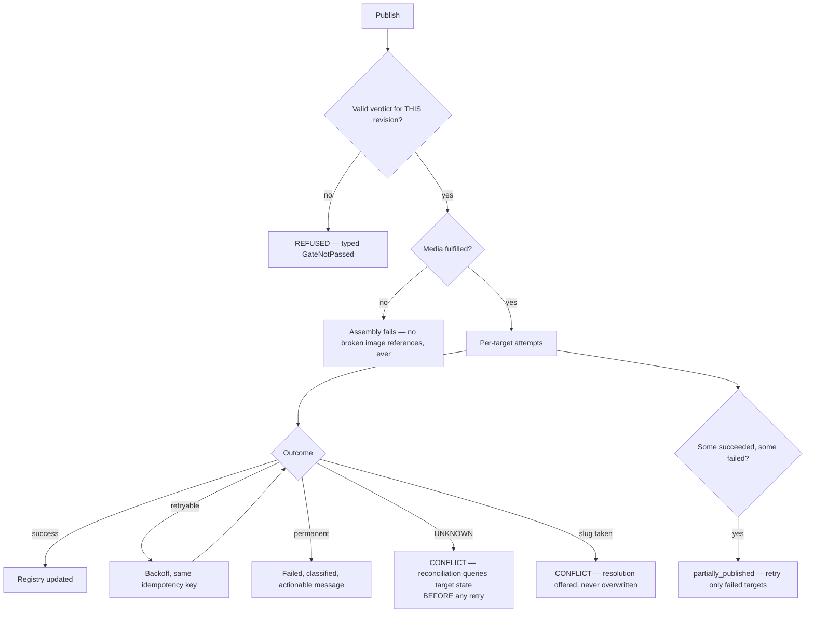

# Publishing Engine

> **Status:** v2.0 — complete. Stage 11 of 13. Bounded context: **Distribution**.
> **Single responsibility: it executes publication.** It writes approved content to systems ContentOS does not own. It forms no opinion about content quality — it treats the gate verdict as authoritative.

## Overview

**Business purpose.** Content that stays in the platform earned nothing. This engine is where the workflow's value is realized — and it is the highest-consequence operation in the product. An error here is externally visible, sometimes indexed within minutes, and never fully reversible. It is also the most common integration demand in sales: an agency without WordPress publishing will not buy, regardless of everything upstream.

**Technical purpose.** Assemble a target-agnostic **`PublishPackage`** from a gate-passed revision, execute **idempotent attempts** against one or more targets, and maintain the **live-URL registry** that Analytics joins on.

**Design posture.** This is deliberately the most conservative engine in the platform, and the only one that performs **no AI generation at all**. Given a choice between publishing twice and not publishing, it does not publish, and it says so.

## Responsibilities

- Package assembly from an authorized revision: content, SEO metadata, media references, taxonomy.
- Target capability discovery and field mapping.
- Idempotent execution of publish, update, and unpublish attempts.
- Multi-target isolation — one target's failure never affects another.
- Live-URL registry maintenance and conflict detection.
- Scheduled publication and its verdict re-validation.
- Reconciliation of attempts with unknown outcomes.

## Non-responsibilities

| Not owned | Owner |
|---|---|
| **Whether content is good enough** | `review-engine.md` — the verdict is authoritative (Conformist relationship) |
| SEO metadata generation | `seo-engine.md` — this engine consumes the package |
| CMS protocol mechanics, auth, quirks | `09-integrations/` adapters |
| Credential encryption and storage | `04-platform/settings.md`, `16-security/` |
| Media asset storage and CDN | `04-platform/media.md` (ADR-018) |
| Post-publication performance | `analytics-engine.md` |
| Human scheduling intent (the calendar) | `04-platform/projects.md` |
| Any score category | `review-engine.md`, `seo-engine.md` (ADR-021) |

**On scheduling:** `projects.md` owns the **calendar** — a human's plan that an article should go live on a date. This engine owns the **schedule** — a durable commitment to execute at a time. Intent versus execution; linked by events, never merged.

## Inputs

| Input | Source | Validation |
|---|---|---|
| `ArticleVersion` with `pass` or `soft-warn` | Stage 7, post-SEO re-check | **Refused** on `block`, missing, or mismatched verdict |
| `SeoPackage` | Stage 8 | Title, meta, slug, canonical, schema |
| `MediaSpec[]` with fulfilled `asset_ref` | Stage 6 + Media Service | **Unfulfilled specs abort assembly** |
| `PublishTargetConfig[]` | Project configuration | Must be `active`; `unverified` and `disabled` refused |
| `IdempotencyKey` | `(articleVersion, targetId, mode)` | Required on every attempt |
| Schedule | `PublishSchedule` or immediate | Verdict re-validated at execution time |

## Outputs

| Artifact | Detail |
|---|---|
| `PublishPackage` | Target-agnostic assembled payload, referencing its authorizing verdict |
| `PublishAttempt[]` | One per target, **immutable and append-only** |
| `PublishedContent` | Live-URL registry entry with `live_revision` and `external_ref` |
| Events | `ArticlePublished`, `PublishFailed`, `PublishConflictDetected` |

**Score impact:** produces none, consumes `publishing_readiness` **as a verdict, not as a value** (ADR-021). The engine checks that the gate passed; it does not read or reason about the number.

**Database impact:** inserts `publish_packages`, `publish_attempts`; upserts `published_content`. No schema change.

## Workflow

```mermaid
sequenceDiagram
    participant ORCH as Orchestrator
    participant PUB as Publishing Engine
    participant PG as PostgreSQL
    participant MED as Media Service
    participant ADP as PublishTarget adapter
    participant ANA as Analytics

    ORCH->>PUB: publish(articleVersion, targetIds[]) [activity]
    PUB->>PG: verify gate verdict pass/soft-warn for THIS revision
    PUB->>MED: resolve media asset URLs
    alt any spec unfulfilled
        PUB-->>ORCH: PackageAssemblyFailed — never publish broken references
    end
    PUB->>PG: assemble package (records verdict_id)
    par per target, independent
        PUB->>PG: insert attempt (pending) with idempotency key
        PUB->>ADP: dispatch (create | update)
        alt success
            ADP-->>PUB: liveUrl + externalRef
            PUB->>PG: attempt succeeded; upsert published_content
        else retryable failure
            ADP-->>PUB: 429 / 5xx
            PUB->>PUB: backoff retry, same idempotency key
        else unknown outcome
            ADP-->>PUB: timeout after send
            PUB->>PG: attempt CONFLICT — never blind retry
        end
    end
    PUB->>PG: BEGIN — package status + outbox(ArticlePublished) — COMMIT
    PUB-->>ORCH: PublishResult (per target)
    PUB-->>ANA: ArticlePublished → tracking begins
```

### Failure branches



**Compensation.** There is **no distributed rollback**. The compensating action for a wrong publish is an explicit, permissioned, audited `unpublish` or `update` — a human decision. Unpublishing from a live site to satisfy transactional neatness is worse than a partial success.

## Domain rules

1. A package may only be assembled from a revision holding `pass` or `soft-warn`, and the package **records its `verdict_id`** (`NOT NULL` FK).
2. If the verdict is invalidated before execution — for example by evidence retraction — an unexecuted package is **invalidated**, not published.
3. **Every attempt carries `IdempotencyKey = (articleVersion, targetId, mode)`**, enforced by a database unique constraint. A retry cannot produce a second write to a customer's site.
4. An attempt with an **unknown outcome is `conflict`, never `failed`**, and is never blindly retried — reconciliation checks the target's actual state first. This rule exists because blind retry on unknown outcome is exactly how duplicate posts appear.
5. Multi-target attempts are **independent**; one failure never blocks or rolls back another.
6. Retrying a partial failure retries **only** the failed targets, by idempotency key.
7. `PublishedContent` is unique per `(targetId, url)`; a second claim is a conflict.
8. Update-in-place requires `externalRef` and `capabilities.updateInPlace`; where a target lacks it, the limitation is surfaced rather than creating a duplicate post.
9. **Unpublishing is explicit, permissioned, and audited.** It never happens as a side effect of archiving, deletion, or a downgrade.
10. Credentials are **referenced, never held** — the value is decrypted in the Provider Layer at execution and never enters this engine.
11. A schedule executes only if the article **still holds a valid verdict** at execution time.
12. A missed schedule notifies and never auto-executes late without a human decision — "late" can mean a broken embargo.

**State machines:** attempt `pending → in_flight → succeeded | failed | conflict | cancelled`; package `assembling → ready → publishing → published | partially_published | failed | invalidated`; content `live → updating → unpublished | orphaned`.

**Idempotency:** the unique constraint on `idempotency_key` is the guarantee — application logic is defence in depth, not the mechanism.

**Concurrency:** per-target dispatch is concurrent; per `(article, target)` it is serialized by the unique constraint.

## AI usage

**None.** This engine performs no generation, no classification, and no model interaction of any kind.

That is a deliberate architectural decision, not an omission. The highest-consequence operation in the platform is fully deterministic, which means it has **no prompt-injection surface**, no non-determinism in its outcomes, and no dependency on the AI Gateway's availability. Content arriving here has already been generated, verified, and optimized; publishing is mechanical execution, and making it mechanical is what makes it trustworthy.

Any future proposal to add AI here — "generate a better slug at publish time" — belongs in the SEO Engine instead.

## Scoring

Per **ADR-021**: **no categories produced.** It consumes `publishing_readiness` **as a verdict**, in a Conformist relationship — Distribution accepts Quality's decision as authoritative and has no opinion of its own (`01-system-architecture/04-context-map.md`).

The engine checks `verdict ∈ {pass, soft-warn}`; it never reads the score value, never compares it against a threshold, and never re-evaluates. Thresholds were applied by the gate, and re-applying them here would create a second, divergent gate.

## Explainability

The engine produces execution records rather than recommendations, so it emits no Explainability Envelope. It maintains the **authorization chain in physical form**, which is what makes publication auditable months later:

```
live URL → published_content → publish_attempt (idempotency key, timestamp, actor)
        → publish_package → gate_verdict (with threshold_snapshot)
        → analyzer_reports → article_revision → citation_anchors → evidence
```

Given any live URL, the chain back to the evidence supporting each claim, and to the exact policy that authorized publication, is a series of joins rather than a reconstruction.

Failure explainability: `FailureReason` is **classified** (`{ code, message, retryable }`) before storage — a raw provider error can echo credentials or internal endpoints and is never persisted or surfaced verbatim.

## Events

Published through the transactional outbox in the state-changing transaction (ADR-020).

| Event | Producer | Consumers | Payload | Retry / DLQ |
|---|---|---|---|---|
| `PublishPackageAssembled` | This engine | Progress stream, Read models | `{ packageId, articleVersion, targetCount }` | Standard |
| `ArticlePublished` | This engine | **Analytics**, Articles, Projects (calendar), Notifications, Read models | `{ articleId, articleVersion, targetId, liveUrl, externalRef, publishedAt }` | **Critical — pages on DLQ; measurement never starts without it** |
| `ArticleUpdated` | This engine | Analytics, Read models | `{ articleId, articleVersion, targetId, liveUrl }` | Critical |
| `PublishFailed` | This engine | Notifications, Workflow, Observability | `{ attemptId, articleId, targetId, reason, retryable }` | Critical |
| `PublishConflictDetected` | This engine | Notifications, Read models | `{ attemptId, targetId, conflictType, details }` | **Critical** |
| `ContentUnpublished` | This engine | Analytics (stop tracking), Notifications, Audit | `{ articleId, targetId, liveUrl, actor, reason }` | Critical |
| `PublishedContentOrphaned` | Reconciliation worker | Notifications, Read models | `{ articleId, targetId, liveUrl, detectedAt }` | Standard |

**Consumed:** `ArticleReadyToPublish` → assemble if a publish action or schedule exists; `EvidenceRetracted` → invalidate unexecuted packages and pending schedules; `ProjectArchived` / `WorkspaceSuspended` → cancel pending schedules, **never unpublish**.

**Ordering:** per `(articleId, targetId)`, strictly. **Idempotency:** by `eventId`, plus the attempt unique constraint.

## Database impact

| Table | Operation |
|---|---|
| `publish_packages` | Insert; `verdict_id NOT NULL` |
| `publish_attempts` | **Append-only**; `UNIQUE (idempotency_key)` |
| `published_content` | Upsert; `UNIQUE (target_id, url)`; partial unique on live state |
| `publish_schedules` | Insert; state transitions |
| `publish_targets` | Read; status updates on repeated auth failure |

**Indexes relied on:** `ux_publish_attempts__idempotency_key` (the duplicate-publication guarantee); `ixp_publish_attempts__unresolved` (the reconciliation worker's index — small, hot, and the safety net against duplicate posts); `ix_published_content__url` (Analytics reverse lookup).

**Caching:** package body cached per `(articleVersion, targetType)` — publishing one revision to five WordPress sites assembles the target-agnostic body once. No schema change.

## APIs

| Surface | Operation |
|---|---|
| REST | `POST /v1/articles/{id}/publish` (202, **`Idempotency-Key` required**) · `POST /v1/articles/{id}/schedule` · `DELETE /v1/schedules/{id}` · `POST /v1/articles/{id}/unpublish` · `GET /v1/articles/{id}/publish-history` · `GET/POST /v1/publish-targets` · `POST /v1/publish-targets/{id}/verify` |
| Internal | `PublishingEngine.assemble(articleVersion) → PublishPackage` · `.execute(attempt) → AttemptResult` · `ReconciliationService.resolve(attemptId)` |
| Streaming | Per-target progress on the run's SSE channel |
| Workers | Scheduler sweep; attempt executor with per-target concurrency limits; **reconciliation worker**; credential-health checker (BullMQ) |

## Security

- **Credentials never enter this engine** — only `CredentialRef`, decrypted in the Provider Layer at execution, never logged, never returned by any API. This closes the v1 defect where CMS passwords were stored in plaintext (`AUDIT.md`).
- Target URLs are validated against SSRF protections before any request; a customer-supplied endpoint is untrusted input.
- **`article.publish` and `article.unpublish` are separate permissions**, and neither is implied by editorial roles.
- Every attempt, unpublish, and credential rotation is audit-logged with actor, target, `ArticleVersion`, and outcome.
- No AI means no prompt-injection surface in the highest-consequence operation — deliberately.
- Workspace isolation on targets, packages, attempts, and registry entries.

## Performance

| Concern | Approach |
|---|---|
| Parallelism | Per-target fan-out, bounded by per-target concurrency limits so a slow CMS never blocks a fast one |
| Assembly caching | Target-agnostic body assembled once per revision |
| Media | Uploaded once per target, referenced by external id on subsequent publishes |
| Attempt durability | The attempt row is written **before** dispatch, so an unknown outcome always has a record to reconcile against |
| Timeouts | Per-target 60 s; whole activity 300 s |
| Scheduler | Batched sweep over a covering index; never scans history |
| Target | p95 **< 45 s** per target |

## Observability

- **Metrics:** `publish_attempts_total{target_type,state}`, `publish_success_ratio`, `publish_duration_seconds{target_type}`, `publish_conflicts_total{conflict_type}`, `targets_total{status}`, `scheduled_publishes_missed_total`, `orphaned_content_total`, `credential_failures_total`.
- **Tracing:** publish traces across assembly, per-target dispatch, and provider call, so a slow publish is attributable to a specific CMS.
- **Logging:** attempt id, target, mode, idempotency key, outcome, correlation id — never credentials or raw provider payloads.
- **Business KPIs:** time from gate pass to live; publish success ratio per target type; share of articles published to more than one target.
- **Alerts:** `ArticlePublished` in the DLQ (**page** — content is live but untracked); publish success ratio below 99% (SLO); **any `conflict_type = duplicate_detected` (page — a possible duplicate on a customer site)**; `orphaned_content_total` rising; a target transitioning to `disabled`.

## Cross references

- `02-domain-design/publishing.md` — aggregates, idempotency, conflict, and unpublish rules
- `review-engine.md` — the authoritative verdict this engine conforms to
- `seo-engine.md` — supplies the SEO package
- `analytics-engine.md` — `liveUrl` is the join key; tracking starts on `ArticlePublished`
- `04-platform/media.md` — asset resolution during assembly (ADR-018)
- `04-platform/settings.md` · `16-security/` — credential handling
- `09-integrations/` — per-target adapters, capabilities, retries
- `14-operations/incident-response.md` — playbook P7 (publishing incidents, duplicate publication)
- `03-database/tables.md` §6 · `indexes.md` §6
