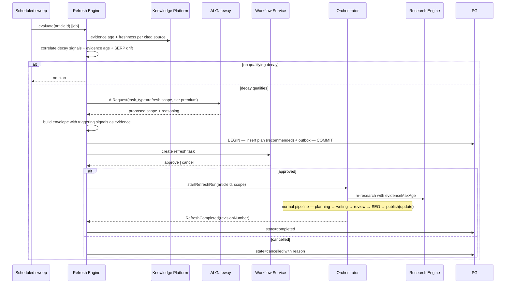
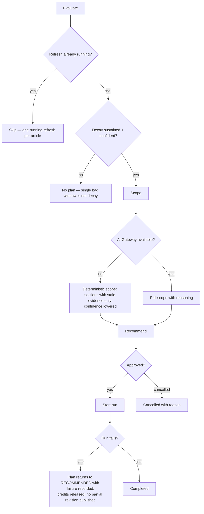

# Refresh Engine

> **Status:** v2.0 — complete. Stage 10 of 13. Bounded context: **Performance**.
> **Single responsibility: it identifies decay and scopes renewal.** It decides that content needs re-research, and how much. It does not measure (stage 12), propose targeted tweaks (stage 9), or execute the re-research itself (stage 4).

## Overview

**Business purpose.** Published content decays. Statistics age, competitors publish better pages, search intent shifts, and cited sources disappear. Most tools treat publication as the end of the workflow, so every refresh restarts from zero — re-researching a topic the platform already knows. This engine is what closes the lifecycle loop and turns a content library into an appreciating asset rather than a depreciating one.

**Technical purpose.** Consume decay signals and evidence-age data, produce a scoped **`RefreshPlan`**, and — on approval — start a new pipeline run that **reuses existing evidence where it is still fresh** and re-retrieves only what has aged.

## Responsibilities

- Evaluating decay signals against evidence age and topic volatility.
- Scoping a refresh: which sections need updating, whether keywords need re-checking, and the evidence freshness ceiling.
- Producing refresh recommendations with full explainability.
- Managing the approval lifecycle of a refresh plan.
- Starting and tracking the refresh run through the orchestrator.
- Converting persistent underperformance into `Opportunity` records that re-enter Discovery.

## Non-responsibilities

| Not owned | Owner |
|---|---|
| Detecting decay signals | `analytics-engine.md` — this engine consumes them |
| Targeted, non-research improvements | `optimization-engine.md` |
| Executing re-research | `research-engine.md` |
| Producing any score category | `review-engine.md`, `seo-engine.md` (ADR-021) |
| Running the pipeline | `orchestration.md` |
| Evidence freshness *scoring* | `11-knowledge-platform/freshness-engine.md` |
| Human approval task | `04-platform/workflow.md` |

**The distinction from Optimization, again from this side:** if the fix is a better title, more internal links, or an added FAQ, that is Optimization. If the fix requires knowing something the platform does not currently know — a 2024 statistic that is now wrong, a product that has been discontinued, a competitor's new angle — that is Refresh. Refresh costs a full pipeline run; Optimization costs a revision.

## Inputs

| Input | Source | Validation |
|---|---|---|
| `DecaySignal[]` | Stage 12 | Type and severity; sustained trend required |
| Evidence age per article | Knowledge Platform freshness | Evidence older than `evidenceMaxAge` marks sections stale |
| `RankingChange[]` | Stage 12 | Confidence-qualified only |
| `SerpDataset` (re-captured) | Stage 2 | Optional; reveals whether the SERP itself moved |
| Current scores | Stages 7–8 | Context for scope decisions |
| `EvidenceRetracted` | Research | **High-severity trigger** — published content resting on retracted evidence |
| Refresh policy, `evidenceMaxAge` | Resolved settings (ADR-024) | Per workspace and article type |

**Preconditions:** article is `published` with active tracking; no refresh already `running` for it.

## Outputs

| Artifact | Detail |
|---|---|
| `RefreshPlan` | Scope, triggering signals, envelope, state |
| `RefreshScope` | `{ reResearch, sectionsToUpdate[], keywordRecheck, evidenceMaxAge }` |
| `Opportunity` | When decay indicates a new article is better than a refresh |
| Events | `RefreshRecommended`, `RefreshStarted`, `RefreshCompleted` |

**Score impact:** produces none, consumes several for context (ADR-021).

**Database impact:** inserts `refresh_plans`; reads decay signals, rollups, evidence metadata. No schema change.

## Workflow

### Failure branches

**Compensation.** A failed refresh run leaves the **published article untouched** — the refresh produces a new revision that must pass the normal gate before publishing an update. There is no state in which a half-refreshed article is live.

## Domain rules

1. A refresh plan references the **decay signals that triggered it**, so a human can see why.
2. **Only one refresh may be `running` per article** — enforced by a partial unique index.
3. Refresh **reuses existing evidence**, re-validating freshness against `evidenceMaxAge`; stale evidence is re-retrieved rather than silently reused.
4. A refresh run goes through the **complete pipeline** — research → planning → writing → review → gate → SEO → publish (update). **No stage is skipped for refreshes.** The temptation to fast-path a refresh is exactly how unverified content reaches a live URL.
5. Refresh runs consume credits like any other run, with the same hold and settlement.
6. Every plan carries a complete Explainability Envelope with non-empty evidence.
7. Decay evaluation is suppressed for content younger than the settling period — new content has no baseline (`02-domain-design/analytics.md` rule 9).
8. `EvidenceRetracted` affecting published content raises a **high-severity** recommendation immediately, bypassing the normal decay-threshold logic. Published content resting on retracted evidence is a grounding-integrity issue, not a performance one.
9. When decay is severe enough that the topic has fundamentally changed, the engine emits an `Opportunity` for a **new article** instead of a refresh plan — refreshing an article whose premise is obsolete is wasted effort.
10. Approving a refresh **supersedes open optimization proposals** for that article.

**State machine:** `recommended → approved → running → completed`, with `cancelled` as a terminal alternative from any pre-completion state.

**Idempotency:** keyed `(articleId, evaluationWindow)`; the partial unique index prevents concurrent running plans.

## AI usage

| Task type | Purpose | Tier hint |
|---|---|---|
| `refresh.scope` | Determine which sections need updating and whether keywords need re-checking | **Premium / reasoning** |
| `refresh.decay_interpret` | Interpret combined decay signals and SERP drift into a cause | Mid |
| `refresh.effort_estimate` | Estimate scope size for prioritization | Fast |

- **Prompt Engine:** versioned templates; `prompt_version` recorded.
- **Context Builder:** assembles decay signals, evidence age summary, current outline, and re-captured SERP consensus within budget. Evidence metadata enters as data.
- **Memory:** supplies prior refresh outcomes for the workspace, so scoping learns which refresh sizes actually recovered performance.
- **Model Router:** premium for scoping — under-scoping wastes a run, over-scoping costs a full rewrite.
- **AI Council:** not used.

## Scoring

Per **ADR-021**: **no categories produced.** Consumed for context: `seo`, `aeo`, `geo`, `citation_quality`, `fact_confidence`.

`fact_confidence` and `citation_quality` are the two most relevant, because they degrade as evidence ages even when the content is unchanged — which is precisely the condition Refresh exists to detect. The engine reads them; it never recomputes them.

## Explainability

Every `RefreshPlan` carries `{ recommendation, reason, evidence[], expected_impact, confidence }`:

- **`evidence[]`** references the decay signals with their supporting metrics, the aged evidence items with their `retrievedAt`, and re-captured SERP entries with `capturedAt`.
- **Reason codes:** `refresh.evidence_aged`, `refresh.statistic_outdated`, `refresh.competitor_displacement`, `refresh.serp_intent_shift`, `refresh.evidence_retracted`, `refresh.sustained_traffic_decline`.
- **`expected_impact`** derived from comparable historical refresh outcomes where available.
- **`confidence`** scaled by signal strength and data completeness.

A user asking "why refresh this article?" receives the decay trend with its windows, the specific sources that have aged with their retrieval dates, and what the SERP looks like now versus at publication.

## Events

Published through the transactional outbox in the state-changing transaction (ADR-020).

| Event | Producer | Consumers | Payload | Retry / DLQ |
|---|---|---|---|---|
| `RefreshRecommended` | This engine | **Workflow**, Notifications, Projects (calendar), Optimization (supersede), Discovery | `{ planId, articleId, scope, envelope, triggers[] }` | **Critical** |
| `RefreshStarted` | This engine | Orchestrator, Articles, Progress stream | `{ planId, articleId, runId, scope }` | **Critical** |
| `RefreshCompleted` | This engine | Articles, Notifications, Read models, Memory | `{ planId, articleId, revisionNumber }` | **Critical** |
| `RefreshCancelled` | This engine | Read models, Memory | `{ planId, reason }` | Standard |
| `OpportunityFromPerformance` | This engine | **Discovery**, Projects (backlog) | `{ projectId, envelope, sourceUrlId }` | Standard |

**Consumed:** `ContentDecayDetected` → evaluate; `EvidenceRetracted` → high-severity recommendation; `RankingChanged` → evaluate; `PerformanceSnapshotRecorded` → periodic sweep input.

**Ordering:** per `articleId`. **Idempotency:** by `eventId` plus the running-plan unique index.

## Database impact

| Table | Operation |
|---|---|
| `refresh_plans` | Insert; state transitions; `envelope` `CHECK`; partial unique `(article_id) WHERE state = 'running'` |
| `decay_signals`, `performance_rollups`, `ranking_changes` | Read only |
| `evidence_items` | Read only, via the Knowledge Platform, for age |
| `research_runs` | `refresh_plans.run_id` FK on start |

**Indexes:** `(tenant_id, state, detected_at)` on decay signals; `ux_refresh_plans__article_running`.

Reads run against a **replica**. No schema change.

## APIs

| Surface | Operation |
|---|---|
| REST | `GET /v1/refresh-plans` (filterable) · `GET /v1/refresh-plans/{id}` · `POST /v1/refresh-plans/{id}/approve` · `POST /v1/refresh-plans/{id}/cancel` · `GET /v1/articles/{id}/refresh-history` |
| Internal | `RefreshEngine.evaluate(articleId) → RefreshPlan?` (job) · `RefreshPlanningService.scope(articleId, signals)` |
| Streaming | Once started, the refresh run streams on the standard run SSE channel |
| Workers | Decay evaluation sweep; retracted-evidence consumer; plan expiry sweep (BullMQ) |

## Security

- Workspace isolation on plans, signals, and evidence reads.
- Approval requires `analytics.refresh.approve`; starting a run additionally consumes credits, so it is gated by the same balance checks as any run.
- Event payloads carry scope and identifiers, never metric values or content.
- `EvidenceRetracted`-driven recommendations are audit-logged with the retraction reference, since they can indicate a published factual error.
- Automated approval, where a workspace enables it, is bounded by policy and audit-logged identically to a human decision.

## Performance

| Concern | Approach |
|---|---|
| Sweep shape | Scheduled batch per workspace over tracked articles, reading rollups rather than raw snapshots |
| Cost | One premium scoping call per qualifying article — and only those with a sustained, confident signal |
| Evidence reuse | The primary saving: a refresh that reuses 70% of its evidence costs a fraction of an original run |
| Timeouts | Evaluation 120 s; scoping 90 s |
| Back-pressure | Per-tenant sweep concurrency cap; refresh runs queue behind normal pipeline capacity |
| Target | Evaluation p95 **< 60 s** per article |

## Observability

- **Metrics:** `refresh_plans_total{state}`, `refresh_recommendations_total{trigger}`, `refresh_evidence_reuse_ratio` (the cost lever), `refresh_run_duration_seconds`, `refresh_approval_rate`, `refresh_uplift` (post-refresh performance delta), `ai_cost_usd{task_type}`.
- **Tracing:** one span per evaluation; the refresh run itself traces as a normal pipeline run linked by `correlationId`.
- **Logging:** article, plan id, triggers, scope summary, decision actor — never metric values or content.
- **Business KPIs:** **refresh uplift** — measured performance recovery after a completed refresh, the metric that justifies the whole engine; and refresh adoption rate per workspace.
- **Alerts:** `RefreshRecommended` or `RefreshStarted` DLQ entries; retracted-evidence recommendations not acted on within a policy window (**a published article resting on retracted evidence is a grounding issue**); approval rate collapsing.

## Cross references

- `02-domain-design/analytics.md` — `RefreshPlan` aggregate and its rules
- `analytics-engine.md` — the source of decay signals
- `optimization-engine.md` — the sibling this engine supersedes when evidence has aged
- `research-engine.md` — executes re-research with freshness re-checks
- `orchestration.md` — runs the refresh through the complete pipeline
- `11-knowledge-platform/freshness-engine.md` — evidence age computation
- `keyword-intelligence.md` — receives `OpportunityFromPerformance`, closing the loop
- `04-platform/settings.md` · `04-platform/workflow.md`
- `03-database/tables.md` §7
