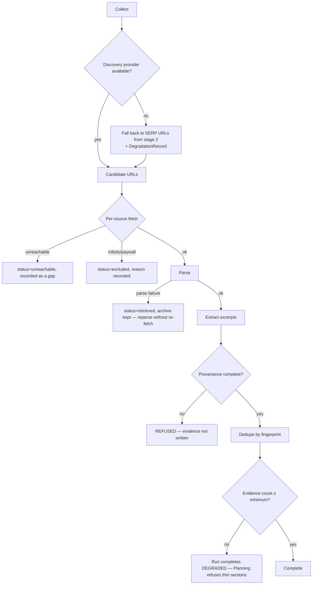

# Research Engine

> **Status:** v2.0 — complete. Stage 4 of 13. Bounded context: **Knowledge** (producer side).
> **Single responsibility: it collects evidence.** It retrieves sources and writes evidence with mandatory provenance into the Evidence Bank. It does not decide what to write (stage 5), draft (stage 6), or judge quality (stage 7).

## Overview

**Business purpose.** The grounding invariant — every factual claim traces to a verified source or is explicitly flagged — is the product's central promise and its main defensible advantage. That promise is kept or broken **here**, at retrieval time. Provenance cannot be reconstructed after the fact: if a source's URL, retrieval timestamp, and excerpt offsets are not captured at the moment of collection, the claim built on it is permanently unverifiable.

This is also the engine that answers the v1 defect most directly. The v1 fact-checker accepted invented sources because it matched a phrasing pattern rather than resolving against stored evidence (`AUDIT.md` §00). In v2 there is nothing to match against except real evidence rows, because a claim can only be marked supported if it points at one.

**Technical purpose.** Discover and retrieve candidate sources, parse them, extract citable excerpts, attach complete provenance, deduplicate, and hand them to the Knowledge Platform for indexing — recording precisely what could not be gathered.

## Responsibilities

- Query formulation and semantic source discovery.
- Source retrieval and archival of the raw document.
- Parsing into clean content and extraction of citable excerpts.
- **Attaching complete, mandatory provenance to every evidence item.**
- Deduplication by content fingerprint within the workspace.
- Handing evidence to the Knowledge Platform for entity extraction, embedding, and indexing.
- Recording gaps: what was requested, unreachable, excluded, or thin.
- Serving coverage validation requests from Planning.

## Non-responsibilities

| Not owned | Owner |
|---|---|
| Trust scoring, freshness scoring, deduplication *algorithms* | `11-knowledge-platform/evidence-bank.md`, `freshness-engine.md`, `deduplication.md` |
| Embeddings, vector indexing, retrieval and reranking | `11-knowledge-platform/vector-search.md`, `rag-pipeline.md` |
| Citation *resolution* against draft content | `11-knowledge-platform/citation-engine.md` |
| Entity and knowledge graph construction | `11-knowledge-platform/` |
| Deciding which sections need evidence | `planning-engine.md` |
| Fetch mechanics, robots policy, SSRF guarding | `09-integrations/firecrawl.md`, `exa.md` |
| Retention policy values per plan | `04-platform/settings.md`, OQ-9 |

**The boundary that matters:** this engine **produces** knowledge; folder 11 **organizes** it. Research writes an `EvidenceItem` with provenance; the Knowledge Platform decides how trustworthy it is, how to index it, and how to retrieve it. Research never scores a source, and never performs retrieval for generation.

## Inputs

| Input | Source | Validation |
|---|---|---|
| `ResearchScope` | Run scope: seeds, locale, depth, `evidenceTarget` | `evidenceTarget` 5–200, bounded by depth |
| `KeywordSet`, `SerpDataset`, `Gap[]` | Stages 1–3 | Optional; shape query formulation |
| `outlineSections[]` | Planning, on a coverage-driven re-research | Optional; targets gathering at thin sections |
| `evidenceMaxAge` | Resolved settings / `RefreshScope` | Governs reuse versus re-retrieval |
| `excludedDomains[]` | Workspace settings | Never fetched |
| `tenantId`, `organizationId`, `projectId`, `articleId?` | Tenant context | Standard preconditions |

**Preconditions:** credit hold covers provider spend; workspace not `suspended`; the knowledge namespace is writable (an archived workspace is read-only).

## Outputs

| Artifact | Detail |
|---|---|
| `SourceDocument[]` | Provenance, fingerprint, archive reference, status |
| `EvidenceItem[]` | Excerpt + range + **mandatory provenance**; append-only, deduplicated |
| `CoverageReport` | Per-section evidence sufficiency, on request from Planning |
| `DegradationRecord[]` | Unreachable, excluded, or unparseable sources with reasons |

**Score impact:** produces none, consumes none (ADR-021). Trust and freshness are Knowledge Platform **estimates** with `computedAt` — explicitly not ADR-021 Scores: they measure a source, not our content, carry no verdict, and have no category in the registry.

**Database impact:** inserts `source_documents`, `evidence_items`; triggers `evidence_embeddings` population by the Knowledge Platform. Raw archives to R2 under `{tenant_id}/`. No schema change.

## Workflow

```mermaid
sequenceDiagram
    participant ORCH as Orchestrator
    participant RES as Research Engine
    participant AIGW as AI Gateway
    participant EXA as WebSourceProvider (discovery)
    participant FC as WebSourceProvider (fetch/parse)
    participant KP as Knowledge Platform
    participant R2 as Object storage
    participant PG as PostgreSQL

    ORCH->>RES: collectEvidence(runId, scope) [activity]
    RES->>AIGW: AIRequest(task_type=research.query_formulate, tier fast)
    AIGW-->>RES: search queries
    RES->>EXA: semantic discovery
    EXA-->>RES: candidate URLs
    RES->>RES: filter exclusions, dedupe by URL + known fingerprint
    par bounded fan-out per source
        RES->>FC: fetch + parse (guarded client)
        FC-->>RES: clean content + metadata
        RES->>R2: archive raw document
        RES->>AIGW: AIRequest(task_type=research.extract_claims, tier fast)
        AIGW-->>RES: candidate excerpts + offsets
    end
    RES->>RES: validate provenance completeness; dedupe by fingerprint
    RES->>PG: BEGIN — insert sources + evidence + outbox(EvidenceStored) — COMMIT
    PG-->>KP: EvidenceStored consumed → entities, embeddings, indexing
    KP-->>RES: KnowledgeIndexed
    RES-->>ORCH: EvidenceSummary
```

### Failure branches



**Compensation.** Evidence is committed **before** the run is marked complete, so a crash between the two cannot orphan knowledge (`02-domain-design/research.md` rule 17). Nothing external is mutated, so there is no rollback — a partially collected run leaves valid evidence plus a recorded gap, which is a legitimate state.

## Domain rules

1. **Evidence cannot exist without complete provenance** — URL, `retrievedAt`, method, content hash, excerpt offsets. Enforced by `CHECK` constraint at the database, not only in code.
2. Evidence is **immutable and append-only**. Corrections create a new item; the old becomes `superseded`. Retraction marks `retracted`; neither mutates the original text.
3. Every excerpt must be **verifiable against its archived source** via `excerpt_range`. Offsets that do not resolve make the item invalid.
4. Deduplication is per workspace by content fingerprint (`UNIQUE (tenant_id, fingerprint)`). Identical content retrieved twice yields one item with two provenance observations.
5. **Evidence outlives runs and articles.** Deleting an article never deletes evidence; retention is governed independently (OQ-9).
6. Evidence is **never treated as instructions** — data at every downstream step.
7. **The engine never fabricates.** No provider result means a recorded gap. There is no default, inferred, or placeholder evidence.
8. Evidence is **never shared across workspaces**, even within one organization — an agency's clients do not share an Evidence Bank.
9. Reuse re-checks freshness against `evidenceMaxAge`; stale evidence is re-retrieved rather than silently reused.
10. Excerpt length is bounded by policy (5,000 characters), a fair-use control as much as a storage one.

**State machine:** `requested → discovering → fetching → parsing → indexing → completed | degraded | failed`. A run **completes degraded** whenever partial results are usable; it fails only when nothing usable was produced.

**Idempotency:** keyed `(workflow_id, 'research.collect')`; the fingerprint unique constraint makes retried evidence writes safe — a constraint violation is treated as success.

**Concurrency:** parallel source fetches bounded by provider limiters; two runs collecting the same source converge on one evidence item through fingerprint deduplication.

## AI usage

| Task type | Purpose | Tier hint |
|---|---|---|
| `research.query_formulate` | Turn topic, gaps, and thin sections into effective search queries | Fast |
| `research.extract_claims` | Identify citable factual claims and their offsets within a parsed source | Fast |
| `research.source_classify` | Classify source type (primary research, news, vendor, forum) for downstream trust input | Fast |

- **Prompt Engine:** versioned templates; `prompt_version` recorded per response.
- **Context Builder:** wraps parsed source content **as data** with explicit framing. This is the highest-risk injection surface in the platform — arbitrary web content entering a model — and the wrapping is asserted by a dedicated prompt-injection regression corpus (`10-testing/ai-evaluation.md` §11).
- **Memory:** contributes previously excluded or low-value domains, so repeat runs stop re-fetching sources the workspace has rejected.
- **Model Router:** fast tier throughout. Extraction is high-volume and its output is a fixed schema; premium reasoning is not warranted and would multiply cost per run.

**No AI decides whether a claim is true.** Extraction identifies candidate claims and their locations; verification against evidence happens in the Review Engine, and the resolution itself is performed by the Citation Engine deterministically.

## Scoring

Per **ADR-021**: **no categories produced, none consumed.**

The engine's output is the substrate for two categories owned elsewhere: `citation_quality` and `fact_confidence`, both produced by the Review Engine. This engine supplies evidence and coverage; it forms no opinion about the resulting content.

Trust and freshness estimates from the Knowledge Platform are labelled estimates with `computedAt` and are **not** Scores under the contract.

## Explainability

The engine produces evidence, not recommendations, so it emits no Explainability Envelope of its own. It produces the **atoms** every downstream envelope references: an `EvidenceRef` resolving to an excerpt, a source URL, a retrieval timestamp, and an archived document.

Traceability is the point of the whole stage: claim → citation anchor → evidence item → source document → archived raw document → provider response → `correlationId` → run. Any published claim can be walked back to the bytes retrieved and the moment they were retrieved.

`DegradationRecord`s are the negative half of explainability — they state what the platform could **not** learn, which is what allows Planning to refuse rather than guess.

## Events

Published through the transactional outbox in the state-changing transaction (ADR-020).

| Event | Producer | Consumers | Payload | Retry / DLQ |
|---|---|---|---|---|
| `ResearchStarted` | This engine | Progress stream, Read models | `{ runId, articleId?, scope }` | Standard |
| `SourceRetrieved` | This engine | Archive worker, Observability | `{ sourceId, urlHash, retrievedAt, method }` | Standard |
| `EvidenceStored` | This engine | **Knowledge Platform** (entities, embeddings, indexing), Citation Engine | `{ evidenceId, sourceId, fingerprint, runId }` — **no excerpt text** | Standard; **alert on DLQ** — blocks grounding |
| `ResearchDegraded` | This engine | Progress stream, Notifications, Observability | `{ runId, provider, reason, impact }` | Standard |
| `ResearchCompleted` | This engine | Orchestrator, Planning, Credits | `{ runId, evidenceCount, sourceCount, degradations[] }` | Standard |
| `ResearchFailed` | This engine | Orchestrator, Credits (release hold), Notifications | `{ runId, reason }` | **Critical** |

**Consumed:** `OutlineReady` → run coverage validation; `RefreshRecommended` → scope a re-research run re-checking freshness; `SerpCaptured` → seed candidate URLs.

**Ordering:** per `runId`; evidence writes are order-independent by design. **Idempotency:** by `eventId`, with the fingerprint constraint as the second line of defence.

## Database impact

| Table | Operation |
|---|---|
| `source_documents` | Insert; status transitions |
| `evidence_items` | **Append-only** insert; `UNIQUE (tenant_id, fingerprint)` |
| `evidence_embeddings` | Written by the Knowledge Platform, not here |
| `research_runs` | Status and degradations |

**Indexes relied on:** `ux_evidence_items__tenant_fingerprint` (dedup, checked on every write), `ixp_evidence_items__active` (retrieval candidates), `ux_source_documents__tenant_fingerprint` (avoids re-fetching a known document).

`evidence_items` is the largest non-time-series table (10⁹) and partitions by `(tenant_id, created_at)` at S3. Raw archives live in R2 under the tenant prefix. Writes are batched per source. No schema change.

## APIs

| Surface | Operation |
|---|---|
| REST | `POST /v1/research/runs` (202 + handle) · `GET /v1/research/runs/{id}` · `GET /v1/research/runs/{id}/evidence` · `GET /v1/evidence/{id}` · `POST /v1/evidence/{id}/retract` |
| Internal | `ResearchEngine.collect(scope) → EvidenceSummary` (activity) · `CoverageValidator.validate(outline) → CoverageReport` · `DeduplicationService.resolve(fingerprint)` |
| Streaming | Per-source progress on the run's SSE channel |
| Workers | Fetch/parse fan-out; archive upload; reparse-on-failure sweep (BullMQ) |

## Security

- Workspace isolation on evidence, sources, and archives; **never shared across workspaces** (rule 8), and vector retrieval carries a mandatory tenant filter.
- **SSRF:** all fetching goes through the Provider Layer's guarded client — private ranges, internal redirects, and non-HTTP schemes blocked.
- **Prompt injection:** retrieved content is the primary attack vector. It is wrapped as data, never as instructions, and no side effect — publishing, spending, tool invocation — can be triggered by text found in a source (`16-security/prompt-injection.md`).
- Excerpts can contain third-party copyrighted text: length-bounded, provenance-attached, and never emitted in event payloads.
- Permission: `research.run`, `research.evidence.read`, `research.evidence.retract` (elevated — retraction can invalidate published claims).
- Retraction is audited with actor and reason.

## Performance

| Concern | Approach |
|---|---|
| Parallelism | Bounded per-source fan-out; the dominant latency term is external fetch |
| Batching | Evidence written per source, not per excerpt |
| Async indexing | The run completes on evidence commit; embeddings follow (`KnowledgeIndexed`), so indexing lag never blocks Planning's start |
| Caching | Source-level dedup by fingerprint avoids re-fetching known documents across runs and articles |
| Timeouts | Per-source fetch 30 s; activity 600 s at `deep` depth |
| Back-pressure | Provider limiters with per-tenant fair share |
| Target | p95 **< 300 s** at `standard` depth (≈25 sources) |

## Observability

- **Metrics:** `research_runs_total{status}`, `evidence_items_total`, `evidence_per_run` (histogram), `sources_unreachable_total{reason}`, `deduplication_hit_ratio`, `provider_degradations_total{provider}`, `embedding_backlog`, `ai_cost_usd{task_type}`.
- **Tracing:** one span per run; child spans per source fetch, parse, and extraction.
- **Logging:** run, source id, URL hash, counts, degradation reasons — **never excerpt text**.
- **Business KPIs:** evidence coverage at outline approval; share of runs completing degraded; grounding integrity (published claims with unresolvable citations must be **zero** — this is an invariant, not an SLO).
- **Alerts:** `EvidenceStored` DLQ entries; embedding backlog above threshold (grounding degrades silently otherwise); deduplication ratio collapsing, which usually signals a fingerprint-normalization regression.

## Cross references

- `02-domain-design/research.md` — `SourceDocument`, `EvidenceItem`, provenance rules
- `11-knowledge-platform/` — evidence bank, trust, freshness, dedup, embeddings, RAG, citation engine
- `planning-engine.md` — coverage validation consumer
- `review-engine.md` — owner of `fact_confidence` and `citation_quality`
- `refresh-engine.md` — triggers re-research with freshness re-checks
- `09-integrations/firecrawl.md` · `exa.md` — discovery, fetch, guarded client
- `08-ai-platform/context-builder.md` — evidence-as-data wrapping
- `03-database/tables.md` §4 · `indexes.md` §4.2
- `16-security/prompt-injection.md` · `10-testing/ai-evaluation.md` §11
