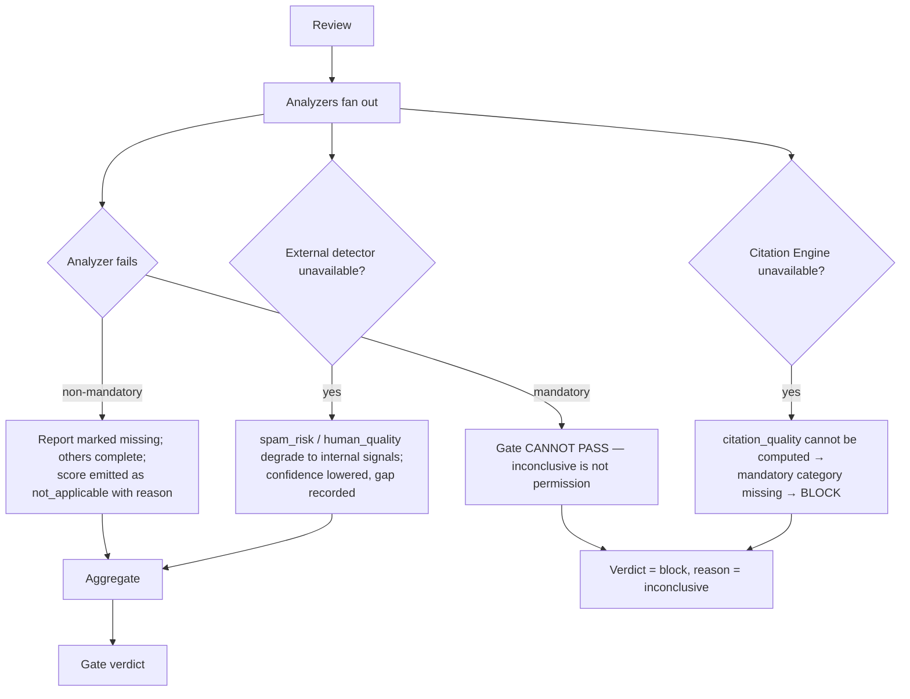

# Review Engine

> **Status:** v2.0 — complete. Rewritten for ADR-020, ADR-021, and Phases 2–4. Supersedes the v1.0 document, which named models directly and predates the scoring contract.
> **Stage 7 of 13.** Bounded context: **Quality**. Runs **before** SEO (ADR-011).
> **Single responsibility: it validates quality.** It measures and issues verdicts. It never mutates content.

## Overview

**Business purpose.** Nothing generated is trusted by default. This engine is where a draft earns the right to continue — and it is the direct answer to the v1 defect that falsified the product's central promise: a fact-checker that accepted invented sources because they matched a phrasing pattern (`AUDIT.md` §00). In v2 a claim is supported only if it resolves against a real Evidence Bank row, and there is nothing else to match.

**Technical purpose.** Run independent analyzers in parallel over an immutable `ArticleVersion`, emit **eight ADR-021 score categories**, aggregate them against workspace thresholds, and issue a `GateVerdict` of `pass` / `soft-warn` / `block`. Blocked content produces an annotated human-review package.

## Responsibilities

- Evidence validation: every claim resolves through the Citation Engine, or is flagged.
- Fact verification, with stricter policy for YMYL content.
- Readability, grammar, and clarity measurement.
- Brand voice conformance against the workspace profile.
- Duplicate and similarity detection.
- Human-quality and spam-risk estimation.
- **Producing eight score categories** and the composite `publishing_readiness`.
- **Hosting the quality gate** and issuing verdicts with a threshold snapshot.
- Building the annotated review package on block.
- Instructing Writing to revise — never revising itself.

## Non-responsibilities

| Not owned | Owner |
|---|---|
| **Mutating content in any way** | `writing-engine.md` — measurement/mutation separation |
| The four optimization categories (`seo`, `aeo`, `geo`, `accessibility`) | `seo-engine.md` (ADR-021 §3) |
| Threshold **values** | `04-platform/settings.md` (ADR-024), snapshotted at run start |
| Citation resolution algorithm | `11-knowledge-platform/citation-engine.md` |
| Evidence collection | `research-engine.md` |
| The human review task and its assignment | `04-platform/workflow.md` |
| The durable wait on a block | Temporal, via `orchestration.md` |

## Inputs

| Input | Source | Validation |
|---|---|---|
| `ArticleVersion` | Stage 6 — immutable | Must exist; revision committed |
| `CitationAnchor[]` | The revision | Anchors must resolve or be flagged |
| Evidence Bank + tenant corpus | Knowledge Platform | For validation and similarity |
| `ThresholdSnapshot` | Resolved settings, pinned at run start | Opaque to this engine's measurement; applied only at the gate |
| Voice profile | Memory | Referenced from settings |
| `ymyl` flag, mandatory categories | Gate policy from settings | Determines strictness and which categories block |

**Preconditions:** the revision is committed; a credit hold is active; analyzers' external providers are optional (absence degrades, see Failure).

## Outputs

| Artifact | Detail |
|---|---|
| `Score[]` | **Eight categories**, each with explanation, per ADR-021 |
| `AnalyzerReport[]` | Per-analyzer findings bound to the `ArticleVersion` |
| `GateVerdict` | `pass` / `soft-warn` / `block` with reasons and the echoed threshold snapshot |
| `Annotation[]` | Located, human-readable findings for the review package |
| `RevisionInstruction` | Issued to Writing when content must change |

**Score impact — categories produced (ADR-021 §3):**

| Category | What it measures | Subject |
|---|---|---|
| `eeat` | Experience, expertise, authoritativeness, trust signals | article_version |
| `human_quality` | Naturalness, variation, non-formulaic construction | article_version |
| `readability` | Reading ease, sentence and paragraph structure | article_version, section |
| `fact_confidence` | Confidence that factual claims are correct | article_version, section |
| `citation_quality` | Coverage and quality of the grounding chain | article_version |
| `spam_risk` | **Inverted** — 100 means no risk | article_version |
| `brand_voice` | Conformance to the workspace voice profile | article_version, section |
| `publishing_readiness` | **Composite** — derived from the above | article_version |

**Categories consumed:** none at first pass. On the post-SEO fast re-check it consumes `seo` and `accessibility` only to confirm structural changes did not break readability or citations — it never re-scores them.

## Workflow

```mermaid
sequenceDiagram
    participant ORCH as Orchestrator
    participant RV as Review Engine
    participant KP as Knowledge Platform
    participant AIGW as AI Gateway
    participant PG as PostgreSQL
    participant WF as Workflow Service

    ORCH->>RV: review(articleVersion) [activity]
    RV->>PG: load revision + anchors + threshold snapshot
    par independent analyzers, cached by content hash
        RV->>KP: citation resolution + coverage
        RV->>KP: similarity vs corpus + web
        RV->>AIGW: AIRequest(task_type=review.fact_verify, tier premium)
        RV->>AIGW: AIRequest(task_type=review.eeat_assess, tier premium)
        RV->>AIGW: AIRequest(task_type=review.voice_conformance, tier mid)
        RV->>AIGW: AIRequest(task_type=review.human_quality_estimate, tier mid)
        RV->>RV: readability + grammar (deterministic, no AI)
    end
    RV->>RV: emit 7 Scores + explanations
    RV->>RV: derive publishing_readiness (composite)
    RV->>RV: GateEvaluation(scores, thresholdSnapshot, policy)
    RV->>PG: BEGIN — insert reports + scores + explanations + verdict + outbox — COMMIT
    alt pass or soft-warn
        RV-->>ORCH: ReviewCompleted(verdict)
    else block
        RV->>RV: build annotated review package
        RV-->>ORCH: QualityGateBlocked
        ORCH->>WF: create review task; park on durable wait
        WF-->>ORCH: fix | approve-override | reject
        ORCH->>RV: resubmit (new revision) or record override
    end
```

### Failure branches



**Compensation.** Scores and verdicts are append-only; a re-review appends rather than overwrites, and the supersession chain is the audit trail. Analyzer results are cached by content hash, so a resubmitted revision re-runs only what actually changed — the dominant cost saving in the revise loop.

## Domain rules

1. **The engine never mutates content.** It issues a `RevisionInstruction`; Writing executes it.
2. A score and its report are bound to **one exact `ArticleVersion`**; neither can be reused for a different revision.
3. **A gate cannot pass with a mandatory category missing.** An analyzer failure means the gate cannot conclude, and inconclusive is not permission.
4. The verdict records its `ThresholdSnapshot`; later threshold changes never retroactively alter a past verdict.
5. Verdict semantics are fixed: `pass` advances, `soft-warn` advances with a logged warning, `block` halts into a durable human wait.
6. **A claim is supported only if its citation anchor resolves against a real evidence row.** No pattern, phrasing, or heuristic may mark a claim supported.
7. `spam_risk` is **inverted** so that higher is better, per the contract's universal direction rule.
8. Similarity and detection outputs are **labelled estimates** with confidence, never presented as determinations (OQ-8).
9. YMYL content applies stricter policy — supplied via the threshold snapshot, not decided here.
10. Human overrides of a verdict are recorded as `ScoreApproved` / `ScoreRejected` with actor and reason, and feed the evaluation harness.
11. The **post-SEO fast re-check** validates only readability and citation integrity — it does not re-run the full analyzer set (ADR-011).

**State machine:** `requested → analyzing → aggregating → verdict_issued → (blocked → awaiting_human → resubmitted)`.

**Idempotency:** keyed `(workflow_id, 'review.evaluate', articleVersion)`; scores are additionally idempotent on `(subject, category, algorithmVersion, inputsDigest)` per ADR-021.

**Concurrency:** analyzers run in parallel and write independent rows; the aggregator waits only for mandatory categories.

## AI usage

| Task type | Purpose | Tier hint |
|---|---|---|
| `review.fact_verify` | Reason about whether a claim is supported by its cited evidence | **Premium / reasoning** |
| `review.eeat_assess` | Assess experience, expertise, authoritativeness, trust signals | **Premium / reasoning** |
| `review.voice_conformance` | Compare against the workspace voice profile | Mid |
| `review.human_quality_estimate` | Estimate naturalness and variation | Mid |
| `review.annotation_summarize` | Convert findings into a reviewer-readable package | Fast |

**Readability and grammar use no AI at all** — deterministic libraries are exact, free, and reproducible. Spending premium tokens on a Flesch score would be indefensible.

- **Prompt Engine:** versioned templates pinned at run start; `prompt_version` recorded on every score's `algorithmVersion`.
- **Context Builder:** assembles the section under review with its cited evidence, so fact verification compares claim against source rather than against model memory.
- **Memory:** supplies the voice profile and prior human overrides, so repeated false positives decay.
- **Model Router:** premium for fact and E-E-A-T reasoning — the two categories where a wrong answer is most expensive.
- **AI Council:** invoked under policy for **YMYL fact verification and contested E-E-A-T assessments** (ADR-019). This is the pipeline's primary Council use case: genuine model diversity on a high-stakes judgment, with conflicts detected rather than manufactured, disclosed to the user, and cost-budgeted.

## Scoring

Fully governed by **ADR-021** (`01-system-architecture/14-scoring-contract.md`).

- Every score is integer 0–100, higher better, with orthogonal confidence and a mandatory explanation.
- `algorithmVersion` is bumped on any analyzer, prompt, or model change — **no contract, API, or schema change follows**.
- `publishing_readiness` is the only composite; it declares its input categories in its explanation so the derivation is inspectable. Its composition function is this engine's to define; the contract requires only declaration.
- The gate **consumes** scores and never computes them. Thresholds arrive in the snapshot; **no threshold or weight is defined in this document** — those are policy and producer implementation respectively.
- `not_applicable` is emitted rather than omitting a category this engine owns.

## Explainability

Every score carries a `ScoreExplanation` with registry-backed reason codes, never prose:

| Category | Representative reason codes |
|---|---|
| `citation_quality` | `citation.coverage_below_target`, `citation.evidence_stale`, `citation.source_concentration` |
| `fact_confidence` | `fact.claim_unsupported`, `fact.statistic_unverified`, `fact.date_inconsistent` |
| `eeat` | `eeat.no_author_signal`, `eeat.primary_source_absent`, `eeat.experience_claim_unbacked` |
| `readability` | `readability.sentence_length_high`, `readability.passive_voice_high` |
| `brand_voice` | `voice.tone_deviation`, `voice.terminology_mismatch` |
| `spam_risk` | `spam.keyword_stuffing`, `spam.formulaic_construction` |
| `human_quality` | `quality.low_burstiness`, `quality.repetitive_structure` |

Every finding carries `affectedSections`, so a score of 62 is navigable rather than merely discouraging. Every `recommendedAction` asserting a fact carries non-empty `evidenceRefs`, enforced by `CHECK`.

Traceability: verdict → contributing scores → explanations → reason codes → affected sections → citation anchors → evidence → sources.

## Events

Published through the transactional outbox in the state-changing transaction (ADR-020).

| Event | Producer | Consumers | Payload | Retry / DLQ |
|---|---|---|---|---|
| `ScoreCalculated` | This engine | Gate evaluation, Read models, Analytics, Progress stream | `{ scoreId, subject, category, value, confidence, verdict, algorithmVersion }` | Standard |
| `AnalyzerReportCompleted` | This engine | Aggregator, Read models | `{ articleVersion, analyzer, findingCount }` | Standard |
| `ReviewCompleted` | This engine | **SEO Engine**, Workflow, Progress stream | `{ articleVersion, verdict, reasons[] }` | **Critical** |
| `QualityGateBlocked` | This engine | **Workflow** (review task), Notifications, Orchestrator | `{ articleVersion, reasons[], annotationCount }` | **Critical — pages** |
| `RevisionRequested` | This engine | **Writing Engine** | `{ articleVersion, instruction, reasonCodes[], affectedSections[] }` | Critical |
| `ScoreApproved` / `ScoreRejected` | This engine (human override) | Audit, Evaluation harness | `{ scoreId, actorId, reason }` | Standard |
| `ScoreInvalidated` | This engine | Gate evaluation, Notifications | `{ subject, categories[], reason }` | **Critical** |

**Consumed:** `ArticleDraftCompleted` → review; `EvidenceRetracted` → invalidate `fact_confidence` and `citation_quality`, re-gate affected articles; `SeoOptimized` → fast re-check.

**Ordering:** per `articleId` and revision. **Idempotency:** by `eventId`, plus the ADR-021 score idempotency key.

## Database impact

| Table | Operation |
|---|---|
| `analyzer_reports` | **Append-only**; extended additively by migration `0024_scoring_contract` for the contract's fields |
| `score_explanations` | **Append-only** insert (new in ADR-021 §9) |
| `gate_verdicts` | **Append-only**; carries `threshold_snapshot` |
| `citation_anchors` | Read only |

**Constraints relied on:** `CHECK (verdict IN ('pass','soft-warn','block'))`; `UNIQUE (article_id, revision_number, analyzer)`; `CHECK (score BETWEEN 0 AND 100)`; the explanation's non-empty-evidence `CHECK`.

**Caching:** analyzer results cached by `(contentHash, analyzer, algorithmVersion)` — this is why a revise loop is affordable. **No schema redesign**; the additive extension is specified in ADR-021 §9.

## APIs

| Surface | Operation |
|---|---|
| REST | `GET /v1/articles/{id}/revisions/{n}/scores` · `.../scores/{category}/explanation` · `GET /v1/articles/{id}/verdict` · `GET /v1/articles/{id}/review-package` · `POST /v1/articles/{id}/verdict/override` |
| Internal | `ReviewEngine.evaluate(articleVersion) → ReviewResult` (activity) · `GateEvaluationService.evaluate(request) → GateEvaluationResult` · `ReviewPackageBuilder.build(articleVersion)` |
| Streaming | `score.updated` and `gate.blocked` on the run's SSE channel |
| Workers | Analyzer fan-out consumers; re-gate consumer for `EvidenceRetracted` |

## Security

- Workspace isolation on scores, explanations, and evidence reads. **A score leaks information about content**, so score visibility follows content visibility (ADR-021 §14).
- Verdict override requires elevated permission, a mandatory reason, and is audit-logged — it is the one path by which content can advance despite a `block`.
- Explanations reference evidence, never embed excerpt content.
- Evidence and content reach models as data; fact verification is the stage most exposed to adversarial content attempting to influence its own assessment (`16-security/prompt-injection.md`).
- Human overrides are the highest-value training signal and are retained accordingly.

## Performance

| Concern | Approach |
|---|---|
| Parallelism | All analyzers independent; wall clock is the slowest analyzer, not their sum |
| Caching | By content hash — a resubmit re-runs only changed analyzers |
| Determinism first | Readability and grammar are free and instant; premium calls are reserved for reasoning |
| Cost | Two premium tasks per review; Council only under policy for YMYL |
| Timeouts | Per analyzer 90 s; aggregation 30 s; activity 300 s |
| Fast re-check | Two analyzers only, target < 45 s |
| Target | p95 **< 180 s** full review |

## Observability

- **Metrics:** `gate_verdicts_total{verdict}`, `scores_emitted_total{category}`, `score_value{category}` (histogram), `analyzer_duration_seconds{analyzer}`, `analyzer_cache_hit_ratio`, `citation_coverage_ratio`, `grounding_violations_total`, `score_overrides_total{decision}`, `council_invocations_total`, `ai_cost_usd{task_type}`.
- **Tracing:** one span per review; child spans per analyzer carrying `category`, `algorithmVersion`, `inputsDigest`.
- **Logging:** article version, verdict, reason codes, counts — never content or excerpts.
- **Business KPIs:** block rate, first-pass pass rate, override rate per category (a rising override rate means a measure has stopped being trusted), and mean time from block to resolution.
- **Alerts:** `grounding_violations_total` non-zero (**page**); `QualityGateBlocked` DLQ entries; block-rate deviation from baseline (usually a prompt or threshold regression); a category's mean value shifting sharply after an `algorithmVersion` bump.

## Cross references

- `01-system-architecture/14-scoring-contract.md` — **ADR-021**, which this engine implements most heavily
- `02-domain-design/articles.md` — `AnalyzerReport`, `GateVerdict`, measurement/mutation rule
- `writing-engine.md` — executes every revision this engine instructs
- `seo-engine.md` — the other score producer; runs after (ADR-011)
- `11-knowledge-platform/citation-engine.md` — citation resolution
- `08-ai-platform/ai-council.md` — YMYL deliberation (ADR-019)
- `04-platform/settings.md` — threshold resolution and run-start snapshotting (ADR-024)
- `04-platform/workflow.md` — human review task and override authority
- `10-testing/ai-evaluation.md` — overrides as eval cases
- `16-security/prompt-injection.md`
