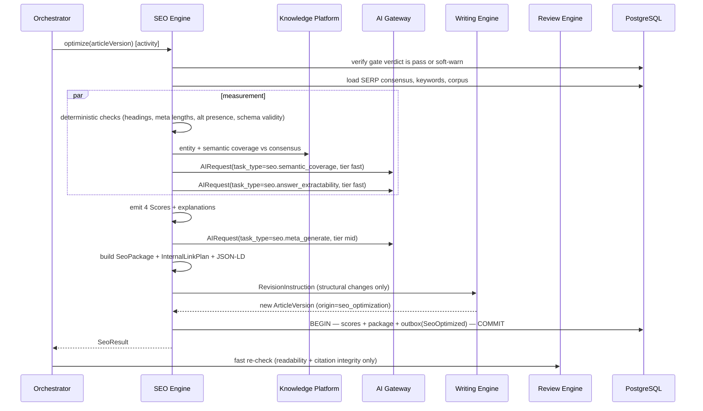
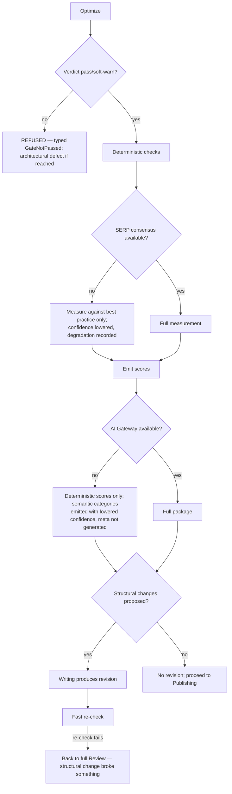

# SEO Engine

> **Status:** v2.0 — complete. Stage 8 of 13. Bounded context: **Quality**. Runs **after** Review (ADR-011).
> **Single responsibility: it evaluates optimization.** It measures and improves how discoverable content is, for search engines and answer engines. It does not judge whether the content is true or well written (stage 7).

## Overview

**Business purpose.** Content that is accurate, well-grounded, and unread is a cost centre. This engine is what converts editorial quality into distribution: the structural, semantic, and markup work that determines whether a page is surfaced by a search engine, quoted by an answer engine, or cited by a generative one.

The three-way split — `seo`, `aeo`, `geo` — reflects a genuine change in how content is discovered. Classic search ranking, answer-box extraction, and generative citation reward different structures, and collapsing them into one number hides which one is failing.

**Technical purpose.** Measure the gate-passed revision against the SERP's structural consensus and optimization best practice, emit **four ADR-021 score categories**, and produce concrete optimization changes as a new revision — which then triggers a fast re-validation.

## Responsibilities

- Title, meta description, slug, canonical, and Open Graph evaluation and generation.
- Semantic coverage: entity and topic coverage versus the SERP consensus.
- Heading structure and hierarchy validation.
- Internal linking recommendations from the tenant's own published corpus.
- External authoritative link validation.
- JSON-LD schema generation and validation.
- Answer-engine readiness: extractable answers, question-and-answer structure, snippet-eligible formatting.
- Generative-engine readiness: citation-friendly structure, factual density, attributable claims.
- Accessibility evaluation of rendered structure.
- Emitting the four optimization score categories and applying changes as a revision.

## Non-responsibilities

| Not owned | Owner |
|---|---|
| The eight editorial categories | `review-engine.md` (ADR-021 §3) |
| Whether content is true, readable, or on-brand | `review-engine.md` |
| Capturing the SERP | `serp-intelligence.md` |
| Competitive judgment | `competitor-intelligence.md` |
| Drafting prose | `writing-engine.md` — SEO instructs, Writing mutates |
| Publishing or canonical URL assignment at the target | `publishing-engine.md` |
| Post-publication ranking measurement | `analytics-engine.md` |
| Alt-text *content* | `writing-engine.md` via `MediaSpec`; this engine validates presence and quality signals |

**Ordering matters and is an ADR:** Review runs first, so structural optimization is only ever applied to content that has already passed quality. Optimizing content that is then rejected wastes the work; worse, optimizing before verification can entrench an unsupported claim in a heading or a schema field.

## Inputs

| Input | Source | Validation |
|---|---|---|
| `ArticleVersion` with `pass` or `soft-warn` verdict | Stage 7 | **Refused** if the verdict is `block` or missing |
| `StructuralConsensus`, `SerpDataset` | Stages 2–3 | Optional; absence lowers confidence and is recorded |
| `KeywordSet` | Stage 1 | Primary and supporting terms for coverage measurement |
| Entity set | Knowledge Platform | Topic and entity coverage baseline |
| Tenant published corpus | `published_content` + sitemap | Internal-link candidates |
| `TemplateBody`, locale, threshold snapshot | Resolved settings (ADR-024) | Pinned at run start |

## Outputs

| Artifact | Detail |
|---|---|
| `Score[]` | **Four categories** with explanations, per ADR-021 |
| `SeoPackage` | Title, meta, slug, canonical, OG tags, JSON-LD schema |
| `InternalLinkPlan` | Proposed links with anchor text and target URLs from the tenant's corpus |
| `ArticleRevision` | Optimization changes committed as a new revision with `origin = seo_optimization` |
| Events | `ScoreCalculated`, `SeoOptimized` |

**Score impact — categories produced (ADR-021 §3):**

| Category | Measures | Subject |
|---|---|---|
| `seo` | Classic search optimization: structure, semantics, metadata, linking | article_version, live_url |
| `aeo` | Answer-engine readiness: extractability, snippet eligibility, Q&A structure | article_version, live_url |
| `geo` | Generative-engine readiness: citation-friendly structure, attributable factual density | article_version, live_url |
| `accessibility` | Heading order, alt-text presence, link-text quality, structural semantics | article_version |

**Categories consumed:** `citation_quality` and `fact_confidence` inform `geo` measurement — generative engines cite well-grounded content — but this engine **reads them, never recomputes them**.

## Workflow

### Failure branches

**Compensation.** Optimization changes are a **new revision**, never an edit — so a failed fast re-check leaves the pre-optimization revision intact and publishable. This is why SEO instructs Writing rather than mutating content itself.

## Domain rules

1. **Optimization runs only on a revision holding `pass` or `soft-warn`.** A `block` or missing verdict refuses the stage.
2. **This engine never mutates content directly.** It issues a `RevisionInstruction`; Writing produces the revision.
3. Structural changes **must not alter factual claims or citation anchors.** Reordering a section is permitted; rewriting a sentence containing a claim is not, and the instruction schema cannot express it.
4. Any structural change triggers the **fast re-check** — readability and citation integrity only (ADR-011).
5. Internal-link targets must come from the tenant's **own published corpus**; the engine never proposes a link to an unpublished or external-to-tenant URL as internal.
6. External links are validated for reachability and are never auto-inserted into claim-bearing sentences.
7. JSON-LD is **validated against schema.org** before emission; invalid structured data is worse than none, since it can suppress rich results.
8. Meta description and title are generated within the target platform's length constraints, recorded as facts in the explanation.
9. `accessibility` measures rendered structure — heading order, alt presence, link text — and never overrides an author's alt text, which belongs to Writing.
10. Keyword usage is measured as **semantic coverage**, never density targets. Density optimization is a `spam_risk` liability owned by Review.

**State machine:** `requested → measuring → scoring → optimizing → complete | degraded | refused`.

**Idempotency:** keyed `(workflow_id, 'seo.optimize', articleVersion)`; scores idempotent on the ADR-021 key.

**Concurrency:** one optimization activity per article; measurement analyzers run in parallel.

## AI usage

| Task type | Purpose | Tier hint |
|---|---|---|
| `seo.semantic_coverage` | Assess topic and entity coverage against consensus | Fast |
| `seo.answer_extractability` | Assess snippet and answer-box readiness | Fast |
| `seo.generative_readiness` | Assess citation-friendliness for generative engines | Fast |
| `seo.meta_generate` | Generate title and meta description candidates | Mid |
| `seo.schema_map` | Map content structure to appropriate schema.org types | Fast |

**Most SEO checking is deterministic and uses no AI at all:** heading hierarchy, meta lengths, alt presence, canonical correctness, schema validity, link reachability. Semantic judgment is the only AI surface, deliberately kept at fast tier because the measurement is comparative rather than generative.

- **Prompt Engine:** versioned templates; `prompt_version` feeds `algorithmVersion`.
- **Context Builder:** assembles the revision, consensus, keyword set, and entity coverage within budget.
- **Memory:** supplies the workspace's metadata conventions and previously rejected meta styles.
- **Model Router:** fast and mid tiers only; no premium reasoning is warranted here.
- **AI Council:** not used.

## Scoring

Fully governed by **ADR-021**.

- Four categories, each integer 0–100, higher better, with orthogonal confidence and mandatory explanation.
- **`accessibility` is subject-restricted to `article_version`** — it measures our markup, not a live URL, since rendered accessibility at the target depends on the CMS theme.
- `seo`, `aeo`, and `geo` also apply to `live_url` subjects with a 30-day expiry, which is how Optimization measures published content later.
- `algorithmVersion` bumps on any check or prompt change; no contract, API, or schema change follows.
- Thresholds are policy from the snapshot; **no threshold or weight is defined here**.
- Where a category does not apply — `aeo` for a paywalled article type, say — `not_applicable` is emitted rather than omitting the category.

## Explainability

Every score carries registry-backed reason codes with affected sections and measured facts:

| Category | Representative reason codes |
|---|---|
| `seo` | `seo.title_length_out_of_range`, `seo.heading_hierarchy_broken`, `seo.internal_links_sparse`, `seo.entity_coverage_below_consensus` |
| `aeo` | `aeo.no_extractable_answer`, `aeo.question_heading_absent`, `aeo.answer_too_long` |
| `geo` | `geo.claims_unattributed`, `geo.factual_density_low`, `geo.citation_structure_weak` |
| `accessibility` | `a11y.alt_text_missing`, `a11y.heading_skip`, `a11y.link_text_ambiguous` |

**Supporting facts are measured observations** — `title_length: 71`, `internal_links: 2`, `consensus_median_links: 9` — never opinions. Every `recommendedAction` proposing a change cites the SERP entries or corpus rows justifying it, with non-empty `evidenceRefs` enforced by `CHECK`.

Traceability: score → reason codes → affected sections → SERP consensus rows with `capturedAt` → `correlationId`.

## Events

Published through the transactional outbox in the state-changing transaction (ADR-020).

| Event | Producer | Consumers | Payload | Retry / DLQ |
|---|---|---|---|---|
| `ScoreCalculated` | This engine | Gate evaluation, Read models, Optimization, Progress stream | `{ scoreId, subject, category, value, confidence, verdict, algorithmVersion }` | Standard |
| `SeoOptimized` | This engine | **Review (fast re-check)**, Publishing, Progress stream | `{ articleId, revisionNumber, changesApplied[] }` | **Critical** |
| `SeoPackageReady` | This engine | Publishing | `{ articleVersion, packageRef }` | Standard |
| `RevisionRequested` | This engine | **Writing Engine** | `{ articleVersion, instruction, reasonCodes[], affectedSections[] }` | Critical |
| `SeoMeasurementDegraded` | This engine | Progress stream, Observability | `{ articleVersion, reason }` | Standard |

**Consumed:** `ReviewCompleted` with `pass`/`soft-warn` → begin optimization; `ArticlePublished` → schedule `live_url` scoring; `OptimizationAccepted` → re-measure after an applied change.

**Ordering:** per `articleId` and revision. **Idempotency:** by `eventId` plus the ADR-021 score key.

## Database impact

| Table | Operation |
|---|---|
| `analyzer_reports` | Append-only score rows (extended per ADR-021 §9) |
| `score_explanations` | Append-only |
| `article_revisions` | New revision via Writing, `origin = seo_optimization` |
| `publish_packages` | `seo JSONB` populated at assembly time by Publishing, from this engine's package |
| `published_content` | Read only, for internal-link candidates |

**Indexes relied on:** `(tenant_id, subject_ref, category) WHERE status = 'current'`; `ix_published_content__url` for corpus lookup.

**Caching:** internal-link candidate sets cached per `(tenant, corpus_version)`; schema templates cached by article type. No schema change.

## APIs

| Surface | Operation |
|---|---|
| REST | `GET /v1/articles/{id}/revisions/{n}/scores?category=seo,aeo,geo,accessibility` · `GET /v1/articles/{id}/seo-package` · `POST /v1/articles/{id}/seo/reoptimize` |
| Internal | `SeoEngine.optimize(articleVersion) → SeoResult` (activity) · `SeoEngine.scoreLiveUrl(urlId) → Score[]` · `InternalLinkPlanner.plan(articleVersion)` |
| Streaming | `score.updated` on the run's SSE channel |
| Workers | Live-URL rescoring sweep on score expiry (BullMQ) |

## Security

- Workspace isolation on scores, corpus reads, and packages; internal-link candidates never cross tenants — proposing a link to another workspace's URL would be a cross-tenant leak in published content.
- External link validation fetches through the Provider Layer's guarded client (SSRF).
- Generated meta and schema are escaped; no user or model output is emitted as raw markup.
- Score visibility follows content visibility (ADR-021 §14).
- Permission: `article.run_pipeline` to optimize; `analytics.read` for live-URL scores.

## Performance

| Concern | Approach |
|---|---|
| Determinism first | The majority of checks are free and instant, so an AI outage degrades semantic categories only |
| Parallelism | Measurement analyzers run concurrently |
| Caching | Link candidates and schema templates cached; live-URL scores cached until expiry |
| Timeouts | Per check 30 s; meta generation 45 s; activity 180 s |
| Cost | Fast tier dominates; one mid-tier call for meta generation |
| Target | p95 **< 90 s**, plus fast re-check |

## Observability

- **Metrics:** `seo_optimizations_total{result}`, `score_value{category}` (histogram), `seo_checks_failed_total{check}`, `internal_links_proposed`, `schema_validation_failures_total`, `structural_revisions_total`, `fast_recheck_failures_total`, `ai_cost_usd{task_type}`.
- **Tracing:** one span per optimization; child spans per check and AI call carrying `category` and `algorithmVersion`.
- **Logging:** article version, category values, reason codes — never content.
- **Business KPIs:** correlation between `seo`/`aeo`/`geo` at publish and measured position and impressions later (joined by Analytics on `correlationId`) — the only honest validation that these measures predict anything.
- **Alerts:** `SeoOptimized` DLQ entries; `fast_recheck_failures_total` rising (structural changes are breaking content); schema validation failures, which suppress rich results silently.

## Cross references

- `01-system-architecture/14-scoring-contract.md` — ADR-021, the four categories owned here
- `review-engine.md` — the other producer; runs first (ADR-011); performs the fast re-check
- `serp-intelligence.md` · `competitor-intelligence.md` — structural consensus this engine measures against
- `writing-engine.md` — executes every structural change
- `publishing-engine.md` — consumes the SEO package
- `optimization-engine.md` — consumes live-URL scores
- `11-knowledge-platform/entity-graph.md` — entity coverage
- `04-platform/settings.md` — thresholds and conventions (ADR-024)
- `03-database/tables.md` §5
