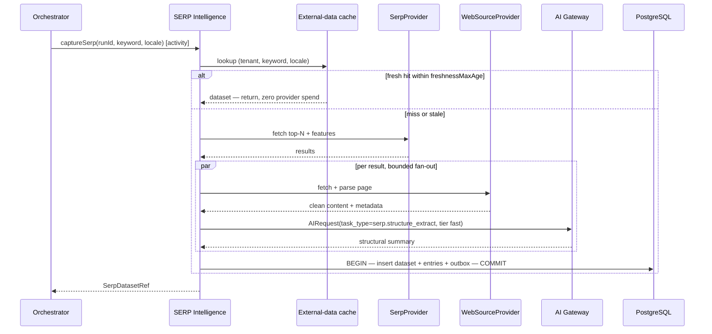
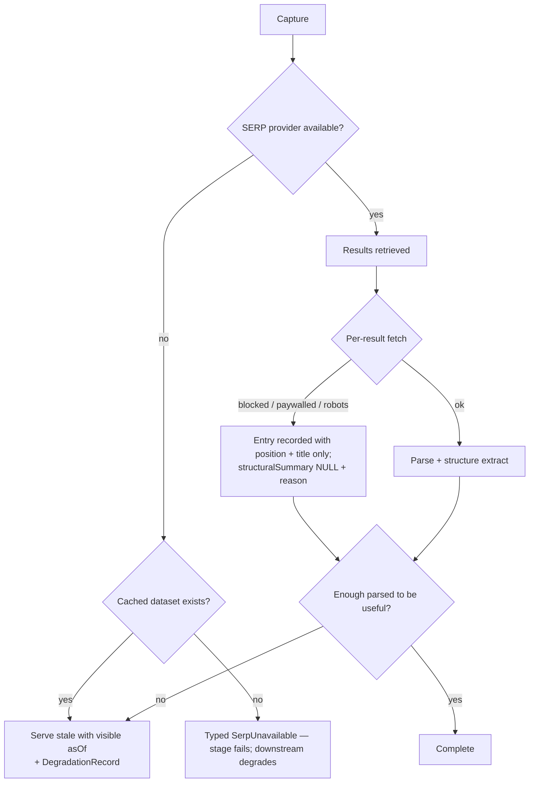

# SERP Intelligence Engine

> **Status:** v2.0 — complete. Stage 2 of 13. Bounded context: **Discovery**.
> **Single responsibility: it observes.** It captures what the results page looks like right now and describes each result's structure. It forms no judgment about competitors (stage 3) and makes no plan (stage 5).

## Overview

**Business purpose.** A search results page is the only honest statement of what a search engine currently rewards for a query. Word counts, heading depth, format, media density, freshness, and which SERP features occupy the page tell a content team what the bar actually is — not what a best-practice article claims it should be. Guessing the bar produces content that is competently wrong.

**Technical purpose.** Capture an **immutable, timestamped SERP dataset** for a keyword and locale, with a structural summary per result, and make it reusable across every downstream stage and every article targeting the same term.

The word *observes* is doing real work. This engine records; it does not interpret. That separation is why one SERP capture can serve competitor analysis, planning, SEO evaluation, and later trend comparison without any of them inheriting another's opinion.

## Responsibilities

- Retrieve the top-N organic results for a keyword and locale from the SERP provider.
- Detect and record SERP features: featured snippet, People Also Ask, video pack, image pack, local pack, knowledge panel, AI overview presence.
- Fetch and parse each result page for structural analysis (via the web source provider).
- Produce a `structuralSummary` per result: word count, heading tree and depth, media count, table and list presence, FAQ presence, schema types, outbound link density, publish and update dates.
- Record `capturedAt` on everything, and surface freshness.
- Cache SERP datasets with a short TTL and serve them across articles.

## Non-responsibilities

| Not owned | Owner |
|---|---|
| Judging which competitor is beatable, or why | `competitor-intelligence.md` |
| Storing page content as evidence | `research-engine.md` (with provenance) |
| Deciding the article's structure | `planning-engine.md` |
| Evaluating our own content's optimization | `seo-engine.md` |
| Ranking history over time | `analytics-engine.md` |
| Provider auth, limits, retries | `09-integrations/dataforseo.md`, `firecrawl.md` |

**The most important boundary here:** this engine parses competitor pages for *structure* but does **not** write their content into the Evidence Bank. Structural facts (a page has 2,400 words and 14 H2s) are observations about the page; quoting its claims is evidence collection, and that requires provenance, deduplication, and retention policy — which is Research's job (stage 4). Blurring this is how a system ends up with un-attributed competitor text inside generated articles.

## Inputs

| Input | Source | Validation |
|---|---|---|
| `keywordTerm`, `locale` | `KeywordSet.primary` (stage 1), or explicit | Term non-empty; locale supported |
| `topN` | Resolved settings | 10 / 20 / 30; bounded by `depth` |
| `fetchDepth` | Resolved settings | `metadata_only` \| `structural` \| `full_parse` |
| `tenantId`, `organizationId`, `projectId` | Tenant context | Standard preconditions |
| `freshnessMaxAge` | Resolved settings | Default 24 h; older cached datasets trigger recapture |

**Preconditions:** a credit hold covers provider spend; the keyword exists in a `KeywordSet` for this run, or is explicitly supplied.

## Outputs

| Artifact | Detail |
|---|---|
| `SerpDataset` | Header: keyword, locale, `capturedAt`, `features[]`. **Immutable** |
| `SerpEntry[]` | Per result: `position`, `url`, `title`, `snippet`, `contentType`, `structuralSummary`. **Immutable** |
| `DegradationRecord[]` | Results that could not be fetched or parsed, and why |

**Score impact:** produces none, consumes none (ADR-021). A structural summary is an observation, not a quality measure — it describes a competitor's page, and this engine has no opinion about whether 2,400 words is good.

**Database impact:** inserts into `serp_datasets` and `serp_entries` (immutable, `03-database/tables.md` §4). No schema change.

## Workflow

### Failure branches

**Partial capture is normal and acceptable.** A SERP where four of twenty results are paywalled still tells you what the page rewards. The dataset records which entries lack structure and why, so downstream stages reason over what exists rather than assuming completeness.

**Compensation:** none required — no external mutation. Retries are Temporal's; a permanently failed capture degrades the run rather than failing it, because Planning can proceed with keyword and competitor data alone, at reduced confidence.

## Domain rules

1. **`capturedAt` is mandatory.** A SERP dataset without a capture timestamp is invalid — SERP data is meaningless without knowing when it was observed.
2. Datasets are **immutable**. A recapture is a new dataset; comparing datasets is how SERP volatility is detected.
3. `position` is unique per dataset (`UNIQUE (serp_dataset_id, position)`) and constrained to 1–100.
4. A result that cannot be fetched is recorded with `structuralSummary = NULL` and a reason, **never omitted** — a missing entry would silently distort every downstream count.
5. Fetching respects `robots.txt`, paywalls, and rate limits; a refusal is a recorded outcome, not an error to route around.
6. **No page content is retained** beyond the structural summary and the snippet the provider returned. Retaining more without provenance would create un-attributed third-party content.
7. SERP features are recorded as presence-and-position facts, never interpreted here.
8. Datasets are **shared across articles within a workspace** for the same `(keyword, locale)` inside the freshness window — this is the single largest provider-cost saving in Discovery.

**State machine:** `requested → fetching → parsing → complete | partial | failed`.

**Idempotency:** keyed on `(workflow_id, 'serp.capture', keyword, locale)`. A retry within the freshness window returns the existing dataset rather than recapturing.

**Concurrency:** two runs requesting the same `(keyword, locale)` concurrently are collapsed by a short-lived distributed lock, so one capture serves both.

## AI usage

| Task type | Purpose | Tier hint |
|---|---|---|
| `serp.structure_extract` | Convert a parsed page into a normalized structural summary | Fast |
| `serp.feature_classify` | Classify ambiguous SERP feature blocks the provider does not label | Fast |

- **Prompt Engine:** versioned templates; `prompt_version` recorded per response.
- **Context Builder:** supplies the parsed page within a token budget, **wrapped as data** — competitor page content is untrusted input and is never interpreted as instructions (`16-security/prompt-injection.md`).
- **Memory:** not used. Structural extraction is stateless and must not be influenced by workspace preferences, or datasets would stop being comparable across articles.
- **Model Router:** fast tier; extraction is high-volume and latency-sensitive.

Extraction is deliberately AI-assisted rather than purely rule-based because real pages are structurally messy, but the output is a **fixed schema** — the model normalizes, it does not judge.

## Scoring

Per **ADR-021**: **no categories produced, none consumed.**

A structural summary is an observation about someone else's page. It becomes an input to `seo` and `aeo` scoring later (`seo-engine.md`), where our own content is measured against what the SERP rewards — but the measurement happens there, by the category's single owner.

## Explainability

This engine produces observations rather than recommendations, so it emits no Explainability Envelope. It supplies the **evidentiary basis** for envelopes produced downstream: when Competitor Intelligence recommends "add a comparison table," its `evidence[]` cites the SERP entries showing that seven of ten ranking results contain one, with `capturedAt`.

Traceability: every structural fact resolves to a `serp_entries` row, its dataset, its `capturedAt`, and the provider response cache key.

## Events

Published through the transactional outbox in the state-changing transaction (ADR-020).

| Event | Producer | Consumers | Payload | Retry / DLQ |
|---|---|---|---|---|
| `SerpCaptured` | This engine | Competitor Intelligence, Planning, SEO Engine, Progress stream | `{ runId, datasetId, keywordTerm, locale, entryCount, features[], capturedAt }` | 5 attempts, backoff, DLQ |
| `SerpCaptureDegraded` | This engine | Progress stream, Observability | `{ runId, keyword, reason, unfetchedCount }` | Standard |

**Consumed:** `KeywordResearchCompleted` → capture for the primary term (and supporting terms at `deep` depth).

**Ordering:** per `runId`. **Idempotency:** consumers dedupe by `eventId`. Payloads carry counts and feature flags, never result content.

## Database impact

| Table | Operation |
|---|---|
| `serp_datasets` | Insert only |
| `serp_entries` | Bulk insert; `structuralSummary` JSONB nullable |

**Indexes relied on:** `ix_serp_datasets__tenant_keyword_captured` with `captured_at DESC` — matches the read direction for "latest SERP for this keyword," avoiding a sort; `ux_serp_entries__dataset_position` for ordered rendering.

**Caching:** `(tenant_id, provider, keyword, locale)` with a **hours-scale TTL** — SERPs move fast, and a day-old capture is a materially different page. Freshness is displayed, never implied.

`serp_entries` is a 10⁸-row table and partitions by `(tenant_id, created_at)` at S3.

## APIs

| Surface | Operation |
|---|---|
| REST | `GET /v1/serp/{keywordRef}` · `GET /v1/research/runs/{id}/serp` · `POST /v1/serp/capture` (202 + handle, explicit budget) |
| Internal | `SerpIntelligence.capture(keyword, locale, opts) → SerpDatasetRef` (Temporal activity) |
| Streaming | Per-result progress on the run's SSE channel — useful because capture is the most visibly incremental stage |
| Workers | Bounded per-result fetch/parse fan-out (BullMQ), limited by the web source provider's limiter |

## Security

- Workspace isolation: datasets carry `tenant_id`; RLS enforced; caches are tenant-prefixed.
- **SSRF defence is critical here** — this engine fetches arbitrary URLs returned by a provider. Fetching happens exclusively through the Provider Layer's guarded client, which blocks private address ranges, redirects to internal hosts, and non-HTTP schemes (`09-integrations/firecrawl.md`, `16-security/`).
- Retrieved competitor content is untrusted: wrapped as data for extraction, never interpreted as instructions, and never persisted beyond the structural summary.
- Permission: `research.run` to capture; `research.evidence.read` to view.
- Robots and paywall policy is respected and recorded — this is a legal and reputational control, not a technical preference.

## Performance

| Concern | Approach |
|---|---|
| Caching | Dataset-level cache is the primary lever; a shared capture serves every article on that keyword within the window |
| Parallelism | Per-result fetch and extraction fan out concurrently, bounded by provider limiters |
| Concurrency collapse | A distributed lock per `(tenant, keyword, locale)` prevents duplicate simultaneous captures |
| Timeouts | Per-page fetch 20 s; whole activity 240 s at `topN = 20`; exceeded → partial dataset |
| Back-pressure | Provider limiter, not worker count |
| Target | p95 **< 150 s** for `topN = 20` at `structural` depth |

## Observability

- **Metrics:** `serp_captures_total{result}`, `serp_capture_duration_seconds{topN}`, `serp_cache_hit_ratio`, `serp_entries_unfetched_total{reason}`, `serp_features_detected_total{feature}`, `provider_calls_total{provider}`, `ai_cost_usd{task_type}`.
- **Tracing:** one span per capture, child spans per result fetch and extraction.
- **Logging:** run, keyword hash, counts, degradation reasons — never page content, never full result URLs at info level.
- **Business KPI:** SERP volatility per tracked keyword — the share of results that changed between captures, which is a leading indicator that refresh is due.
- **AI cost:** attributed per run; structure extraction is the highest-volume fast-tier task in the platform, so its cache hit ratio is watched closely.

## Cross references

- `02-domain-design/research.md` — `SerpDataset`, `SerpEntry` aggregates and immutability rules
- `keyword-intelligence.md` — supplies the term
- `competitor-intelligence.md` — the primary consumer, which adds judgment
- `seo-engine.md` — measures our content against what this observed
- `analytics-engine.md` — ranking history, deliberately separate from point-in-time capture
- `09-integrations/dataforseo.md` · `firecrawl.md` — providers and the guarded fetch client
- `08-ai-platform/context-builder.md` — evidence-as-data wrapping
- `03-database/tables.md` §4 · `indexes.md` §4.1
- `16-security/prompt-injection.md` — untrusted content handling
