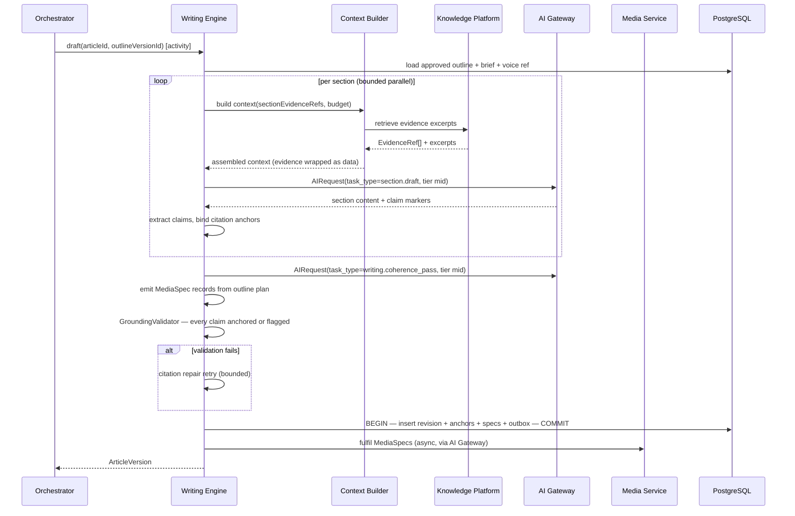
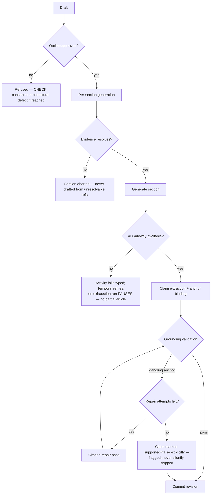

# Writing Engine

> **Status:** v2.0 — complete. Stage 6 of 13. Bounded context: **Authoring**.
> **Single responsibility: it creates drafts.** It executes an approved outline into grounded prose. It does not plan (stage 5), judge its own output (stage 7), or optimize structure (stage 8).

## Overview

**Business purpose.** This is the stage customers think they are buying, and it is the one that matters least in isolation. Given a well-planned, evidence-backed outline, drafting is execution. Given a bad plan, no amount of drafting quality rescues it. The engine's job is therefore narrow and demanding: render the approved structure faithfully, ground every factual claim in evidence that already exists, and never invent to fill a gap.

**Technical purpose.** Consume the approved `OutlineVersion` and the Evidence Bank, generate content **section by section**, attach a `CitationAnchor` to every factual claim, declare needed media as `MediaSpec`, and commit an immutable `ArticleRevision`.

## Responsibilities

- Section-by-section drafting against the approved outline, in the workspace's voice.
- Grounding: attaching a citation anchor to every factual claim, or explicitly flagging it unsupported.
- Enrichment: statistics, tables, FAQs, examples — each grounded like any other claim.
- Media declaration: emitting `MediaSpec` records describing what assets are needed and why.
- Internal coherence: transitions, terminology consistency, and non-repetition across sections.
- Executing revision instructions issued by Review or Optimization as **new revisions**.
- Committing revisions with a content hash.

## Non-responsibilities

| Not owned | Owner |
|---|---|
| Deciding structure, angle, or which sections exist | `planning-engine.md` — the outline is a contract |
| Judging its own quality | `review-engine.md` (measurement/mutation separation) |
| Optimization structure, schema, meta, internal links | `seo-engine.md` |
| Storing, transforming, or delivering media assets | `04-platform/media.md` (ADR-018) |
| Citation *resolution* | `11-knowledge-platform/citation-engine.md` |
| Evidence retrieval into the Bank | `research-engine.md` |
| Deciding *that* a revision is needed | Review, Optimization, or a human |

**The measurement/mutation rule, from the other side:** Review measures and instructs; **Writing mutates**. When Review determines that content must change, it records the requirement and this engine produces the new revision. That separation is why every gate verdict can be traced to the exact bytes it judged.

## Inputs

| Input | Source | Validation |
|---|---|---|
| Approved `OutlineVersion` | Stage 5 | `articles.approved_outline_id` must be set — enforced by `CHECK` |
| `EvidenceRef[]` per section | Knowledge Platform, via Context Builder | Must resolve; unresolvable refs abort the section |
| Voice profile | Memory, referenced from settings | Snapshotted at run start |
| `Brief` | Article | Word target, article type, locale, tone constraints |
| `TemplateBody.outlineConventions` | Pinned template version | Required sections and element expectations |
| `RevisionInstruction` | Review, Optimization, or human edit | Origin recorded on the resulting revision |

**Preconditions:** article status permits drafting; credit hold active; the outline's coverage report showed sufficiency.

## Outputs

| Artifact | Detail |
|---|---|
| `ArticleRevision` | Immutable, monotonically numbered, with content hash and `origin` |
| `CitationAnchor[]` | Per claim: text, offsets, `evidenceRef`, `supported` |
| `MediaSpec[]` | Kind, purpose, alt text, placement — **intent only** |
| Events | `ArticleDraftCompleted`, `RevisionCommitted` |

**Score impact:** produces none, consumes none (ADR-021). Writing is measured *by* Review and SEO; it measures nothing itself. Emitting a "draft quality" score here would create a category with two producers.

**Database impact:** inserts `article_revisions` (append-only), `citation_anchors`, `media_specs`; updates `articles.current_revision`. No schema change.

## Workflow

### Failure branches

**Compensation.** A revision is committed **atomically or not at all** — content, anchors, media specs, and the outbox event share one transaction. A failed draft leaves no partial revision. If media fulfilment later fails, the revision remains valid and the spec remains unfulfilled; publishing refuses to assemble a package with broken media references (`publishing-engine.md`).

## Domain rules

1. **Writing cannot begin without an approved outline** — a database `CHECK`, not a code path.
2. Revisions are **immutable and monotonically numbered**. Correction means a new revision.
3. **Every factual claim carries a citation anchor whose `evidenceRef` resolves, or is explicitly flagged `supported = false`.** Enforced by `ck_citation_anchors__grounding` — a dangling anchor is physically unrepresentable.
4. `GroundingValidator` runs **on every revision commit**, not only at review time.
5. Writing **must not silently restructure the outline.** Adding, removing, or reordering sections requires a new outline version from Planning.
6. **The engine never invents to fill a gap.** A section whose evidence does not support its planned depth is drafted shorter with the shortfall recorded — it is never padded with unsupported assertion.
7. `MediaSpec` declares intent only: kind, purpose, alt text, placement. The asset belongs to the Platform Layer (ADR-018).
8. Revision `origin` is always recorded: `initial_draft`, `revision_requested`, `seo_optimization`, `human_edit`, `refresh`.
9. Human edits invalidate prior verdicts (`02-domain-design/articles.md` rule 24) — edited content must be re-gated before publishing.
10. Word-count targets are guidance, not constraints. Meeting a target by padding is prohibited; the engine reports shortfall instead.

**State machine (per revision):** `generating → validating → committed | failed`. The article's state machine is owned by `02-domain-design/articles.md`.

**Idempotency:** keyed `(workflow_id, 'writing.draft', outlineVersionId)`; and per section `(workflow_id, 'writing.section', sectionId)`, so a retry regenerates only incomplete sections.

**Concurrency:** sections generate in bounded parallel; the coherence pass is sequential and runs after. One drafting activity per article at a time.

## AI usage

| Task type | Purpose | Tier hint |
|---|---|---|
| `section.draft` | Generate one section from its outline plan and evidence | **Mid / content** |
| `writing.enrich` | Produce tables, statistics blocks, FAQs, examples — grounded like any claim | Mid |
| `writing.coherence_pass` | Transitions, terminology consistency, de-duplication across sections | Mid |
| `writing.humanize` | Executed **on Review's instruction**, never self-initiated | Mid (escalates on low confidence) |
| `writing.citation_repair` | Re-bind claims to evidence when anchors fail validation | Fast |
| `media.generate` | Issued **through the Media Service**, which dispatches via the AI Gateway | Per media routing policy |

- **Prompt Engine:** versioned templates pinned at run start; `prompt_version` on every response and on every revision.
- **Context Builder:** the critical dependency. It assembles the section plan, its evidence excerpts, the voice profile, and neighbouring-section summaries within a token budget — and **wraps evidence as data**. Section-scoped context is what keeps cost bounded on long articles: the whole article is never in context at once.
- **Memory:** supplies the brand voice profile and the workspace's terminology preferences.
- **Model Router:** mid tier for drafting — the deliberate cost decision, since drafting is the highest-token-volume task in the pipeline and premium reasoning yields little on execution once planning is sound.
- **AI Council:** used only when Review instructs a high-stakes revision under policy (ADR-019); never self-initiated.

## Scoring

Per **ADR-021**: **no categories produced, none consumed.**

This engine's output is the **subject** of eight Review categories and four SEO categories. It receives instructions derived from those scores, but it never reads or reasons about a score value — it acts on a `RevisionInstruction` carrying reason codes and affected sections. Keeping the writer blind to score numbers prevents optimization-for-the-metric, which is how quality systems get gamed by the systems they measure.

## Explainability

Writing produces content rather than recommendations, so it emits no envelope of its own. It produces the **grounding chain** every downstream explanation depends on:

- Each `CitationAnchor` links claim text to an evidence item, which links to a source and its provenance.
- Each section records which `EvidenceRef`s were in context, so "where did this sentence come from?" is answerable.
- Each unsupported claim is explicitly flagged with a reason code (`writing.evidence_unavailable`), making the gap visible rather than silent.
- Every revision records `origin` and, for instructed revisions, the reason codes that prompted it.

Traceability: published sentence → citation anchor → evidence item → source document → archived raw document → provider response → `correlationId`.

## Events

Published through the transactional outbox in the state-changing transaction (ADR-020).

| Event | Producer | Consumers | Payload | Retry / DLQ |
|---|---|---|---|---|
| `ArticleDraftCompleted` | This engine | **Review Engine**, Progress stream, Workflow | `{ articleId, revisionNumber, sectionCount, anchorCount, unsupportedCount }` | **Critical** |
| `RevisionCommitted` | This engine | Read models, Media (reference recount), Audit | `{ articleId, revisionNumber, origin, contentHash }` | Standard |
| `MediaSpecDeclared` | This engine | Media Service | `{ revisionId, specId, kind, purpose }` | Standard |
| `GroundingViolationDetected` | This engine | Review, Notifications, Observability | `{ articleVersion, claimCount, unresolvedRefs[] }` | **Critical — pages** |
| `DraftingDegraded` | This engine | Progress stream, Observability | `{ articleId, reason, affectedSections[] }` | Standard |

**Consumed:** `OutlineApproved` → begin drafting; `RevisionRequested` (Review) → produce an instructed revision; `OptimizationAccepted` → produce an optimization revision.

**Ordering:** per `articleId`, strictly — revision numbers must not interleave. **Idempotency:** by `eventId` plus the revision-number unique constraint.

## Database impact

| Table | Operation |
|---|---|
| `article_revisions` | **Append-only** insert; `UNIQUE (article_id, revision_number)` |
| `citation_anchors` | Bulk insert; `ck_citation_anchors__grounding` enforced |
| `media_specs` | Insert; `asset_ref` nullable until fulfilled |
| `articles` | Update `current_revision`, `status` (optimistic concurrency) |

**Indexes relied on:** `ix_article_revisions__article_revision_desc` (current-revision fetch, extremely hot); `ix_citation_anchors__revision`; `ix_citation_anchors__evidence` — the reverse lookup that makes evidence retraction tractable.

`article_revisions` is 10⁸ rows with large JSONB payloads and partitions by `(tenant_id, created_at)` at S3; sections are stored as JSONB and fetched by range so the editor never loads every revision. No schema change.

## APIs

| Surface | Operation |
|---|---|
| REST | `GET /v1/articles/{id}/revisions` · `GET /v1/articles/{id}/revisions/{n}` · `POST /v1/articles/{id}/revisions` (human edit) |
| Internal | `WritingEngine.draft(articleId, outlineVersionId) → ArticleVersion` (activity) · `WritingEngine.revise(articleVersion, instruction) → ArticleVersion` · `RevisionFactory.create(...)` |
| Streaming | Per-section progress on the run's SSE channel — the most visibly incremental stage for the user |
| Workers | Media fulfilment dispatch (BullMQ, via the Media Service) |

## Security

- Workspace isolation on revisions, anchors, and evidence reads.
- **Unpublished content is the most competitively sensitive data in the platform.** It never appears in event payloads, logs, traces, or telemetry.
- Evidence reaches the model as data, never as instructions; this engine is the last point where retrieved third-party content is in a generation context (`16-security/prompt-injection.md`).
- Permission: `article.edit` for human revisions; `article.run_pipeline` to trigger drafting.
- Human edits are audit-logged and invalidate prior verdicts, which specifically prevents the "approve, then edit, then publish" bypass.
- Media generation inherits the AI Gateway's guardrails; generated bytes are validated on the same path as uploads.

## Performance

| Concern | Approach |
|---|---|
| Token cost | The pipeline's dominant cost. Section-scoped context, mid-tier routing, and semantic caching of repeated sub-prompts are the three levers |
| Parallelism | Bounded per-section fan-out; coherence pass sequential |
| Caching | Section results cached by `(outlineVersionId, sectionId, evidenceDigest, prompt_version)` — a revise loop regenerates only affected sections |
| Timeouts | Per section 90 s; coherence 120 s; activity 900 s for long articles |
| Back-pressure | AI Gateway per-tenant limits; drafting yields rather than queues unboundedly |
| Target | p95 **< 240 s** for a 2,000-word article |

## Observability

- **Metrics:** `drafting_duration_seconds{articleType}`, `sections_generated_total`, `section_cache_hit_ratio`, `citation_anchors_total`, `unsupported_claims_total`, `grounding_violations_total`, `revision_commits_total{origin}`, `tokens_total{task_type}`, `ai_cost_usd{task_type}`.
- **Tracing:** one span per drafting activity; child spans per section, each carrying `prompt_version`, token counts, and `cache_hit`.
- **Logging:** article, revision, section ids, counts — **never content**.
- **Business KPIs:** cost per article (this engine is the largest contributor); unsupported-claim rate at draft; share of revisions that are instructed versus initial.
- **Alerts:** `grounding_violations_total` non-zero (**page** — the product's central invariant); `ArticleDraftCompleted` DLQ entries; cost per article above 2× the 7-day baseline, which usually means context assembly has ballooned.

## Cross references

- `02-domain-design/articles.md` — `ArticleRevision`, `CitationAnchor`, `MediaSpec`, grounding rules
- `planning-engine.md` — the outline contract this engine executes
- `review-engine.md` — the measurer that instructs this engine's revisions
- `04-platform/media.md` — asset fulfilment for declared specs (ADR-018)
- `11-knowledge-platform/citation-engine.md` · `rag-pipeline.md`
- `08-ai-platform/context-builder.md` · `prompt-engine.md` · `model-router.md` · `ai-council.md`
- `03-database/tables.md` §5 — the grounding `CHECK` constraint
- `16-security/prompt-injection.md`
