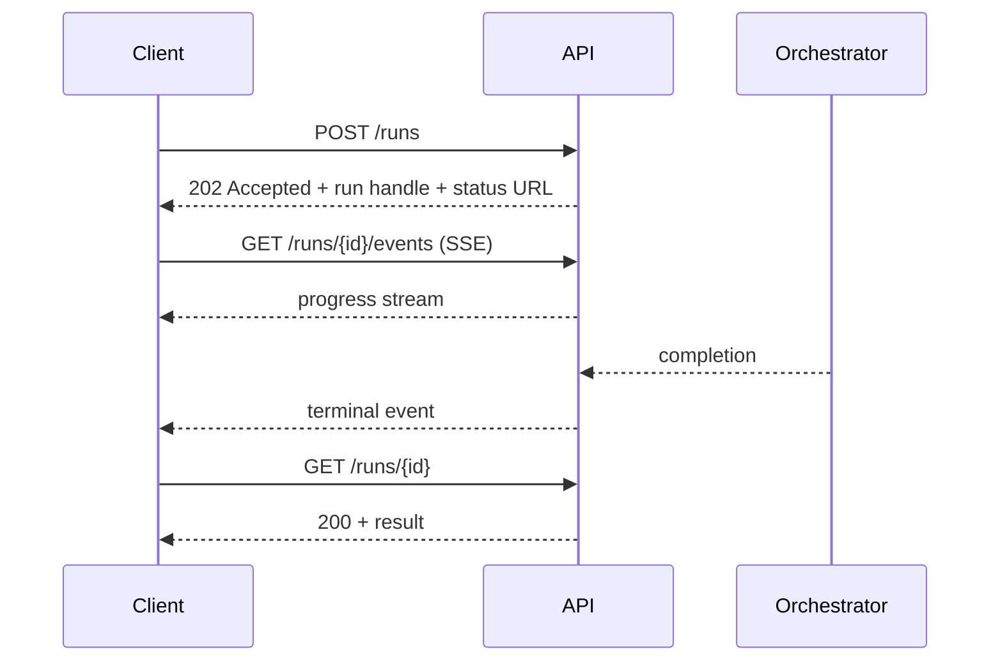
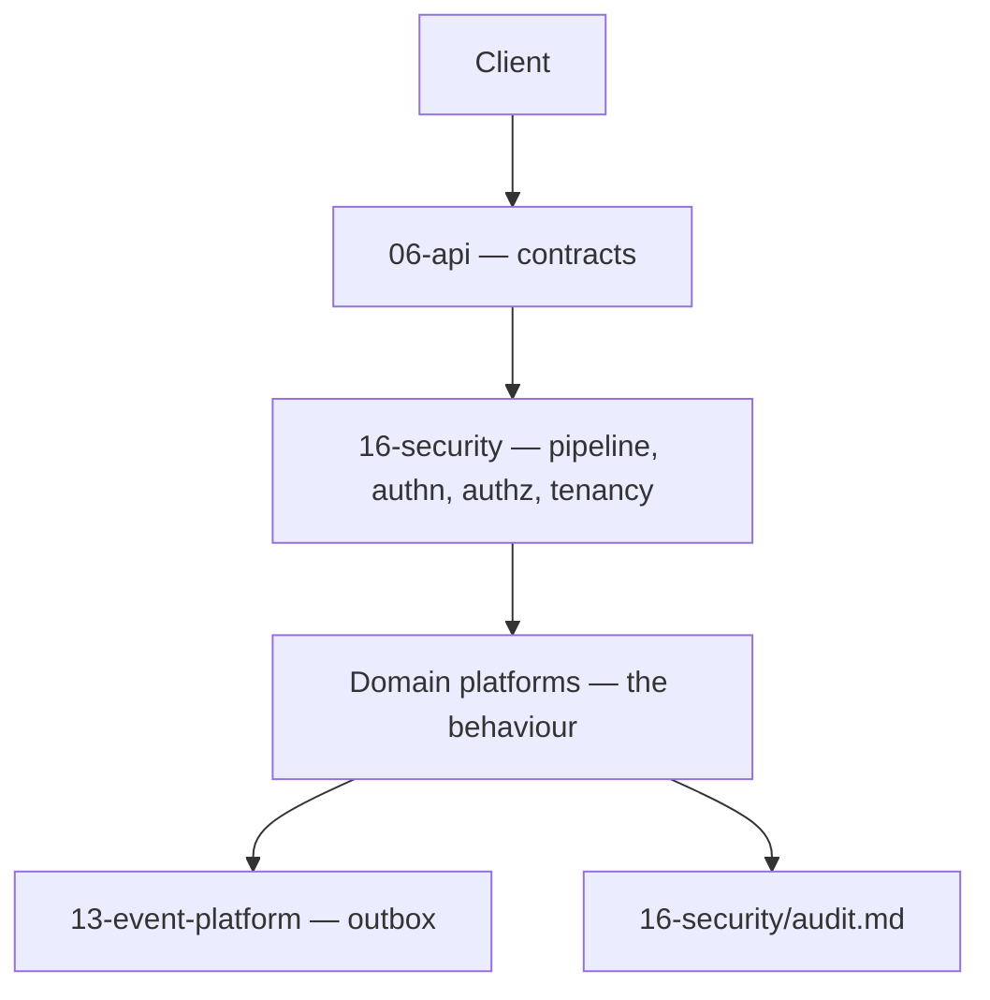

# API

> **Status:** v1.0 — complete. Phase 12.
> **This folder specifies contracts, not behaviour.** Every endpoint here delegates its logic to a platform specified in Phases 4–11. Where an API document appears to define a rule, it is restating one and says whose.

## Overview

**Purpose.** Define the external HTTP surface: resources, methods, schemas, status codes, pagination, versioning, and the compatibility promises customers can build against.

**Contract-first.** The contract is designed before the implementation and is the artifact both sides commit to. A contract derived from an implementation inherits every accident of that implementation — a field named after a column, a status code chosen by a framework default, a shape that changes when the storage changes.

**The API is the only inbound surface.** `services/api` accepts external traffic; nothing else does (`07-development-guide/project-structure.md`). Every request passes the pipeline in `16-security/api-security.md` — size limits, rate limiting, authentication, CSRF, validation, idempotency, tenant resolution, authorization — before reaching a handler.

## What this folder owns

- Resource-oriented URL structure and HTTP method semantics.
- Request and response schemas.
- Status code policy and the error envelope.
- Pagination, filtering, sorting, sparse fieldsets, expansion.
- Idempotency semantics at the request layer.
- API versioning and deprecation.
- Documented rate-limit classes per endpoint.

## What this folder never owns

| Not owned | Owner |
|---|---|
| **Any business rule** | The owning domain component |
| Database schema and column names | `03-database/` |
| Authentication mechanics | `16-security/authentication.md` |
| Authorization policy | `16-security/authorization.md`, `rbac.md` |
| Rate limit **values** | `04-platform/rate-limiting.md` |
| Request pipeline controls | `16-security/api-security.md` |
| Error codes and retryability | `07-development-guide/error-handling.md` |
| Event contracts | `13-event-platform/event-apis.md` |
| Long-running execution | `05-content-platform/orchestration.md` |

**An API document that redefined an owned concern would create a second source of truth**, and the two would drift silently — the drift only surfacing when a client depends on the wrong one.

## Stability guarantees

| Guarantee | Scope |
|---|---|
| **Additive changes only** within a version | New optional fields, new endpoints, new enum values on output |
| **Stable error codes** | A code's meaning never changes; retired codes are never reused |
| **Stable identifiers** | A resource id is permanent for that resource's lifetime |
| **Deprecation notice** | 6 months minimum before retirement, announced in-band |
| **Security fixes backported** | To every supported version |

**Message text is not part of the contract; codes are.** A client branching on message text breaks when wording improves. `error.code` is the branch point and is documented per endpoint (`07-development-guide/error-handling.md`).

**Adding an enum value to a *response* is additive; adding one to a *request* is not.** Clients tolerate unknown output values by ignoring them, but a server that starts accepting a new input value has changed what it will do. Response enums are documented as open; request enums as closed.

**Field removal is never additive**, even for a field nobody appears to use. Usage is unobservable from the server side once a client has cached a response shape.

## Versioning

```
https://api.contentos.ai/v1/workspaces/{workspaceId}/articles
```

**The version is in the path.** Header-based versioning is more elegant and worse in practice: it is invisible in logs, browser tools, and support tickets, and it makes a URL insufficient to reproduce a request.

| Rule | Behaviour |
|---|---|
| Unknown version | **Rejected**, never defaulted (`16-security/api-security.md`) |
| Retired version | **`410 Gone`** with an upgrade reference — never a silent fallback |
| Breaking change | New version; old version supported for its deprecation window |
| Compatible change | Ships in the current version |

**Silently routing a v1 call to v2 applies v2 semantics — including authorization semantics — to a client expecting v1.** That is the reason retirement is a hard `410` rather than a redirect.

**Breaking versus compatible follows the same taxonomy as event versioning** (`13-event-platform/versioning.md`): removing or renaming a field, changing a type, narrowing an input enum, or **changing a field's meaning while keeping its shape** are all breaking. The last is the most dangerous, because every automated check passes.

## REST conventions

| Convention | Rule |
|---|---|
| Resources are **plural nouns** | `/articles`, never `/getArticle` |
| Hierarchy reflects ownership | `/workspaces/{id}/articles` |
| Verbs live in the method | Not the path |
| **Actions that are not CRUD** | `POST /{resource}/{id}/actions/{action}` |
| Identifiers | UUIDv7, opaque to clients |
| Timestamps | ISO 8601 UTC, always `Z` |
| Durations | Field name carries the unit — `ttlSeconds` |
| Casing | `camelCase` in JSON |

**Non-CRUD actions get an explicit `actions/` segment** rather than being forced into a verb-shaped path or an overloaded `PATCH`. Archiving a workspace is not an update to a field the client should be setting directly — it is a state transition with its own authorization, events, and audit implications.

**URLs never expose database tables, column names, or internal keys.** A path segment named after a table freezes the schema into the public contract, and a storage key in a response leaks the tenant prefix and internal layout (`12-storage-platform/object-storage.md`).

## Long-running work

**Specified by `01-system-architecture/09-request-flow.md` and restated here because every resource document depends on it.**



**Long-running operations return `202 Accepted` with a handle, never a held-open request.** Progress streams over SSE; the terminal result is fetched from the resource. A synchronous endpoint that blocked for minutes would exhaust connections and fail at the first proxy timeout.

**The stream is a convenience, not the source of truth.** A client that misses events reconstructs state from the resource, which is why every streamed operation also has a `GET` returning current state (`13-event-platform/consumer-groups.md` applies the same reconnection reasoning internally).

## Relationship to the platforms



| Layer | Contributes |
|---|---|
| **Security** | Every pipeline control; authentication; authorization; `TenantContext` |
| **Platform** | Rate limit values, billing entitlements, notifications |
| **Event** | Events emitted by state changes — always through the outbox |
| **Domain** | The behaviour every endpoint delegates to |

**Every endpoint document states the events it emits and its audit implications**, because those are contract-adjacent: a customer building a webhook integration needs to know which events a call produces, and a customer under audit needs to know what is recorded.

**No endpoint publishes an event directly.** State changes write to the transactional outbox in the same transaction, so a `201 Created` and its `WorkspaceCreated` event cannot diverge (`13-event-platform/transactional-outbox.md`).

## Document map

| Document | Covers |
|---|---|
| `api-principles.md` | **Canonical conventions** — URLs, methods, status codes, error envelope, pagination, filtering, expansion, idempotency, ETags, deprecation |
| `api-reference.md` | **Canonical endpoint registry** — every endpoint, once, with authorization, idempotency, events, and audit |
| `api-versioning.md` | Evolution: compatible versus breaking, field and enum lifecycle, deprecation and sunset |
| `api-observability.md` | HTTP-surface telemetry, trace identifiers, SLOs, alerting |
| `authentication-api.md` | Login, logout, refresh, session, MFA, password reset, email verification |
| `organization-api.md` | Organizations, members, invitations, ownership transfer |
| `workspace-api.md` | Workspaces, membership, roles, archive/restore lifecycle |
| `content-api.md` | Articles, outlines, revisions, quality gates, citations, publish/refresh/optimize |
| `research-api.md` | Research jobs, SERP, competitors, and the **canonical `Run` resource** |
| `knowledge-api.md` | Evidence search, provenance, entities, citations, freshness |
| `ai-api.md` | Generation, review, Council, cost and usage reporting |
| `media-api.md` | Upload, multipart, metadata, derivatives, signed URLs, deletion, restore |
| `event-api.md` | Event catalogue, subscriptions, delivery records, replay visibility |
| `webhooks.md` | Endpoint registration, verification, signing, retry, secret rotation |
| `admin-api.md` | **Never public** — health, status, flags, jobs, DLQ, replay, audit lookup |

**Every endpoint is documented with the same eleven fields**: purpose, method, path, request schema, response schema, error codes, authorization requirement, idempotency, events emitted, audit implications, and rate-limit class. Uniformity is what makes the set generatable and reviewable.

## Pre-existing scaffold — two items requiring a decision

**This folder contained six placeholder files before Phase 12.**

| Item | Status |
|---|---|
| `README.md` | **Superseded** by this document |
| **`authentication.md`** | **Conflict** — Phase 12 specifies `authentication-api.md` |
| `keywords.md`, `research.md`, `articles.md`, `publishing.md` | **Not in this batch** — remain TODO placeholders; `articles.md` and `publishing.md` each have 1 inbound reference |

**The `authentication.md` placeholder additionally encodes a superseded assumption.** Its TODO list specifies "token contents and claims (`user_id`, `tenant_id`, `roles`)." The approved `16-security/authentication.md` overturned exactly that: **no token carries permissions or roles**, and `Subject` deliberately carries no `tenantId`, because a token minted before a permission change would hold stale authority until it expired.

**`authentication-api.md` follows the approved Phase 9 decision.** The placeholder predates it and is stale, not merely unwritten — which is worth stating explicitly, because a reader comparing the two would otherwise conclude the new document had drifted.

## Reading order

**Implementing an endpoint:** `api-principles.md` first, always. It defines conventions every resource document assumes.

**Integrating as a client:** `api-principles.md` for pagination, errors, and idempotency; then the resource document.

**Reviewing a contract change:** `api-principles.md` §deprecation, then `13-event-platform/versioning.md` for the compatible-versus-breaking taxonomy the API shares.

## Cross references

- `16-security/api-security.md` — **the request pipeline every endpoint passes through**
- `16-security/authentication.md` — session, token, and MFA semantics
- `16-security/authorization.md` — permission evaluation; 404-versus-403
- `16-security/rbac.md` — the permissions endpoints require
- `16-security/audit.md` — what each endpoint records
- `07-development-guide/error-handling.md` — stable codes and the error envelope
- `13-event-platform/event-apis.md` — the envelope of emitted events
- `13-event-platform/transactional-outbox.md` — why events cannot diverge from responses
- `13-event-platform/versioning.md` — the compatibility taxonomy
- `04-platform/rate-limiting.md` — rate limit values per plan
- `01-system-architecture/09-request-flow.md` — 202 plus handle; SSE progress
- `01-system-architecture/13-adr-log.md` — ADR-017 tenancy hierarchy
