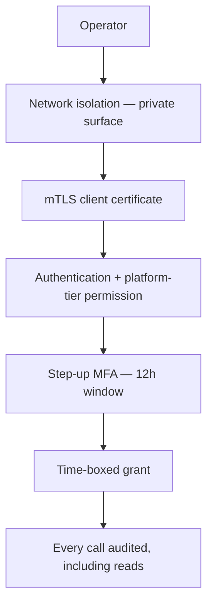

# Admin API

> **Status:** v1.0 — complete. Phase 12. **Contracts only.**
> **This surface is never public.** It is network-isolated, requires platform-tier permissions that no customer role can hold, demands step-up authentication, and audits every call — including reads.

## Overview

**Purpose.** Define the operator surface: health and readiness probes, system status, feature flags, background job inspection, replay administration, dead-letter inspection, audit lookup, and configuration inspection.

**Permissions are not redefined here.** The platform-tier permissions — `dlq:read`, `dlq:manage`, `replay:execute`, `platform:audit`, `platform:support` — are defined in `16-security/rbac.md` and are **never held by a customer subject**. They belong to operator identities, are granted individually rather than through a role, and every use is audited as a cross-tenant operation.

**Reads are audited here, unlike everywhere else in the API.** An operator inspecting a tenant's dead letters or reading their audit trail is accessing customer data across the isolation boundary. Without audited reads, an operator could review every tenant's activity leaving no trace — defeating the audit trail's purpose at exactly the point it matters (`16-security/audit.md`).

## Access model



| Control | Rule |
|---|---|
| Network | Private surface; **not routable from the public internet** |
| Transport | mTLS in addition to TLS |
| Permission | Platform-tier only — never a customer role |
| Step-up | Required; 12-hour window (`16-security/authentication.md`) |
| Grants | **Time-boxed**, individually approved |
| Audit | **Every request, including reads** |
| Cross-tenant | Recorded as a cross-tenant operation and **alerted** |

**Defence in depth is deliberate: four independent controls.** Network isolation alone fails if the surface is misconfigured; permissions alone fail if an operator account is compromised. A public admin API protected only by a permission check is one routing mistake from exposure.

**A `platform:audit` cross-tenant read pages every time** (`16-security/security-observability.md`). It is legitimate and rare; the page is not an accusation but a guarantee that no privileged access happens unobserved.

## Health and readiness

**The one exception: unauthenticated, and deliberately uninformative.**

| Field | Value |
|---|---|
| **Purpose** | Orchestrator probes |
| **Method · Path** | `GET /healthz` · `GET /readyz` · `GET /startupz` |
| **Authorization** | **None** |
| **Idempotency** | Read-only |
| **Rate limit** | Exempt |
| **Events** | None |
| **Audit** | Not recorded |

```ts
// GET /healthz — liveness. 200 or nothing.
{ status: 'ok' }

// GET /readyz — readiness.
{ status: 'ready' | 'not_ready' }        // 200 or 503
```

**Liveness never checks dependencies.** If it probed the database, a brief blip would fail liveness on every instance simultaneously, the orchestrator would restart the whole fleet, and the fleet could not start because the dependency is still degraded — a recoverable incident turned into a total outage by the health check (`07-development-guide/deployment-guide.md`).

**Readiness checks dependencies and only removes from rotation.** It never triggers a restart.

**Neither response names a dependency.** `{"status":"not_ready","database":"unreachable"}` tells an unauthenticated caller which component is down and where to press. The detailed view is authenticated, below.

## System status

| Field | Value |
|---|---|
| **Purpose** | Detailed component health for operators |
| **Method · Path** | `GET /admin/v1/status` |
| **Authorization** | `platform:support` |
| **Idempotency** | Read-only |
| **Rate limit** | `read` |
| **Events** | None |
| **Audit** | **Recorded** |

```ts
interface SystemStatus {
  readonly build: { version: string; commitSha: string; deployedAt: string };
  readonly components: readonly {
    readonly name: string;
    readonly status: 'healthy' | 'degraded' | 'unhealthy';
    readonly detail: string | null;
  }[];
  readonly invariants: readonly {
    readonly name: string;                    // 'cross_tenant', 'audit_write', 'ordering'
    readonly breaches24h: number;             // MUST be zero
  }[];
}
```

**The invariant block mirrors the invariant board** — every entry should read zero, and a non-zero value is an incident rather than a metric to interpret (`16-security/security-observability.md`).

**`commitSha` and `deployedAt` answer "what is actually running here"**, which is the first question in most incidents and is otherwise answered by trusting a deployment manifest was applied.

## Configuration inspection

| Field | Value |
|---|---|
| **Purpose** | Show effective configuration |
| **Method · Path** | `GET /admin/v1/config` |
| **Authorization** | `platform:support` |
| **Idempotency** | Read-only |
| **Rate limit** | `read` |
| **Events** | None |
| **Audit** | **Recorded** |

```ts
{
  config: object;                    // resolved values
  secretsReferenced: readonly {      // NAMES ONLY
    readonly key: string;            // 'database.passwordSecret'
    readonly secretName: string;     // 'db-app-password'
    readonly version: number;
    readonly resolvedAt: string;
  }[];
}
```

**Secret names and versions are shown; values never are.** Configuration holds references, and the resolved values are deliberately kept out of the config object precisely so this endpoint can exist (`07-development-guide/configuration.md`, `16-security/secrets-management.md`).

**Configuration is read-only through the API.** Changes go through deployment. A mutable configuration endpoint would let an operator alter production behaviour outside the deploy pipeline, with no artifact, no review, and no rollback target.

## Feature flags

| Field | Value |
|---|---|
| **Purpose** | Inspect and modify flag state |
| **Method · Path** | `GET /admin/v1/flags` · `PATCH /admin/v1/flags/{flagName}` |
| **Authorization** | `platform:support` + **step-up** |
| **Idempotency** | `PATCH` idempotent; `If-Match` required |
| **Rate limit** | `write` |
| **Events** | `FeatureFlagChanged` |
| **Audit** | **Actor, flag, before/after, scope** |

```ts
// PATCH
{ enabled?: boolean; percentage?: number; tenantOverrides?: Record<string, boolean>; }
```

| Error | Code | Status |
|---|---|---|
| Unknown flag | `NOT_FOUND` | 404 |
| **Flag gates a security control** | `FLAG_IMMUTABLE` | **403** |
| Past removal date | Warning in response; change permitted | 200 |

**No flag gates a security control, and attempting to create one is refused at registration.** There is no flag that disables RLS, skips authorization, or bypasses audit. A control that can be switched off at runtime is not a control (`07-development-guide/configuration.md`).

**Flags are the fastest rollback available** — seconds, no deploy — which is why this endpoint exists on the operator surface at all (`07-development-guide/deployment-guide.md`).

**Stale flags are reported but changeable.** Blocking a change to a flag past its removal date would remove a rollback lever during an incident.

## Background jobs

| Field | Value |
|---|---|
| **Purpose** | Inspect scheduled jobs and worker health |
| **Method · Path** | `GET /admin/v1/jobs` · `GET /admin/v1/workers` |
| **Authorization** | `platform:support` |
| **Idempotency** | Read-only |
| **Rate limit** | `read` |
| **Events** | None |
| **Audit** | **Recorded** |

```ts
interface WorkerStatus {
  readonly workerId: string;
  readonly hostedGroups: readonly string[];
  readonly inFlight: number;
  readonly lastHeartbeatAt: string;
  readonly status: 'starting' | 'ready' | 'draining' | 'unhealthy';
}

interface ConsumerGroupStatus {
  readonly group: string;
  readonly instanceCount: number;             // ZERO IS AN ALERT
  readonly lagSeconds: number;                // TIME, not count
  readonly pendingCount: number;
}
```

**`instanceCount: 0` for a registered group is the alert that catches a failed deploy.** Events accumulate with no error anywhere, and the capability that group powers silently stops working (`13-event-platform/workers.md`).

**Lag is reported in seconds, not entries.** A backlog of 50,000 means nothing without a drain rate; "the oldest unprocessed event is 40 minutes old" is directly actionable (`13-event-platform/observability.md`).

## Dead-letter inspection

| Field | Value |
|---|---|
| **Purpose** | Inspect and resolve quarantined events |
| **Method · Path** | `GET /admin/v1/dlq` · `GET .../dlq/{entryId}` · `POST .../dlq/{entryId}/actions/resolve` · `.../discard` · `.../replay` |
| **Authorization** | **`dlq:read`** · **`dlq:manage`** + step-up |
| **Idempotency** | Actions require `Idempotency-Key` |
| **Rate limit** | `read` · `write` |
| **Events** | `DlqEntryResolved` · `Discarded` · `ReplayRequested` |
| **Audit** | **Every action, with mandatory note** |

```ts
// resolve / discard
{ note: string; }        // REQUIRED — no default, no empty string
```

| Error | Code | Status |
|---|---|---|
| Missing note | `VALIDATION_FIELD_INVALID` | 400 |
| Not replay-eligible | `DLQ_INELIGIBLE` | 409 |
| Already resolved | `DLQ_ALREADY_RESOLVED` | 409 |

**`note` is mandatory on resolve and discard, enforced by a database CHECK constraint as well as the schema.** A rule stated only in a service method is bypassed by the first migration script or admin query that updates the row directly (`13-event-platform/dead-letter-queue.md`).

**There is no delete.** Removal happens only through retention of already-resolved entries. An API that could remove a quarantined entry would be an API that could lose an event — the platform's hardest rule (ADR-027).

**Grouped inspection is the default view.** `GET /admin/v1/dlq?groupBy=failure_code` turns a 4,000-entry queue into three distinct incidents, which is the difference between triage and archaeology.

**Publish-side and delivery-side entries are labelled distinctly**, because they demand different responses: publish-side means no consumer saw the event at all.

## Replay administration

| Field | Value |
|---|---|
| **Purpose** | Estimate and execute event replay |
| **Method · Path** | `POST /admin/v1/replays/estimate` · `POST /admin/v1/replays` · `GET .../replays/{id}` · `POST .../{id}/actions/pause` · `.../resume` · `.../abort` |
| **Authorization** | **`replay:execute`** + step-up |
| **Idempotency** | Start requires `Idempotency-Key` |
| **Rate limit** | `write`, strictly bounded |
| **Events** | `ReplayStarted` · `ReplayCompleted` · `ReplayAborted` |
| **Audit** | **Actor, scope, target groups, outcome** |

```ts
// estimate — MUST precede start
{ mode: 'range' | 'consumer' | 'targeted'; targetGroups: string[]; from?: string; to?: string; }

// 200
{ eventCount: number; targetGroups: string[]; estimatedDurationMs: number;
  withinBounds: boolean; rejectionReason?: string; }
```

| Error | Code | Status |
|---|---|---|
| **`targetGroups` missing or empty** | `VALIDATION_FIELD_INVALID` | **400** |
| Scope exceeds bounds | `REPLAY_SCOPE_TOO_LARGE` | 409 |
| Overlapping run for a target group | `REPLAY_RUN_ACTIVE` | 409 |
| Estimate not performed | `REPLAY_ESTIMATE_REQUIRED` | 409 |

**`targetGroups` is required and non-empty. There is no broadcast.** An operator rebuilding one analytics projection who accidentally re-delivered to the notification consumer would send customers a week of duplicate emails — an effect no idempotency check can retract once the send has left the platform (ADR-028, `13-event-platform/replay.md`).

**Estimation must precede start and is enforced.** An operator seeing "2.4 million events across 6 groups" reconsiders; one who typed a date range a year too wide and pressed go does not get the chance.

**Overlapping runs against one group are refused by a partial unique index**, not by an application check — two concurrent rebuilds interleave into one shadow and produce a corrupt result that passes superficial checks.

## Audit lookup

| Field | Value |
|---|---|
| **Purpose** | Query the immutable audit trail |
| **Method · Path** | `GET /admin/v1/audit` · `GET /admin/v1/audit/timeline/{correlationId}` · `POST /admin/v1/audit/verify` |
| **Authorization** | **`platform:audit`** + step-up |
| **Idempotency** | Read-only |
| **Rate limit** | `read` |
| **Events** | None |
| **Audit** | **Recorded — reading the audit log is audited** |

```ts
// verify request
{ tenantId: string; from: string; to: string; }

// 200
{ valid: true; recordCount: number; headHash: string }
| { valid: false; brokenAt: string; expectedHash: string; actualHash: string }
```

**Reading the audit log is itself an audited action.** Without this, an operator could review every tenant's activity leaving no trace (`16-security/audit.md`).

**`timeline/{correlationId}` is the investigation primitive** — every audited action caused by one request, across services, tenants, and asynchronous work, in one query.

**Chain verification failure is a suspected compromise, not a data-quality finding.** The chain breaks for exactly two reasons: someone modified the trail, or storage corrupted. Both page immediately.

**There is no audit write, update, or delete endpoint.** The interface offers no path to mutation.

## Business rules

1. **This surface is never publicly routable.**
2. **mTLS in addition to TLS.**
3. **Platform-tier permissions only** — never a customer role.
4. **Step-up required on every mutating operation.**
5. **Every request is audited, including reads.**
6. **Cross-tenant access is recorded and alerted.**
7. **Health and readiness are unauthenticated and name no dependency.**
8. **Liveness never checks dependencies.**
9. **Configuration is read-only; secret values are never returned.**
10. **No flag gates a security control.**
11. **DLQ resolve and discard require a note**, enforced by constraint.
12. **There is no DLQ delete.**
13. **Replay requires non-empty `targetGroups`** — no broadcast.
14. **Replay estimation must precede execution.**
15. **Overlapping replays per group are refused.**
16. **Audit reads are audited; there is no audit mutation endpoint.**
17. **Chain verification failure pages as a suspected compromise.**

## Events emitted

| Event | Trigger |
|---|---|
| `FeatureFlagChanged` | Flag modification |
| `DlqEntryResolved` · `Discarded` · `ReplayRequested` | DLQ intervention |
| `ReplayStarted` · `Completed` · `Aborted` | Replay lifecycle |

**These are internal events, not customer-subscribable.** They carry operator identities and cross-tenant scope, and exposing them through `event-api.md` would leak operational activity to customers.

## Audit implications

**Every endpoint on this surface writes an audit record**, including reads — the inversion of the rest of the API, where reads are not recorded.

| Action | Recorded |
|---|---|
| Status, config, jobs, workers | Actor, endpoint |
| DLQ inspect | Actor, entry id, tenant |
| **DLQ resolve, discard, replay** | Actor, entry id, **mandatory note** |
| Replay start, pause, abort | Actor, scope, target groups |
| **Audit read** | Actor, query, result count |
| Flag change | Actor, flag, before/after |

## Cross references

- `16-security/rbac.md` — **platform-tier permissions, never in a customer role**
- `16-security/authentication.md` — step-up requirements
- `16-security/audit.md` — the trail this surface queries and writes to
- `16-security/security-observability.md` — invariant board, cross-tenant alerting
- `16-security/incident-response.md` — the procedures this surface supports
- `13-event-platform/dead-letter-queue.md` — ADR-027, entry shape, mandatory notes
- `13-event-platform/replay.md` — ADR-028, estimation, target groups
- `13-event-platform/workers.md` — worker and consumer group health
- `07-development-guide/configuration.md` — flags, config immutability
- `07-development-guide/deployment-guide.md` — liveness versus readiness
- `event-api.md` — the customer-facing event surface, distinct from this one
- `api-principles.md` — actions, idempotency, status codes
