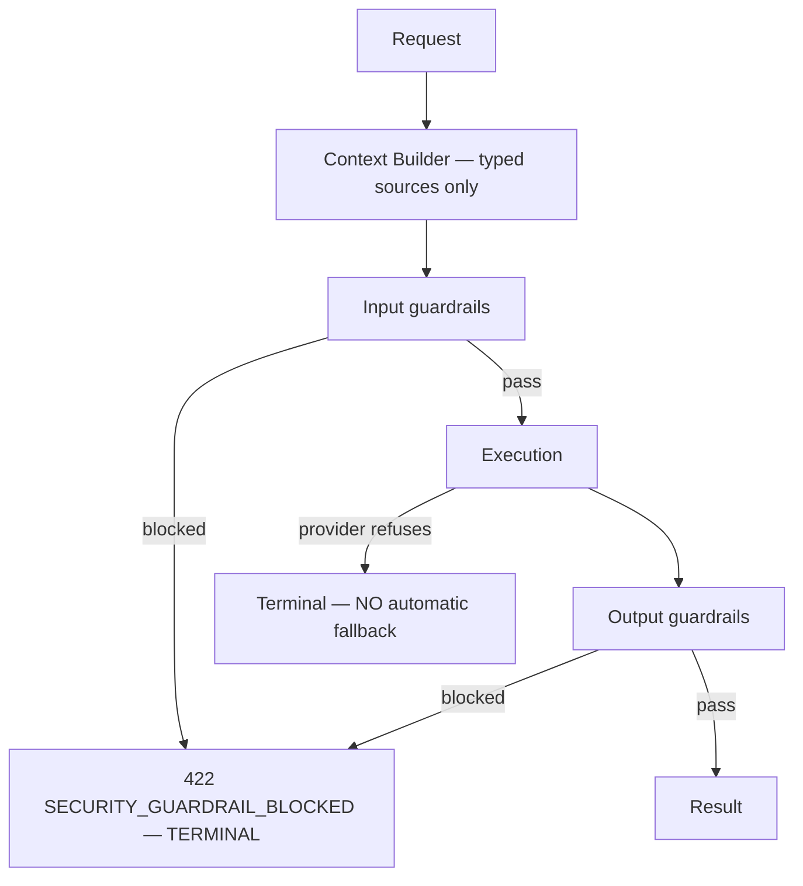

# AI API

> **Status:** v1.0 — complete. Phase 12. **Contracts only.**
> **No model name, no provider, no routing decision appears in any request or response.** Clients submit intent and references; the platform decides everything else. A contract naming a model would make model substitution a breaking change.

## Overview

**Purpose.** Define endpoints for generation, review, Council execution, cost and usage reporting, job status, and cancellation.

**Two Phase 6 rules shape every schema below.**

**Clients never submit prompt text.** They submit *references* — an article, an outline, evidence identifiers. The Context Builder assembles the actual model input from typed, allowlisted sources, which is what structurally excludes secrets from ever reaching a prompt (`16-security/secrets-management.md`) and prevents the API from becoming a direct prompt-injection channel.

**Disclosure is not provider exposure.** ADR-019 requires that Council results disclose how many independent evaluations ran and whether they conflicted. It does not require — and this API does not permit — revealing which models produced them.

## What is never exposed

| Never returned | Why |
|---|---|
| Model name, family, or version | Substitution would become a breaking change |
| Provider identity | Same, plus it leaks commercial arrangements |
| **Routing decisions** | Which model handled what is an optimization detail |
| Fallback occurrence | Implies provider structure |
| Raw prompts or system instructions | Prompt engineering is not a customer contract |
| Per-model token counts | Tokenizers differ by family — a fingerprint |
| **Anything from AI Memory as fact** | Never a source of truth (ADR-026) |

**Per-model token counts are withheld because tokenizers fingerprint model families.** Two calls with identical text producing different counts identifies the models involved as surely as naming them.

## Common contract

| Property | Value |
|---|---|
| Base path | `/v1/workspaces/{workspaceId}/ai` |
| Authorization | Workspace-tier; the specific permission varies |
| Run shape | **The canonical `Run`** (`research-api.md`) |
| Rate-limit class | **`expensive`** on every execution endpoint |
| Audit | Every execution; cost recorded |

## Context submission

**Clients supply references. The platform builds the context.**

```ts
interface ContextRequest {
  readonly articleId?: string;
  readonly outlineVersionId?: string;
  readonly revisionNumber?: number;
  readonly evidenceIds?: readonly string[];
  readonly instructions?: string;        // BOUNDED, treated as untrusted
}
```

| Field | Treatment |
|---|---|
| Identifiers | Resolved server-side under the caller's authorization |
| `instructions` | **Max 2,000 characters**, sanitised, marked untrusted in the manifest |
| Anything else | Rejected — schemas are `.strict()` |

**`instructions` is the one free-text field and it is deliberately constrained.** Customers legitimately need to say "keep the tone formal." That is not the same as submitting a system prompt, and the length bound plus untrusted marking is what keeps the distinction (`08-ai-platform/context-builder.md`).

**Evidence identifiers are authorized individually.** A caller referencing evidence they cannot read receives `403` for that reference rather than silently having it dropped — a dropped reference would produce content grounded differently than the caller believes.

**There is no raw-prompt endpoint, and there will not be one.** It would bypass the Context Builder, defeat structural secret exclusion, and make every guardrail a filter on attacker-controlled input rather than a check on a constructed manifest.

## Generation

| Field | Value |
|---|---|
| **Purpose** | Generate content from an outline and evidence |
| **Method · Path** | `POST /v1/workspaces/{workspaceId}/ai/generate` |
| **Authorization** | `article:execute` |
| **Idempotency** | **`Idempotency-Key` required** |
| **Rate limit** | **`expensive`** |
| **Events** | `AiGenerationRequested`, then `AiGenerationCompleted` \| `AiGenerationFailed` |
| **Audit** | Actor, context references, credit hold, outcome |

```ts
// request
{
  target: 'section' | 'article' | 'summary' | 'meta';
  context: ContextRequest;
  sectionId?: string;
}

// 202 — Location: /v1/runs/{runId}
{ run: Run }
```

| Error | Code | Status |
|---|---|---|
| Insufficient credits | `DOMAIN_QUOTA_EXCEEDED` | **402** |
| Evidence not readable | `SECURITY_AUTHORIZATION_DENIED` | 403 |
| **Guardrail blocked** | `SECURITY_GUARDRAIL_BLOCKED` | **422** |
| Instructions too long | `VALIDATION_FIELD_INVALID` | 400 |
| All providers unavailable | `PROVIDER_UNAVAILABLE` | 503 |

**A guardrail block is `422` and is terminal.** It is never retried, by any component, under any circumstance — the platform's most-repeated rule (`13-event-platform/retry-engine.md`, `08-ai-platform/retry-strategy.md`). A client retrying receives the same block, because a guardrail decision is deterministic and the input is unchanged.

**A safety refusal never triggers automatic provider fallback.** Routing a refused request elsewhere until one complies is laundering a refusal. The run fails terminally and the reason is disclosed as a category, not a provider message.

**`503` for total provider unavailability carries `Retry-After`** and is the one AI failure that is genuinely transient.

## Review

| Field | Value |
|---|---|
| **Purpose** | Evaluate content and produce scores |
| **Method · Path** | `POST /v1/workspaces/{workspaceId}/ai/review` |
| **Authorization** | `article:execute` |
| **Idempotency** | **`Idempotency-Key` required** |
| **Rate limit** | **`expensive`** |
| **Events** | `AiReviewRequested`, `AiReviewCompleted` |
| **Audit** | Actor, subject, outcome |

```ts
// request
{ context: ContextRequest; dimensions?: readonly string[]; }

// result (via /runs/{id}/results)
{
  scores: readonly {
    category: string;                 // canonical registry value
    value: number;                    // INTEGER 0–100, higher is better
    confidence: number;               // INTEGER 0–100
    contractVersion: string;
    explanation: ExplainabilityEnvelope;
  }[];
  verdict: 'pass' | 'soft-warn' | 'block';
}
```

**Scores conform to ADR-021 exactly** — integer 0–100, higher always better, orthogonal confidence, mandatory explanation. `algorithmVersion` is **not** returned: it is opaque and changes when scoring improves, which must not look like a contract change (`01-system-architecture/14-scoring-contract.md`).

**Each category has exactly one producer**, so two review calls cannot return conflicting scores for the same category.

**`explanation` is required, not optional.** A score without one is a defect (ADR-009), which makes it a mandatory response field rather than an enrichment a client requests.

## Council execution

| Field | Value |
|---|---|
| **Purpose** | Run a multi-perspective evaluation with enforced diversity |
| **Method · Path** | `POST /v1/workspaces/{workspaceId}/ai/council` |
| **Authorization** | `article:execute` |
| **Idempotency** | **`Idempotency-Key` required** |
| **Rate limit** | **`expensive`** — highest cost per call |
| **Events** | `AiCouncilRequested`, `AiCouncilCompleted` |
| **Audit** | Actor, subject, participant count, conflict outcome, cost |

```ts
// request
{ context: ContextRequest; question: string; }

// result
interface CouncilResult {
  readonly participantCount: number;            // HOW MANY — never WHICH
  readonly diversityEnforced: true;
  readonly consensus: 'unanimous' | 'majority' | 'split' | 'no-consensus';
  readonly positions: readonly {
    readonly positionId: string;                // opaque — 'position-1', not a model
    readonly summary: string;
    readonly reasoning: string;
    readonly confidence: number;                // 0–100
  }[];
  readonly conflicts: readonly {
    readonly topic: string;
    readonly positionIds: readonly string[];
    readonly nature: string;
  }[];
  readonly recommendation: ExplainabilityEnvelope;
  readonly costCredits: number;
}
```

**`participantCount` and `diversityEnforced` are the ADR-019 disclosure.** A customer learns that three independent evaluations ran under an enforced-diversity constraint, and whether they agreed. That is the honesty requirement — the alternative is Council theatre, where one model is queried three times and presented as consensus.

**`positionId` is opaque and deliberately uninformative.** `position-1` carries no model attribution. Numbering is stable within a result so conflicts can reference positions, and carries no meaning across results.

**`conflicts` is populated only by real disagreement.** ADR-019 requires genuine conflict detection, not synthesized dissent — an empty array means the participants actually agreed.

**`consensus: 'no-consensus'` is a legitimate terminal outcome**, not a failure. Forcing a recommendation from genuine disagreement would misrepresent the platform's confidence.

**`costCredits` is returned inline** because Council is the most expensive operation available and a customer deciding whether to run it again needs the number without a second call.

## Job status and cancellation

**Both use the canonical `Run` endpoints** defined in `research-api.md`:

| Operation | Path |
|---|---|
| Status | `GET /v1/runs/{runId}` |
| Progress stream | `GET /v1/runs/{runId}/events` |
| Results | `GET /v1/runs/{runId}/results` |
| Cancel | `POST /v1/runs/{runId}/actions/cancel` |

**AI runs report the same five coarse phases** as every other run. `gathering` covers context assembly; `analyzing` covers model execution. Neither reveals how many calls were made or to whom.

**Cancellation releases held credits for work not performed.** An in-flight provider call cannot be recalled, so credits for calls already issued are retained (`04-platform/billing.md`).

## Cost and usage reporting

| Field | Value |
|---|---|
| **Purpose** | Report AI consumption for a workspace |
| **Method · Path** | `GET /v1/workspaces/{workspaceId}/ai/usage` |
| **Authorization** | `analytics:read` |
| **Idempotency** | Read-only |
| **Rate limit** | `read` |
| **Events** | None |
| **Audit** | Not recorded |

```ts
// GET .../usage?from=2026-07-01&to=2026-07-31&groupBy=day
{
  period: { from: string; to: string };
  totals: {
    credits: number;
    operations: number;
    tokensProcessed: number;        // AGGREGATE ONLY — no model attribution
  };
  byOperation: readonly {
    operation: 'generate' | 'review' | 'council' | 'embed';
    credits: number;
    operations: number;
  }[];
  series: readonly { date: string; credits: number; operations: number }[];
}
```

**Credits are the unit customers are billed in and reason about.** Provider dollar cost is never exposed — it reveals commercial terms and would change when a provider contract changes, with no corresponding change in what the customer pays.

**`tokensProcessed` is a single aggregate across every operation.** Broken down per operation or per model it becomes a fingerprint; as one number it is a useful scale indicator with no attribution.

**Usage is reported per workspace.** Organization-level aggregation is a billing concern with a different permission (`04-platform/billing.md`).

## Guardrails and refusals



| Outcome | Code | Status | Retryable |
|---|---|---|---|
| Input guardrail | `SECURITY_GUARDRAIL_BLOCKED` | 422 | **Never** |
| Output guardrail | `SECURITY_GUARDRAIL_BLOCKED` | 422 | **Never** |
| Provider safety refusal | `PROVIDER_SAFETY_REFUSAL` | 422 | **Never; no fallback** |
| Grounding failure | `AI_GROUNDING_FAILED` | 422 | Never — evidence is insufficient |
| Validation failure | `AI_VALIDATION_FAILED` | 500 | **Retried internally** |

**Validation failure is the only retryable class, and the retry happens internally.** A malformed model response is re-attempted by the platform; the client sees either a result or a terminal failure, never a retry it must manage (`08-ai-platform/retry-strategy.md`).

**`AI_GROUNDING_FAILED` means the claim could not be supported by available evidence.** The correct client response is to run more research, not to retry generation — which is why it is terminal and distinct from a validation failure.

**Block reasons are returned as categories, never as model output.** A verbatim refusal message could contain injected content from a fetched page (`16-security/threat-model.md`, T-14).

## Business rules

1. **No model, provider, or routing decision is ever exposed.**
2. **Per-model token counts are never returned**; only an aggregate.
3. **Clients submit references, never prompt text.**
4. **`instructions` is bounded at 2,000 characters and marked untrusted.**
5. **Evidence references are authorized individually.**
6. **No raw-prompt endpoint exists.**
7. **Guardrail blocks are `422` and terminal — never retried.**
8. **Safety refusals never trigger automatic fallback.**
9. **Validation failures are retried internally, invisibly.**
10. **Scores conform to ADR-021**; `algorithmVersion` is not exposed.
11. **Explanations are mandatory on every score and recommendation.**
12. **Council discloses participant count and diversity, never identity.**
13. **`positionId` is opaque and carries no attribution.**
14. **`no-consensus` is a valid outcome, not a failure.**
15. **Cost is reported in credits**, never provider currency.
16. **All executions return `202` with the canonical `Run`.**
17. **Every execution requires `Idempotency-Key`.**

## Events emitted

| Event | Trigger |
|---|---|
| `AiGenerationRequested` · `Completed` · `Failed` | Generation |
| `AiReviewRequested` · `Completed` | Review |
| `AiCouncilRequested` · `Completed` | Council |
| `AiCostRecorded` | Cost attribution |

**Payloads carry run identifiers, credit amounts, and outcome categories — never prompts, completions, model names, or provider identities** (`13-event-platform/event-registry.md`). Events reach webhook subscribers with weaker controls than the source, and a completion in a payload is customer content leaving its boundary.

## Audit implications

| Action | Recorded |
|---|---|
| Every execution | Actor, operation, context references, credits, outcome |
| **Guardrail block** | Category and subject — **never the blocked content** |
| Safety refusal | Category, provider **not** named in customer-visible records |
| Council | Participant count, consensus, conflict count, cost |
| Usage read | Not recorded |

**Guardrail blocks are audited without the content that triggered them.** The record proves the control fired; storing the blocked content would put the exact material the guardrail rejected into a seven-year append-only store (`16-security/audit.md`).

**Cost is audited per execution** because credit disputes are resolved from the audit trail, not from metrics.

## Cross references

- `08-ai-platform/context-builder.md` — **why clients submit references, not prompts**
- `08-ai-platform/guardrails.md` — block semantics
- `08-ai-platform/retry-strategy.md` — guardrail and safety-refusal rules
- `01-system-architecture/13-adr-log.md` — **ADR-019 Council, ADR-021 scoring, ADR-026 memory**
- `01-system-architecture/14-scoring-contract.md` — score shape
- `research-api.md` — the canonical `Run` resource
- `content-api.md` — gate verdicts consuming these scores
- `knowledge-api.md` — evidence referenced in context
- `api-principles.md` — `202`, idempotency, rate-limit classes
- `16-security/secrets-management.md` — structural exclusion from prompts
- `16-security/threat-model.md` — T-14 prompt injection, T-15 model abuse
- `04-platform/billing.md` — credits, holds, partial charging
- `13-event-platform/event-registry.md` — payload content rules
