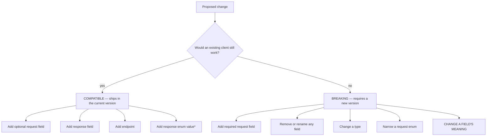
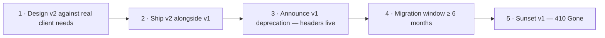

# API Versioning

> **Status:** v1.0 — complete. Phase 12.
> **An existing field never changes meaning.** Not its type, not its units, not its semantics. A field whose meaning shifts passes every automated check and breaks every client — it is the one change no test catches and no schema diff reveals.

## Overview

**Purpose.** Define how the API evolves: what counts as compatible, how a new version is introduced and run in parallel, and how an old one is retired.

**The boundary with `api-principles.md`.** That document states the *conventions* — version in the path, unknown versions rejected, retired versions return `410`, deprecation headers on every response. **This document owns the *process*:** classification, introduction, parallel operation, and sunset.

**The taxonomy is shared with event versioning.** Compatible-versus-breaking follows the same rules as `13-event-platform/versioning.md`, deliberately — a platform where an API change and an event change classify differently would produce contradictory guidance for a single feature that touches both.

## Classification



| Change | Class |
|---|---|
| Add an optional request field | Compatible |
| Add a response field | Compatible |
| Add an endpoint | Compatible |
| Add a response enum value | **Compatible with a caveat** — see below |
| Relax a validation rule | Compatible |
| Add an optional query parameter | Compatible |
| **Add a required request field** | **Breaking** |
| **Remove or rename any field** | **Breaking** |
| **Change a field's type** | **Breaking** |
| **Narrow a request enum** | **Breaking** |
| Tighten a validation rule | **Breaking** |
| Change a default value | **Breaking** |
| **Change what a field means** | **Breaking** |
| Change an HTTP status for an existing condition | **Breaking** |

**Meaning changes are breaking and are the most dangerous entry in this table**, because every automated check passes. A `publishedAt` that shifts from "sent to the CMS" to "confirmed live on the customer's site" is the same type, same name, same shape — and every client computing time-to-publish silently produces wrong numbers with no error anywhere.

**Detection is human review, which is why `07-development-guide/code-review.md` asks the question explicitly.** There is no linter for semantics.

## Request and response asymmetry

**The same change is compatible in one direction and breaking in the other.**

| Change | In a **response** | In a **request** |
|---|---|---|
| Add a field | Compatible — clients ignore unknowns | Compatible **if optional** |
| Add an enum value | Compatible (with a caveat) | **Breaking** |
| Remove a field | **Breaking** | Compatible |
| Make a field required | Compatible | **Breaking** |

**Response enums are documented as open; request enums as closed.** A client tolerating unknown output values by ignoring them keeps working when a new `status` appears. A server that starts *accepting* a new input value has changed what it will do, and a client that never sends it is unaffected — but one built against a validator now sees previously-rejected input succeed.

**The response-enum caveat is real and is stated at every enum.** A client with an exhaustive `switch` and no default breaks on a new value. The contract requires clients to handle unknown response enum values by ignoring or deferring, and every response enum is documented as open so that requirement is visible before it bites.

**Adding a value to `ArticleStatus` illustrates the risk.** Fourteen values today; a fifteenth is compatible by contract and will break a client that mapped all fourteen into a closed union. The obligation is on the client, stated up front, rather than freezing the platform's state machine forever.

## Field lifecycle

### Addition

**Response fields ship in the current version, immediately.**

**Request fields ship optional. A required field is always a new version** — the rule as stated. A request that succeeded yesterday must succeed today, and adding a requirement breaks every existing caller at once.

**Where a new input is genuinely required, it ships optional with a documented default, and becomes required in the next version.** That is expand/contract applied to a contract instead of a schema (`07-development-guide/migration-guide.md`).

### Removal

**Never within a version.** A field is deprecated in the docs and in the response, and removed only in the next version.

```json
{
  "wordCount": 1840,
  "word_count": 1840,
  "_deprecated": ["word_count"]
}
```

**Both fields are populated during the deprecation window.** A client migrated to the new name and one still on the old both work, which is what makes migration a client-paced activity rather than a coordinated cutover.

**Usage is unobservable once a client caches a response shape**, so "nobody uses it" is never a reason to remove a field early. The window runs regardless of observed usage.

### Enum evolution

| Direction | Class |
|---|---|
| Add a response value | Compatible — clients must tolerate |
| Add a request value | Compatible — widens what is accepted |
| **Remove a response value** | **Breaking** |
| **Remove a request value** | **Breaking** |
| **Reuse a retired value with new meaning** | **Prohibited outright** |

**Retired enum values are never reused**, mirroring the event-type rule. The same string meaning two things at two points in time makes historical data ambiguous with nothing in the record to disambiguate (`13-event-platform/versioning.md`).

## What is never versioned

| Element | Rule |
|---|---|
| **Error codes** | Stable across versions; a code means one thing forever |
| **Resource identifiers** | A UUID is permanent regardless of version |
| Security controls | Never weakened in any version |
| Rate-limit semantics | Values may change; the contract does not |

**Error codes are deliberately version-independent.** A client handling `STORAGE_NOT_FOUND` should not need per-version branching, and a code whose meaning varied by version would defeat the purpose of having stable codes (`07-development-guide/error-handling.md`).

**Security fixes are backported to every supported version.** An unpatched old version is an open door, and clients pinned to it have no signal to migrate (`16-security/api-security.md`).

## Introducing a version



**Both versions run in parallel from the moment v2 ships.** A new version is never a cutover; the migration window begins only once v2 is available.

**A new version is a significant event and is not created for one field.** Every version doubles the surface under test and the paths a security fix must reach. Small breaking changes wait and ship together.

**Versions share one implementation with a translation layer at the edge** wherever possible. Two independent implementations diverge — a bug fixed in one and not the other is the predictable outcome, and it is how a "supported" old version quietly stops being supported.

**Deprecation is announced in-band on every v1 response**, not only in a changelog:

```http
Deprecation: Sun, 01 Mar 2026 00:00:00 GMT
Sunset: Tue, 01 Sep 2026 00:00:00 GMT
Link: <https://docs.contentos.ai/api/v2/migration>; rel="deprecation"
```

**The header is the only channel that reaches a client integrated two years ago.** Nobody reads the changelog for an integration that is working.

## Sunset

| Stage | Duration | Behaviour |
|---|---|---|
| Announced | — | Docs updated; `Deprecation` header on every response |
| Deprecated | **≥ 6 months** | Fully functional; security fixes backported |
| **Sunset** | — | **`410 Gone`** with the migration link |

**Sunset returns `410`, never a fallback to the current version.** Silently routing a v1 call to v2 applies v2 semantics — including authorization semantics — to a client expecting v1 (`api-principles.md`).

```json
{
  "error": {
    "code": "API_VERSION_RETIRED",
    "message": "API v1 was retired on 2026-09-01. See the migration guide.",
    "requestId": "018f3a2b-..."
  }
}
```

**Customers with active v1 traffic are contacted directly before sunset**, at 90, 30, and 7 days. Traffic is observable per version per tenant, so this is a query rather than a guess.

**Sunset can be deferred for a specific customer**, extending v1 for their organization while it is retired for everyone else. Breaking an enterprise integration on a date rather than a readiness signal converts a migration into an incident, and the extension is time-boxed and recorded.

## Client migration support

| Support | Detail |
|---|---|
| Migration guide | Per version, field-by-field |
| Parallel testing | v2 available in every environment during the window |
| **Per-version usage reporting** | A customer can see their own v1 traffic |
| Direct notice | 90 / 30 / 7 days before sunset |
| Extension | Available on request, time-boxed |

**Per-version usage reporting lets a customer verify their own migration is complete.** A customer who believes they have migrated but has one forgotten service still on v1 discovers it from data rather than from a `410` at sunset.

## Versioning and events

**API versions and event versions are independent and are versioned separately.** An API v2 does not imply event v2, and a customer on API v1 may subscribe to event v3.

| Surface | Version selector |
|---|---|
| API | Path — `/v1/…` |
| Events | Per subscription (`event-api.md`) |
| Webhook payloads | The subscription's declared version |

**Coupling them would force every event consumer to migrate whenever an unrelated REST endpoint changed.** They evolve on different schedules driven by different pressures, and the taxonomy is shared precisely so that independence does not produce inconsistency.

## Business rules

1. **An existing field never changes meaning, type, or units.**
2. **New required request fields require a new version.**
3. **Response fields may be added within a version.**
4. **Fields are never removed within a version**; both names are populated during deprecation.
5. **Response enums are open; request enums are closed** — documented at every enum.
6. **Retired enum values are never reused.**
7. **Error codes are stable across versions.**
8. **Resource identifiers are permanent across versions.**
9. **Security controls are never weakened**; fixes are backported to every supported version.
10. **Both versions run in parallel from the moment the new one ships.**
11. **Versions share one implementation with edge translation** wherever possible.
12. **Deprecation is announced in-band on every response.**
13. **The migration window is at least 6 months.**
14. **Sunset returns `410`, never a fallback.**
15. **Customers with active traffic are contacted at 90, 30, and 7 days.**
16. **Extensions are available, time-boxed, and recorded.**
17. **API and event versions are independent.**

## Observability

- **Metrics:** `api_requests_total{version,endpoint}`, `deprecated_version_requests_total{version,tenant_bucket}`, `sunset_rejections_total{version}`, `version_migration_ratio{version}` (gauge).
- **Alerts:** v1 traffic not declining within 60 days of sunset (migration is not happening and the date is at risk); `sunset_rejections_total` non-zero after sunset (a client was missed — the direct-notice process failed); a deprecated version's traffic *rising* (new integrations are being built against a dying version, which means the documentation still points there).

**Rising traffic on a deprecated version is the most informative alert here.** It means customers are actively adopting something scheduled for removal, and the cause is nearly always documentation or a client library that was not updated.

## Cross references

- `api-principles.md` — **path versioning, `410`, deprecation headers, status codes**
- `13-event-platform/versioning.md` — the shared compatible-versus-breaking taxonomy
- `event-api.md` — per-subscription event versions
- `webhooks.md` — payload version follows the subscription
- `07-development-guide/error-handling.md` — version-independent error codes
- `07-development-guide/migration-guide.md` — expand/contract, applied to contracts
- `07-development-guide/code-review.md` — the meaning-change review question
- `16-security/api-security.md` — unknown versions rejected; backported fixes
- `api-observability.md` — per-version traffic reporting
- `api-reference.md` — the endpoint registry, versioned
