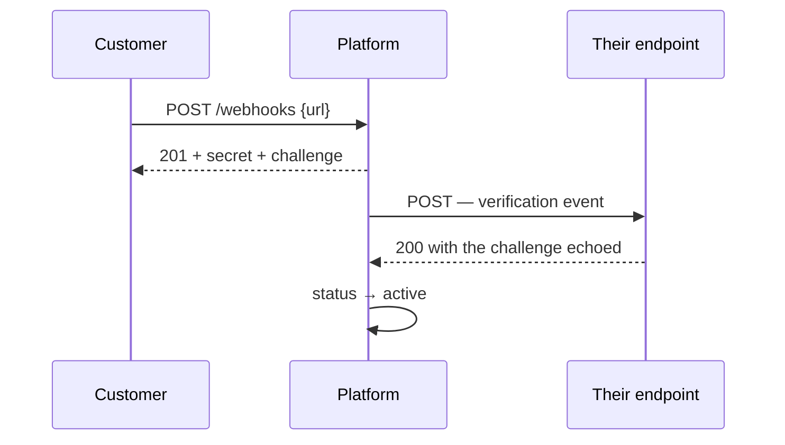
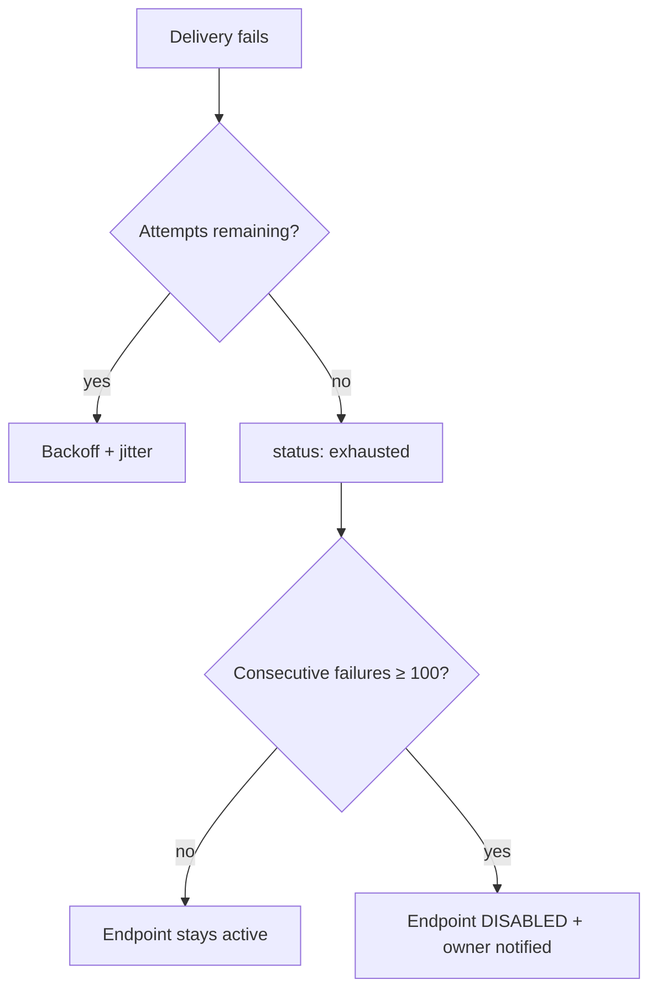

# Webhooks

> **Status:** v1.0 — complete. Phase 12. **Contracts only.**
> **Webhook delivery does not preserve ordering.** The platform guarantees per-aggregate ordering internally; independent HTTP retries destroy it in transit. A customer who assumes ordered delivery will process a stale update over a newer one, and that is stated here rather than discovered.

## Overview

**Purpose.** Define the outbound HTTP delivery contract: endpoint registration and verification, the signature scheme, retry policy, secret rotation, and failure handling.

**The boundary with `event-api.md`.** A **subscription** declares which events a customer wants; a **webhook endpoint** is where they go. This document owns the endpoint and the delivery mechanics.

**These are outbound webhooks.** Inbound webhooks — from CMS platforms into ContentOS — are governed by `16-security/api-security.md` and use the same verification discipline in the opposite direction.

## Endpoint registration

| Field | Value |
|---|---|
| **Purpose** | Register and manage a delivery destination |
| **Method · Path** | `POST /v1/workspaces/{workspaceId}/webhooks` · `GET` · `PATCH .../{id}` · `DELETE .../{id}` |
| **Authorization** | **`integration:manage`** |
| **Idempotency** | Create requires `Idempotency-Key`; `PATCH`/`DELETE` idempotent |
| **Rate limit** | `write` |
| **Events** | `WebhookEndpointCreated` · `Updated` · `Deleted` |
| **Audit** | **Actor, URL, and status recorded** |

```ts
interface WebhookEndpoint {
  readonly id: string;
  readonly url: string;                       // https only
  readonly status: 'unverified' | 'active' | 'paused' | 'disabled';
  readonly description: string | null;
  readonly createdAt: string;
  readonly lastDeliveryAt: string | null;
  readonly consecutiveFailures: number;
  readonly disabledReason: string | null;
}

// POST — 201, secret shown ONCE
{ endpoint: WebhookEndpoint; secret: string; verificationChallenge: string; }
```

| Error | Code | Status |
|---|---|---|
| Non-HTTPS URL | `VALIDATION_FIELD_INVALID` | 400 |
| **URL resolves to a private address** | `VALIDATION_FIELD_INVALID` | **400** |
| Endpoint limit reached | `DOMAIN_QUOTA_EXCEEDED` | 402 |

**The URL is validated through the SSRF chokepoint at registration**: HTTPS only, DNS resolved, private and loopback ranges blocked, `169.254.169.254` explicitly refused (`16-security/api-security.md`). A customer registering a webhook pointing at our own internal network would otherwise turn the delivery system into an SSRF engine with a legitimate-looking configuration.

**Validation runs again at delivery time.** DNS can be re-pointed after registration; validating only at registration leaves a rebinding window measured in days.

**The signing secret is returned exactly once and is never retrievable.** Storage is hashed. An endpoint that could redisplay a secret could leak every customer's signing key in a database compromise.

## Verification

**An endpoint receives nothing until it proves it wants to.**



| Field | Value |
|---|---|
| **Purpose** | Confirm control of the endpoint |
| **Method · Path** | `POST /v1/webhooks/{id}/actions/verify` |
| **Authorization** | `integration:manage` |
| **Idempotency** | Yes |
| **Rate limit** | `write` |
| **Events** | `WebhookEndpointVerified` |
| **Audit** | Recorded |

**Verification requires echoing a challenge, not merely returning `200`.** A `200` proves a URL exists; echoing a challenge that arrived in a signed request proves the operator controls the endpoint and can read the delivery. Without it, anyone could register a subscription pointing at a third party's URL and use the platform to flood them.

**An unverified endpoint cannot be subscribed to** (`event-api.md`).

**Re-verification is required when the URL changes.** A `PATCH` that changed the URL without re-verifying would let an already-verified endpoint be repointed at an arbitrary target.

## Signature scheme

Every delivery carries these headers:

```http
POST /your-endpoint HTTP/1.1
Content-Type: application/json
X-ContentOS-Event-Id: 018f3a2b-...
X-ContentOS-Event-Type: ArticlePublished
X-ContentOS-Event-Version: 2
X-ContentOS-Delivery-Id: 018f3a2c-...
X-ContentOS-Timestamp: 1735689600
X-ContentOS-Signature: v1=5257a869e7ec...
X-ContentOS-Correlation-Id: 018f3a2a-...
```

```
signature = HMAC-SHA256(secret, "{timestamp}.{rawBody}")
```

**Verification requires all three checks. A signature alone is insufficient.**

| Check | Prevents |
|---|---|
| **Signature matches** | Forgery |
| **Timestamp within 5 minutes** | Replay of a captured delivery |
| **`Delivery-Id` unseen** | Replay within the window |

**A valid signature proves authenticity, not freshness.** A captured delivery stays signed forever; without the timestamp window it can be replayed indefinitely. This is the same three-part discipline the platform applies to inbound webhooks (`16-security/api-security.md`).

**The signature is computed over the raw body, before parsing.** A customer who parses JSON and re-serializes before verifying will fail on whitespace and key ordering — and under some serializers, a modified payload can be made to pass.

**Comparison must be timing-safe.** A byte-by-byte early-exit comparison leaks the expected signature through response timing.

**`v1=` prefixes the signature** so a future scheme can be added alongside without breaking existing verifiers.

## Idempotency and ordering

**Two properties customers must build against, stated plainly.**

| Property | Guarantee |
|---|---|
| **Delivery** | **At-least-once.** Duplicates will occur |
| **Ordering** | **None across HTTP delivery** |

**Duplicates are normal, not exceptional.** A delivery that succeeded but whose response was lost is retried; a redelivery after an incident repeats events already handled. Customers deduplicate on `X-ContentOS-Event-Id`, which is stable across every retry and redelivery of the same event.

**Ordering is not preserved and this is worth being precise about.** The platform guarantees per-aggregate ordering *internally* — the outbox sequence, a single stream per type, and an aggregate barrier during consumption (`13-event-platform/ordering.md`). None of that survives HTTP delivery: if the first of two events fails and enters backoff while the second succeeds immediately, the customer receives them inverted.

**Customers reconcile order with `occurredAt` and the resource itself.** The reliable pattern is to treat a webhook as a *signal* — "this article changed" — and fetch current state through the API, rather than applying the payload as a delta. That pattern is immune to both duplication and reordering.

**The platform will not add ordered delivery.** Guaranteeing it would require blocking every subsequent event for an aggregate behind a failing delivery, so one customer's downtime would stall their own queue indefinitely — and head-of-line blocking on an external dependency is worse than unordered arrival.

## Payload

```json
{
  "eventId": "018f3a2b-...",
  "eventType": "ArticlePublished",
  "eventVersion": 2,
  "occurredAt": "2026-07-29T10:14:22Z",
  "workspaceId": "018f39...",
  "organizationId": "018f38...",
  "correlationId": "018f3a2a-...",
  "data": { "articleId": "018f3a1f-...", "revisionNumber": 4 }
}
```

**`data` carries identifiers, never content.** No article body, no outline, no evidence text, no credentials. A customer needing content fetches it through the API under their own authorization (`13-event-platform/event-registry.md`).

**This is not accidental parsimony.** Webhook endpoints have weaker access controls than the platform's own surfaces — they are URLs on customer infrastructure, logged by proxies and stored by aggregators. Content in a payload is content outside its boundary.

**`eventVersion` reflects the subscription's declared version**, not the platform's current one. A subscriber on v1 receives v1-shaped payloads after the platform moves to v3, produced by downcast transforms (`13-event-platform/versioning.md`).

## Retry policy

| Property | Value |
|---|---|
| Attempts | **6** |
| Backoff | Exponential from 10 s, **full jitter** |
| Schedule | ~10 s, 1 m, 5 m, 30 m, 2 h, 6 h |
| Total window | ~9 hours |
| Timeout | **10 seconds per attempt** |
| Success | Any `2xx` |
| Retried | `408`, `429`, `5xx`, timeout, connection error |
| **Not retried** | **Other `4xx`** |

**Full jitter is mandatory, not tuning.** An outage at a customer's endpoint fails every in-flight delivery simultaneously; without jitter every retry arrives at the same instant, and the platform becomes a synchronised load generator against a service that has just recovered (`13-event-platform/retry-engine.md`).

**`4xx` other than `408`/`429` is terminal.** A `400` means the payload was rejected, and it will be rejected identically on retry — retrying wastes nine hours and delays the operator signal.

**`429` is retried and honours `Retry-After`** where supplied.

**The 10-second timeout is deliberately short.** A customer's endpoint should acknowledge and process asynchronously; holding the connection while they do work makes their processing time our delivery latency.

## Failure handling



| Threshold | Action |
|---|---|
| 10 consecutive failures | Warning notification |
| **100 consecutive failures** | **Endpoint disabled; delivery stops** |
| Any success | Counter resets |

**Auto-disable protects both sides.** An endpoint dead for a week accumulates thousands of exhausted deliveries, consuming platform capacity to repeatedly fail — and if the URL was reassigned, the platform is sending a stranger someone else's event identifiers.

**Disabled endpoints are re-enabled explicitly**, which requires re-verification. Automatic re-enable would resume delivery to a URL that may have changed hands.

**Events are never lost by disabling.** They remain queryable and redeliverable for 30 days (`event-api.md`).

## Secret rotation

| Field | Value |
|---|---|
| **Purpose** | Rotate a signing secret without dropping deliveries |
| **Method · Path** | `POST /v1/webhooks/{id}/actions/rotate-secret` |
| **Authorization** | `integration:manage` + **step-up** |
| **Idempotency** | `Idempotency-Key` required |
| **Rate limit** | `write` |
| **Events** | `WebhookSecretRotated` |
| **Audit** | **Recorded; alerted** |

```ts
// 200 — new secret shown ONCE
{ secret: string; previousSecretValidUntil: string; }
```

**Both secrets are valid during a 7-day overlap.** Deliveries are signed with the new secret; the previous one remains acceptable for verification on the customer's side until the window closes (`16-security/secrets-management.md`).

**Seven days, not minutes, because the other party controls the update.** A customer may need a deploy to apply a new secret, and a short window silently breaks their integration.

**Emergency rotation skips the overlap** — `?immediate=true` — and is expected to break in-flight verification. That is the trade, taken knowingly when a secret is believed compromised (`16-security/incident-response.md`).

**Rotation is audited and alerted** because an unexpected rotation is a possible account-takeover signal.

## Delivery status

**Delivery records, attempt history, and manual redelivery are specified in `event-api.md`** and are not duplicated here. A customer debugging a webhook uses that surface.

## Business rules

1. **HTTPS only; URLs pass SSRF validation at registration and at delivery.**
2. **Secrets are shown once and never retrievable.**
3. **Endpoints must echo a challenge to become active.**
4. **A URL change requires re-verification.**
5. **Unverified endpoints cannot be subscribed to.**
6. **Verification requires signature, timestamp window, and unseen delivery id.**
7. **Signatures are computed over the raw body**, compared timing-safely.
8. **Delivery is at-least-once; duplicates are normal.**
9. **Ordering is not preserved across HTTP delivery**, and ordered delivery will not be added.
10. **Payloads carry identifiers, never content.**
11. **`eventVersion` matches the subscription's declared version.**
12. **Six attempts over ~9 hours with full jitter.**
13. **`4xx` other than `408`/`429` is terminal.**
14. **10-second per-attempt timeout.**
15. **100 consecutive failures disables the endpoint**; re-enable requires re-verification.
16. **Secret rotation has a 7-day overlap**; emergency rotation skips it.
17. **Disabling never loses events** — 30-day redelivery remains.

## Events emitted

| Event | Trigger |
|---|---|
| `WebhookEndpointCreated` · `Updated` · `Deleted` · `Verified` | Endpoint lifecycle |
| `WebhookEndpointDisabled` | Auto-disable |
| `WebhookSecretRotated` | Rotation |

**Endpoint lifecycle events are themselves deliverable**, so a customer's monitoring can observe their own integration health — including the disable event, which is the one they most need.

## Audit implications

| Action | Recorded |
|---|---|
| Create, update, delete | Actor, URL, status |
| Verify | Actor, outcome |
| **Secret rotation** | **Actor, mode — alerted** |
| Auto-disable | Failure count, last error |

**The URL is audited on every change** because it determines where tenant event identifiers are sent — a data-egress configuration change (`16-security/audit.md`).

## Cross references

- `event-api.md` — **subscriptions, delivery records, manual redelivery**
- `13-event-platform/retry-engine.md` — backoff and jitter discipline
- `13-event-platform/ordering.md` — the internal guarantee that HTTP delivery does not extend
- `13-event-platform/idempotency.md` — why at-least-once is the contract
- `13-event-platform/versioning.md` — downcast to the subscribed version
- `13-event-platform/event-registry.md` — payload content rules
- `16-security/api-security.md` — SSRF validation; inbound webhook verification
- `16-security/secrets-management.md` — rotation overlap windows
- `16-security/incident-response.md` — emergency rotation
- `api-principles.md` — actions, idempotency, status codes
