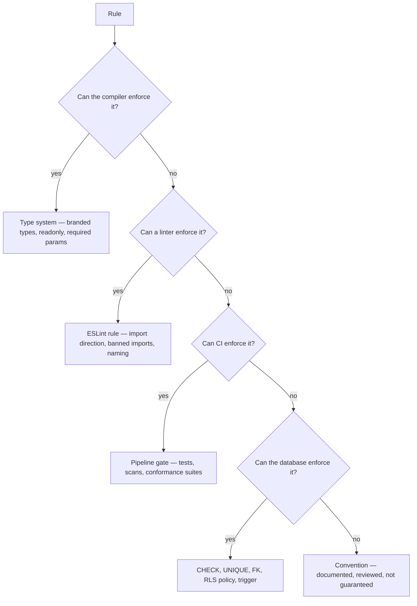
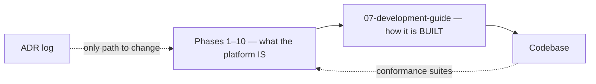

# Development Guide

> **Status:** v1.0 — complete. Phase 11.
> **This folder defines how ContentOS is built, never what it does.** It owns conventions, structure, and workflow. Every architectural constraint it references was decided in Phases 1–10 and is restated here only as a rule to follow, never as a decision to revisit.

## Overview

**Purpose.** Ten phases produced roughly 240,000 words of architecture specifying what the platform is. This folder specifies how a developer — or a coding agent — turns that into a codebase that stays consistent with it. Without it, ten correct specifications become ten differently-shaped implementations.

**The constraint that shapes everything here.** Nothing in this folder may loosen a constraint defined elsewhere in the tree. Where a rule appears both here and in an architecture document, the architecture document is authoritative and this one is a pointer. Where a convention exists only here, it is a convention rather than an invariant, and it may be revised by ordinary review.

**Written for two audiences equally.** Human engineers and AI coding agents work in this repository. Rules that rely on judgement, tribal knowledge, or "you'd know not to do that" fail for the second audience, and often for the first. Every rule here is therefore either mechanically enforced — lint, type, CI gate, database constraint — or explicitly labelled as a convention.

## What this folder owns

- TypeScript conventions, naming, file organization.
- Repository layout and import direction.
- Dependency policy, pinning, supply-chain verification.
- Test authoring conventions and the developer test workflow.
- The canonical error model and error propagation.
- Structured logging conventions and redaction.
- Configuration hierarchy, validation, feature flags.
- Local development setup.
- The developer-facing release process.
- CI/CD pipeline stages and gates.
- Code review checklist.
- Schema and data migration process.
- Per-platform implementation checklists.

## What this folder does not own

| Not owned | Owner |
|---|---|
| **Any architectural decision** | `01-system-architecture/13-adr-log.md` |
| **Any business rule** | The owning domain component |
| Test *strategy* — levels, coverage thresholds, mandatory isolation tests | **`10-testing/testing-strategy.md`** |
| Production deployment *operations* | **`14-operations/deployment.md`** |
| Monitoring infrastructure, alert routing | `14-operations/monitoring.md` |
| Incident procedure | `14-operations/incident-response.md`, `16-security/incident-response.md` |
| Security controls | `16-security/` |
| Database schema | `03-database/` |
| Metric names | The owning platform's observability document |

**Three boundaries deserve explicit statement, because they are where duplicate ownership would otherwise appear.**

**Testing.** `10-testing/` owns strategy: which levels exist, what coverage is required, which tests are mandatory, and what CI gates on. `testing-guide.md` in this folder owns *authoring* — how to name a test, how to structure it, which helpers to use, how to run it locally. A threshold appearing in both would drift, so thresholds appear only in `10-testing/testing-strategy.md` and are referenced here.

**Deployment.** `14-operations/deployment.md` owns operating a deployed system: environments, rollout mechanics, health checks in production, scaling. `deployment-guide.md` here owns the developer's path from merged commit to released artifact. The handoff point is the artifact: this folder produces it, `14-operations/` runs it.

**CI/CD.** `ci-cd.md` owns pipeline composition — stages, ordering, what blocks. The *gate contract* — which tests must pass and at what thresholds — belongs to `10-testing/testing-strategy.md` §9 and is referenced, never restated.

## Conventions frozen by the architecture

These are not stylistic preferences. Each was established by an architecture decision in Phases 1–10, and `coding-standards.md` codifies them as enforceable rules.

| Convention | Origin |
|---|---|
| `TenantContext` is the first parameter of every tenant-scoped operation | `16-security/tenant-isolation.md` |
| Operations with durable side effects take a `Transaction` handle | `13-event-platform/transactional-outbox.md` |
| Result types discriminate on `outcome`; errors and blockers on `kind` | `12-storage-platform/storage-apis.md` |
| Identifiers are branded types, never bare strings | `12-storage-platform/storage-apis.md` |
| Returned types and arrays are `readonly` | `12-storage-platform/storage-apis.md` |
| Durations carry their unit in the name (`ttlSeconds`, never `ttl`) | `12-storage-platform/storage-apis.md` D-2 |
| No wildcard permissions; no permission implies another | `16-security/rbac.md` |
| Model providers are reached only through the AI Gateway | ADR-019, `08-ai-platform/` |
| Events are published only through the transactional outbox | ADR-020 |
| Every workspace-owned table carries `tenant_id` and an RLS policy | ADR-017, `16-security/row-level-security.md` |
| Secrets never appear in logs, events, audit records, or prompts | `16-security/secrets-management.md` |

**The `ttlSeconds` rule earned its place the hard way.** The Phase 10 consistency review found a duration parameter declared without a unit in three places and with one in a fourth — the shape of bug that turns a 15-minute credential into a 15-millisecond one or a 15-day one, with no type error either way.

## Enforcement posture

**A rule that reaches the bottom of this chart is weaker than one that does not, and is labelled as such.** The tree has consistently pushed invariants downward — `UNIQUE(idempotency_key)` making duplicate publication impossible, `CHECK (reference_count >= 0)` making double-decrement loud, a publisher signature requiring a transaction handle. This folder continues that: where a standard can become a lint rule, it becomes one rather than a paragraph.

**Conventions are honestly labelled.** Function length guidance and comment style are conventions; import direction and tenant-scoping are enforced. Presenting the first as though it carried the weight of the second devalues both.

## Document map

| Document | Owns |
|---|---|
| `coding-standards.md` | TypeScript conventions, naming, composition, async, immutability, DI |
| `project-structure.md` | **Frozen repository layout**, import direction, boundary enforcement |
| `dependency-management.md` | Package policy, pinning, licences, supply-chain verification |
| `testing-guide.md` | Test authoring and the developer test workflow |
| `error-handling.md` | **The canonical error model** — typed, recoverable vs terminal |
| `logging-guide.md` | Structured logging fields, levels, redaction, sampling |
| `configuration.md` | Config hierarchy, validation, feature flags, secrets delegation |
| `local-development.md` | Setup, containers, seed data, debugging |
| `deployment-guide.md` | Developer release path to a signed artifact |
| `ci-cd.md` | Pipeline stages and gates |
| `code-review.md` | Review checklist across architecture, security, performance, tests |
| `migration-guide.md` | Schema and data migration process, expand/contract, rollback |
| `implementation-checklists.md` | Per-platform build checklists for all seven platforms |

## Pre-existing scaffold — four items requiring a decision

**This folder contained five placeholder files before Phase 11.** Two are superseded by the documents above. Three are not, and two naming conflicts remain open.

| Item | Status |
|---|---|
| `README.md`, `coding-standards.md` | **Superseded** by Phase 11 documents |
| **`folder-structure.md`** | **Conflict** — Phase 11 specifies `project-structure.md`; `folder-structure.md` has **5 inbound references** from approved documents |
| **`claude-code-rules.md`** | **Not in the Phase 11 order** — 1 inbound reference; remains a TODO placeholder |
| **`git-workflow.md`** | **Not in the Phase 11 order** — 1 inbound reference; remains a TODO placeholder |

**`project-structure.md` is written as ordered**, and the five references to `folder-structure.md` do not resolve to it. Resolving this is a structural choice — rename, redirect the references, or keep both — and the structure is frozen except where the owner instructs.

**`claude-code-rules.md` is the more consequential gap.** Its placeholder enumerates binding constraints for AI coding agents: implement only from the architecture, never invent it; request a decision on open questions rather than assuming one; architectural changes only via ADR. Those rules are distributed across `coding-standards.md`, `code-review.md`, and `implementation-checklists.md` in this phase, but no single document addresses an agent directly — which matters in a repository substantially built by agents.

**`git-workflow.md` covers branching, commit conventions, PR process, and the hotfix path**, none of which Phase 11 assigns elsewhere. `ci-cd.md` covers what the pipeline does; it does not cover how branches are named or how a hotfix reaches production.

**All are recorded here rather than silently dropped.** None blocks implementation; each leaves a reference that does not resolve.

## Reading order

**Starting implementation:** `project-structure.md` → `coding-standards.md` → `error-handling.md` → `configuration.md`. Layout and the error model come first because everything else assumes them.

**Setting up a machine:** `local-development.md`, then `testing-guide.md`.

**Shipping a change:** `testing-guide.md` → `code-review.md` → `ci-cd.md` → `deployment-guide.md`.

**Changing the schema:** `migration-guide.md` first, always. It is the process with the least recoverable failure mode.

**Building a platform from scratch:** `implementation-checklists.md`, which sequences the work per platform against its architecture documents.

## Relationship to the architecture

**Implementation never amends architecture.** A developer or agent encountering a constraint that appears wrong records an open question or proposes an ADR (`99-open-questions.md`). Working around it in code produces a codebase that silently disagrees with its own specification — the exact condition the Phase 1 review found in the original repository and that ADR-016 exists to have resolved.

**Conformance suites are the feedback edge.** RLS policy conformance, driver capability tests, and interface signature checks assert that the code still matches the specification. They run in CI, and a failure is a build failure rather than a discussion (`16-security/row-level-security.md`, `12-storage-platform/storage-abstraction.md`).

## Cross references

- `01-system-architecture/13-adr-log.md` — the only path to an architectural change
- `99-open-questions.md` — where uncertainty is recorded, not resolved in code
- `10-testing/testing-strategy.md` — test strategy, coverage thresholds, the CI gate contract
- `14-operations/deployment.md` — production deployment operations
- `14-operations/monitoring.md` — metrics infrastructure
- `16-security/` — every security control this folder references
- `03-database/migrations.md` — expand/contract discipline
- `12-storage-platform/storage-apis.md` — the interface conventions codified here
- `13-event-platform/event-apis.md` — the event contract conventions codified here
