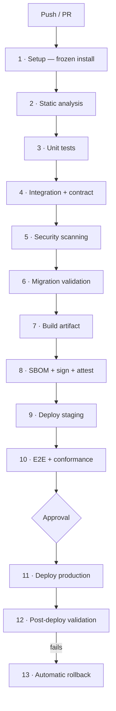

# CI/CD

> **Status:** v1.0 — complete. Phase 11.
> **The deployed artifact is byte-identical to the tested artifact.** Not rebuilt from the same commit — the same digest. Anything else means production runs something no test ever executed.

## Overview

**Purpose.** Define the delivery pipeline: source control workflow, stage ordering, what each stage verifies, and what blocks a deploy.

**The boundary.** The **CI gate contract** — which suites must pass and at what coverage thresholds — is owned by `10-testing/testing-strategy.md` §9 and is referenced, never restated. This document owns pipeline *composition*: which stages exist, in what order, and what each produces. Deployment mechanics are `deployment-guide.md`; production operations are `14-operations/deployment.md`.

**Every stage is deterministic.** Same commit, same lockfile, same result. A stage whose outcome varies between runs is a stage nobody trusts, and an untrusted gate gets bypassed within a month.

## Source control workflow

| Element | Rule |
|---|---|
| Default branch | `main` — always deployable |
| Branches | Short-lived, branched from `main`, named `<type>/<short-description>` |
| Commits | Conventional Commits; imperative subject |
| **Merge** | **Squash only** — one commit per change on `main` |
| Force push to `main` | **Blocked** |
| Direct push to `main` | **Blocked** — PR required |
| Signed commits | **Required** |

**Squash merging keeps `main` bisectable.** Every commit on `main` is one reviewed change that passed the full pipeline, so `git bisect` lands on a commit that actually built rather than a mid-branch state that never did.

**Signed commits are the base of the supply-chain story.** Artifact provenance attests that an image was built from a commit; a commit signature attests who wrote it. Without both, provenance proves only that the pipeline ran (`16-security/threat-model.md`, T-21).

**Branch protection requires: all gates green, one approval, up-to-date with `main`.** Security-sensitive paths require an additional named reviewer (`code-review.md`).

**Hotfixes use the same pipeline.** There is no expedited path that skips gates — a hotfix is a normal change with a higher-priority review, because the changes most likely to break production are the ones written fastest.

## Pipeline



**Stages 1–6 run on every PR. Stages 7–13 run only on `main`.** Building an artifact per PR wastes registry storage and time; the artifact is built once, after the code is approved and merged.

**Fast stages run first.** Type checking fails in under a minute; E2E takes ten. Ordering cheapest-first means the common failure is reported quickly rather than after a full run.

**Any stage failure stops the pipeline immediately.** No stage is advisory, and no failure is carried forward as a warning.

## Stage 1 — Setup

```bash
pnpm install --frozen-lockfile
```

**Frozen install fails if the lockfile does not match `package.json`.** A dependency change that reached a PR without its lockfile update fails here rather than resolving differently on every machine (`dependency-management.md`).

**Caching is keyed on the lockfile hash.** A cache keyed on branch or time serves a stale dependency tree and produces the non-reproducibility the pipeline exists to prevent.

## Stage 2 — Static analysis

| Check | Blocks on |
|---|---|
| Type check (`tsc --noEmit`) | Any error |
| ESLint | Any error, including custom rules |
| Prettier | Any formatting difference |
| **Import boundaries** (`dependency-cruiser`) | Any layering violation |
| **Banned imports** | A provider SDK outside its permitted package |
| Unused code (`knip`) | Unused dependency, export, or file |
| Duplicate packages | Any duplicate version |

**Import boundary violations block the build, never warn.** The layering decided across ten phases exists only as long as something mechanically prevents crossing it (`project-structure.md`).

**Custom lint rules carry this folder's specific constraints** — `ctx: TenantContext` first, duration naming, no floating promises, no cross-package relative imports (`coding-standards.md`). Each maps to a stated rule.

## Stage 3 — Unit tests

Fast, isolated, no containers. Coverage is measured here against the thresholds in `10-testing/testing-strategy.md` §9.

**Coverage is a gate, not a target.** It is reported per package against the owning document's thresholds; the pipeline enforces what that document specifies rather than defining its own numbers.

## Stage 4 — Integration and contract

Real PostgreSQL, Redis, and MinIO in containers.

| Suite | Verifies |
|---|---|
| Integration | Cross-package behaviour against real infrastructure |
| **RLS coverage** | Every table has `tenant_id`, a policy, and a named isolation test |
| Contract | Event schemas match the registry; frozen interfaces have not drifted |

**The RLS coverage job enumerates `information_schema` and cross-references the isolation test registry.** A new table without a policy or without a named isolation test fails the merge gate — which converts the platform's primary isolation risk from a review-time concern into a build-time one (`10-testing/testing-strategy.md`, `16-security/row-level-security.md`).

**Contract tests read the registry rather than a copy.** A test asserting a hand-written schema drifts from the registered one and passes while production breaks (`13-event-platform/event-registry.md`).

**Interface signature tests would have caught the ten drift items the Phase 10 review found by hand**, which is why they run per PR rather than per review (`12-storage-platform/storage-apis.md`).

## Stage 5 — Security scanning

| Scan | Blocks on |
|---|---|
| **Secret scanning** | **Any credential-shaped value in the diff or history** |
| Dependency vulnerabilities | Critical or High CVE |
| Licence compliance | Denied or unrecognised licence, including transitive |
| **Install-script audit** | A non-allowlisted `postinstall` |
| SAST | High-confidence findings |
| Container image scan | Critical or High in base layers |
| **`.env` presence** | Any committed environment file |

**Secret scanning covers history, not just the diff.** A secret added and removed in the same branch is still in the objects, and a rebase does not remove it. A hit blocks the merge *and* triggers rotation — a committed secret is compromised regardless of whether it reached `main` (`16-security/secrets-management.md`).

**Install scripts are the highest-value gate here.** A `postinstall` executes arbitrary code on every runner and developer machine before any review happens; the allowlist is small and each entry has a recorded reason (`dependency-management.md`).

**Vulnerability thresholds are severity-based deliberately.** Blocking on every Low finding trains people to bypass the gate, which loses the Critical ones too.

## Stage 6 — Migration validation

**Four checks, all automated. This is the stage that prevents the least recoverable failures.**

| Check | Verifies |
|---|---|
| **Applies cleanly** | Against a restored production-shaped schema |
| **Backward compatible** | **The previous release's test suite passes against the new schema** |
| Reversible or forward-only | Declared explicitly; no ambiguity |
| Duration | Estimated against production-scale row counts |

**Running the previous release's tests against the new schema is the check that makes expand/contract enforceable.** During a rolling deploy old and new code run simultaneously against one database; a migration that breaks the old code causes an outage produced by the deployment mechanism itself (`deployment-guide.md`, `migration-guide.md`).

**Duration estimation catches migrations that would time out.** An index build on a 10⁸-row table takes hours, and discovering that during a production deploy is the wrong moment.

## Stage 7 — Build


**Built once, on `main`, and promoted unchanged.** Rebuilding per environment produces two artifacts, only one of which was tested (`deployment-guide.md`).

**Builds are reproducible**: pinned base image by digest, frozen lockfile, no network access beyond the registry, no timestamps baked into layers.

**No manual production builds exist. [CI]** There is no local-build-and-push path, and registry write access is held only by the pipeline's identity. A human-built artifact has no provenance and no gate record.

## Stage 8 — SBOM, signing, attestation

| Output | Purpose |
|---|---|
| **SBOM** (CycloneDX) | Complete dependency inventory, direct and transitive |
| **Signature** | Verified at deploy; refuses unsigned artifacts |
| **Provenance attestation** | Binds the artifact to its source commit and builder |

**The SBOM is what makes vulnerability response tractable.** When a widely-used package is disclosed, the question is "which releases contain it, at what version" — answerable from stored SBOMs in seconds, or by rebuilding and inspecting every release over days.

**SBOMs are stored per artifact and retained as long as the artifact could be deployed**, including rollback targets.

**Signature verification gates deployment** (`deployment-guide.md`), which is the control against a compromised registry.

## Stages 9–10 — Staging

Automatic deployment on merge, then E2E and conformance suites against a running system.

| Suite | Verifies |
|---|---|
| E2E | Critical journeys through the full stack |
| **Conformance** | RLS policies, driver capabilities, interface signatures |
| Smoke | Critical paths respond |

**Staging runs the same artifact and the same migrations against production-shaped data volume.** A migration verified against a thousand rows says nothing about a hundred million.

**Conformance suites run here against a real deployed system**, not only in unit form — they assert that the deployed configuration produced the expected policies and capabilities.

## Stages 11–13 — Production

**Deployment requires a named approver. [CI]** Staging is continuous; production is a decision, recorded and audited (`16-security/audit.md`).

**Post-deployment validation and automatic rollback are specified in `deployment-guide.md`** and are not restated. The pipeline's role is to execute those gates and to trigger the rollback path on failure.

**Rollback automation redeploys the previously-recorded digest through the same health gating.** The rollback target is captured before the deploy starts, so an incident never requires reconstructing it from registry history.

## Pipeline security

| Control | Rule |
|---|---|
| **Credentials** | Ephemeral, per-run, scoped to that run (`16-security/secrets-management.md`) |
| Production secrets | **Never available to CI** |
| Registry write | Pipeline identity only |
| Deploy identity | Least privilege; cannot read tenant data |
| Fork PRs | Run without secrets; no artifact build |
| Workflow changes | Require review from a code owner |

**Fork PRs run a reduced pipeline without credentials.** A workflow file is code, and a PR that could modify the workflow and access secrets in the same run is a straightforward exfiltration path.

**No production secret exists in CI at all** — staging and production values live in their own isolated stores, reachable only by their own workload identities.

## Business rules

1. **The deployed artifact is byte-identical to the tested artifact** — same digest.
2. **Artifacts are built once, on `main`, and promoted unchanged.**
3. **No manual production builds exist**; registry write is pipeline-only.
4. **Every stage is deterministic.**
5. **Any stage failure stops the pipeline**; no advisory gates.
6. **Squash merge only; `main` is always deployable.**
7. **Commits are signed; force push and direct push to `main` are blocked.**
8. **Hotfixes use the same pipeline.**
9. **Frozen lockfile install; cache keyed on lockfile hash.**
10. **Import boundary violations block the build.**
11. **RLS coverage is a merge gate**, enumerated from the live schema.
12. **Secret scanning covers history and triggers rotation on a hit.**
13. **Migration validation runs the previous release's tests against the new schema.**
14. **SBOM, signature, and provenance are produced per artifact.**
15. **Production deployment requires a named approver** and is audited.
16. **Fork PRs run without credentials.**
17. **Coverage thresholds and the gate contract belong to `10-testing/testing-strategy.md`.**

## Gate summary

| Stage | Blocks merge | Blocks deploy |
|---|---|---|
| Type check, lint, format | ✅ | ✅ |
| Import boundaries | ✅ | ✅ |
| Unit tests + coverage | ✅ | ✅ |
| Integration + RLS coverage | ✅ | ✅ |
| Contract + signature tests | ✅ | ✅ |
| Secret scan | ✅ | ✅ |
| Vulnerabilities, licences | ✅ | ✅ |
| Migration validation | ✅ | ✅ |
| E2E, conformance | — | ✅ |
| Signature verification | — | ✅ |
| Approval | — | ✅ |
| Post-deploy validation | — | Triggers rollback |

## Observability

- **Metrics:** `pipeline_runs_total{stage,outcome}`, `pipeline_duration_seconds{stage}`, `gate_failures_total{gate}`, `pipeline_flake_rate{stage}`, `artifact_builds_total`, `time_to_merge_seconds`, `deployment_frequency`, `change_failure_rate`.
- **Alerts:** `pipeline_flake_rate` above threshold (**a flaky gate is a gate people will bypass**); pipeline duration trending up (feedback loops lengthening); `gate_failures_total{gate="secret-scan"}` non-zero (**page** — a credential nearly entered source control); repeated failures on `main`.
- **Tracking:** deployment frequency, change failure rate, and time to restore, reviewed monthly. A rising change failure rate is the earliest signal that gates are insufficient.

**Flake rate is the pipeline's most important health metric.** A gate that fails randomly gets re-run reflexively, and a gate that is always re-run is not a gate.

## Cross references

- `10-testing/testing-strategy.md` §9 — **the CI gate contract and coverage thresholds**
- `deployment-guide.md` — artifact identity, migration ordering, rollback, post-deploy gates
- `migration-guide.md` — what migration validation checks
- `dependency-management.md` — frozen installs, licences, install scripts, SBOM inputs
- `project-structure.md` — the boundaries enforced in static analysis
- `coding-standards.md` — the custom lint rules
- `testing-guide.md` — how the tested suites are authored
- `code-review.md` — the human gate alongside these automated ones
- `16-security/secrets-management.md` — ephemeral CI credentials, rotation on a scan hit
- `16-security/row-level-security.md` — the conformance suite
- `16-security/audit.md` — deployment approval records
- `16-security/threat-model.md` — T-21 supply chain
- `14-operations/deployment.md` — production operations
