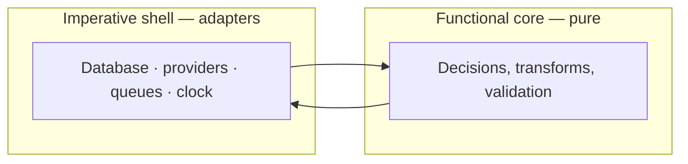

# Coding Standards

> **Status:** v1.0 — complete. Phase 11.
> **Where a standard can be a type or a lint rule, it is one.** Prose that relies on a reader remembering it is the weakest form of enforcement available, and this document reaches for it last.

## Overview

**Purpose.** Ten phases of architecture declared several hundred interfaces. This document codifies the conventions those interfaces already follow so that new code matches them by default rather than by inspection.

**Scope.** TypeScript conventions, naming, file organization, function and class rules, async patterns, dependency injection, immutability, and documentation. Error *model* is `error-handling.md`; logging *fields* are `logging-guide.md`; test *strategy* is `10-testing/testing-strategy.md` and is not restated here.

**Every rule is labelled by enforcement.** **[type]** the compiler rejects it. **[lint]** ESLint rejects it. **[CI]** a pipeline gate rejects it. **[convention]** review catches it, or it ships.

## TypeScript configuration

```jsonc
{
  "strict": true,
  "noUncheckedIndexedAccess": true,
  "exactOptionalPropertyTypes": true,
  "noImplicitOverride": true,
  "noFallthroughCasesInSwitch": true,
  "noUnusedLocals": true,
  "noUnusedParameters": true,
  "isolatedModules": true,
  "verbatimModuleSyntax": true
}
```

**`noUncheckedIndexedAccess` is the highest-value flag here.** Without it, `arr[0]` is typed as `T` even when the array is empty, and `record[key]` is typed as `T` for a key that may not exist. It produces the most `undefined` runtime errors of any TypeScript default, and turning it on is the difference between a type system that models reality and one that flatters it.

**`exactOptionalPropertyTypes` distinguishes "absent" from "present and undefined."** For an events and storage platform where `causationId: string | null` means "no parent" and absence would mean "unknown," that distinction is semantic, not pedantic (`13-event-platform/event-apis.md`).

**`any` is banned; `unknown` is the escape hatch. [lint]** `unknown` forces a narrowing step, which is where validation belongs. A single `any` erases type checking for every value that flows from it.

**Type assertions (`as`) are banned outside parsers and test fixtures. [lint]** An assertion is a claim the compiler cannot check. Where external data enters, it is validated with a schema that produces a typed result (`configuration.md`, `16-security/api-security.md`).

## Naming

| Element | Convention | Example |
|---|---|---|
| Files | `kebab-case.ts` | `outbox-relay.ts` |
| Types, interfaces, classes | `PascalCase` | `TenantContext` |
| Functions, variables | `camelCase` | `resolveTenant` |
| Constants | `SCREAMING_SNAKE_CASE` | `MAX_PART_COUNT` |
| Type parameters | Descriptive, not single letters | `TPayload`, not `T` |
| Booleans | `is` / `has` / `can` / `should` prefix | `isRetryable` |
| Async functions | **No `Async` suffix** | `publish`, not `publishAsync` |
| **Durations** | **Unit in the name** | `ttlSeconds`, `timeoutMs` |
| Event types | `PascalCase` past tense | `ArticlePublished` |
| Permissions | `resource:action` | `article:export` |

**Durations carry their unit, without exception. [lint]** This is the one naming rule with a dedicated lint check, because the Phase 10 review found `ttl: number` in three places and `ttlSeconds: number` in a fourth — the same parameter, and no type error distinguishes 15 seconds from 15 milliseconds from 15 days. A bare `timeout`, `ttl`, `interval`, `delay`, `age`, or `duration` fails lint.

**No `I` prefix on interfaces and no `Impl` suffix on classes.** Hungarian notation for types conveys nothing the tooling does not already show, and `FooImpl` implementing `IFoo` is a naming scheme standing in for a missing abstraction.

**No abbreviations except an accepted list** — `id`, `url`, `ctx`, `tx`, `req`, `res`, `db`. Everything else is spelled out. `usr`, `cfg`, and `mgr` save keystrokes and cost readers.

## File organization

| Rule | Enforcement |
|---|---|
| One primary export per file, named for the file | [convention] |
| Barrel files (`index.ts`) only at package boundaries | [lint] |
| Test files adjacent: `foo.ts` → `foo.test.ts` | [convention] |
| No file exceeds ~400 lines | [convention] |
| Imports ordered: node, external, internal, relative | [lint] |
| **No cross-package relative imports** (`../../other-package`) | **[lint]** |

**Barrel files inside a package are banned because they create import cycles and defeat tree-shaking. [lint]** A package-level `index.ts` defining the public surface is correct; a barrel per directory means every import pulls the whole subtree.

**Cross-package relative imports are the mechanism by which layering silently dies. [lint]** `../../ai-platform/internal/thing` bypasses the package's declared surface and the boundary rules in `project-structure.md`. Packages import each other by name or not at all.

## Functions

| Rule | Enforcement |
|---|---|
| Target under 40 lines; over 80 requires justification | [convention] |
| Maximum 4 positional parameters; beyond that, an options object | [lint] |
| **`TenantContext` is the first parameter** of every tenant-scoped operation | **[lint]** |
| **`Transaction` is required** where the operation has a durable side effect | [type] |
| Explicit return types on all exported functions | [lint] |
| No default exports | [lint] |

**`ctx: TenantContext` first, always. [lint]** Established by `16-security/tenant-isolation.md` and enforced because an operation reachable without tenant scope is an isolation defect, not a style lapse. A lint rule flags any exported function in a tenant-scoped package whose first parameter is not `ctx`.

**A `Transaction` parameter is how atomicity becomes structural. [type]** `publish(tx, event)`, `record(tx, entry)`, `addReference(ctx, id, holder, tx)` — each requires a transaction handle by signature, so committing a state change separately from its event or its audit record is unrepresentable rather than discouraged (`13-event-platform/transactional-outbox.md`, `16-security/audit.md`).

**Explicit return types on exports. [lint]** Inference is fine internally; at a package boundary an inferred return type means a refactor silently changes the public contract, and the break surfaces in a consumer rather than in the changed file.

## Classes and composition

**Composition over inheritance, enforced by a depth limit. [lint]**

| Rule | Enforcement |
|---|---|
| Inheritance depth ≤ 1 from a platform base | [lint] |
| No `protected` members — use composition | [lint] |
| No abstract classes with implementation | [convention] |
| Classes hold behaviour; data uses interfaces | [convention] |
| Prefer functions to classes where there is no state | [convention] |

**Classes exist for two purposes here: dependency injection roots and stateful adapters.** A class with no injected dependencies and no state is a namespace, and a module already is one.

**Interfaces define contracts; classes implement exactly one.** Every abstraction in the tree follows this — `EventBus`, `ObjectStoreDriver`, `KeyManagementService` — because a single interface with several implementations is what makes a component swappable (`12-storage-platform/storage-abstraction.md`).

**`protected` is banned because it is inheritance's leakiest feature. [lint]** It couples a subclass to a parent's internals, and every change to the parent risks a subclass nobody remembered.

## The functional core / imperative shell

**Established across the engine documents and codified here.**



| Layer | Rules |
|---|---|
| **Core** | Pure. No I/O, no clock, no randomness, no environment. Fully unit-testable. |
| **Shell** | I/O only. Thin. Contains no decisions. |

**Purity is enforced where it matters most. [lint]** Version transform modules and media transform specs may not import I/O — a transform that queried the database would produce different results on replay than on live delivery, defeating idempotency (`13-event-platform/versioning.md`).

**`Date.now()` and `Math.random()` are banned in core code. [lint]** Time and randomness are injected as `Clock` and `Random` dependencies. Their direct use makes a function untestable without mocking global state, and makes replay non-deterministic.

## Async patterns

| Rule | Enforcement |
|---|---|
| `async`/`await` only — no raw `.then()` chains | [lint] |
| Every promise is awaited or explicitly voided | [lint] |
| No floating promises | [lint] |
| Parallelize independent work with `Promise.all` | [convention] |
| `Promise.allSettled` where partial failure is acceptable | [convention] |
| Every external call has a timeout | [lint] |
| Cancellation via `AbortSignal`, threaded through | [convention] |

**Floating promises are the most common source of silent failure in async TypeScript. [lint]** An un-awaited promise that rejects becomes an unhandled rejection — the work did not happen, and nothing reported it. The rule directly serves "no silent failures" (`error-handling.md`).

**Every external call has a timeout. [lint]** A call without one inherits the socket default, which is minutes, and a worker blocked for minutes holds a slot, a connection, and a lease (`13-event-platform/workers.md`).

**Sequential `await` in a loop over independent work is a review finding.** Ten 200 ms calls awaited serially take two seconds; the same ten in `Promise.all` take 200 ms. Where the work is genuinely dependent, sequential is correct — but it should be visibly deliberate.

## Immutability

| Rule | Enforcement |
|---|---|
| `const` by default; `let` only where reassignment is real | [lint] |
| **All returned types and arrays are `readonly`** | [type] |
| Interface fields `readonly` unless mutation is the point | [type] |
| No parameter mutation | [lint] |
| Prefer `map`/`filter`/`reduce` to in-place mutation | [convention] |

**Returned arrays are `readonly` because a caller who sorts one is mutating state the platform still owns. [type]** `readonly string[]` makes `.sort()` and `.push()` compile errors, which is a class of aliasing bug removed rather than reviewed for (`12-storage-platform/storage-apis.md` D-7).

**Domain objects are constructed, never mutated.** `TenantContext` has no setter and no re-scoping method; acting for a different tenant constructs a new one, which forces the establishment rules to run again (`16-security/tenant-isolation.md`).

## Types over primitives

**Identifiers are branded. [type]**

```ts
type ObjectId = string & { readonly __brand: 'ObjectId' };
type ObjectKey = string & { readonly __brand: 'ObjectKey' };
type TenantId = string & { readonly __brand: 'TenantId' };
```

**Branding prevents the substitutions that leak data.** A public `ObjectId` and an internal `ObjectKey` are both strings; passing one where the other is expected exposes a tenant-prefixed storage path. The brand makes it a compile error (`12-storage-platform/storage-apis.md` D-3).

**Result types discriminate on `outcome`; errors and blockers on `kind`. [convention]**

```ts
type DeleteOutcome =
  | { outcome: 'soft-deleted'; purgeEligibleAt: Date }
  | { outcome: 'already-deleted' }
  | { outcome: 'retained'; blockers: readonly PurgeBlocker[] };
```

**Uniform discriminators matter because mixed ones produce `switch` statements that silently fall through.** A developer writing `switch (result.kind)` against a type discriminated on `outcome` gets `undefined` and no error — which `noFallthroughCasesInSwitch` and exhaustive-switch linting then catch.

**Union variants encode invariants that comments cannot.** `RetryDecision` has exactly two branches and neither is "drop," so silently discarding an event is unrepresentable (`13-event-platform/retry-engine.md`). This technique appears throughout the tree and is the preferred way to express a rule.

## Dependency injection

| Rule | Enforcement |
|---|---|
| Constructor injection; no service locator | [convention] |
| Depend on interfaces, never concrete classes | [convention] |
| No module-level singletons holding state | [lint] |
| **No global `TenantContext`** — passed explicitly or via scoped storage | **[lint]** |
| Wiring lives in a composition root per app | [convention] |

**Module-level mutable state is banned because it is shared across every request the process handles. [lint]** A cached value populated under one tenant's context and read under another's is a cross-tenant leak with no database involvement — the same failure mode as an unscoped cache key (`16-security/tenant-isolation.md`).

**`TenantContext` is never a global. [lint]** It travels as a parameter or through an `AsyncLocalStorage` scope bound at exactly three entry points: the request handler, the event delivery path, and the scheduled-job runner. Ambient context inherited across work items is precisely how a worker leaks the first tenant's scope into the rest.

## Comments and documentation

| Rule | Enforcement |
|---|---|
| Comments explain **why**, never **what** | [convention] |
| No commented-out code | [lint] |
| TSDoc on every exported symbol in a shared package | [lint] |
| Non-obvious constraints cite their source document | [convention] |
| No TODO comments — open an issue | [lint] |

**Comments that restate the code are worse than none**, because they drift and then actively mislead.

**Non-obvious constraints cite their source.** `// relay must read the primary, never a replica — see 13-event-platform/transactional-outbox.md` tells the next reader why the constraint exists and where to challenge it. Without it, the line looks removable.

**TODO comments are banned. [lint]** A TODO in committed code is an obligation with no owner, no date, and no visibility. The same discipline applied to this documentation tree applies to the codebase.

## Tooling

| Tool | Role |
|---|---|
| TypeScript | Type enforcement — strict, as configured above |
| ESLint | Every **[lint]** rule here, plus import boundaries |
| Prettier | Formatting — **not negotiable, not configurable per package** |
| `dependency-cruiser` | Import direction and layering (`project-structure.md`) |
| `knip` | Unused exports and dependencies (`dependency-management.md`) |

**Formatting is delegated entirely and never discussed.** Prettier's output is the standard; disagreements about it are not code review material.

**Custom lint rules carry this folder's specific constraints**: `ctx`-first parameters, duration naming, no floating promises, no cross-package relative imports, banned imports outside their permitted packages. Each maps to a rule stated above, and adding a standard means adding a rule.

## Business rules

1. **`strict` plus `noUncheckedIndexedAccess` and `exactOptionalPropertyTypes`.**
2. **`any` is banned**; `unknown` plus narrowing is the escape hatch.
3. **Type assertions are banned** outside parsers and fixtures.
4. **Durations carry their unit** in the name.
5. **`ctx: TenantContext` is the first parameter** of every tenant-scoped operation.
6. **`Transaction` is required** where an operation has a durable side effect.
7. **Explicit return types** on all exports.
8. **No cross-package relative imports.**
9. **Inheritance depth ≤ 1; no `protected`.**
10. **Core code is pure** — no I/O, no `Date.now()`, no `Math.random()`.
11. **No floating promises; every external call has a timeout.**
12. **Returned types and arrays are `readonly`.**
13. **Identifiers are branded types.**
14. **Result types discriminate on `outcome`; errors on `kind`.**
15. **No module-level mutable state; no global `TenantContext`.**
16. **No TODO comments; no commented-out code.**

## Cross references

- `project-structure.md` — package boundaries and import direction
- `error-handling.md` — the canonical error model and propagation
- `logging-guide.md` — structured logging fields and redaction
- `configuration.md` — schema validation replacing type assertions
- `testing-guide.md` — test authoring conventions
- `code-review.md` — the checklist applying these standards
- `dependency-management.md` — unused export and dependency detection
- `10-testing/testing-strategy.md` — test strategy, thresholds, CI gates
- `16-security/tenant-isolation.md` — `TenantContext` rules
- `13-event-platform/transactional-outbox.md` — the transaction-handle pattern
- `12-storage-platform/storage-apis.md` — branded types, `readonly`, discriminators
