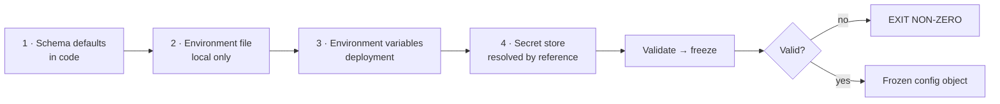
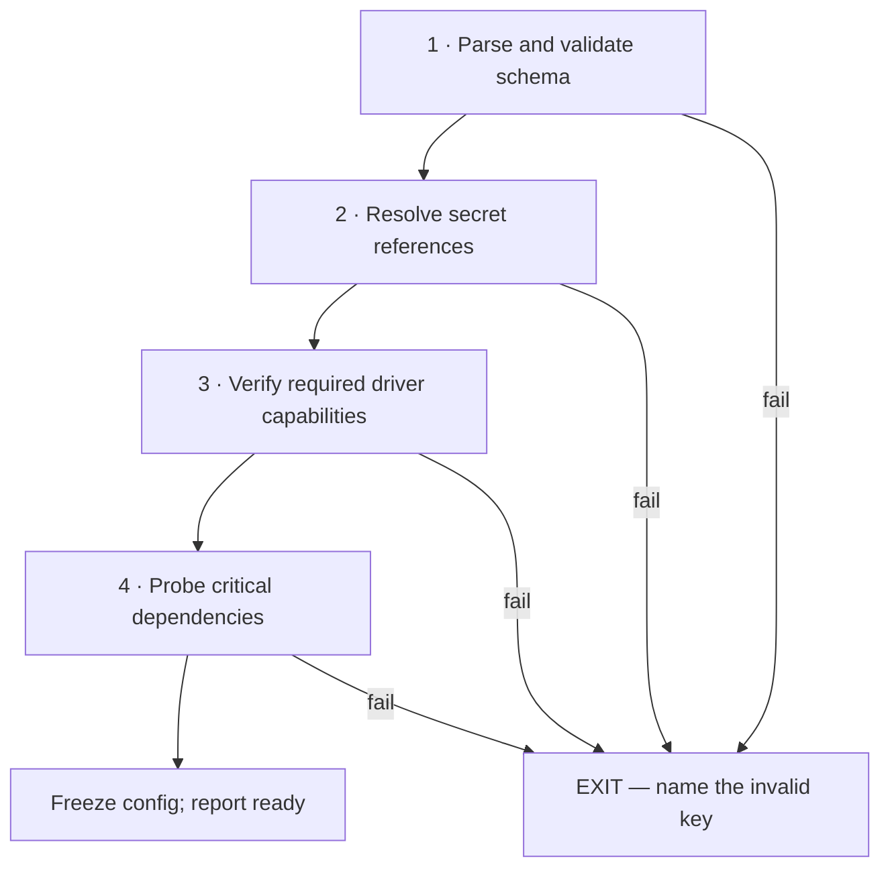

# Configuration

> **Status:** v1.0 — complete. Phase 11.
> **A process with invalid configuration does not start.** Not degraded, not with defaults substituted, not logging a warning and continuing — it exits non-zero before serving a request, because a misconfigured service that runs is harder to diagnose than one that refuses to.

## Overview

**Purpose.** Define the configuration hierarchy, the schema validation that runs at startup, how secrets are referenced rather than stored, and the narrow set of values that may change at runtime.

**Configuration is not secrets, and the split is absolute.** Configuration says *which* database and *which* secret name; the secret store supplies the password. This document owns the first half; `16-security/secrets-management.md` owns the second and is authoritative wherever they meet.

**Configuration is immutable after startup, with two declared exceptions.** Log level and feature flags. Everything else is loaded once, validated once, and frozen — a value that can change under a running request produces behaviour that depends on when the request arrived.

## Responsibilities

- The configuration hierarchy and precedence.
- Schema definition, defaults, and startup validation.
- Secret reference resolution.
- Feature flag evaluation.
- Hot-reload policy.

## Non-responsibilities

| Not owned | Owner |
|---|---|
| Secret storage, rotation, access | `16-security/secrets-management.md` |
| Encryption keys | `16-security/encryption.md` |
| Deployment-time value injection | `deployment-guide.md`, `14-operations/deployment.md` |
| Plan limits and quota values | `04-platform/billing.md` |
| Test gate thresholds | `10-testing/testing-strategy.md` |

## Hierarchy

**Later sources override earlier ones. There are exactly four.**



| Source | Contains | Environments |
|---|---|---|
| **Schema defaults** | Safe, non-secret defaults | All |
| **Environment file** (`.env`) | Local overrides | **Local only** — never loaded in deployed environments |
| **Environment variables** | Deployment values, secret *names* | All deployed |
| **Secret store** | Secret *values*, resolved by reference | All deployed |

**`.env` files are never loaded outside local development. [CI]** A deployed process that reads a `.env` file will eventually read one someone left in an image. Deployed environments receive values through environment variables and the secret store only.

**There is no config-file layer** — no `config.production.json`. Files check into source control, and the first secret to appear in one is permanent in git history (`16-security/threat-model.md`, T-19). Environment variables plus a secret store cover every case a file would.

## Schema and validation

**Every value is declared in one schema, with its type, constraints, and default.**

```ts
const ConfigSchema = z.object({
  nodeEnv: z.enum(['development', 'test', 'production']),
  port: z.coerce.number().int().min(1).max(65535).default(3000),

  database: z.object({
    host: z.string().min(1),
    port: z.coerce.number().int().default(5432),
    name: z.string().min(1),
    passwordSecret: z.string().min(1),        // a NAME, never a value
    poolMax: z.coerce.number().int().min(1).max(100).default(20),
    sslMode: z.enum(['verify-full']).default('verify-full'),
  }),

  storage: z.object({
    provider: z.enum(['r2', 's3', 'minio']),
    endpoint: z.string().url(),
    buckets: z.object({ media: z.string(), exports: z.string(),
                        backups: z.string(), quarantine: z.string() }),
    kmsKeyId: z.string().min(1),
  }),

  events: z.object({
    relayPollMs: z.coerce.number().int().min(50).default(200),
    relayBatchSize: z.coerce.number().int().min(1).max(1000).default(100),
    retryMaxAttempts: z.coerce.number().int().min(1).max(10).default(5),
  }),
}).strict();

export type Config = Readonly<z.infer<typeof ConfigSchema>>;
```

**`.strict()` rejects unknown keys.** An environment variable typo — `DATABSE_HOST` — otherwise silently falls back to a default while the operator believes it was set. Strict parsing turns that into a startup failure naming the unrecognised key.

**`sslMode` is an enum with one legal value.** `verify-full` is required (`16-security/encryption.md`), and making it a constrained enum rather than a string means no deployment can quietly weaken it to `require`.

**Defaults exist only where a safe default is genuinely available.** `poolMax` has one; `database.name` does not. A default for a value that must be deliberate is a way for a misconfiguration to reach production looking healthy.

**Numeric bounds are real bounds, not documentation.** `poolMax` above 100 exhausts the database's connection limit across a worker fleet — the constraint that also caps worker concurrency (`13-event-platform/workers.md`).

## Startup validation

**Validation is more than schema parsing.** A process passes four gates before it accepts work:



| Gate | Checks | On failure |
|---|---|---|
| **Schema** | Types, bounds, required values, unknown keys | Exit, naming the key |
| **Secrets** | Every referenced secret resolves | Exit, naming the secret |
| **Capabilities** | Driver supports what this deployment requires | Exit, naming the capability |
| **Dependencies** | Database, KMS, secret store reachable | Exit |

**Capability verification catches a class of failure that otherwise surfaces weeks later.** A deployment configured with a driver lacking Object Lock while backups require it fails at boot with a named capability, rather than at the first backup (`12-storage-platform/storage-abstraction.md`).

**Failure messages name the specific problem and never print the value.** `database.passwordSecret: secret 'db-app-password' not found in store` is actionable; printing the resolved value would put a credential in a startup log.

**Fail-fast is the whole point.** A service that starts with a missing optional integration and returns errors for a subset of requests is a partial outage that looks like intermittent bugs. Exiting produces a failed deploy, which rolls back (`deployment-guide.md`).

## Secret delegation

**Configuration holds secret *names*. The secret store holds *values*.**

```ts
// configuration
{ database: { passwordSecret: 'db-app-password' } }

// resolution at startup — value never enters the config object
const password = await secretStore.get(config.database.passwordSecret);
```

| Rule | Enforcement |
|---|---|
| No secret value in configuration or environment variables | [CI] |
| Environment variables carry only the **bootstrap workload identity** | [convention] |
| Resolved secrets are held in memory, never merged into the config object | [convention] |
| `SecretValue` redacts on `toString`/`toJSON` | [type] |
| Committed-secret scan blocks the merge | [CI] |

**The one permitted environment secret is the bootstrap workload identity** — the credential that lets a service authenticate to the secret store. It is short-lived, platform-injected, and grants nothing except fetching the secrets that service is authorized for (`16-security/secrets-management.md`).

**Resolved secrets stay out of the config object** so that logging or serializing configuration — which happens during debugging — cannot leak one. The config object is safe to print; the secret store's values are not.

**Rotation does not require a restart.** Services refresh secrets from the store on a timer; configuration is frozen but the secrets it references are not (`16-security/secrets-management.md`).

## Feature flags

**Flags are runtime-mutable and are deliberately not configuration.**

| | Configuration | Feature flags |
|---|---|---|
| Changes | Deploy | **Runtime** |
| Scope | Process | **Per tenant, per user, percentage** |
| Validated | Startup | Evaluation |
| Purpose | How the service runs | **What behaviour is enabled** |

```ts
interface FeatureFlags {
  isEnabled(flag: FlagName, ctx: TenantContext): Promise<boolean>;
  variant<T>(flag: FlagName, ctx: TenantContext, defaultValue: T): Promise<T>;
}
```

**Evaluation takes a `TenantContext`**, so a flag can be enabled for one workspace during rollout. This is what makes progressive delivery possible without a deploy per cohort (`deployment-guide.md`).

**Flags fail closed to their default.** An unreachable flag service returns the compiled-in default rather than throwing — a flag outage must not become a platform outage.

**Every flag has a removal date recorded at creation.** Flags are temporary by definition; a permanent one is configuration wearing a flag's clothes, and a codebase of stale flags has a combinatorial number of untested paths.

**Flags never gate security controls.** There is no flag that disables RLS, skips authorization, or bypasses audit. A control that can be switched off at runtime is not a control (`16-security/`).

## Hot reload

**Two values reload. Everything else requires a restart.**

| Value | Reloadable | Why |
|---|---|---|
| **Log level** | **Yes** | Diagnosis during an incident must not require a restart |
| **Feature flags** | **Yes** | That is their purpose |
| Everything else | **No** | Immutability after startup |

**Connection pools, timeouts, batch sizes, and endpoints do not reload.** A pool size changing mid-flight means some connections follow the old limit and some the new; a batch size changing mid-claim produces a partially-sized batch. These are the bugs that reproduce once and never again.

**Reloading is per-process and observable.** A log-level change emits a record at the new level noting the change, so it is visible in the stream it affects.

## Environment differences

| Setting | Local | CI | Production |
|---|---|---|---|
| Storage driver | MinIO | MinIO | R2 |
| Secret store | Local dummy values | Ephemeral, per run | Isolated instance |
| Log level | `debug` | `info` | `info` |
| Sampling | Off | Off | On |
| Rate limits | Relaxed | Production values | Production values |
| **Auth** | **Real** | **Real** | Real |
| **RLS** | **Enabled** | **Enabled** | **Enabled** |

**Authentication and RLS are never relaxed, in any environment.** A local shortcut that disables auth produces code paths tested only with auth off, and the shortcut reaches production eventually — the "development shortcuts must never leak into production" rule made concrete (`local-development.md`).

**Rate limits are relaxed locally and production-valued in CI**, so a change that breaks under limits fails in CI rather than in production.

**`nodeEnv === 'production'` enables additional guards**: `.env` loading is refused, dummy secrets are rejected, and debug endpoints are absent from the build rather than merely disabled.

## Business rules

1. **Invalid configuration exits non-zero before serving traffic.**
2. **Four sources, in fixed precedence**; no config-file layer.
3. **`.env` is local only**, never loaded in deployed environments.
4. **Schemas are `.strict()`**; unknown keys fail startup.
5. **Defaults exist only where a safe default is genuinely available.**
6. **Configuration is frozen after startup.**
7. **Only log level and feature flags reload.**
8. **Configuration holds secret names, never values.**
9. **The only environment secret is the bootstrap workload identity.**
10. **Resolved secrets never enter the config object.**
11. **Startup validates schema, secrets, capabilities, and dependencies.**
12. **Failure messages name the key, never the value.**
13. **Flags take a `TenantContext` and fail closed.**
14. **Every flag has a removal date.**
15. **Flags never gate security controls.**
16. **Auth and RLS are never relaxed in any environment.**

## Implementation

```ts
let frozen: Config | null = null;

export async function loadConfig(): Promise<Config> {
  if (frozen) return frozen;

  const parsed = ConfigSchema.safeParse(readSources());
  if (!parsed.success) {
    console.error('configuration invalid', formatIssues(parsed.error));  // keys only
    process.exit(1);
  }

  await assertSecretsResolvable(parsed.data);
  await assertCapabilities(parsed.data);
  await probeDependencies(parsed.data);

  frozen = Object.freeze(parsed.data);
  return frozen;
}
```

**`Object.freeze` plus a `Readonly` type is belt and braces.** The type prevents mutation at compile time; the freeze prevents it in code that bypassed types via a cast.

**Configuration is loaded once at the composition root and injected**, never read from a module-level import at point of use. A module-level singleton holding config is the same shape as the module-level mutable state banned in `coding-standards.md`, and it makes testing with alternate configuration impossible without mutating a global.

**`process.exit(1)` rather than a thrown error.** A thrown error during startup can be caught by a framework and turned into a degraded process; exiting cannot.

## Observability

- **Metrics:** `config_load_duration_seconds`, `config_validation_failures_total{gate}`, `feature_flag_evaluations_total{flag,result}`, `feature_flag_service_failures_total`, `stale_flags_total` (gauge — past removal date), `log_level_changes_total`.
- **Logging:** at startup, the resolved configuration **with secret names only** — a deliberate record of what the process is running with.
- **Alerts:** `config_validation_failures_total` non-zero during a deploy (**page** — the rollout is failing at startup); `feature_flag_service_failures_total` sustained (flags are serving defaults, so a rollout may not be taking effect); `stale_flags_total` above zero (accumulating untested code paths).

**Logging the resolved configuration at startup is worth the volume.** The most common production question is "what is this process actually configured with," and answering it from the deployment manifest requires trusting that the manifest was applied.

## Cross references

- `16-security/secrets-management.md` — **secret storage, resolution, rotation, bootstrap identity**
- `16-security/encryption.md` — `verify-full`, KMS key configuration
- `error-handling.md` — `INFRA_CONFIGURATION_INVALID` is terminal
- `logging-guide.md` — log level as the reloadable value
- `local-development.md` — local environment values and prohibited shortcuts
- `deployment-guide.md` — value injection and startup gating in rollout
- `ci-cd.md` — committed-secret scanning and `.env` checks
- `project-structure.md` — `infrastructure/environments/` holds no secrets
- `12-storage-platform/storage-abstraction.md` — capability verification at startup
- `13-event-platform/workers.md` — pool size bounding worker concurrency
- `04-platform/billing.md` — plan limits, which are not configuration
