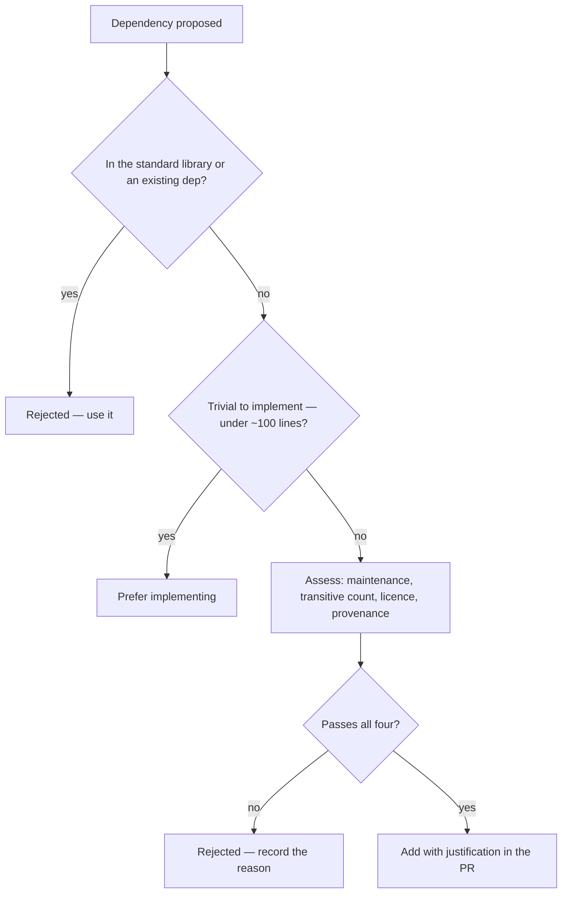

# Dependency Management

> **Status:** v1.0 — complete. Phase 11.
> **Every dependency is code you did not write, running with your privileges.** The threat model classifies dependency compromise as High and supply-chain compromise as Critical (`16-security/threat-model.md`, T-21 and T-22). This document is how that classification becomes policy.

## Overview

**Purpose.** Define what may be added, how versions are pinned, how upgrades happen, which licences are permitted, and how the supply chain is verified.

**The governing observation.** A typical Node application has a handful of direct dependencies and hundreds of transitive ones, each executing with the application's credentials and network access. Reducing that surface is worth more than any scanning tool applied to it.

**pnpm workspaces** manage the monorepo. Its strict, non-flat `node_modules` is a security property, not just a disk optimization: a package cannot import something it did not declare, so an undeclared transitive dependency fails at build rather than working by accident until it is removed upstream.

## Responsibilities

- Dependency addition policy and review.
- Version pinning and lockfile discipline.
- Upgrade cadence and batching.
- Licence policy and enforcement.
- Supply-chain verification.
- Unused dependency and export removal.

## Non-responsibilities

| Not owned | Owner |
|---|---|
| Which packages exist and their boundaries | `project-structure.md` |
| Runtime secret handling | `16-security/secrets-management.md` |
| Threat classification | `16-security/threat-model.md` |
| Pipeline mechanics | `ci-cd.md` |
| Container base images | `infrastructure/`, `14-operations/deployment.md` |

## Addition policy

**Adding a dependency is a review decision, not a commit. [CI]**



| Criterion | Requirement |
|---|---|
| Maintenance | Released within 12 months; more than one maintainer where practical |
| **Transitive count** | Reviewed and stated; a 40-dependency package needs a strong case |
| Licence | On the allowlist below |
| Provenance | Published with attestation where the registry supports it |
| Alternative considered | Named in the PR, including "implement it" |

**Transitive count is weighted heavily because it is the number that actually determines exposure.** A direct dependency is one package a reviewer looked at; forty transitive ones are forty they did not.

**"Implement it" is a real option and is stated explicitly** to counter the reflex that adding a package is free. A left-pad-shaped utility is a supply-chain risk, an upgrade obligation, and a licence question in exchange for saving twenty lines.

**Every added dependency names its justification in the PR description**, which is what makes the decision reviewable later when someone asks whether it is still needed.

## Version pinning

**Exact versions only. No ranges anywhere. [CI]**

```jsonc
{
  "dependencies": {
    "drizzle-orm": "0.44.2",     // exact
    "zod": "3.25.7"              // exact
  }
}
```

| Prohibited | Why |
|---|---|
| `^0.44.2` | A minor release changes behaviour between two builds of the same commit |
| `~0.44.2` | Same problem, narrower |
| `latest`, `*` | Non-reproducible by construction |

**Ranges make a build non-reproducible, and that breaks incident response.** Reproducing a production bug requires the exact tree that produced it; a caret range means a rebuild three weeks later resolves differently and the bug vanishes without being fixed.

**Ranges are also a supply-chain hole.** A compromised patch release of a transitive dependency enters automatically on the next install. Exact pinning means the compromised version enters only when someone deliberately updates and a diff is reviewed.

**The lockfile is committed and CI installs frozen. [CI]** `pnpm install --frozen-lockfile` fails if the lockfile does not match `package.json`, so a dependency change cannot reach main without the lockfile change alongside it.

**Lockfile conflicts are resolved by regenerating, never by hand-merging.** A hand-merged lockfile produces a tree nobody has ever installed.

## Upgrade strategy

| Class | Cadence | Process |
|---|---|---|
| **Security patch (Critical/High)** | **Within 7 days** | Expedited; may bypass batching |
| Security patch (Medium/Low) | Next weekly batch | Normal review |
| Patch releases | Weekly, batched | Automated PR, full CI |
| Minor releases | Monthly, batched | Automated PR, full CI |
| **Major releases** | **Deliberate** | Individual PR, changelog read, migration planned |
| Framework/runtime majors | Planned work | ADR if it changes an architectural assumption |

**Critical and High CVEs are remediated within 7 days**, which is the SLO in `16-security/security-observability.md`. That is the one class permitted to bypass batching.

**Patches and minors are batched to make review affordable.** Forty individual PRs are rubber-stamped; one weekly PR with forty entries and a green pipeline gets read.

**Majors are never batched and never automated.** A major release is a breaking change by definition, and the changelog is read before the version is bumped.

**Upgrades run the full pipeline including conformance suites.** A dependency upgrade that silently breaks RLS policy application or a storage driver capability is exactly what those suites exist to catch (`project-structure.md`).

## Licence policy

| Licence | Status |
|---|---|
| MIT, Apache-2.0, BSD-2/3, ISC, 0BSD, Unlicense | **Allowed** |
| MPL-2.0, LGPL | **Review required** — permitted for unmodified library use |
| **GPL, AGPL** | **Denied** |
| SSPL, BUSL, Commons Clause | **Denied** |
| Unlicensed / unclear | **Denied** |

**AGPL is denied because ContentOS is a hosted service.** The AGPL's network clause would extend its obligations to software delivered over a network — precisely what the platform is. This is a business constraint, not a preference.

**SSPL and BUSL are denied because they are not open source licences** despite being presented as such, and their obligations are incompatible with a commercial SaaS.

**Licence checking runs in CI and blocks on any denied or unrecognised licence. [CI]** An unrecognised licence is treated as denied — an unreviewed obligation is worse than a known one.

**The check covers transitive dependencies**, since a permissively-licensed package that depends on a GPL one carries the obligation regardless of its own licence.

## Supply-chain verification

**Four controls, each addressing a distinct attack path.**

| Control | Defeats | Enforcement |
|---|---|---|
| **Lockfile integrity hashes** | Registry tampering, content substitution | [CI] |
| **`ignore-scripts` by default** | Malicious install scripts | [CI] |
| **Vulnerability scanning** | Known CVEs | [CI] |
| **Provenance attestation** | Package/source mismatch | [CI] where available |

**Install scripts are disabled by default, with an explicit allowlist. [CI]** This is the highest-value control here. A `postinstall` script executes arbitrary code on every developer machine and every CI runner, with full filesystem and network access, before any code review has happened. Packages genuinely needing one — native builds — are allowlisted individually with a recorded reason.

**Integrity hashes in the lockfile are verified on every install.** A package whose content changed for a published version fails to install rather than silently entering the build.

**Vulnerability scanning gates merges**, and the threshold is severity-based: Critical and High block; Medium and Low are recorded and batched. A scanner blocking on every Low finding trains people to bypass it.

**Provenance attestation is verified where the registry provides it**, confirming a package was built from the source repository it claims. Adoption is uneven, so it is a gate where available and a preference where not — stated honestly rather than as a guarantee.

**A zero-day in a trusted dependency remains detectable rather than preventable**, which is exactly how `16-security/threat-model.md` T-22 classifies it. The bounding control is runtime: the egress restrictions and process isolation that limit what a compromised package can reach (`12-storage-platform/media-processing.md`, `16-security/api-security.md`).

## Unused dependency removal

**Dead dependencies are live risk.** They are scanned, upgraded, and audited exactly like used ones, and they contribute their transitive tree while contributing nothing else.

| Detection | Tool | Enforcement |
|---|---|---|
| Unused dependencies | `knip` | [CI] |
| Unused exports | `knip` | [CI] |
| Unused files | `knip` | [CI] |
| Duplicate packages at different versions | `pnpm dedupe --check` | [CI] |

**Duplicate versions are flagged because they are usually accidental**, and they double the surface while producing subtle bugs where two copies of a library hold separate module state.

**Removal happens continuously, not in cleanup sprints.** A quarterly cleanup means three months of accumulated risk, and the cleanup PR is too large to review properly.

**Unused *exports* matter as much as unused packages.** An exported symbol nobody imports is public surface with no consumer — it constrains refactoring and suggests capability that does not exist.

## Internal packages

**Workspace packages are referenced by `workspace:*`**, never by version.

```jsonc
{
  "dependencies": {
    "@contentos/contracts": "workspace:*",
    "@contentos/security": "workspace:*"
  }
}
```

**Internal packages are not published** and are not independently versioned in v1. The monorepo deploys as a unit, so version skew between internal packages is not a state the system can reach — and independent versioning would introduce a compatibility matrix with no consumer to justify it.

**Internal dependencies still obey the layer rules** in `project-structure.md`. Declaring `@contentos/content` as a dependency of `@contentos/security` fails the boundary check regardless of being a workspace reference.

## Runtime versions

| Component | Version | Pinning |
|---|---|---|
| Node.js | 22 LTS | `.nvmrc`, `engines`, container base image |
| pnpm | Pinned exactly | `packageManager` field |
| PostgreSQL | 17 | Container tag, ADR-016 |
| Redis | 7.x | Container tag |

**Runtime versions are pinned in three places and verified consistent. [CI]** A `.nvmrc` saying 22 while the container runs 20 produces failures that reproduce locally but not in CI, or the reverse — the most expensive class of environment bug.

**`engines` with `engine-strict` makes a wrong local Node version a clear error** rather than a confusing runtime failure.

## Business rules

1. **Exact versions only.** No ranges, anywhere.
2. **The lockfile is committed; CI installs frozen.**
3. **Lockfile conflicts are regenerated**, never hand-merged.
4. **Every added dependency carries a justification** and a named alternative.
5. **Transitive count is assessed and stated** at addition.
6. **Install scripts are disabled by default**, allowlisted individually.
7. **Integrity hashes are verified on every install.**
8. **Critical and High CVEs are remediated within 7 days.**
9. **Patches and minors are batched; majors are individual and deliberate.**
10. **GPL, AGPL, SSPL, BUSL, and unclear licences are denied.**
11. **Licence checking covers transitive dependencies**; unrecognised means denied.
12. **Unused dependencies, exports, and files fail CI.**
13. **Duplicate versions are flagged.**
14. **Internal packages use `workspace:*`** and are not independently versioned.
15. **Runtime versions are pinned in three places** and verified consistent.
16. **Upgrades run the full pipeline including conformance suites.**

## CI enforcement

| Gate | Blocks on |
|---|---|
| `pnpm install --frozen-lockfile` | Lockfile/manifest mismatch |
| Licence check | Denied or unrecognised licence, including transitive |
| Vulnerability scan | Critical or High CVE |
| `knip` | Unused dependency, export, or file |
| `pnpm dedupe --check` | Duplicate versions |
| Install-script audit | Non-allowlisted `postinstall` |
| Range check | Any non-exact version specifier |
| Runtime version consistency | `.nvmrc` vs `engines` vs container tag |

**Every gate blocks rather than warns**, following the enforcement posture in `README.md`. A dependency policy enforced by warnings is a dependency policy with no effect.

Full pipeline composition is in `ci-cd.md`; this table states what dependency management contributes to it.

## Observability

- **Metrics:** `dependency_count{package,kind}` (gauge), `outdated_dependencies{severity}` (gauge), `vulnerabilities_open{severity}` (gauge), `vulnerability_age_days{severity}` (gauge), `licence_violations_total`, `unused_dependencies_total`, `install_script_allowlist_size` (gauge).
- **Alerts:** an open Critical or High vulnerability older than 7 days (**page** — the remediation SLO is breached); a licence violation on main (**page** — a legal obligation entered the build); `dependency_count` growing sharply without a corresponding feature (surface expanding unnoticed); the install-script allowlist growing.
- **Reporting:** total transitive count is tracked over time. A number that only grows is a trend worth a decision rather than a discovery during an incident.

**Vulnerability *age* matters more than vulnerability count.** Ten Low findings open for a day is healthy; one High open for a month is the actual risk, and a count-based dashboard hides that.

## Cross references

- `project-structure.md` — package boundaries, banned imports, SDK containment
- `ci-cd.md` — pipeline composition and gate ordering
- `coding-standards.md` — unused export detection via the same tooling
- `local-development.md` — runtime version setup
- `deployment-guide.md` — artifact composition and signing
- `16-security/threat-model.md` — T-21 supply chain, T-22 dependency compromise
- `16-security/secrets-management.md` — CI credentials are ephemeral and per-run
- `16-security/security-observability.md` — patch currency SLO
- `01-system-architecture/13-adr-log.md` — ADR-016 stack selection
