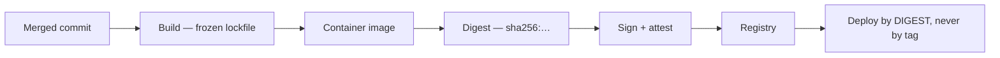
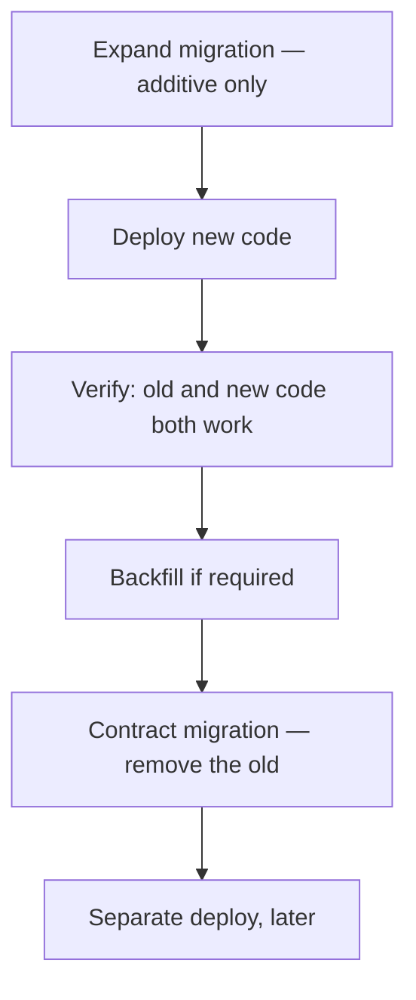
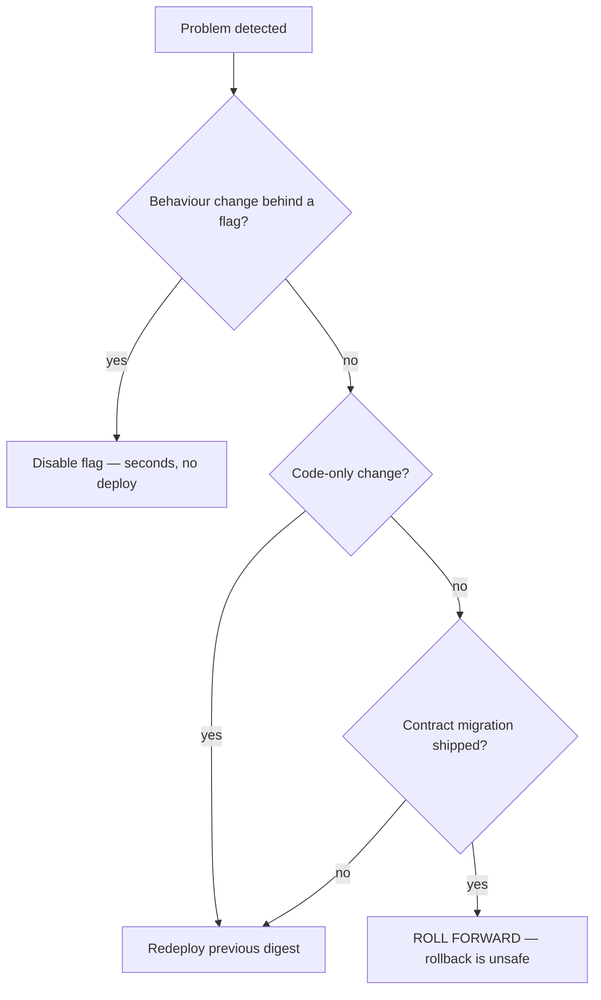
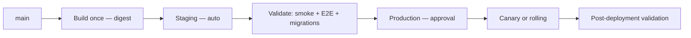

# Deployment Guide

> **Status:** v1.0 — complete. Phase 11.
> **Code rolls back in seconds. Schema does not roll back at all.** That asymmetry is why every migration must be backward compatible — not as a best practice, but because it is the only thing that makes rollback survivable.

## Overview

**Purpose.** Specify the path from a merged commit to a released artifact running in production: build, artifact identity, migration ordering, health gating, rollout strategy, rollback, and post-deployment validation.

**The boundary.** `14-operations/deployment.md` owns operating deployed environments — infrastructure, capacity, environment topology. **This document owns the release process and its gates.** The handoff point is the artifact: this folder produces and validates it; `14-operations/` runs it.

**Deployments are repeatable by construction.** The same commit produces the same artifact digest, and the same artifact deploys identically to every environment. Reproducibility is what makes an incident diagnosable — a build that resolves differently on rebuild cannot be reasoned about (`dependency-management.md`).

## Build and artifact



| Property | Rule |
|---|---|
| Input | A commit SHA and a frozen lockfile — nothing else |
| Identity | **The image digest**, not a tag |
| Immutability | An artifact is built once and promoted, **never rebuilt per environment** |
| Signing | Signed at build; signature verified at deploy |
| Provenance | Attestation records the source commit and builder |

**Deploying by digest rather than tag is the difference between knowing and hoping.** Tags are mutable — `v1.4.2` can be repointed, and `latest` means nothing at all. A digest identifies exactly one set of bytes, so the artifact running in production is provably the artifact that passed CI.

**One artifact is promoted across environments.** Rebuilding for staging and again for production produces two artifacts, only one of which was tested. Configuration differs per environment and is injected at runtime (`configuration.md`); the bytes do not change.

**Signature verification is a deploy gate. [CI]** An unsigned or mis-signed artifact is refused, which is the control against a compromised registry (`16-security/threat-model.md`, T-21).

## Migration ordering

**This is the section that prevents the most damaging deployment failures.**



| Phase | When | Contains |
|---|---|---|
| **Expand** | **Before** the code deploy | Add columns, tables, indexes; new nullable fields |
| **Deploy** | After expand | Code that writes both shapes, reads the new one |
| **Backfill** | After deploy | Populate new columns from old |
| **Contract** | **A later, separate deploy** | Drop old columns, add `NOT NULL`, remove compatibility |

**Expand runs before the deploy; contract runs long after.** During a rolling deploy, old and new code run simultaneously against one database. A migration that dropped a column would break every old instance still serving traffic — an outage caused by the deployment mechanism itself.

**Contract never ships in the same deploy as the code that stopped using the column.** If that deploy rolls back, the column is already gone and the rolled-back code fails against a schema it cannot use. Contract waits until the new code is confirmed stable and rollback is no longer plausible.

**Every migration is backward compatible with the currently-deployed code. [CI]** This is enforced, not encouraged: CI runs the previous release's test suite against the new schema. A migration that breaks it fails the build.

| Never in a single migration | Reason |
|---|---|
| Add a `NOT NULL` column without a default | Old code inserting without it fails |
| Rename a column | Old code reads the old name |
| Drop a column still referenced | Old code breaks immediately |
| Narrow a type | Existing rows may not fit |
| Add a unique constraint without verifying | Fails mid-migration on duplicates |

**Renames are expand/contract in disguise**: add the new column, write both, backfill, switch reads, then drop. A single-statement rename is atomic in the database and catastrophic across a rolling fleet.

**Long-running migrations run outside the deploy.** An index build on a 10⁸-row table takes hours; blocking a deploy on it means either a hours-long deploy or a timeout mid-migration. Indexes are built concurrently, ahead of the deploy that needs them (`03-database/migrations.md`).

## Health, readiness, startup

**Three probes, three distinct questions. Conflating them is the most common deployment misconfiguration.**

| Probe | Asks | Failure action |
|---|---|---|
| **Startup** | Has initialization finished? | Keep waiting; do not kill yet |
| **Liveness** | Is the process wedged? | **Restart it** |
| **Readiness** | Can it serve traffic *right now*? | **Remove from rotation; do not restart** |

```ts
// Liveness — process-local only. NEVER checks dependencies.
function liveness(): boolean { return !eventLoopBlocked() && !shuttingDown; }

// Readiness — dependencies included.
async function readiness(): Promise<boolean> {
  return configLoaded && await db.ping() && await secretStore.reachable() && !draining;
}
```

**Liveness must never check dependencies, and this is the single highest-consequence rule here.** If liveness probes the database, a brief database blip fails liveness on every instance simultaneously, the orchestrator restarts the entire fleet, and the fleet cannot start because the database is still degraded. A recoverable dependency incident becomes a total outage caused by the health check.

**Readiness checks dependencies and only removes from rotation.** The instance stays alive, keeps retrying, and rejoins when the dependency recovers.

**Startup probes exist because initialization is slow and legitimate.** Configuration validation, secret resolution, capability verification, and dependency probing all run before ready (`configuration.md`). Without a separate startup probe, a slow-but-healthy boot is killed by liveness and restarts forever.

**Readiness returns false immediately on `SIGTERM`**, before draining begins, so traffic stops arriving while in-flight work completes (`13-event-platform/workers.md`).

## Rollout strategies

| Strategy | Used for | Rollback |
|---|---|---|
| **Rolling** | Default for API and workers | Redeploy previous digest |
| **Blue/green** | Changes with infrastructure risk | Switch traffic back — seconds |
| **Canary** | High-risk or broad-impact changes | Shift traffic to 0% |
| **Feature flag** | Behaviour changes | **Disable the flag — no deploy** |

**Feature flags are the fastest rollback available and are preferred for behaviour changes.** Disabling a flag takes effect in seconds without a deploy, a build, or a migration concern — which is why flags evaluate per tenant and fail closed to their default (`configuration.md`).

**Rolling is the default because it needs no duplicate capacity.** Instances are replaced in batches, each gated on readiness, with a maximum-unavailable bound that keeps capacity above the serving threshold.

**Canary is gated on metrics, not on elapsed time.** A canary that gets 5% of traffic for ten minutes and is promoted on a timer proves nothing. Promotion requires error rate, latency, and the invariant board to be within bounds against the baseline (`16-security/security-observability.md`).

**Worker deployments always drain.** A worker killed mid-handler leaves entries pending until the idle-claim timeout, turning a routine deploy into a latency spike on that consumer group. The grace window must exceed p99 handler duration, and `ShutdownReport.abandoned` must be zero (`13-event-platform/workers.md`).

## Rollback



**Code rolls back; migrations do not.** Reverting a migration is a *new* migration, written under pressure, against a schema that may already have new data in it. The safe path after a contract migration is forward — which is precisely why contract migrations wait until rollback is no longer plausible.

**Every deploy records its rollback target before it starts.** The previous digest is captured at the beginning, not reconstructed during an incident from registry history.

**Rollback is rehearsed, not theorized.** It runs in staging on a schedule, for the same reason restore testing is mandatory: an untested rollback is a hypothesis (`12-storage-platform/backups.md`).

**Rollback never bypasses health gating.** The previous artifact deploys through the same readiness checks — a rollback that skipped validation could deploy something equally broken with no signal.

## Post-deployment validation

**A deploy is not complete when instances are running. It is complete when it is validated.**

| Gate | Checks | Failure |
|---|---|---|
| **Startup** | All instances ready within the window | **Auto-rollback** |
| **Smoke** | Critical paths respond correctly | **Auto-rollback** |
| **Error rate** | Within baseline for 15 minutes | Alert; manual decision |
| **Latency** | p95 within SLO | Alert |
| **Invariant board** | All zero | **Page — never auto-rollback** |
| **Consumer lag** | No group falling behind | Alert |
| **Deploy hygiene** | `worker_shutdown_abandoned_total` is zero | Alert |

**Startup and smoke failures roll back automatically.** They are unambiguous: instances that never became ready, or a critical path returning errors.

**An invariant breach pages and does not auto-roll-back.** A cross-tenant violation or an audit failure needs a human decision, and automatic rollback could destroy the state needed to determine scope (`16-security/incident-response.md`). Automatic remediation is right for "it did not start" and wrong for "isolation may have failed."

**`worker_shutdown_abandoned_total` is the deploy-hygiene signal.** Non-zero means the grace window is shorter than actual handler duration, and every deploy is abandoning work — visible per deploy rather than inferred from a latency graph.

## Environment promotion



**Staging runs the same artifact and the same migrations against production-shaped data volume.** A migration tested against a thousand rows tells you nothing about the same migration against a hundred million.

**Production requires explicit approval.** Continuous deployment to staging is automatic; production is a decision with a named approver, recorded.

**Deployments are audited** — artifact digest, actor, approver, migration set, outcome (`16-security/audit.md`).

## Business rules

1. **Deploy by digest, never by tag.**
2. **One artifact is promoted**, never rebuilt per environment.
3. **Artifacts are signed; verification gates deployment.**
4. **Expand migrations run before the code deploy.**
5. **Contract migrations ship in a later, separate deploy.**
6. **Every migration is backward compatible with deployed code**, verified in CI.
7. **Renames are always expand/contract.**
8. **Long-running index builds run outside the deploy.**
9. **Liveness never checks dependencies.**
10. **Readiness removes from rotation; it never restarts.**
11. **Startup probes exist so slow boots are not killed.**
12. **Readiness fails immediately on `SIGTERM`.**
13. **Canary promotion is gated on metrics, never elapsed time.**
14. **Worker deploys drain**; abandoned work is zero.
15. **Every deploy records its rollback target before starting.**
16. **Rollback is rehearsed and never bypasses health gating.**
17. **Startup and smoke failures auto-roll-back; invariant breaches page instead.**
18. **Production deploys require a named approver and are audited.**

## Interfaces

```ts
interface DeploymentRecord {
  readonly deploymentId: string;
  readonly artifactDigest: string;        // sha256:… — never a tag
  readonly commitSha: string;
  readonly environment: 'staging' | 'production';
  readonly strategy: 'rolling' | 'blue-green' | 'canary';
  readonly migrations: readonly MigrationRef[];
  readonly rollbackTarget: string;        // captured BEFORE the deploy starts
  readonly approvedBy: string | null;     // required for production
  readonly startedAt: Date;
  readonly validation: ValidationReport | null;
  readonly outcome: 'succeeded' | 'rolled-back' | 'failed' | 'in-progress';
}

type ValidationReport =
  | { outcome: 'passed'; gates: readonly GateResult[] }
  | { outcome: 'failed'; failedGates: readonly GateResult[]; action: 'auto-rollback' | 'paged' };
```

**`rollbackTarget` is non-nullable and captured before the deploy begins.** A deploy that cannot state what it would roll back to is not permitted to start — the same fail-closed structure used for recovery gates (`12-storage-platform/disaster-recovery.md`).

**`approvedBy` is required for production** and enforced at the type level for that branch, so an unapproved production deploy is unrepresentable rather than merely blocked by policy.

## Observability

- **Metrics:** `deployments_total{environment,strategy,outcome}`, `deployment_duration_seconds`, `rollbacks_total{reason}`, `time_to_rollback_seconds`, `migration_duration_seconds`, `readiness_failures_total`, `worker_shutdown_abandoned_total`, `canary_promotions_total{outcome}`.
- **Alerts:** deployment failed or auto-rolled-back (**page**); `time_to_rollback_seconds` above target (the rollback path is slow — it will be slower during an incident); `worker_shutdown_abandoned_total` non-zero (grace window too short); migration duration exceeding its window; readiness failures during rollout.
- **Tracking:** deployment frequency, change failure rate, and time to restore — reviewed monthly, since a rising change failure rate is the earliest signal that the gates are insufficient.

## Cross references

- `14-operations/deployment.md` — **production deployment operations; the handoff**
- `migration-guide.md` — expand/contract in detail, data migrations
- `ci-cd.md` — the pipeline producing and validating the artifact
- `configuration.md` — runtime value injection, startup validation
- `dependency-management.md` — frozen lockfiles and reproducible builds
- `local-development.md` — the drain path exercised locally
- `03-database/migrations.md` — migration mechanics and index building
- `13-event-platform/workers.md` — graceful shutdown and drain reporting
- `16-security/security-observability.md` — the invariant board as a deploy gate
- `16-security/incident-response.md` — why invariant breaches page rather than auto-roll-back
- `16-security/audit.md` — deployment audit records
- `16-security/threat-model.md` — T-21 supply chain, artifact signing
