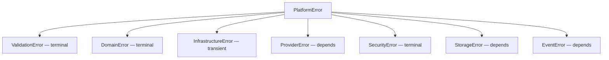
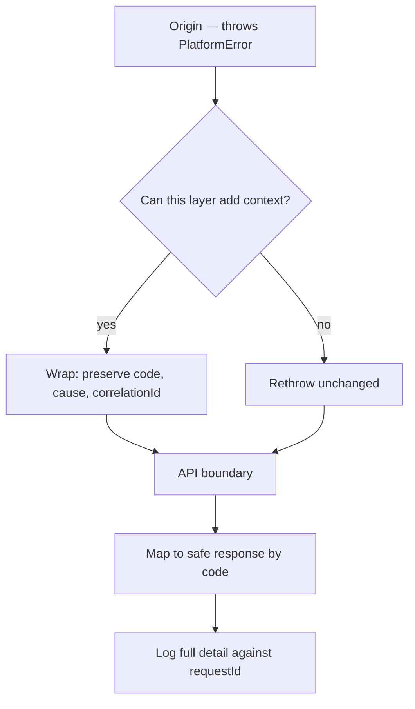

# Error Handling

> **Status:** v1.0 — complete. Phase 11. **Canonical error model.**
> **Every error carries a stable code and a retryability classification.** The classification is the same three-valued one the Retry Engine already uses, because two components disagreeing about whether a failure is transient is how a permanent bug retries forever.

## Overview

**Purpose.** Freeze the platform-wide error model: the taxonomy, the stable code scheme, how errors propagate across layers, what reaches a user, and what stays internal.

**This model unifies; it does not redefine.** Phases 8, 9, and 10 each froze an error or failure taxonomy. This document defines the umbrella every error conforms to and the mapping from each existing taxonomy into it. Where an existing type is authoritative, it stays authoritative.

| Frozen elsewhere | Owner | Relationship |
|---|---|---|
| `FailureClass` = `transient \| terminal \| unknown` | `13-event-platform/retry-engine.md` | **Adopted verbatim** as `retryability` |
| Terminal codes — `GuardrailBlocked`, `ValidationRejected`, `SchemaViolation`, `UnknownEventType`, `AuthorizationFailure` | `13-event-platform/retry-engine.md` | **Never retried, in any component** |
| `StorageError` — 8 variants on `kind` | `12-storage-platform/storage-apis.md` | Mapped, not replaced |
| `DenyReason` — 7 string literals | `16-security/authorization.md` | Mapped, not replaced |
| `AuthResult` failure — one opaque reason | `16-security/authentication.md` | Preserved exactly |

## The canonical error

```ts
abstract class PlatformError extends Error {
  abstract readonly code: ErrorCode;          // stable, enumerated
  abstract readonly category: ErrorCategory;
  abstract readonly retryability: FailureClass;
  readonly correlationId: string;
  readonly detail: string;                    // INTERNAL — never user-facing
  readonly cause?: unknown;
}

type ErrorCategory =
  | 'validation' | 'domain' | 'infrastructure'
  | 'provider' | 'security' | 'storage' | 'event';

type FailureClass = 'transient' | 'terminal' | 'unknown';   // from Phase 8
```

**`retryability` is `FailureClass`, imported rather than re-declared.** The Retry Engine classifies delivery failures with exactly these three values; a second enum meaning almost the same thing would drift on the first addition (`13-event-platform/retry-engine.md`).

**`detail` is internal and never reaches a response.** It carries the specific cause — a constraint name, a provider message, a resolved host — for logs and diagnostics. What a caller receives is derived from `code` (`16-security/api-security.md`).

**Every error subclasses `PlatformError`.** A raw `Error` thrown from platform code fails lint, because an untyped error has no code, no classification, and no correlation — so retry cannot classify it and the API layer cannot map it safely.

## Stable codes

```
<CATEGORY>_<SPECIFIC>
```

`VALIDATION_FIELD_INVALID` · `STORAGE_NOT_FOUND` · `SECURITY_AUTHORIZATION_DENIED` · `EVENT_SCHEMA_VIOLATION` · `PROVIDER_RATE_LIMITED`

| Rule | Enforcement |
|---|---|
| Codes are enumerated constants, never constructed strings | [type] |
| A code's meaning **never changes** once shipped | [convention] |
| Codes are additive; retired codes are never reused | [convention] |
| Codes appear in API responses and are documented | [CI] |
| Message text may change; **codes may not** | [convention] |

**Codes are part of the public contract and messages are not.** A client branching on message text breaks when the wording improves; a client branching on `STORAGE_NOT_FOUND` does not. This mirrors the event-type immutability rule — a name whose meaning changes silently breaks every consumer (`13-event-platform/versioning.md`).

**Code reuse is banned for the same reason event types are never reused.** A retired code appearing later with a new meaning makes historical logs ambiguous.

## Taxonomy



### Validation — always terminal

Input violates a documented rule. The input is immutable, so retrying cannot help.

| Code | HTTP |
|---|---|
| `VALIDATION_FIELD_INVALID` | 400 |
| `VALIDATION_SCHEMA_MISMATCH` | 400 |
| `VALIDATION_SIZE_EXCEEDED` | 413 |
| `VALIDATION_TYPE_UNSUPPORTED` | 415 |

**Maps to `ValidationRejected`** in retry classification — terminal, never retried.

**Validation errors carry field paths, never values.** `body.wordCount: must be ≤ 10000` is actionable; echoing the received value puts potentially sensitive input into logs and responses (`16-security/api-security.md`).

### Domain — terminal

A business invariant was violated. Owned by the domain component; the model here only classifies it.

| Code | HTTP |
|---|---|
| `DOMAIN_INVARIANT_VIOLATED` | 409 |
| `DOMAIN_STATE_INVALID` | 409 |
| `DOMAIN_CONFLICT` | 409 |
| `DOMAIN_QUOTA_EXCEEDED` | 402 |

**Domain errors are terminal because the state is what it is.** Publishing an already-published article fails identically on retry until the state changes, and the state changes through a different operation.

**This document defines no domain errors.** It defines that they exist, are terminal, and carry stable codes.

### Infrastructure — transient

The platform's own dependencies failed.

| Code | Retryability |
|---|---|
| `INFRA_DATABASE_UNAVAILABLE` | transient |
| `INFRA_CACHE_UNAVAILABLE` | transient |
| `INFRA_TIMEOUT` | transient |
| `INFRA_SERIALIZATION_FAILURE` | transient — PostgreSQL 40001 |
| `INFRA_LOCK_CONTENTION` | transient |
| `INFRA_CONFIGURATION_INVALID` | **terminal** |

**`INFRA_CONFIGURATION_INVALID` is terminal despite its category.** A malformed configuration value does not fix itself, and retrying against it burns budget while hiding the real problem — the process should fail to start instead (`configuration.md`).

### Provider — mixed

External services. Classification depends on the failure.

| Code | Retryability |
|---|---|
| `PROVIDER_TIMEOUT` | transient |
| `PROVIDER_UNAVAILABLE` | transient |
| `PROVIDER_RATE_LIMITED` | transient — honours `retryAfterMs` |
| `PROVIDER_INVALID_RESPONSE` | transient — once |
| `PROVIDER_AUTH_FAILED` | **terminal** |
| `PROVIDER_QUOTA_EXHAUSTED` | **terminal** |
| **`PROVIDER_SAFETY_REFUSAL`** | **terminal — never auto-fallback** |

**`PROVIDER_SAFETY_REFUSAL` never triggers automatic provider fallback.** A model refusing on safety grounds is the safety system working; routing the same request to a different provider until one complies is an attempt to launder a refusal. This is `08-ai-platform/retry-strategy.md` Rule 2, restated because the error model must not permit what the AI Platform forbids.

**Provider error bodies are never forwarded to callers.** They routinely embed the request they received, including credentials (`16-security/api-security.md`).

### Security — always terminal

| Code | HTTP | Notes |
|---|---|---|
| `SECURITY_AUTHENTICATION_FAILED` | 401 | **One opaque reason only** |
| `SECURITY_AUTHORIZATION_DENIED` | **403 or 404** | See below |
| `SECURITY_STEP_UP_REQUIRED` | 401 | Fresh MFA needed |
| `SECURITY_TENANT_VIOLATION` | 404 | **Invariant breach — pages** |
| `SECURITY_GUARDRAIL_BLOCKED` | 422 | **Never retried, anywhere** |

**Authentication failure carries exactly one reason.** Never "unknown user" versus "wrong password" — a distinguishable failure turns login into an account enumeration oracle (`16-security/authentication.md`).

**Authorization denial returns 404 across tenants and 403 within one.** A 403 confirms the resource exists, letting an attacker enumerate ids across tenants. The seven `DenyReason` values map to this single code; the specific reason goes to the audit record, never to the caller (`16-security/authorization.md`).

**`SECURITY_TENANT_VIOLATION` is an invariant breach, not an ordinary error.** It routes to `recordInvariantBreach` and pages at count one (`16-security/security-observability.md`).

**`SECURITY_GUARDRAIL_BLOCKED` is never retried in any component, under any circumstance** — the platform's most-repeated rule (`13-event-platform/retry-engine.md`, `08-ai-platform/retry-strategy.md`).

### Storage — mapped from Phase 10

**`StorageError` is authoritative and unchanged.** This is the mapping into the canonical model:

| `StorageError.kind` | Code | Retryability | HTTP |
|---|---|---|---|
| `not-found` | `STORAGE_NOT_FOUND` | terminal | 404 |
| `already-exists` | `STORAGE_ALREADY_EXISTS` | terminal | 409 |
| `precondition-failed` | `STORAGE_PRECONDITION_FAILED` | terminal | 412 |
| `access-denied` | `STORAGE_ACCESS_DENIED` | **terminal** | 500 |
| `rate-limited` | `STORAGE_RATE_LIMITED` | transient | 503 |
| `transient` | `STORAGE_TRANSIENT` | transient | 503 |
| `integrity` | `STORAGE_INTEGRITY_FAILURE` | **terminal — invariant breach** | 500 |
| `unsupported` | `STORAGE_UNSUPPORTED` | terminal | 501 |

**`access-denied` surfaces as 500, not 403.** It means the *platform's* credentials failed, not the user's — a configuration or rotation failure, invisible to the caller and urgent for operators (`12-storage-platform/storage-abstraction.md`).

**`integrity` is an invariant breach**: the platform holds bytes that do not match its recorded checksum. It pages (`12-storage-platform/storage-observability.md`).

### Event — mapped from Phase 8

| Code | Retryability |
|---|---|
| `EVENT_UNKNOWN_TYPE` | **terminal** |
| `EVENT_SCHEMA_VIOLATION` | **terminal — pages** |
| `EVENT_PUBLISH_OUTSIDE_TRANSACTION` | terminal — programming error |
| `EVENT_ORDERING_VIOLATION` | **terminal — invariant breach** |

**`EVENT_SCHEMA_VIOLATION` at a consumer is a paradox and pages.** The registry validates inside the producer's transaction, so an invalid payload cannot reach the outbox. Seeing one downstream means the registry was bypassed or a schema changed in place (`13-event-platform/retry-engine.md`).

## Propagation



**Never swallow. [lint]** A `catch` that neither rethrows, wraps, nor produces a typed result fails lint. Empty catch blocks and `catch { return null }` are the most common silent-failure shapes in TypeScript.

**Never catch broadly to convert to a generic error.** `catch (e) { throw new Error('failed') }` destroys the code, the classification, and the cause — retry can no longer classify it, so it becomes `unknown` and gets one attempt.

**Wrapping preserves `cause`, `code`, and `correlationId`.** A wrapper adds context; it does not replace identity.

**Expected outcomes are results, not exceptions.** `already-deleted`, `no-op`, `not-archived`, and `suppressed` are returned as discriminated variants (`12-storage-platform/storage-apis.md`, `13-event-platform/idempotency.md`). Exceptions are for genuine failures, which is what keeps `catch` blocks meaningful.

**Retry never re-implements classification.** A handler catching a failure hands the error to the Retry Engine, which reads `retryability`. A handler deciding for itself produces per-consumer retry behaviour that no one can reason about (`13-event-platform/retry-engine.md`).

## User-facing errors

```ts
interface ErrorResponse {
  error: {
    code: string;          // the stable code
    message: string;       // safe, generic, derived from code
    requestId: string;     // the diagnostic pivot
    details?: readonly FieldError[];   // validation only — paths, never values
  };
}
```

| Never in a response | Why |
|---|---|
| Stack traces | Reveal paths, framework versions, structure |
| SQL fragments | Reveal schema; confirm injection reachability |
| Provider messages | May contain credentials |
| Internal hostnames, service names | Map the topology |
| **`detail`** | Internal by definition |
| Whether a resource exists in another tenant | Enumeration |

**`requestId` is how support recovers everything without disclosing anything.** Full detail is logged against it; the caller quotes it.

**Unhandled exceptions return a generic 500 with a `requestId` and nothing else.** The error boundary is the last control and must assume the exception contains anything at all (`16-security/api-security.md`).

## Correlation

**Every `PlatformError` carries `correlationId` from creation.** It is not attached at the boundary — an error created without one cannot be traced back to the request that produced it.

| Identifier | Role |
|---|---|
| `correlationId` | The originating request, across services and async work |
| `requestId` | The specific HTTP request; returned to the caller |
| `operationId` | One attempt at one operation (`12-storage-platform/storage-observability.md`) |
| `auditId` | The immutable evidence record where one exists |

**`correlationId` is the pivot for every investigation**, and it is why errors, logs, traces, and audit records all carry it (`16-security/audit.md`).

## Business rules

1. **Every error subclasses `PlatformError`** with a stable code.
2. **`retryability` is Phase 8's `FailureClass`**, not a parallel enum.
3. **Codes never change meaning and are never reused.**
4. **Messages may change; codes may not.**
5. **Never swallow an exception.**
6. **Never catch broadly to convert to a generic error.**
7. **Wrapping preserves code, cause, and correlation.**
8. **Expected outcomes are results, not exceptions.**
9. **Retry classification is read, never re-implemented.**
10. **Terminal failures are never retried** — guardrail, validation, schema, unknown type, authorization.
11. **`PROVIDER_SAFETY_REFUSAL` never triggers automatic fallback.**
12. **Authentication failure carries one opaque reason.**
13. **Cross-tenant denial returns 404; in-tenant returns 403.**
14. **Provider error bodies are never forwarded.**
15. **`detail` never reaches a response.**
16. **Unhandled exceptions return a generic 500 with `requestId`.**
17. **Every error carries `correlationId` from creation.**
18. **Invariant-breach codes page at count one.**

## Implementation

```ts
class StorageNotFoundError extends PlatformError {
  readonly code = 'STORAGE_NOT_FOUND' as const;
  readonly category = 'storage' as const;
  readonly retryability = 'terminal' as const;

  constructor(objectId: ObjectId, correlationId: string) {
    super(`object ${objectId} not found`);
    this.correlationId = correlationId;
    this.detail = `objectId=${objectId}`;
  }
}

function toResponse(err: unknown, requestId: string): ErrorResponse {
  if (err instanceof PlatformError) {
    const mapping = ERROR_CATALOGUE[err.code];      // exhaustive
    return { error: { code: err.code, message: mapping.publicMessage, requestId } };
  }
  return { error: { code: 'INTERNAL_ERROR', message: 'An unexpected error occurred', requestId } };
}
```

**`ERROR_CATALOGUE` is exhaustive over `ErrorCode` and checked by the compiler.** Adding a code without a public message and HTTP status fails the build, so a new error cannot reach production without someone deciding what a caller should see.

**The fallback branch returns nothing derived from the error.** An unknown error's message may contain anything.

## Observability

- **Metrics:** `errors_total{code,category,retryability}`, `unhandled_exceptions_total`, `error_responses_total{code,status}`, `swallowed_exception_lint_violations` (CI gauge).
- **Logging:** code, category, retryability, correlation id, tenant id, `detail` — never payloads, secrets, or provider bodies (`logging-guide.md`).
- **Alerts:** `unhandled_exceptions_total` above baseline (errors escaping the boundary); `errors_total{code="EVENT_SCHEMA_VIOLATION"}` non-zero (**page**); `errors_total{code="STORAGE_INTEGRITY_FAILURE"}` non-zero (**page**); `errors_total{code="SECURITY_TENANT_VIOLATION"}` non-zero (**page**); `errors_total{retryability="unknown"}` rising (the taxonomy needs an entry).

**Rising `unknown` retryability is a taxonomy gap made visible.** Unknown failures get exactly one retry and then dead-letter (`13-event-platform/retry-engine.md`); a growing rate means real failures are being classified by default rather than by decision.

## Cross references

- `13-event-platform/retry-engine.md` — `FailureClass`, terminal codes, retry authority
- `12-storage-platform/storage-apis.md` — `StorageError`, mapped here
- `16-security/authorization.md` — `DenyReason`, 404-versus-403
- `16-security/authentication.md` — the single opaque auth failure
- `16-security/api-security.md` — response policy, what never leaves
- `16-security/security-observability.md` — invariant breach routing
- `08-ai-platform/retry-strategy.md` — guardrail and safety-refusal rules
- `logging-guide.md` — how errors are logged
- `coding-standards.md` — no floating promises, no swallowed exceptions
- `configuration.md` — fail-fast on invalid configuration
