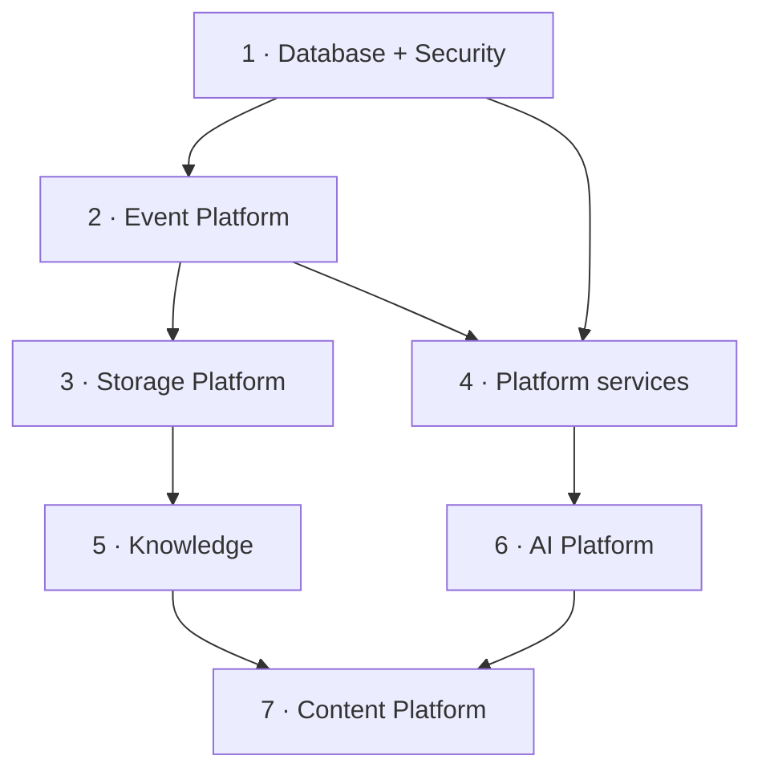

# Implementation Checklists

> **Status:** v1.0 — complete. Phase 11.
> **These checklists reference responsibilities; they never restate specifications.** Every item points at the document that owns it. A checklist that duplicated a spec would drift from it, and the drift would be invisible.

## Overview

**Purpose.** Provide a build sequence and a per-platform readiness checklist, plus the binding implementation rules for AI coding agents working in this repository.

**How to use these.** Each checklist is a gate, not a plan. An item is satisfied when the referenced document's requirement is met and verifiable — by a test, a conformance suite, or a metric — not when someone believes it is done.

---

# Part 1 — Rules for AI coding agents

**These rules are binding.** They apply to every agent-authored change and are enforced through the same gates as human-authored work. They replace the intent of the retired `claude-code-rules.md` placeholder.

## The source-of-truth rule

**Implement only what the architecture documents.** Phases 1–10 specify what the platform is. An agent's job is to produce code matching that specification — never to design the part that is missing.

| Situation | Correct action |
|---|---|
| The behaviour is specified | Implement it exactly |
| The behaviour is unspecified | **Stop. Ask.** Do not choose a default |
| The spec is ambiguous | **Stop. Ask.** Do not pick the likelier reading |
| The spec appears wrong | **Say so, then ask.** Do not work around it |
| The spec contradicts another document | **Report both.** Do not reconcile silently |

**Never invent missing behaviour.** An invented default becomes load-bearing within a week and is indistinguishable from a decision once it ships. The cost of asking is one message; the cost of a silently invented rule is an architecture nobody agreed to.

**Never resolve a contradiction by choosing.** Two documents disagreeing is a finding — report both and let the owner decide. Silently picking one leaves the other document wrong and nobody knowing.

**Report honestly when work is incomplete.** If part of a task could not be finished, say which part and why. A completion claim covering unfinished work is worse than a partial delivery.

## The change-process rule

**Architectural changes require an ADR, approved before implementation.**

| Change | Path |
|---|---|
| Behaviour inside an existing boundary | Ordinary PR |
| A new boundary, ownership, or dependency direction | **ADR first** |
| Anything contradicting an accepted ADR | **New ADR first** |
| A sixth RLS exception table | **ADR — the set is closed** |
| A new top-level directory or package layer | **ADR** |

**An agent never amends an ADR, never marks one accepted, and never treats a Proposed ADR as settled.** Where a decision is needed, record it in `99-open-questions.md` and ask.

## Invariants an agent must never break

**These are not preferences. Each is enforced somewhere, and code violating one is a defect regardless of whether tests pass.**

| Invariant | Source |
|---|---|
| **Tenant isolation** — `TenantContext` from identity and resource, never payload | `16-security/tenant-isolation.md` |
| **RLS** — every workspace-owned table has `tenant_id`, a policy, and an isolation test | `16-security/row-level-security.md` |
| **Default deny** — absence of a grant is a denial | `16-security/authorization.md` |
| **Immutable audit** — append-only, in the action's transaction | `16-security/audit.md` |
| **Secrets** — never in logs, events, audit records, prompts, or responses | `16-security/secrets-management.md` |
| **Event publication** — only through the transactional outbox | ADR-020 |
| **Event contracts** — registered, validated pre-commit, versioned additively | `13-event-platform/event-registry.md` |
| **AI egress** — model providers reached only through the AI Gateway | ADR-019 |
| **Guardrail blocks** — never retried, in any component | `13-event-platform/retry-engine.md` |
| **Object immutability** — a key is written once | `12-storage-platform/object-storage.md` |
| **Exactly-once effects** — handlers are idempotent | `13-event-platform/idempotency.md` |
| **API contracts** — frozen signatures change only via their owning document | `12-storage-platform/storage-apis.md` |

**An agent encountering a task that requires breaking one of these stops and reports it.** The task is wrong, or the invariant needs an ADR — and either way the answer is not to break it quietly.

## Working discipline

| Rule |
|---|
| Read the specifying document **before** writing code, not after |
| Cite the document in the PR description |
| Never disable, skip, or weaken a test to make a change pass |
| Never bypass a gate, add an exclusion, or mark a check advisory |
| Never commit a secret, a `.env`, or a credential-shaped value |
| Never add a TODO — raise the question instead |
| Update affected documentation in the same PR |
| Keep changes small and single-purpose |

**Never weaken a failing test.** A test failing on a change is doing its job. Deleting it, marking it skipped, loosening its assertion, or adding a lint exclusion converts a caught defect into a shipped one — and it is the single most damaging thing an agent can do in this repository.

**Never bypass a gate.** Coverage exclusions, `eslint-disable`, `@ts-expect-error`, and pipeline skips each require an explicit, reviewed justification. Their unexplained appearance in an agent-authored diff is a review-blocking finding.

## Definition of done

An agent-authored change is complete when **all** of these hold:

| Criterion |
|---|
| Behaviour matches the specifying document, cited in the PR |
| All CI gates pass — no exclusions added |
| Unit tests cover the logic; failure and denial paths included |
| New tables have `tenant_id`, a policy, and an isolation test |
| Errors are typed with stable codes and correct retryability |
| Nothing logged that must not be |
| Metric labels are bounded |
| Affected documentation is updated in the same PR |
| Uncertainties are stated in the PR description, not resolved silently |

---

# Part 2 — Build sequence

**Database and Security are built together and first.** Every other platform depends on `TenantContext` and RLS existing; building anything else first means retrofitting isolation into code written without it, which reliably misses cases.

**The Event Platform precedes everything that publishes.** Retrofitting the outbox means finding every direct publication path, and the ones that are missed are exactly the ones that lose events.

**Content is last** because it consumes AI, Knowledge, and Storage. Building it first produces mocks that then become the integration contract.

---

# Part 3 — Per-platform checklists

Each checklist covers ten dimensions. Items reference their owning document.

## Security Platform — `16-security/`

| Dimension | Items |
|---|---|
| **Architecture** | ADR-017 tenancy implemented; `TenantContext` immutable, three entry points only |
| **Database** | Five RLS exception tables and no more; `ENABLE` + `FORCE` on every other table; canonical policy with `USING` **and** `WITH CHECK`; `contentos_app` lacks `BYPASSRLS` and owns no tables |
| **Security** | Argon2id; refresh rotation with reuse detection; no wildcard permissions; audit append-only with revoked grants, trigger, and hash chain |
| **Observability** | Invariant board all-zero; cross-tenant, RLS violation, audit failure, and break-glass all page at count one |
| **Testing** | RLS conformance enumerates the schema; denial paths tested; exception count fails the build at six |
| **Deployment** | Policies ship in the table's own migration; conformance is a deploy gate |
| **Operational** | Break-glass procedure rehearsed; operator sessions page |
| **Failure scenarios** | Missing context returns zero rows; cross-tenant write rejected by `WITH CHECK`; failed audit write fails the action |
| **Post-deploy** | Conformance suite green; chain verification passes |
| **Documentation** | Any new exception recorded as an ADR |

## Event Platform — `13-event-platform/`

| Dimension | Items |
|---|---|
| **Architecture** | ADR-020 outbox implemented; `EventBus` swappable; `entryId` never persisted by consumers |
| **Database** | `outbox_events` with `publish_attempts`; partial pending index; `processed_events` partitioned monthly; DLQ and replay tables |
| **Security** | Payloads carry identifiers only; registration rejects credential patterns; consumers use the RLS-enforced role; context validated per delivery |
| **Observability** | Relay lag p95 < 2 s; consumer lag in **time**; ordering violations page; zero-consumer and zero-suppression silence alerts |
| **Testing** | Publisher requires `tx` by signature; idempotency proven under redelivery; ordering under retry, failover, and replay |
| **Deployment** | Relay reads the primary only; `WEB_CONCURRENCY` set for reconnect; grace window exceeds p99 handler duration |
| **Operational** | DLQ triage runbook; replay is privileged and audited |
| **Failure scenarios** | Poison row quarantined; budget exhaustion dead-letters rather than drops; cancellation never acks |
| **Post-deploy** | `worker_shutdown_abandoned_total` zero; no quarantined publish-side entries |
| **Documentation** | **ADR-020 still Proposed; ADR-027 and ADR-028 do not exist as records** |

## Storage Platform — `12-storage-platform/`

| Dimension | Items |
|---|---|
| **Architecture** | Sixteen frozen operations; `ObjectStoreDriver` with declared capabilities; no vendor SDK outside drivers |
| **Database** | `media_assets` with `reference_count`, `CHECK (>= 0)`, `deleted_at`, partial index; **zero schema changes** |
| **Security** | Tenant-prefixed server-constructed keys; presigned only; SSE-KMS on every write; keys never in responses |
| **Observability** | Checksum mismatches and dangling references page; verified backup age on the dashboard, not completion age |
| **Testing** | Conformance against real MinIO; declared capabilities proven; immutability via conditional write |
| **Deployment** | Buckets created and versioned; Object Lock on backups; multipart abort lifecycle rule |
| **Operational** | Restore testing weekly; DR drill quarterly; orphan approval is manual |
| **Failure scenarios** | Unscannable quarantined; failed derivation yields `Degraded`; purge blocked by refcount or hold |
| **Post-deploy** | Upload reaches `Available`; CDN hit ratio > 95%; invalidation verified |
| **Documentation** | Additive tables under ADR-027/028 |

## AI Platform — `08-ai-platform/`

| Dimension | Items |
|---|---|
| **Architecture** | ADR-019 Council with enforced diversity; all egress through the Gateway; AI Memory never a source of truth (ADR-026) |
| **Database** | `ai_call_costs`; memory tenant-scoped and RLS-protected |
| **Security** | **Secrets structurally excluded from the Context Builder**; output scanned for credential patterns; prompts never logged |
| **Observability** | Cost per tenant; guardrail block rate; provider latency and fallback |
| **Testing** | Guardrail blocks never retried; safety refusal never auto-falls-back; cost accounting exact |
| **Deployment** | Provider credentials from the secret store; no model named in configuration defaults |
| **Operational** | Budget alerts; provider outage degradation path |
| **Failure scenarios** | Validation failure retries; guardrail block terminal; refusal terminal |
| **Post-deploy** | Cost within envelope; no unexpected provider fallback |
| **Documentation** | `retry-strategy.md` is authoritative on refusal handling |

## Knowledge Platform — `11-knowledge-platform/`

| Dimension | Items |
|---|---|
| **Architecture** | Always the source of truth; retrieval prepares evidence only — Context Builder assembles the manifest |
| **Database** | Embeddings tenant-scoped; **every vector index leads with `tenant_id`**; derived data excluded from backup |
| **Security** | **Query-time tenant filtering, never post-filtering**; provenance integrity is an invariant breach |
| **Observability** | Foreign-tenant vector results must be zero; freshness and provenance integrity tracked |
| **Testing** | Cross-tenant retrieval returns nothing; merges preserve lineage |
| **Deployment** | Embedding backfill batched, resumable, tenant-scoped |
| **Operational** | Deduplication creates review candidates only — never auto-merges authoritative entities |
| **Failure scenarios** | Provider outage degrades retrieval, never fabricates evidence |
| **Post-deploy** | Retrieval latency within SLO; zero foreign-tenant results |
| **Documentation** | Derived versus authoritative never blurred |

## Content Platform — `05-content-platform/`

| Dimension | Items |
|---|---|
| **Architecture** | No engine calls another's database, defines its own scoring, calls providers directly, or bypasses the bus |
| **Database** | `media_specs.asset_ref` nullable per ADR-018; revisions immutable |
| **Security** | Fetched pages treated as untrusted; grounding invariant enforced by CHECK constraint |
| **Observability** | Gate verdicts `pass`/`soft-warn`/`block`; per-stage latency |
| **Testing** | Scores conform to ADR-021 — integer 0–100, one producer per category; citations resolve |
| **Deployment** | Temporal workflows versioned; activities idempotent on `(workflow_id, step)` |
| **Operational** | Run recovery after worker loss; human-wait steps |
| **Failure scenarios** | Engine failure fails the run cleanly; no partial publication |
| **Post-deploy** | End-to-end run completes; quality gates fire |
| **Documentation** | ADR-018 media split respected |

## Platform Services — `04-platform/`

| Dimension | Items |
|---|---|
| **Architecture** | Never calls models, contains SEO or content logic, or bypasses the bus |
| **Database** | `credit_holds` and ledger with atomic charging; `audit_log` |
| **Security** | Stripe tokenizes in-browser — **no PAN ever reaches the platform**; webhooks signed with replay protection |
| **Observability** | Credit balance, rate-limit rejections, notification delivery |
| **Testing** | Atomic charge under concurrency; 402 on exhaustion; idempotent webhooks |
| **Deployment** | Stripe webhook endpoint registered; rate-limit values per plan |
| **Operational** | Credit reconciliation; billing dispute path |
| **Failure scenarios** | Provider outage does not double-charge; hold released on failure |
| **Post-deploy** | Ledger reconciles; limits enforced |
| **Documentation** | Entitlements distinct from permissions |

---

## Cross-platform pre-launch gates

**All must pass before production traffic.**

| Gate |
|---|
| RLS conformance green; exactly five exception tables |
| Invariant board all-zero across every platform |
| Verified backup age within window; restore test passed |
| DR drill completed with measured RTO/RPO |
| Every registered consumer group has a heartbeating worker |
| Secret rotation current; no break-glass credentials outstanding |
| Threat-model detection coverage at 100% |
| Every frozen interface has a signature test |
| **Every Proposed ADR either accepted or explicitly accepted-as-risk** |

**The last gate is the one currently outstanding.** ADR-020 remains Proposed beneath the Event, Security, and Storage platforms, and ADR-027 and ADR-028 are referenced across three phases without existing as records (`01-system-architecture/13-adr-log.md`).

## Cross references

- `code-review.md` — the human gate applying these rules
- `ci-cd.md` — the automated gates
- `migration-guide.md` — schema and contract evolution
- `coding-standards.md` · `project-structure.md` — the conventions and boundaries
- `01-system-architecture/13-adr-log.md` — **the only path to architectural change**
- `99-open-questions.md` — where an agent records uncertainty
- `04-platform/` · `05-content-platform/` · `08-ai-platform/` · `11-knowledge-platform/` · `12-storage-platform/` · `13-event-platform/` · `16-security/` — the specifications these checklists gate against
- `10-testing/testing-strategy.md` — coverage and the gate contract
- `14-operations/` — operational readiness
