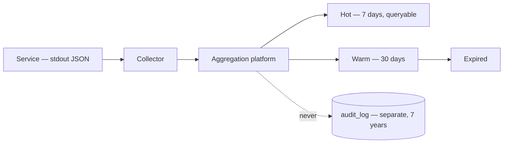
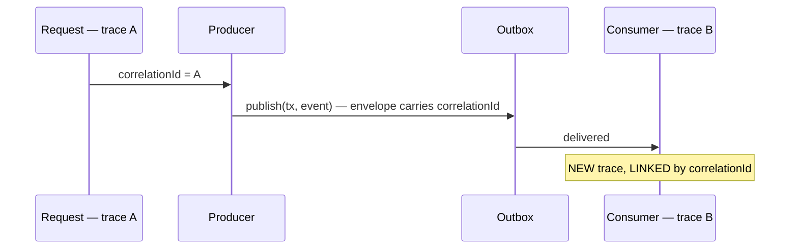

# Logging Guide

> **Status:** v1.0 — complete. Phase 11.
> **Logs are operational and expendable. Audit is evidence and is not.** Conflating them produces either an audit trail that gets sampled away or a log volume nobody can afford — and the fix for each is the opposite of the fix for the other.

## Overview

**Purpose.** Define the structured log schema, required fields, severity semantics, redaction, sampling, and retention.

**The boundary, stated once.** `16-security/audit.md` established three distinct streams — operational logs, metrics, and audit records — with different write paths, retention, and loss tolerance. **This document owns operational logs only.** Audit records are written synchronously inside the action's transaction, are never sampled, and are retained seven years. Nothing here changes that.

| | **Logs** | **Audit** |
|---|---|---|
| Written | Async, fire-and-forget | **Synchronously, in the transaction** |
| Sampled | Yes, at debug | **Never** |
| Retention | 30 days | **7 years** |
| Loss tolerance | Acceptable | **Zero** |
| Audience | Engineers | Auditors, courts, customers |

**A security-relevant action that is only logged is not audited.** If it belongs in `16-security/audit.md`'s event list, it goes to `audit_log` — logging it as well is optional and adds nothing evidentiary.

## Structured only

**No string interpolation. No free-text messages carrying data. [lint]**

```ts
// wrong — unparseable, unsearchable, and it embeds a tenant id in prose
logger.info(`Upload failed for tenant ${tenantId}: ${err.message}`);

// right
logger.error({
  event: 'upload.failed',
  tenantId,
  objectId,
  code: err.code,
  correlationId,
});
```

**Interpolated logs cannot be queried, aggregated, or alerted on.** Finding "all upload failures for this tenant" across a string-formatted log requires a regex that breaks the first time the wording changes.

**A lint rule rejects template literals and concatenation in log calls.** The message field, where one exists, is a **static string** — the variable parts are fields.

## The log record

```ts
interface LogRecord {
  // — always present —
  readonly timestamp: string;          // ISO 8601 UTC
  readonly level: LogLevel;
  readonly event: string;              // dot.namespaced, e.g. 'outbox.relay.claimed'
  readonly service: string;
  readonly version: string;            // build identity
  readonly correlationId: string;

  // — present when known —
  readonly tenantId?: string;
  readonly organizationId?: string;
  readonly actorId?: string;
  readonly requestId?: string;
  readonly eventId?: string;
  readonly objectId?: string;
  readonly operationId?: string;
  readonly auditId?: string;

  // — outcome —
  readonly outcome?: 'success' | 'failure' | 'denied' | 'suppressed';
  readonly durationMs?: number;
  readonly code?: string;              // stable error code
  readonly detail?: string;            // sanitised

  readonly traceId?: string;
  readonly spanId?: string;
}
```

**`event` is a dot-namespaced identifier, not a sentence.** `outbox.relay.claimed`, `upload.scan.quarantined`, `authz.denied`. It is the primary aggregation key, and a stable identifier makes a dashboard possible where a sentence does not.

**`correlationId` is mandatory on every record.** A log line that cannot be tied back to the request that produced it is nearly useless during an incident, and it is the pivot the whole platform is built around (`16-security/audit.md`).

**`tenantId` is a log field and never a metric label.** Per-tenant cardinality would multiply every time series by the customer count; per-tenant analysis happens here, on demand (`16-security/security-observability.md`).

**`detail` carries a classification and a sanitised message, never raw provider or database output** (`error-handling.md`).

## Levels

| Level | Means | Retention | Sampled |
|---|---|---|---|
| `error` | Something failed and needs attention | 30 days | **Never** |
| `warn` | Degraded, self-healing, or approaching a limit | 30 days | Never |
| `info` | A significant state change | 30 days | **Head-sampled under load** |
| `debug` | Diagnostic detail | **7 days** | Aggressively |

**`error` is for failures a human should see.** A validation rejection is `info` with `outcome: 'failure'` — the system worked correctly and refused bad input. Logging it as `error` trains people to ignore the error stream, which is the failure mode that matters.

**A caught-and-handled transient failure is `warn`, not `error`.** The retry succeeded; nothing is broken. It is worth counting, not worth paging.

**`fatal` does not exist.** A process that cannot continue logs at `error` and exits non-zero; a separate level implies a distinction nothing acts on.

**Suppressed duplicates log at `debug`.** They are the idempotency mechanism working correctly, and logging them as errors would train operators to ignore a stream that occasionally matters. A *spike* is what escalates (`13-event-platform/idempotency.md`).

## Redaction

**Redaction is by allowlisted output, never by blocklisted input.**

```ts
const REQUEST_LOG_FIELDS = ['method', 'route', 'status', 'durationMs'] as const;
// anything not listed does not appear
```

**A blocklist fails on the first field nobody thought of.** A list containing `password` and `apiKey` misses `apiToken`, `secretValue`, and `authorization` the day someone adds them. An allowlist means a new field is invisible until deliberately included — the safe direction for the default.

**Three layers, because any one can be bypassed:**

| Layer | Mechanism |
|---|---|
| **Type** | `SecretValue.toString()` and `.toJSON()` return `[REDACTED]` |
| **Serializer** | Allowlisted field projection |
| **Pipeline** | Pattern scan for credential shapes as a backstop |

**The type-level control is the strongest and cheapest.** Template interpolation and `JSON.stringify` are how secrets actually reach logs — not through anyone deciding to log one — and both call those methods (`16-security/secrets-management.md`).

**Never logged, at any level, in any environment:**

| Category | Examples |
|---|---|
| Credentials | Passwords, API keys, tokens, refresh tokens, session ids |
| **Presigned URLs** | Bearer credentials for their lifetime (`12-storage-platform/cdn.md`) |
| Headers | `Authorization`, `Cookie`, `X-API-Key` |
| Payloads | Request bodies, event payloads, model prompts and completions |
| **Storage keys** | Leak tenant id and internal layout — log the **hash** |
| Encryption material | Key bytes, wrapped or plaintext |
| Threat signatures | Would let an uploader iterate against the scanner |

**Personal data is logged only where explicitly permitted.** `actorId` and `tenantId` are opaque identifiers and are always permitted. Email addresses, names, and IP addresses are logged only where a documented purpose requires them, and they are the fields that make erasure hard — which is why audit records avoid them entirely (`16-security/compliance.md`).

**Model prompts and completions are never logged.** A prompt may contain a customer's unpublished content, and a completion may contain injected instructions from a fetched page (`16-security/threat-model.md`, T-14).

## Sampling

| Level | Policy |
|---|---|
| `error`, `warn` | **Never sampled** |
| `info` | Head-sampled above a volume threshold; a representative floor always kept |
| `debug` | Aggressively sampled; off by default in production |
| **Anything with an invariant-breach code** | **Never sampled** |

**Invariant breaches bypass sampling entirely.** A cross-tenant violation dropped by a 1% sampler is a correctness incident with no record, at the moment the record matters most (`16-security/security-observability.md`).

**Sampling is head-based and decided once per trace**, so a sampled request keeps all its records rather than a random subset — a partial trace is worse than none, because it looks complete.

**Debug logging is enabled per tenant or per correlation for a bounded window**, not globally. Flipping debug on platform-wide during an incident multiplies volume at the moment the pipeline is already stressed.

## Aggregation and retention



**Services write JSON to stdout and nothing else.** No file handling, no rotation, no direct shipping. The collector owns delivery, and a service that writes files acquires disk management, rotation bugs, and a failure mode where a full disk takes down the application.

**Log delivery failure never blocks the application.** Logs are fire-and-forget by design; blocking a request because a log could not ship inverts the priority. Audit is the opposite — a failed audit write fails the action (`16-security/audit.md`).

**Retention is 30 days, and it is shorter than DLQ residency deliberately.** A dead-lettered event may sit for weeks, so its retry history is captured on the DLQ record rather than reconstructed from logs that will have expired (`13-event-platform/dead-letter-queue.md`).

## Correlation across boundaries



**`correlationId` crosses the async boundary in the event envelope**, which is why it is a mandatory, non-nullable envelope field (`13-event-platform/event-apis.md`).

**Consumers start a new trace and link rather than extending the producer's.** A single request can cause hundreds of downstream events over hours; one continuous trace would be unreadable and would hold the originating span open (`13-event-platform/observability.md`).

**Logs, traces, and audit records share `correlationId`**, which is what makes a single query reconstruct an incident across all three.

## Writing good log events

| Rule | Reason |
|---|---|
| Log **decisions and state changes**, not control flow | "Entering function" is noise |
| One record per operation outcome, not per step | Volume without information |
| Include `durationMs` on anything with a duration | Latency analysis needs no extra instrumentation |
| Name events by what happened, past tense | Matches the event-type convention |
| Never log inside a tight loop | One line per item at 10⁶ items is an outage |
| Log **before** a risky operation and **after** its outcome | A missing "after" localises a hang |

**"Log decisions, not control flow" is the rule that keeps volume affordable.** A retry decision, a guardrail block, an authorization denial, a state transition — each is a fact worth keeping. Function entry and exit are already in the trace.

**Errors are logged once, at the boundary where they are handled.** Logging at every level as an error propagates produces five records for one failure, all with the same `correlationId`, and inflates the error rate fivefold (`error-handling.md`).

## Business rules

1. **Structured only.** No interpolation, no data in message strings.
2. **`event` is a dot-namespaced stable identifier.**
3. **`correlationId` is mandatory on every record.**
4. **`tenantId` is a log field, never a metric label.**
5. **Redaction is allowlist-based**, reinforced by type-level and pipeline controls.
6. **Never log credentials, tokens, presigned URLs, payloads, prompts, keys, or storage keys.**
7. **Personal data only where explicitly permitted.**
8. **`error` means a human should look**; handled transients are `warn`, refusals are `info`.
9. **`fatal` does not exist.**
10. **`error` and `warn` are never sampled**; invariant breaches never sampled.
11. **Sampling is head-based**, decided once per trace.
12. **Debug is enabled per tenant or correlation**, never globally.
13. **Services write JSON to stdout only.**
14. **Log delivery never blocks the application.**
15. **Retention is 30 days**; audit is separate and seven years.
16. **Errors are logged once, at the handling boundary.**
17. **Logs are operational; audit is authoritative.**

## Implementation

```ts
interface Logger {
  error(record: LogRecord & { code: string }): void;
  warn(record: LogRecord): void;
  info(record: LogRecord): void;
  debug(record: LogRecord): void;
  child(bindings: Partial<LogRecord>): Logger;
}
```

**There is no `log(level, message)` and no variadic form.** The signature accepts a structured record, so an interpolated string cannot be passed — the same make-it-unrepresentable technique used for the transaction-bound publisher (`13-event-platform/transactional-outbox.md`).

**`error` requires a `code`. [type]** An error logged without a stable code cannot be aggregated or alerted on (`error-handling.md`).

**`child()` binds context once per scope** — request handler, event delivery, job run — so `correlationId` and `tenantId` are attached automatically rather than passed to every call and forgotten on one.

## Observability

- **Metrics:** `log_records_total{level,service}`, `log_sampling_dropped_total{level}`, `log_delivery_failures_total`, `redaction_pattern_hits_total` (**should be zero**), `log_volume_bytes_total{service}`.
- **Alerts:** `redaction_pattern_hits_total` non-zero (**page** — a credential-shaped value reached the pipeline and the earlier layers failed); `log_delivery_failures_total` sustained (visibility is degraded, which is not the same as the platform being healthy); log volume spike (a loop is logging, or an incident is under way); `error` rate above baseline.

**The redaction backstop firing is itself the alert.** It means the type-level and serializer controls did not catch something, and the pattern scan is the last layer.

## Cross references

- `16-security/audit.md` — **the authoritative record; three-stream distinction**
- `16-security/secrets-management.md` — `SecretValue` redaction, never-log rules
- `16-security/security-observability.md` — invariant breaches, cardinality discipline
- `16-security/compliance.md` — personal data and erasure implications
- `error-handling.md` — stable codes, sanitised `detail`, log-once discipline
- `coding-standards.md` — the no-interpolation lint rule
- `configuration.md` — log level configuration
- `13-event-platform/observability.md` — trace linking across the async boundary
- `13-event-platform/event-apis.md` — `correlationId` in the envelope
- `12-storage-platform/storage-observability.md` — the four storage identifiers
- `14-operations/monitoring.md` — aggregation infrastructure
