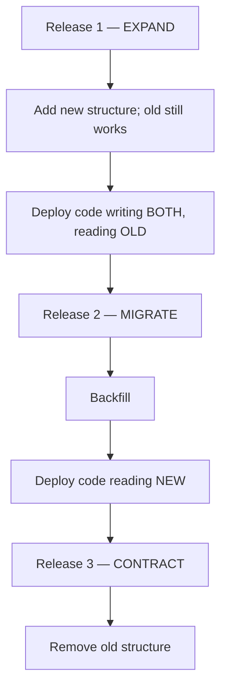
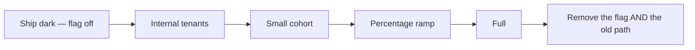
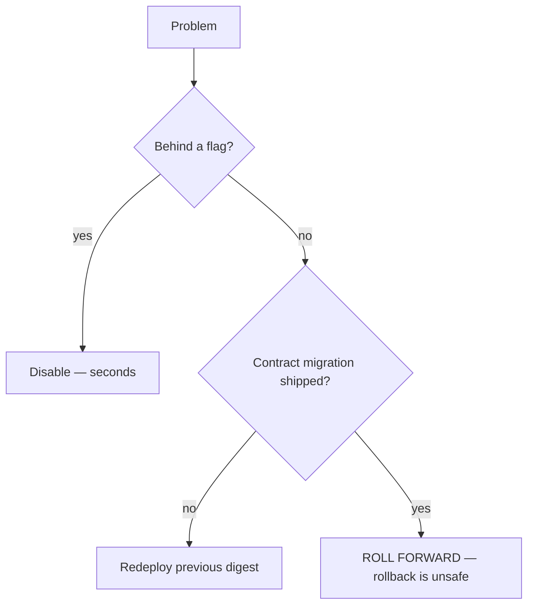

# Migration Guide

> **Status:** v1.0 — complete. Phase 11.
> **Every migration must be survivable by the code already running.** During a rolling deploy, old and new code hit one database simultaneously. A migration the old code cannot tolerate is an outage produced by the deployment mechanism itself.

## Overview

**Purpose.** Define the process for every kind of migration — schema, data, configuration, event version, API, storage, security — with backward compatibility as the organizing constraint.

**The boundary.** `03-database/migrations.md` owns migration *mechanics*: Drizzle Kit, file format, how a migration is written and applied. **This document owns the process**: sequencing, compatibility rules, rollout, validation, and the non-schema migration types. Neither restates the other.

**One rule governs all seven types.** A change ships in two or more releases: first make the new shape possible, then move to it, then remove the old. Compressing that into one release is what makes rollback impossible.

## Expand / contract



| Phase | Ships | Reversible |
|---|---|---|
| **Expand** | Additive only — new columns, tables, indexes | ✅ Drop the addition |
| **Migrate** | Backfill; reads switch to the new shape | ✅ Switch reads back |
| **Contract** | Remove the old structure | ❌ **Forward only** |

**Contract never ships with the code that stopped using the old structure.** If that release rolls back, the structure is already gone and the rolled-back code fails against a schema it cannot use. Contract waits until the new code is confirmed stable and rollback is no longer plausible — typically a release later, sometimes several.

**This is the rule the brief states as "no destructive schema changes in the same release that removes application usage,"** and it is enforced in CI by running the previous release's test suite against the new schema (`ci-cd.md`).

## Prohibited in a single migration

| Change | Breaks | Correct form |
|---|---|---|
| Add `NOT NULL` without a default | Old inserts omitting it | Add nullable → backfill → add constraint |
| **Rename a column** | Old code reads the old name | Add new → dual-write → backfill → switch reads → drop |
| Drop a referenced column | Old code immediately | Stop reading → release → drop |
| Change a column type | Old code's expectations | Add new column → convert → switch → drop |
| Add `UNIQUE` unverified | Fails mid-migration on duplicates | Verify uniqueness → add concurrently |
| Non-concurrent index on a large table | **Locks writes** | `CREATE INDEX CONCURRENTLY` |

**A rename is expand/contract in disguise**, and it is the change most often attempted as a one-liner. `ALTER TABLE ... RENAME COLUMN` is atomic in the database and catastrophic across a rolling fleet — every old instance breaks the instant it commits.

**Index builds run concurrently and outside the deploy.** A non-concurrent build takes an `ACCESS EXCLUSIVE` lock; on a 10⁸-row table that is a write outage for hours (`03-database/migrations.md`).

## Data migrations

**Data migrations are background work, never part of a deploy.**

```ts
interface BackfillJob {
  readonly name: string;
  readonly batchSize: number;          // 1,000 typical
  readonly checkpoint: string | null;  // resumable
  readonly tenantScoped: boolean;      // per-tenant iteration
}
```

| Property | Rule |
|---|---|
| **Batched** | Bounded batches, never one statement over the table |
| **Resumable** | Checkpointed; interruption resumes rather than restarts |
| **Idempotent** | Re-running a batch is safe |
| **Rate-limited** | Yields to production traffic |
| **Tenant-scoped** | Iterates tenant by tenant, context set per iteration |
| **Observable** | Progress, rate, and ETA reported |

**A single `UPDATE` over a 10⁸-row table is never acceptable.** It holds a transaction for hours, generates enormous WAL, blocks vacuum, and cannot be interrupted without losing all progress. Batched updates with checkpoints complete in the same total time and can be paused.

**Cross-tenant backfills iterate tenant by tenant with `TenantContext` set per iteration**, using the RLS-enforced role — never a single cross-tenant statement, which would require a privileged role and defeat the isolation model (`16-security/tenant-isolation.md`, `13-event-platform/workers.md`).

**Backfills are idempotent because they will be re-run.** A `WHERE new_column IS NULL` predicate makes re-running a batch a no-op, which is what allows a stalled backfill to be resumed without reasoning about what completed.

**A backfill is complete only when verified**: a count of remaining unmigrated rows reaching zero, not the job reporting success.

## Configuration migrations

| Change | Process |
|---|---|
| Add a value with a safe default | Ship the default first; set it after |
| Add a required value | **Set it in every environment before the code requires it** |
| Rename a key | Accept both for one release; then drop the old |
| Remove a value | Stop reading it; then remove from environments |
| Change a default | Treat as a behaviour change — flag it |

**Required values are set before the code requiring them deploys.** Configuration is validated at startup and an invalid config exits non-zero, so a missing required value is a failed rollout across every instance simultaneously (`configuration.md`).

**Changing a default is a behaviour change and goes behind a flag**, because a default silently alters behaviour for every deployment that never set the value explicitly.

## Feature flag rollouts



**The old path stays live until the flag is removed.** A flag whose off-branch was deleted is not a rollback mechanism — it is a comment.

**Flag removal is scheduled at creation** (`configuration.md`). A codebase of stale flags has a combinatorial number of paths, and only one of them is tested.

**Flags never gate security controls.** There is no flag disabling RLS, skipping authorization, or bypassing audit (`16-security/`).

## Event version migrations

**Governed entirely by `13-event-platform/versioning.md`. The process view:**

| Change | Deploy order |
|---|---|
| **Compatible** — new version | **Producer first**; consumers downcast and follow at their own pace |
| **Breaking** — new event type | **Consumers first**; producer dual-publishes; migrate groups one at a time; retire |

**Compatible and breaking changes deploy in opposite orders**, which is the detail most easily got wrong. A compatible change is safe producer-first because downcast transforms keep old consumers working. A breaking change requires consumers to exist *before* the new type is published, or events are dead-lettered.

**Dual publication is atomic** — both types in one transaction with the state change (`13-event-platform/transactional-outbox.md`) — and **no consumer group may subscribe to both a type and its successor**, which is what prevents dual publication from doubling effects.

**A version cannot be retired while outbox retention still holds events of it.** Retiring early makes those events permanently unreplayable, and the failure surfaces weeks later during an incident (`13-event-platform/replay.md`).

## API migrations

| Change | Handling |
|---|---|
| Add an optional field | Compatible; ship it |
| Add a required request field | **Breaking** — new version |
| Remove or rename a response field | **Breaking** — new version |
| Change a field's meaning | **Breaking** — and invisible to every automated check |
| Change an error code's meaning | **Breaking** — codes are contract (`error-handling.md`) |

**Versions are additive; a retired version returns `410 Gone`, never a silent fallback to the current one.** Routing a v1 call to v2 applies v2 semantics — including authorization semantics — to a client expecting v1 (`16-security/api-security.md`).

**Security fixes are backported to every supported version.** An unpatched old version is an open door, and clients pinned to it have no signal.

## Storage evolution

| Change | Process |
|---|---|
| New derivation variant | New `transformId`; derive lazily; old variants stay valid |
| Transform algorithm change | **Bump the transform version** — new ids, no migration |
| New storage provider | Dual-write → backfill → **verify every checksum** → switch reads |
| Object key layout change | Only via `move`; `objectId` is stable so references survive |
| Encryption algorithm change | New `algorithm_id`; **decrypt support ships before encrypt** |

**Transform version bumps require no migration at all**, because `transformId` is a hash of the spec including its version. New derivations are produced going forward; existing ones remain valid and referenced until something regenerates them (`12-storage-platform/media-processing.md`).

**Provider migration verifies every object's checksum, not a sample.** A migration that silently dropped objects surfaces months later as unrenderable media with no record of what was lost (`12-storage-platform/storage-abstraction.md`).

**Encryption changes ship decrypt support before encrypt.** Writing ciphertext an older instance cannot decrypt during a rolling deploy causes read failures for the overlap — the same expand/contract discipline applied to cryptography (`16-security/encryption.md`).

## Security migrations

**The highest-risk category, because the failure mode is silent.**

| Change | Process |
|---|---|
| **New table** | RLS policy in the **same migration** that creates it |
| RLS policy change | Verify with the conformance suite before and after |
| New permission | Additive; grant explicitly — no wildcard, no implication |
| Role change | Additive first; remove after verifying nothing depends on it |
| **Key rotation** | KEK re-wraps DEKs; DEK rotation is lazy |
| Secret rotation | Overlapping validity; verify adoption before revoking |
| **RLS exception** | **Requires an ADR** — the set is closed at five tables |

**A table created in one migration and secured in a later one is unprotected in production for the interval between deploys** — however brief that interval is (`16-security/row-level-security.md`).

**Every RLS change runs the conformance suite before and after.** It enumerates the schema and verifies `ENABLE` plus `FORCE`, the canonical policy shape, and an exception count of exactly five. A sixth exception fails the build.

**Permission removal is separated from permission addition by a release**, because removing a permission someone's role still depends on locks them out with no warning.

## Rollback



**Migrations are never rolled back; they are rolled forward.** A "down" migration is a new migration written under pressure against a schema that may already contain new data. Expand and migrate phases are reversible *by deploying the previous code*, because the schema still supports it — which is the entire reason for the phasing.

**Down migrations are not written.** Their existence implies a rollback path that is unsafe to take, and the safety comes from the phase discipline instead.

**Every deploy records its rollback target before starting** (`deployment-guide.md`).

## Validation

**Automated in CI. [CI]**

| Check | Verifies |
|---|---|
| Applies cleanly | Against a restored production-shaped schema |
| **Backward compatible** | **Previous release's tests pass against the new schema** |
| Forward compatible | Where required, new code works against the old schema |
| Duration estimated | Against production-scale row counts |
| Destructive-change detector | Flags drops, renames, type changes, `NOT NULL` additions |
| RLS conformance | Every table has `tenant_id`, policy, isolation test |
| Reversibility declared | Explicit; no ambiguity |

**The previous-release test run is the check that makes the whole discipline enforceable.** Everything else in this document is a rule; that job is a gate.

**The destructive-change detector blocks by default and requires an explicit acknowledgement** naming the release in which usage was removed. That turns "did we already stop using this?" from a memory question into a recorded claim.

## Business rules

1. **Backward compatibility first**; every migration is survivable by deployed code.
2. **Expand before deploy; contract in a later, separate release.**
3. **Contract never ships with the code that stopped using the structure.**
4. **Renames are always expand/contract.**
5. **Index builds are concurrent and outside the deploy.**
6. **Data migrations are batched, resumable, idempotent, rate-limited, and tenant-scoped.**
7. **A backfill is complete only when verified by count.**
8. **Required configuration is set before the code requiring it deploys.**
9. **The old path stays live until its flag is removed.**
10. **Compatible event changes deploy producer-first; breaking changes consumer-first.**
11. **A version is not retired while outbox retention holds its events.**
12. **Retired API versions return `410`, never a silent fallback.**
13. **RLS policies ship in the same migration as the table.**
14. **A sixth RLS exception requires an ADR.**
15. **Down migrations are not written**; rollback is by phase discipline.
16. **Migration validation is automated and blocking.**
17. **Destructive changes require an explicit acknowledgement.**

## Checklist per migration

| Step |
|---|
| Which phase — expand, migrate, or contract? |
| Does the previous release's code still work? |
| Is a backfill needed — batched, resumable, tenant-scoped? |
| Is the duration estimated at production scale? |
| Are indexes built concurrently? |
| For a new table: RLS policy and isolation test in the same migration? |
| Is the reverse path a code rollback, or is this forward-only? |
| Are dependent event, API, or storage migrations sequenced? |
| Is the destructive-change acknowledgement recorded? |

## Observability

- **Metrics:** `migrations_applied_total{phase,outcome}`, `migration_duration_seconds`, `backfill_progress_ratio{job}`, `backfill_remaining_rows{job}` (gauge), `destructive_changes_flagged_total`, `rls_conformance_failures_total`, `stale_flags_total`.
- **Alerts:** migration exceeding its estimated duration (**page** — it may be locking); `backfill_remaining_rows` flat while the job reports running (stalled silently); `rls_conformance_failures_total` non-zero (**page** — a table may be unprotected); a contract migration proposed in the same release as its usage removal (blocked at review).

**A stalled backfill is the failure with no error.** The job reports healthy, rows stop moving, and the migration is quietly incomplete until someone checks the count.

## Cross references

- `03-database/migrations.md` — **migration mechanics, Drizzle Kit, index building**
- `deployment-guide.md` — migration ordering within a deploy; rollback
- `ci-cd.md` — the automated validation gates
- `configuration.md` — configuration values and startup validation
- `code-review.md` — the migration review path
- `13-event-platform/versioning.md` — event compatibility and deploy ordering
- `13-event-platform/replay.md` — why retirement waits for retention
- `12-storage-platform/media-processing.md` — transform versioning
- `12-storage-platform/storage-abstraction.md` — provider migration
- `16-security/row-level-security.md` — policy migrations, the closed exception set
- `16-security/encryption.md` — key rotation and algorithm agility
- `16-security/secrets-management.md` — secret rotation with overlap
- `16-security/api-security.md` — API version retirement
