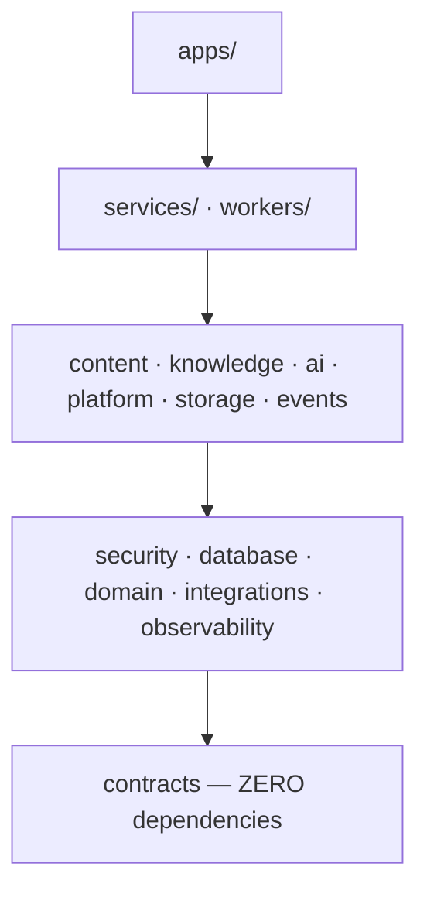
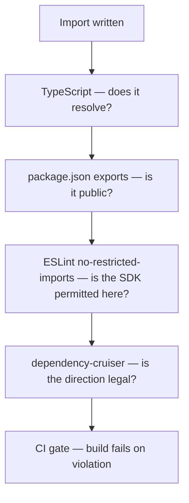

# Project Structure

> **Status:** v1.0 — complete. Phase 11. **Frozen.**
> **The layout mirrors the architecture, and the import graph enforces it.** A package that could import anything would, within a quarter, and the boundaries decided across ten phases would exist only in documentation.

## Overview

**Purpose.** Freeze the repository layout, map every package to the architecture folder that specifies it, and define the import direction that keeps layering real rather than aspirational.

**The rule that makes this document worth having.** Architectural boundaries survive exactly as long as something mechanically prevents crossing them. `dependency-cruiser` rules and `no-restricted-imports` are that mechanism; the layout below is what they are configured against.

**Adding a top-level directory or a new package layer is an architectural change** and requires an ADR. Adding a package inside an existing layer is ordinary work.

## Canonical layout

```
contentos/
├── apps/
│   ├── web/                    # Next.js App Router — customer application
│   └── admin/                  # operator console
├── services/
│   └── api/                    # NestJS HTTP API — the only inbound surface
├── workers/
│   └── host/                   # generic worker binary; handler sets by config
├── packages/
│   ├── contracts/              # events, scoring contract, shared types — ZERO deps
│   ├── domain/                 # domain model, invariants, value objects
│   ├── database/               # Drizzle schema, migrations, RLS policies
│   ├── security/               # authn, authz, tenant context, audit
│   ├── events/                 # outbox, bus, consumers, retry, replay
│   ├── storage/                # object storage, drivers, media pipeline
│   ├── platform/               # billing, rate limiting, notifications, jobs
│   ├── ai/                     # gateway, providers, guardrails, memory
│   ├── knowledge/              # evidence, entities, retrieval, provenance
│   ├── content/                # planning, research, writing, review engines
│   ├── integrations/           # provider SDK adapters — ONLY place SDKs appear
│   └── observability/          # tracing, metrics, structured logging
├── infrastructure/             # IaC, container definitions, environment config
├── scripts/                    # operational and development scripts
├── tests/                      # cross-cutting suites: e2e, conformance, load
└── docs/                       # contentos-docs — this tree
```

**Package-to-architecture mapping is one-to-one and deliberate.** Anyone reading `12-storage-platform/` knows the code is in `packages/storage`; anyone in `packages/knowledge` knows the specification is `11-knowledge-platform/`.

| Package | Specified by |
|---|---|
| `contracts` | `13-event-platform/event-apis.md`, `01-system-architecture/14-scoring-contract.md` |
| `domain` | `02-domain-design/` |
| `database` | `03-database/` |
| `security` | `16-security/` |
| `events` | `13-event-platform/` |
| `storage` | `12-storage-platform/` |
| `platform` | `04-platform/` |
| `ai` | `08-ai-platform/` |
| `knowledge` | `11-knowledge-platform/` |
| `content` | `05-content-platform/` |
| `integrations` | `09-integrations/` |
| `observability` | `14-operations/monitoring.md` |

## Why `services/` and `workers/` are separate

**A worker is a different runtime shape, not a different service.** The API is request-scoped, latency-sensitive, and horizontally scaled on request volume. A worker is queue-driven, throughput-oriented, and scaled on backlog depth. They share every package and share no lifecycle (`13-event-platform/workers.md`).

**There is exactly one worker binary.** `workers/host` hosts any set of registered handlers, selected by configuration — there is no "analytics worker" program distinct from an "embedding worker" program. That keeps deployment uniform and makes rebalancing a config change rather than a build.

**`services/api` is the only inbound network surface.** Nothing else accepts external traffic. Adding a second would multiply the authentication, rate limiting, and validation pipeline that `16-security/api-security.md` specifies once.

## Import direction



**Imports flow downward only. [lint]** Every arrow above is permitted; every reverse arrow is a build failure.

| Layer | May import | May never import |
|---|---|---|
| `apps/` | services, feature, core, contracts | Another app |
| `services/`, `workers/` | feature, core, contracts | **apps** |
| Feature packages | core, contracts, **other feature packages via contracts only** | apps, services |
| Core packages | contracts, other core packages | apps, services, **feature** |
| `contracts` | **Nothing** | **Everything** |

**`contracts` having zero dependencies is what makes it usable everywhere.** It holds the event envelope, the scoring contract, and shared identifier types — imported by every layer including the browser bundle. One dependency on `database` would pull Drizzle into the frontend build.

**Feature packages do not import each other's internals.** `content` needs AI capability, so it imports the AI Gateway's *interface* from `contracts` and receives an implementation by injection. It never reaches into `packages/ai/src/providers`. This is the code expression of "no engine may call another engine's database" (`05-content-platform/`).

**Core packages never import feature packages.** `security` cannot depend on `content`, because a security control that depended on a domain engine would invert the layering that makes it universally applicable.

## Banned imports

**These are the boundaries where a violation is an architectural breach, not a style issue. [lint]**

| Import | Permitted only in | Rationale |
|---|---|---|
| `@aws-sdk/*`, R2/S3 clients | `packages/storage/src/drivers/**` | `12-storage-platform/storage-abstraction.md` |
| Model provider SDKs, OpenRouter | `packages/ai/src/providers/**` | Only the AI Gateway calls models — ADR-019 |
| DataForSEO, Firecrawl, Exa clients | `packages/integrations/**` | Provider Layer boundary |
| Stripe SDK | `packages/platform/src/billing/**` | Billing owns payment |
| `drizzle-orm` | `packages/database/**` | One schema owner |
| `ioredis` | `packages/platform/src/cache/**`, `packages/events/**` | Tenant-scoped cache API only |
| Raw `fetch` to customer-supplied URLs | `packages/integrations/src/safe-fetch/**` | SSRF chokepoint — `16-security/api-security.md` |

**The `SafeUrlFetcher` restriction is the most security-critical entry.** ContentOS fetches competitor pages and customer-configured CMS endpoints by design; a single audited chokepoint is what makes the SSRF controls verifiable. Scattered `fetch` calls cannot be reviewed, and the lint rule is what keeps them from appearing.

**Raw Redis access is restricted because cache keys must be tenant-prefixed.** A direct `ioredis` call bypasses `TenantScopedCache`, and an unprefixed key is shared state between tenants — a cross-tenant leak that never touches the database and therefore never touches RLS (`16-security/tenant-isolation.md`).

## Package internal structure

```
packages/<name>/
├── src/
│   ├── index.ts          # THE public surface — the only barrel
│   ├── <feature>/
│   │   ├── <thing>.ts
│   │   ├── <thing>.test.ts
│   │   └── internal/     # not exported from index.ts
│   └── types.ts
├── package.json
├── tsconfig.json
└── README.md             # what this package owns + its spec document
```

**`index.ts` is the only barrel file and defines the entire public surface. [lint]** Anything not exported there is internal, and `exports` in `package.json` blocks deep imports so `import { thing } from '@contentos/storage/src/internal/thing'` fails to resolve.

**Every package README names the architecture document that specifies it.** A developer or agent opening `packages/events` should reach `13-event-platform/` in one hop rather than searching.

**Unit tests sit adjacent to their subject** (`coding-standards.md`), so a file and its test move together and an untested file is visible in the directory listing.

## `tests/` versus adjacent tests

**Both exist, and the split is by scope rather than by preference.**

| Location | Contains |
|---|---|
| Adjacent (`foo.test.ts`) | Unit tests — a single module, no I/O |
| `tests/integration/` | Cross-package, real PostgreSQL and Redis |
| `tests/e2e/` | Full stack through the API |
| **`tests/conformance/`** | **RLS policies, driver capabilities, interface signatures** |
| `tests/load/` | Performance and capacity |

**Conformance suites are the feedback edge between code and architecture** and deserve their own directory. They assert that RLS is enabled with `FORCE` on every workspace-owned table, that the exception set is exactly five tables, that every declared driver capability actually works, and that frozen interface signatures have not drifted. A failure is a build failure (`16-security/row-level-security.md`, `12-storage-platform/storage-abstraction.md`).

**Test *strategy* — which levels are required, coverage thresholds, what CI gates on — is owned by `10-testing/testing-strategy.md`** and is not restated here or in `testing-guide.md`.

## `infrastructure/` and `scripts/`

```
infrastructure/
├── environments/       # per-environment config, NO secrets
├── containers/         # Dockerfiles
├── migrations/         # applied via packages/database
└── monitoring/         # dashboard and alert definitions as code

scripts/
├── dev/                # local setup, seeding
├── db/                 # migration helpers, schema diff
├── ops/                # operational tooling
└── ci/                 # pipeline helpers
```

**No secret ever appears in `infrastructure/`. [CI]** Environment configuration holds non-sensitive values and references to secret names; the values themselves come from the secret store at runtime (`16-security/secrets-management.md`, `configuration.md`). A committed-secret scan gates every commit.

**Dashboards and alerts are code.** A dashboard configured by hand is lost on provider migration and drifts from the metric names the platform actually emits.

## Enforcement



**Four independent mechanisms, because each catches what the others miss.** `exports` blocks deep imports but not layering violations; `dependency-cruiser` catches layering but not a banned SDK in a permitted layer; `no-restricted-imports` catches the SDK but not a cycle.

**Violations fail the build, never warn. [CI]** A warning in a boundary rule is a boundary that erodes at exactly the rate people are busy.

**New packages are added to the layer map in the same commit that creates them.** A package with no declared layer defaults to the most restrictive — it may import only `contracts` — so an unmapped package fails loudly rather than importing freely.

## Where new code goes

| Adding | Location |
|---|---|
| A new engine | `packages/content/src/<engine>/` |
| A new event type | `packages/contracts/events/` |
| A schema change | `packages/database/` — see `migration-guide.md` |
| A new provider | `packages/integrations/src/<provider>/` |
| A new model provider | `packages/ai/src/providers/` |
| A storage backend | `packages/storage/src/drivers/` |
| A shared type used by two packages | `packages/contracts/` |
| A UI component | `apps/web/` |
| A background job | `workers/host` handler + registration |
| Anything used by exactly one package | **That package's `internal/`** |

**The last row prevents the most common structural drift.** A utility "that might be useful elsewhere" moved to a shared package acquires dependents, then constraints, then a version. Code shared by one thing belongs to that thing until a second caller genuinely exists.

## Naming drift with approved documents

**`10-testing/testing-strategy.md` (approved) references package names that differ from the layout frozen above.**

| Referenced there | Frozen here | Note |
|---|---|---|
| `packages/db` | `packages/database` | Same package |
| `packages/engines/*` | `packages/content` | Same package; coverage threshold applies to it |
| `packages/config` | `packages/platform` (config module) | No separate top-level config package |
| `tooling/test` | `tests/` + package fixtures | No `tooling/` directory |

**The coverage thresholds in `10-testing/testing-strategy.md` §9 remain authoritative** — ≥ 85% lines in the engine and contracts packages, ≥ 70% elsewhere, no threshold on `apps/web`. They apply to the packages above under their frozen names.

**This is recorded rather than resolved unilaterally.** The approved document is authoritative on test strategy; this document is authoritative on layout. Reconciling the names requires either updating the approved references or renaming packages here, and that is the owner's decision.

## Business rules

1. **The top-level layout is frozen.** New top-level directories require an ADR.
2. **Imports flow downward only**; reverse imports fail the build.
3. **`contracts` has zero dependencies.**
4. **Feature packages communicate through `contracts` and injection**, never internals.
5. **Core packages never import feature packages.**
6. **`index.ts` is the only barrel**; deep imports are blocked by `exports`.
7. **Provider SDKs appear only in their permitted package.**
8. **Customer-supplied URLs are fetched only through `SafeUrlFetcher`.**
9. **Raw Redis access is restricted** to the tenant-scoped cache and event packages.
10. **`drizzle-orm` appears only in `packages/database`.**
11. **One worker binary**, handler sets by configuration.
12. **`services/api` is the only inbound network surface.**
13. **No secrets in `infrastructure/`**, enforced by scan.
14. **Unmapped packages default to the most restrictive layer.**
15. **Every package README names its specifying document.**
16. **Boundary violations fail the build**, never warn.

## Cross references

- `coding-standards.md` — file organization, no cross-package relative imports
- `dependency-management.md` — package policy and unused dependency detection
- `testing-guide.md` — where each test kind lives
- `configuration.md` — environment configuration and secret references
- `migration-guide.md` — schema changes in `packages/database`
- `ci-cd.md` — the gates enforcing these boundaries
- `10-testing/testing-strategy.md` — test strategy and coverage thresholds
- `16-security/api-security.md` — the SSRF chokepoint
- `16-security/tenant-isolation.md` — tenant-scoped cache access
- `12-storage-platform/storage-abstraction.md` — driver SDK containment
- `13-event-platform/workers.md` — the single worker binary
- `01-system-architecture/07-c4-container.md` — the container view this layout implements
