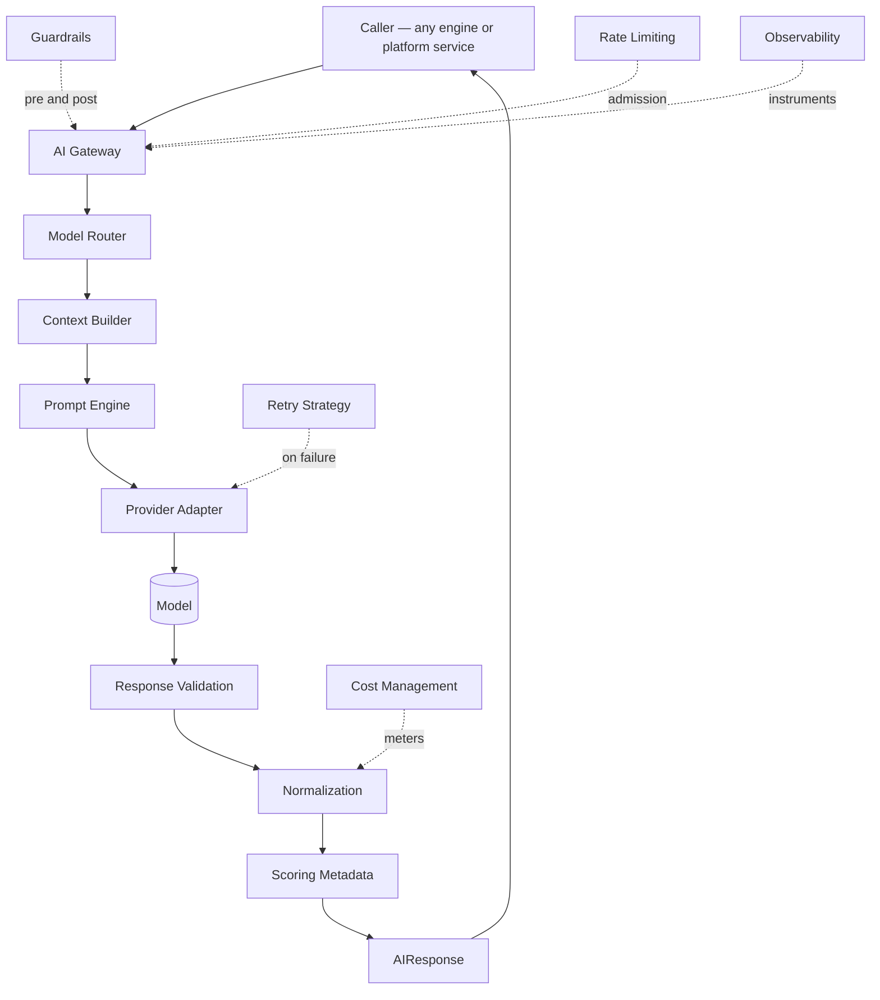

# 08 — AI Platform

The shared intelligence infrastructure every Content Platform engine consumes. It **owns AI execution** and knows nothing about what the AI is being used for.

## The defining rule

**The AI Platform never knows SEO, articles, keywords, research, publishing, or analytics.** It receives an `AIRequest` carrying a `task_type` — an opaque routing key — and returns a validated, normalized `AIResponse`. If a component here would need to understand what an outline *is* to do its job, business logic has leaked into the wrong layer.

That constraint is what makes the platform reusable. The same Gateway serves keyword expansion, fact verification, and media generation without a branch for any of them, and a fourteenth engine costs no change here at all.

## The mandatory pipeline

Every AI request follows exactly this path. No component may bypass it.

**Why routing precedes context assembly.** The Router selects the model; the model fixes the context window and the tokenizer. The Context Builder cannot budget tokens correctly without knowing both. Assembling context first and routing second would mean re-trimming after every routing decision, and would make fallback to a smaller-window model a silent truncation rather than a deliberate re-assembly.

## Components

| # | Document | Owns |
|---|---|---|
| 1 | `ai-gateway.md` | The single governed egress; request lifecycle; the `AIRequest`/`AIResponse` contract |
| 2 | `model-router.md` | Capability, cost, latency, availability, budget, and policy → a model and a fallback chain |
| 3 | `provider-adapters.md` | The `ModelProvider` **port**: capability declaration, normalization, error taxonomy |
| 4 | `prompt-engine.md` | Versioned template registry, variable substitution, prompt metadata |
| 5 | `context-builder.md` | Retrieval through published interfaces, token budgeting, compression |
| 6 | `ai-memory.md` | Session, workspace, and long-term memory with tenant isolation and retention |
| 7 | `ai-council.md` | Multi-model deliberation: consensus, debate, judge (ADR-019) |
| 8 | `guardrails.md` | Injection defence, policy enforcement, safety boundaries |
| 9 | `response-validation.md` | Schema, citations, evidence references, completeness — never trust model output |
| 10 | `cost-management.md` | Token accounting, attribution, budgets, forecasting |
| 11 | `rate-limiting.md` | Per-tenant, per-model, per-provider admission control and fairness |
| 12 | `retry-strategy.md` | Error taxonomy, backoff, idempotency, fallback interaction |
| 13 | `observability.md` | Metrics, tracing, and the `correlationId` contract |
| — | `model-selection.md` | The concrete model matrix — **versioned routing policy data**, not architecture (ADR-013) |

`model-selection.md` is the one document here that names specific models. It is **policy**, consumed by the Router as data. No architectural document in this folder names a model, and none may.

## Golden rules

| Rule | Enforcement |
|---|---|
| **No caller reaches a model except through the Gateway** | Import-boundary lint; only the Provider Layer imports provider SDKs, only the Gateway invokes the model port |
| **No provider logic escapes the Router and the adapters** | The Router returns capability-described model handles, never provider identifiers, to anything upstream |
| **No business logic anywhere in this folder** | Review: a component needing domain knowledge to function is misplaced |
| **No component produces a Score** | ADR-021 — the platform supplies *metadata* from which producers construct Scores; it produces none |
| **Every async operation uses the EventBus** | ADR-020 — outbox in the state-changing transaction |
| **Every request carries `correlationId`** | Injected at the Gateway; propagated to every span, log, and cost event |
| **Model output is never trusted** | `response-validation.md` runs on every response, without exception |

## Boundary with `09-integrations/`

This is the boundary most likely to be blurred, so it is stated precisely:

| Folder | Owns |
|---|---|
| **`08-ai-platform/provider-adapters.md`** | The **port** — the `ModelProvider` interface, the capability contract, the normalization contract, the error taxonomy every adapter must satisfy |
| **`09-integrations/openrouter.md`** and siblings | The **adapters** — concrete implementations: authentication, transport, endpoint shapes, provider-specific quirks, rate-limit headers, cost tables |

The port is architecture and lives here. The adapters are integrations and live there. Adding a provider means writing an adapter in folder 09 that satisfies the port defined here — with **zero change** to any component in this folder.

## What this platform is not

| Not owned | Owner |
|---|---|
| Any content capability | `05-content-platform/` |
| Evidence, entities, citations, retrieval implementation | `11-knowledge-platform/` — the Context Builder *consumes* its published interface |
| Credits, billing, invoicing | `04-platform/credits.md`, `billing.md` — cost management here **meters**, it does not bill |
| Identity, tenancy, permissions | `04-platform/` |
| Provider authentication and transport | `09-integrations/` |
| Score categories and their production | `05-content-platform/review-engine.md`, `seo-engine.md` (ADR-021) |
| Prompt *content* for a business task | The engine owns the template's semantics; this platform owns its lifecycle |

**On cost:** this platform measures tokens and computes cost in USD, emits `CreditConsumed`, and enforces per-request budget ceilings. It does **not** know what a credit is worth, how a plan is priced, or how an invoice is produced. That separation is why a pricing change never touches AI execution code.

## Shared conventions

| Concern | Convention |
|---|---|
| Task identity | `task_type` in `dot.case` — opaque to this platform, meaningful to the caller |
| Versioning | `prompt_version`, `policy_version`, `contract_version` recorded on every response |
| Tenancy | `tenant_id` on every request, cache key, memory namespace, and cost event |
| Idempotency | `idempotency_key` per request; a retry never double-charges |
| Errors | Typed and exhaustive: `RateLimited`, `BudgetExceeded`, `ProviderUnavailable`, `GuardrailBlocked`, `ValidationFailed`, `ContextInsufficient` — **never a fabricated success** |
| Determinism | Temperature, seed, and sampling parameters are template metadata, recorded per response |
| Caching | Semantic cache keyed on normalized prompt embedding + model + `prompt_version`, tenant-scoped |

## Cross references

- `01-system-architecture/08-c4-component.md` §2 — the component decomposition this folder specifies
- `01-system-architecture/13-adr-log.md` — ADR-008 (Gateway), ADR-013 (model matrix), ADR-019 (Council), ADR-020 (events), ADR-021 (scoring)
- `01-system-architecture/14-scoring-contract.md` — what this platform supplies and what it must not produce
- `05-content-platform/` — every caller
- `09-integrations/` — the adapters implementing the port defined here
- `11-knowledge-platform/` — retrieval the Context Builder consumes
- `04-platform/credits.md` · `settings.md` — budget authority and routing overrides
- `16-security/prompt-injection.md` — the threat model guardrails implement
- `10-testing/ai-evaluation.md` — the harness gating prompt promotion
