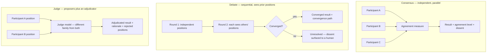
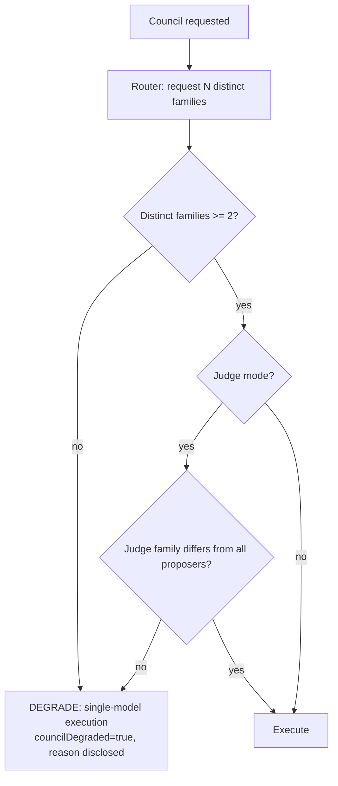
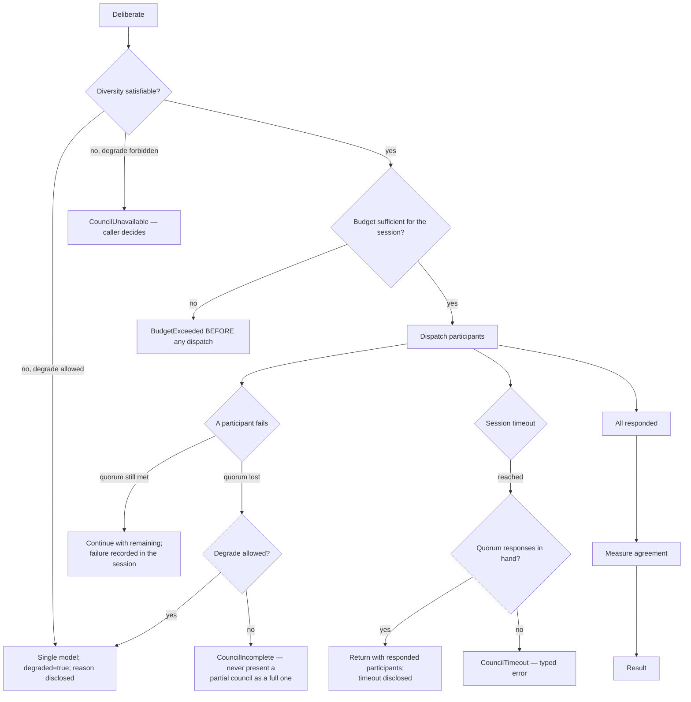

# AI Council

> **Status:** v1.0 — complete. New in Phase 6.
> **Authority:** **ADR-019**. A bounded multi-model deliberation component — not a decomposition strategy (ADR-001).

## Overview

**Business purpose.** Some judgments are genuinely hard and expensive to get wrong: is this medical claim supported, does this article demonstrate real expertise, is this statistic being misread. On those, a single model's confident answer is worth less than several genuinely different models agreeing — or, more valuably, disagreeing in a way that surfaces the difficulty to a human.

**Technical purpose.** Execute a bounded deliberation across models from **genuinely different families**, detect real disagreement, and return a result that discloses both the outcome and the dissent — under an explicit cost budget and timeout.

**The defect this exists to prevent.** The v1 system presented one model as four "council seats," synthesized conflicts that were never detected, and disclosed none of it (`AUDIT.md` §07). That is worse than no council: it manufactures the appearance of rigour. Every rule below exists to make that failure structurally impossible.

## Responsibilities

- Three deliberation modes: **consensus**, **debate**, **judge**.
- Enforcing **model diversity**, verified at dispatch and not merely requested.
- **Genuine conflict detection** — measured disagreement, never synthesized.
- Disclosure: returning participants, positions, and dissent to the caller and ultimately the user.
- Cost budgeting and timeout handling.
- Graceful, **visible** degradation to single-model execution when diversity or budget cannot be satisfied.

## Non-responsibilities

| Not owned | Owner |
|---|---|
| Deciding *when* deliberation is warranted | The calling engine, under workspace policy |
| The business meaning of the question | The calling engine |
| Model selection mechanics | `model-router.md` — the Council requests diversity, the Router satisfies it |
| Dispatch | `ai-gateway.md` — every participant call goes through the Gateway |
| Producing Scores | The producing engine (ADR-021) |
| Prompt content | `prompt-engine.md` |

**The Council never decides that it should be used.** Trigger conditions are policy, evaluated by the caller — typically YMYL fact verification and contested E-E-A-T assessment (`05-content-platform/review-engine.md`). A component that could invoke itself would have unbounded cost.

## Modes



| Mode | Use for | Participants | Cost |
|---|---|---|---|
| **Consensus** | Verifying a factual determination where independence matters | 3, parallel | 3× single call |
| **Debate** | Assessments where reasoning benefits from challenge | 2–3, sequential, max 2 rounds | 4–6× |
| **Judge** | Choosing between defensible alternatives | 2 proposers + 1 adjudicator | 3× |

**Consensus runs participants independently and in parallel.** They must not see each other's positions — that is what makes agreement meaningful. Debate deliberately does the opposite, which is why it is a different mode rather than a parameter.

## Diversity rules

The Council's credibility rests entirely on this section.

1. **Participants must come from genuinely different model families.** Two versions of the same base model are one participant, not two.
2. **Diversity is verified at dispatch**, not requested and assumed. The Router returns model handles with a `family` attribute; the Council asserts distinctness before the first call and **aborts** if it cannot.
3. **Minimum viable diversity is 2 distinct families.** Below that the Council does not run.
4. If diversity cannot be satisfied — a provider outage collapsing the available set — the Council **degrades to single-model execution and says so** in the result. It never proceeds while presenting itself as deliberation.
5. The **judge in judge mode must differ in family from every proposer.** A model adjudicating its own family's position is not adjudication.
6. Participant identity is recorded per session, so a disclosed council is auditable after the fact.



## Conflict detection

**Disagreement is measured, never manufactured.** The rule that separates this from theatre:

| Step | Mechanism |
|---|---|
| 1. Normalize | Each participant returns a **structured position** — a verdict plus a confidence plus cited support — not free prose |
| 2. Compare | Positions are compared on their **structured fields**: does participant A's verdict differ from B's? Do their cited supports differ? |
| 3. Classify | `unanimous` · `majority` · `split` · `unresolved` |
| 4. Surface | Any classification other than `unanimous` is **disclosed**, with each dissenting position intact |

**The Council never asks a model to invent an opposing view.** There is no prompt anywhere in this component that says "argue against." Debate mode shows participants each other's *actual* positions and asks whether they revise — which is a genuine test, and sometimes the answer is that nobody moves.

**Agreement is as informative as disagreement.** A unanimous council on a hard YMYL claim is a strong signal, and it is reported as such rather than being collapsed into a single answer that hides how it was reached.

## Inputs

```ts
interface CouncilRequest {
  mode: 'consensus' | 'debate' | 'judge';
  taskType: string;                     // opaque
  templateRef: { id: string; version?: number };
  variables: Record<string, unknown>;
  contextRefs?: ContextRef[];
  outputSchema: JsonSchema;             // REQUIRED — positions must be structured

  participants: { count: number; minDistinctFamilies: number };
  budget: { maxCostUsd: number };       // hard ceiling for the WHOLE session
  timeoutMs: number;                    // whole session
  degradeToSingle: boolean;             // policy: may we fall back?

  tenantId: string;
  correlationId: string;
}
```

**`outputSchema` is mandatory.** Free-prose positions cannot be compared structurally, which means disagreement could only be assessed by another model — reintroducing exactly the subjectivity the Council exists to reduce.

## Outputs

```ts
interface CouncilResult {
  outcome: unknown;                     // schema-conformant final position
  agreement: 'unanimous' | 'majority' | 'split' | 'unresolved';
  participants: ParticipantRecord[];    // family, position, confidence — NOT provider names
  dissent: DissentRecord[];             // every non-majority position, intact
  rounds: number;
  degraded: boolean;                    // true when diversity or budget forced single-model
  degradationReason?: string;
  cost: { usd: number; calls: number };
  sessionId: string;                    // persisted, auditable
  disclosure: DisclosureSummary;        // what the user must be shown
}
```

**`disclosure` is not optional and not advisory.** It is a required part of the result, and the consuming engine must surface it. A council whose deliberation is invisible to the user is indistinguishable from the v1 defect.

**Score impact:** none produced. `sessionId` flows into the Gateway's `ScoringMetadata`, so a producing engine's `algorithmVersion` reflects that a council was used (ADR-021).

## Workflow

```mermaid
sequenceDiagram
    participant ENG as Calling engine
    participant GW as AI Gateway
    participant CO as AI Council
    participant RT as Model Router
    participant PG as PostgreSQL

    ENG->>GW: AIRequest(council: {mode, participants, budget})
    GW->>CO: deliberate(CouncilRequest)
    CO->>RT: request N handles, distinct families
    RT-->>CO: handles + family attributes
    CO->>CO: verify diversity — abort or degrade if unsatisfied
    CO->>CO: budget check: estimated total <= maxCostUsd
    alt consensus
        par independent, parallel — participants never see each other
            CO->>GW: dispatch participant 1
            CO->>GW: dispatch participant 2
            CO->>GW: dispatch participant 3
        end
    else debate
        CO->>GW: round 1 — independent positions
        CO->>GW: round 2 — each sees others' ACTUAL positions
    else judge
        par proposers
            CO->>GW: proposer A
            CO->>GW: proposer B
        end
        CO->>GW: judge (different family from both)
    end
    CO->>CO: normalize positions; measure agreement structurally
    CO->>PG: BEGIN — persist session + outbox event — COMMIT
    CO-->>GW: CouncilResult with disclosure
    GW-->>ENG: AIResponse + councilSession
```

### Failure and timeout handling



**Quorum** is `minDistinctFamilies` distinct families responding. Below quorum the session is not a council, and it never claims to be.

**Compensation.** Participant calls already dispatched are metered honestly even when the session fails — the tokens were genuinely consumed. A failed council never leaves partial state; the session row records the failure and its reason.

## Domain rules

1. **Diversity is verified, not assumed.** Distinct model families, asserted before the first dispatch (ADR-019).
2. **Disagreement is never manufactured.** No prompt asks a participant to oppose; positions are compared structurally.
3. **Degradation is always disclosed.** `degraded: true` with a reason, surfaced to the user.
4. **The budget is a hard ceiling for the whole session**, checked before any dispatch. A council that overruns is a cost incident.
5. **Every participant call goes through the AI Gateway** — the Council does not bypass the pipeline it sits inside, so every participant call is metered, guarded, and validated like any other.
6. `outputSchema` is mandatory; positions must be structured.
7. In consensus mode, participants are **independent and parallel** and must not see each other's output.
8. In judge mode, the judge's family differs from **every** proposer.
9. Debate is capped at **2 rounds**; convergence is not forced, and an unresolved debate is a legitimate, useful outcome routed to a human.
10. Sessions are **persisted and auditable** — participants, positions, agreement, cost.
11. The Council is invoked **only under explicit policy** by a caller; it never self-triggers.
12. **Council usage never changes the score contract** — it changes `algorithmVersion` and nothing else (ADR-021).

**Idempotency:** keyed on `(correlationId, mode, templateRef, variablesDigest)`; a retried session returns the persisted result rather than re-running an expensive deliberation. **Concurrency:** participants parallel within a session; sessions independent.

## AI usage

Every participant call is an ordinary `AIRequest` through the Gateway, using a template from the Prompt Engine with `outputSchema` set. The Council supplies:

| Element | Source |
|---|---|
| Template | Caller's `templateRef` — the same prompt for every participant in consensus mode |
| Context | Assembled once by the Context Builder and **reused across participants**, so they judge identical evidence |
| Model | Router-supplied handles with distinct families |
| Sampling | Temperature from template hints; identical across participants |

**Context is assembled once and shared.** Participants must see exactly the same evidence, or disagreement measures context variance rather than judgment.

## Scoring

Per **ADR-021**: no categories produced. `sessionId` and `agreement` flow into `ScoringMetadata`; a producing engine incorporates council usage into its `algorithmVersion`.

Two consequences worth stating: enabling the Council for a category is an `algorithmVersion` bump requiring **no contract change**; and `agreement` is a **signal available to a producer's confidence computation**, not a confidence value itself — the producer decides how deliberation outcome affects its own confidence.

## Explainability

The Council's disclosure requirement is an explainability requirement:

```ts
interface DisclosureSummary {
  participantCount: number;
  distinctFamilies: number;             // families, NOT provider names
  agreement: AgreementLevel;
  dissentSummary: string[];             // each dissenting position, in its own terms
  degraded: boolean;
  degradationReason?: string;
  costUsd: number;
}
```

Where the Council contributed to a recommendation, the consuming engine's Explainability Envelope carries reason code `council.deliberated` with the session reference, and the dissent is available to the reviewer. A human resolving a blocked gate can see that two of three models agreed a claim was supported and one did not — which is far more useful than a single confident verdict.

**Provider names are never disclosed**, only family distinctness. Customers need to know the deliberation was genuine, not which vendors we contract with.

## Events

Published through the transactional outbox in the state-changing transaction (ADR-020).

| Event | Producer | Consumers | Payload | Retry / DLQ |
|---|---|---|---|---|
| `CouncilSessionCompleted` | This component | Observability, Cost dashboards, Evaluation harness | `{ sessionId, mode, agreement, participantCount, degraded, costUsd }` | Standard |
| `CouncilDegraded` | This component | **Observability, Notifications (on-call)** | `{ sessionId, reason, availableFamilies }` | **Critical — the platform is presenting less rigour than configured** |
| `CouncilDissentRecorded` | This component | Evaluation harness, Read models | `{ sessionId, agreement, dissentCount }` | Standard |
| `CouncilBudgetExceeded` | This component | Cost dashboards, Notifications | `{ taskType, requested, ceiling }` | Standard |

`CouncilDissentRecorded` feeds the evaluation harness: **split councils are the highest-value evaluation cases**, because they identify genuinely ambiguous inputs that a single-model eval would score confidently and wrongly.

## Database impact

| Table | Purpose | Notes |
|---|---|---|
| `council_sessions` | `tenant_id`, mode, task type, agreement, participant count, distinct families, degraded, reason, cost, correlation id | **Tenant-scoped with RLS**; append-only |
| `council_positions` | Per participant: family, structured position, confidence, round, latency | Append-only; **no provider name stored above the adapter layer** |

**Indexes:** `(tenant_id, created_at DESC)`; `(agreement)` partial on non-unanimous for evaluation harvesting.

**Retention:** 180 days for positions, indefinite for session headers (they are cost and audit records). **No schema redesign** — both tables are new.

## APIs

| Surface | Operation |
|---|---|
| Internal (primary) | `AICouncil.deliberate(request: CouncilRequest) → CouncilResult` |
| Internal | `AICouncil.estimate(request) → { estimatedCostUsd, estimatedCalls }` — callers check affordability before committing |
| Admin REST | `GET /internal/v1/council/sessions` · `GET /internal/v1/council/sessions/{id}` |
| REST | **None public.** Council results reach users through the consuming engine's explainability surface, not directly |

## Security

- Tenant isolation on sessions and positions; context is tenant-scoped by construction.
- **Provider identity is never exposed** in results, disclosures, or events — only family distinctness.
- Every participant call inherits the Gateway's guardrails: PII redaction, injection framing, output validation. A council does not weaken any safety control by multiplying calls.
- Council invocation is **policy-gated**, which is also an abuse control: an unbounded council is a 6× cost multiplier and a plausible denial-of-wallet vector.
- Sessions are audit-visible, so a claim that content was deliberated is verifiable.
- Reference `16-security/`; this component defines no controls of its own.

## Performance

| Concern | Approach |
|---|---|
| Latency | Consensus is parallel — session latency ≈ slowest participant, not the sum |
| Debate | Inherently sequential; capped at 2 rounds precisely because latency and cost compound |
| Cost | 3–6× a single call. The dominant control is **narrow trigger conditions**, not efficiency inside the session |
| Timeout | Whole-session budget; partial results returned above quorum |
| Context reuse | Assembled once, shared across participants — significant token saving and a correctness requirement |
| Caching | Sessions cached by idempotency key; deliberation is never re-run for identical inputs |

## Observability

- **Metrics:** `council_sessions_total{mode,agreement}`, `council_duration_seconds{mode}`, `council_cost_usd{mode}`, `council_degraded_total{reason}`, `council_participant_failures_total`, `council_dissent_ratio`, `council_distinct_families` (histogram).
- **Tracing:** one span per session, child spans per participant carrying family and round — participant spans nest under the session, which nests under the engine's span.
- **Logging:** session id, mode, agreement, participant families, cost, correlation id — **never positions or content**.
- **Business KPIs:** dissent ratio per task type (rising dissent means genuinely harder inputs, or a degrading prompt), and **whether council-deliberated decisions are overridden by humans less often than single-model ones** — the only honest measure of whether the cost is justified.
- **Alerts:** `CouncilDegraded` (**page** — the platform is claiming rigour it is not delivering); council cost above budget share; dissent ratio spiking for one task family.

## Cross references

- `01-system-architecture/13-adr-log.md` — **ADR-019**, the decision this component implements
- `ai-gateway.md` — every participant call passes through it
- `model-router.md` — supplies handles with family attributes for diversity verification
- `context-builder.md` — assembles the shared context participants judge
- `prompt-engine.md` — supplies the structured-output template
- `05-content-platform/review-engine.md` — the primary caller (YMYL fact verification, contested E-E-A-T)
- `05-content-platform/planning-engine.md` — secondary caller for high-stakes outlines
- `10-testing/ai-evaluation.md` — split councils as high-value evaluation cases
- `AUDIT.md` §07 — the v1 defect this component's rules exist to prevent
