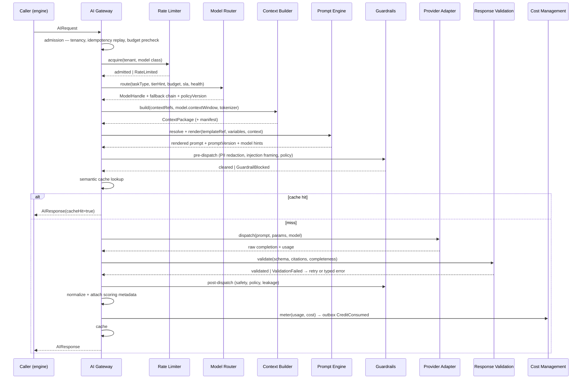
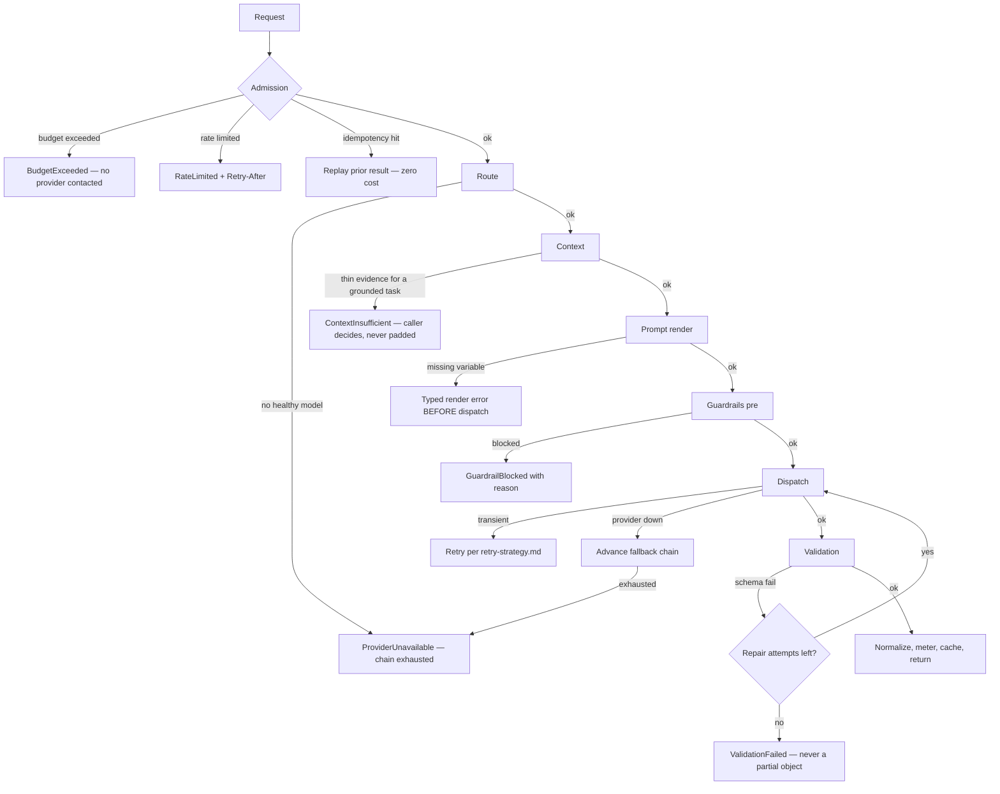

# AI Gateway

> **Status:** v2.0 — complete. Rewritten for ADR-020, ADR-021, and Phases 2–5. Supersedes v1.0, which named providers inside architecture and predated the scoring and event contracts.
> **Authority:** ADR-008. The single, governed egress from every caller to model intelligence.

## Overview

**Business purpose.** AI spend is the platform's dominant variable cost and the main determinant of gross margin. Quality is the product. Both are only controllable if every model interaction passes through one place — otherwise thirteen engines each carry their own keys, retries, budgets, and safety posture, and none of it is steerable without a deploy.

**Technical purpose.** Provide callers a stable, provider-agnostic interface while enforcing platform policy: admission, routing, context assembly, prompt resolution, guardrails, dispatch, validation, normalization, metering, and caching — in a fixed order, with no bypass.

**Design posture.** The Gateway is an **orchestrator of the pipeline, not a participant in it.** It owns sequencing and enforcement; every decision it appears to make is delegated to a component that owns it. That is what keeps a service touched by every request from accumulating logic.

## Responsibilities

- Admission: authentication of the caller, tenancy resolution, rate-limit and budget checks.
- Idempotency: replaying a prior result for a repeated `idempotency_key`.
- Sequencing the mandatory pipeline in the specified order.
- Semantic cache lookup and population.
- Enforcing per-request budget ceilings and refusing to exceed them.
- Metering token usage and cost; emitting `CreditConsumed`.
- Attaching scoring metadata to every response.
- Producing typed errors — never a fabricated success.
- Streaming passthrough for callers that request it.

## Non-responsibilities

| Not owned | Owner |
|---|---|
| Which model to use | `model-router.md` |
| What the prompt says | `prompt-engine.md` |
| What the model sees | `context-builder.md` |
| How a provider is reached | `provider-adapters.md` + `09-integrations/` |
| Whether output is acceptable | `response-validation.md`, `guardrails.md` |
| What a credit is worth, or billing | `04-platform/credits.md`, `billing.md` |
| Any business meaning of `task_type` | The calling engine |
| Producing Scores | The producing engine (ADR-021) |

## Inputs

```ts
interface AIRequest {
  taskType: string;                 // dot.case; OPAQUE to this platform
  tenantId: string;                 // workspace (ADR-017)
  organizationId: string;
  correlationId: string;            // propagated from the originating request
  idempotencyKey: string;           // required on every request

  templateRef: { id: string; version?: number };   // resolved by the Prompt Engine
  variables: Record<string, unknown>;              // typed slots the template declares
  contextRefs?: ContextRef[];                      // evidence, memory, continuity refs
  outputSchema?: JsonSchema;                       // required for structured tasks

  tierHint?: 'fast' | 'mid' | 'premium' | 'alternative';
  latencySla?: number;              // ms
  budget: { maxCostUsd: number; maxTokens?: number };
  stream?: boolean;
  attribution: { articleId?: string; runId?: string; stage?: string };
}
```

**Validation at admission, in order:** tenant context present and active; `idempotencyKey` present; `templateRef` resolvable; declared variables satisfy the template's typed slots; `budget.maxCostUsd` within the workspace's per-request ceiling; `outputSchema` present when the template declares structured output. A failure at any step returns a typed error **before** any provider is contacted, so a malformed request never costs a customer anything.

**Ownership.** Inputs are read-only. The Gateway never mutates a caller's variables, refs, or attribution.

## Outputs

```ts
interface AIResponse {
  content: unknown;                 // validated against outputSchema when declared
  finishReason: 'stop' | 'length' | 'content_filter' | 'tool_call';

  model: ModelHandle;               // capability-described, not a provider identifier
  promptVersion: string;            // 'planning.outline@7'
  policyVersion: string;            // routing policy in force
  contractVersion: number;

  usage: { promptTokens: number; completionTokens: number; totalTokens: number };
  cost: { usd: number; estimated: boolean };
  latencyMs: number;
  cacheHit: boolean;
  attempts: number;

  scoringMetadata: ScoringMetadata; // §Scoring — inputs from which a producer builds a Score
  contextManifest: ContextManifest; // what the model actually saw, by reference
  councilSession?: CouncilSessionRef;
}
```

**Side effects:** a `CreditConsumed` event via the outbox; a cost row; a cache entry on success; trace spans and metrics. **No business state is ever written by the Gateway.**

## Workflow



### Failure branches



**Compensation.** The Gateway holds no durable business state, so there is nothing to roll back. Its one durable side effect — the cost event — is emitted **only after a successful, validated response**, and is idempotent on `(idempotencyKey, attempt-invariant)`. A failed request costs the customer nothing unless tokens were genuinely consumed, in which case the partial consumption is metered honestly and the failure recorded alongside it.

## Domain rules

1. **No caller reaches a model except through this component.** Violations are architectural defects caught by import lint.
2. The pipeline order is **fixed**. No component may be skipped, reordered, or invoked directly by a caller.
3. **Idempotency is mandatory.** A repeated `idempotencyKey` within the retention window returns the original response at zero cost.
4. **Per-request budget is a hard ceiling.** The Gateway refuses to exceed it and returns `BudgetExceeded` naming the cap — never a silent downgrade to a cheaper model, which would change output quality without the caller knowing.
5. Every response records `promptVersion`, `policyVersion`, `model`, and `contractVersion` — the four values that make a call reproducible.
6. **Model output is never trusted.** Validation runs on every response including cache hits at population time.
7. A typed error is always preferable to a degraded success. The Gateway never returns partial, truncated, or unvalidated content as if it were complete.
8. Streaming responses are metered on completion; a cancelled stream meters what was consumed.
9. `taskType` is **opaque**. No branch anywhere in this component may switch on its value — that would be business logic.
10. Cache entries are tenant-scoped, keyed on normalized prompt embedding + model + `promptVersion`, and invalidated by a prompt version bump.

**Idempotency and concurrency.** The Gateway is stateless and horizontally scalable — the platform's hottest service. Concurrent identical requests are collapsed by a short-lived lock on the idempotency key so one dispatch serves both.

## AI usage

This component issues no AI requests of its own. It is the mechanism by which others do. Its only model interaction is invoking the Provider Adapter port on behalf of a caller.

## Scoring

Per **ADR-021**: the Gateway **produces no Score**. It attaches `ScoringMetadata` — the inputs from which a producing engine constructs one:

```ts
interface ScoringMetadata {
  algorithmInputs: {
    promptVersion: string;
    policyVersion: string;
    modelHandle: string;            // capability-described
    temperature: number;
    contractVersion: number;
  };
  contextDigest: string;            // feeds the Score's inputsDigest
  selfReportedConfidence?: number;  // model-reported, explicitly labelled, never authoritative
  councilSession?: CouncilSessionRef;
}
```

The producing engine composes `algorithmVersion` from these inputs and computes its own `value` and `confidence`. **`selfReportedConfidence` is never used as a Score's confidence** — a model's assessment of its own certainty is an input signal, not a measurement, and the distinction is enforced by keeping it in a differently-named field.

## Explainability

The Gateway produces no recommendations and emits no Explainability Envelope. It produces the **reproducibility record** every explanation depends on: given a `correlationId`, the exact prompt version, routing policy, model, context manifest, and token usage that produced any piece of generated content are recoverable.

The `contextManifest` is the key artifact — it lists what the model saw **by reference** (evidence ids, memory keys, continuity refs) without duplicating content, so "why did the model say this?" resolves to specific evidence rows.

## Events

Published through the transactional outbox in the state-changing transaction (ADR-020).

| Event | Producer | Consumers | Payload | Retry / DLQ |
|---|---|---|---|---|
| `CreditConsumed` | This component | **Credits ledger**, Cost dashboards | `{ tenantId, organizationId, holdId, costUsd, tokens, taskType, model, correlationId }` | **Critical — under-metering is revenue loss** |
| `AIRequestFailed` | This component | Observability, Notifications (on sustained failure) | `{ taskType, errorCode, attempts, correlationId }` | Standard |
| `ModelFallbackEngaged` | This component | Observability, Router health | `{ fromModel, toModel, reason }` | Standard |
| `GuardrailTriggered` | This component | **Security monitoring**, Observability | `{ taskType, guardrail, action, correlationId }` | Critical |
| `BudgetCeilingHit` | This component | Notifications, Cost dashboards | `{ tenantId, cap, taskType }` | Standard |

**Consumed:** none synchronously. The Gateway is invoked directly by callers; events are its output, not its input — a Gateway driven by events could not return a response.

**Payloads carry identifiers, versions, and numbers — never prompt text, context, or completions.** Events reach far more consumers than the cost tables do.

## Database impact

The Gateway owns **no business tables**. It writes to two AI Platform tables:

| Table | Purpose | Notes |
|---|---|---|
| `ai_call_costs` | Per-call metering: tenant, article, task type, model, prompt version, tokens, cost, cache hit, correlation id | **Append-only**, partitioned monthly, 13-month retention (`03-database/tables.md` §8) |
| `ai_idempotency_records` | `(tenant_id, idempotency_key) → response ref`, 24-hour TTL | New in this phase; mirrors the request-level idempotency pattern |

Redis holds the semantic cache, rate-limit buckets, and the concurrent-request collapse locks. **No schema redesign** — `ai_call_costs` already exists; only `ai_idempotency_records` is added.

## APIs

| Surface | Operation |
|---|---|
| Internal (primary) | `AIGateway.dispatch(request: AIRequest) → AIResponse` · `.stream(request) → AsyncIterable<AIChunk>` |
| Internal | `AIGateway.estimate(request) → { estimatedCostUsd, estimatedTokens }` — used by callers for budget planning without dispatch |
| REST | **None public.** The Gateway is not reachable from outside the platform; exposing it would create an unmetered proxy to model providers |
| Workers | Callers invoke the same interface from activities and jobs; there is no separate background path |

The absence of a public API is deliberate and load-bearing: an exposed Gateway becomes an open relay whose cost is borne by the platform.

## Security

- **Tenant isolation:** every request carries `tenant_id`; cache keys, memory namespaces, and cost rows are tenant-scoped. A cache shared across tenants would leak content between workspaces.
- **PII redaction** runs pre-dispatch as a guardrail; the redaction corpus is unit-tested with an asserted zero false-negative rate (`10-testing/unit-testing.md` §11).
- **Prompt-injection framing** is applied to every context segment before dispatch (`guardrails.md`, `16-security/prompt-injection.md`).
- **No secrets in this component.** Provider credentials live in the Provider Layer and are never visible here.
- **Logs and traces never contain prompt text, context, or completions** — only references, versions, and counts.
- Budget ceilings are a security control as much as a cost one: they bound the damage a compromised caller or a runaway loop can do.

## Performance

| Concern | Approach |
|---|---|
| Gateway overhead | **p95 < 50 ms** excluding provider latency and context assembly |
| Semantic cache | The single largest cost lever; hit ratio is a first-class SLI |
| Concurrency | Stateless, horizontally scaled; ceiling is provider quota, not this service |
| Collapse | Identical concurrent requests share one dispatch via an idempotency-key lock |
| Streaming | Passthrough with incremental metering; no buffering of full completions |
| Timeouts | Per-tier defaults from routing policy; a request may lower but never raise them |
| Back-pressure | Admission control at the rate limiter, not queueing inside the Gateway |

## Observability

- **Metrics:** `ai_calls_total{task_type,model,outcome}`, `ai_call_duration_seconds{task_type}`, `ai_gateway_overhead_seconds`, `ai_cache_hit_ratio{task_type}`, `ai_tokens_total{direction,model}`, `ai_cost_usd_total{task_type,model}`, `ai_fallback_total{reason}`, `ai_validation_failures_total{reason}`, `ai_budget_rejections_total`.
- **Tracing:** one span per dispatch, with child spans for routing, context assembly, prompt render, guardrails, provider call, and validation. Mandatory attributes: `correlationId`, `tenant_id`, `task_type`, `model`, `prompt_version`, `policy_version`, `cache_hit`.
- **Logging:** structured, one line per call — versions, counts, outcome, correlation id. Never content.
- **Business KPIs:** cost per article (attributed via `attribution.articleId`), cache hit ratio, fallback rate.
- **Alerts:** `CreditConsumed` DLQ entries (**page** — unmetered spend); cache hit ratio dropping sharply (usually a cache-key regression); fallback rate above baseline; validation failure rate above baseline (a prompt or schema regression).

## Cross references

- `01-system-architecture/13-adr-log.md` — ADR-008, the decision this component implements
- `model-router.md` · `context-builder.md` · `prompt-engine.md` · `provider-adapters.md` — the pipeline it sequences
- `guardrails.md` · `response-validation.md` — the checks it enforces
- `cost-management.md` · `rate-limiting.md` · `retry-strategy.md` · `observability.md`
- `01-system-architecture/14-scoring-contract.md` — what this component supplies and must not produce
- `04-platform/credits.md` — the consumer of `CreditConsumed`
- `05-content-platform/` — every caller
- `16-security/prompt-injection.md`
