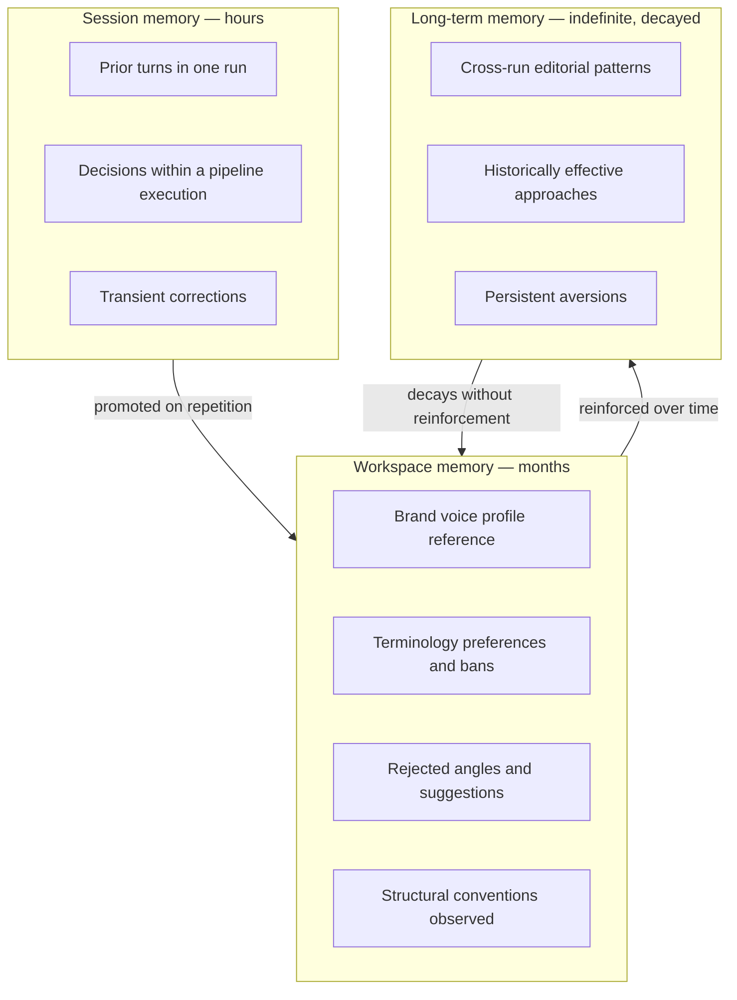
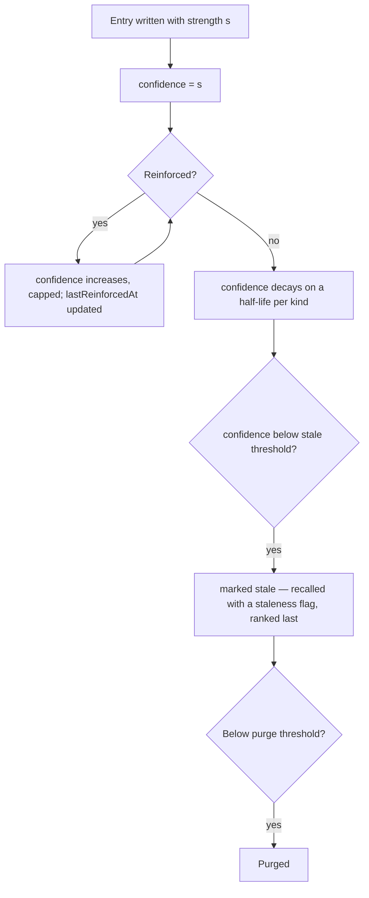
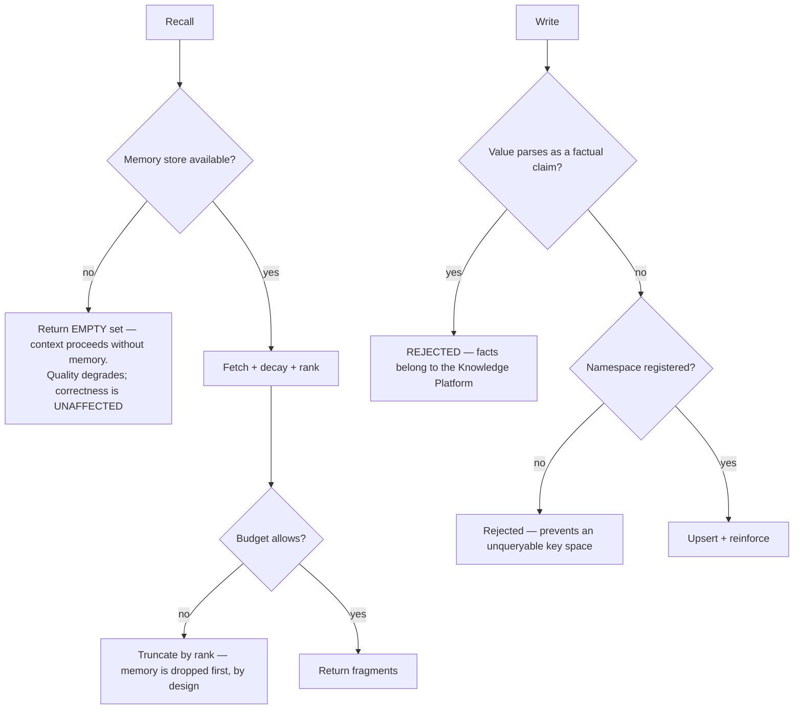

# AI Memory

> **Status:** v1.0 — complete. New in Phase 6.
> **Authority:** **ADR-026** (resolving OQ-25). AI Memory belongs to the AI Platform. It stores interaction context and personalization. **It is never a source of truth.**

## Overview

**Business purpose.** A platform that forgets is a platform that feels stupid. Without memory, every run re-proposes an angle the customer rejected last month, re-uses terminology they have banned, and re-learns a brand voice that was configured in January. Memory is what makes the product feel like it is working *with* a team rather than restarting from zero — and it is a genuine retention mechanism, because accumulated personalization is switching cost.

**Technical purpose.** Store, decay, and recall **derived interaction context** — preferences, prior decisions, voice profiles, rejected suggestions, terminology — scoped by tenancy, with retention and privacy controls, and supply it to the Context Builder as clearly-marked non-authoritative context.

## The line that defines this component

| | AI Memory | Knowledge Platform |
|---|---|---|
| Stores | Interaction context, personalization | Facts, evidence, entities, citations, embeddings |
| Authority | **Never a source of truth** | **Always the source of truth** |
| Carries provenance | No | **Yes — mandatory** |
| Can support a claim | **No** | Yes |
| Can be cited | **No** | Yes |
| If lost | Quality degrades; correctness unaffected | Grounding breaks; correctness compromised |
| Rebuildable | Yes, from interaction history | Yes, from sources plus archives |

**A fact never comes from memory.** If generated content needs a fact, it comes from the Knowledge Platform with provenance. Memory may record that a workspace *prefers* metric units; it may never record that a product *costs* $49. The first is a preference; the second is a claim, and a claim without provenance is exactly the failure mode the platform exists to prevent (`AUDIT.md` §00).

This separation is why the two are never merged: merging them would create a store where some entries can support citations and others cannot, distinguished only by discipline.

## Responsibilities

- Three memory scopes: session, workspace, long-term.
- Writing memory from explicit signals, never from inference over content.
- Recall with relevance ranking and decay.
- Retention and expiration per scope.
- Tenant isolation and namespace management.
- Privacy: PII minimization, and erasure propagation.
- Confidence decay and staleness marking.

## Non-responsibilities

| Not owned | Owner |
|---|---|
| **Any fact, evidence, entity, or citation** | `11-knowledge-platform/` |
| Grounding of any kind | `11-knowledge-platform/` |
| Context assembly | `context-builder.md` |
| Workspace *settings* (thresholds, policy) | `04-platform/settings.md` — settings are configuration, memory is learned |
| Conversation transport or session auth | `04-platform/authentication.md` |
| Prompt templates | `prompt-engine.md` |
| Business interpretation of a memory entry | The calling engine |

**Memory versus settings — a boundary worth stating.** A workspace *sets* a reading-grade range in settings; it *accumulates* a preference for short paragraphs through repeated editorial choices. Settings are declared and authoritative for policy; memory is observed and advisory. A memory entry never overrides a setting.

## Memory scopes



| Scope | Key | TTL | Written by |
|---|---|---|---|
| **Session** | `(tenantId, runId, key)` | 24 hours | Engines during a run |
| **Workspace** | `(tenantId, key)` | 180 days, refreshed on reinforcement | Explicit signals: approvals, rejections, edits, settings changes |
| **Long-term** | `(tenantId, key)` | Indefinite with decay | Promoted from workspace on repeated reinforcement |

**Promotion requires repetition.** One rejection is noise; five rejections of the same angle is a preference. The threshold is policy, and promotion is never inferred from a single interaction.

## Inputs

```ts
interface MemoryWrite {
  tenantId: string;
  scope: 'session' | 'workspace' | 'long_term';
  runId?: string;                       // required for session scope
  key: string;                          // dot.case namespace: 'voice.terminology.banned'
  kind: MemoryKind;
  value: MemoryValue;                   // scalars, short strings, or reference lists
  signal: {
    source: 'explicit_setting' | 'human_decision' | 'observed_edit' | 'engine_outcome';
    strength: number;                   // 0–1
    correlationId: string;
  };
  ttlOverride?: number;
}

type MemoryKind =
  | 'preference' | 'rejection' | 'convention' | 'terminology'
  | 'continuity' | 'outcome';
```

**Writes come from signals, never from content inference.** A human rejecting an outline is a signal. A model reading an article and concluding "this workspace likes lists" is **not** — that is inference over content, which would let generated text write its own memory and drift without any human input.

**Validation:** `key` must be in a registered namespace; `value` must be scalar, short string, or a reference list — never free-form prose and never a factual assertion. A write whose value parses as a factual claim is rejected, which is a crude but effective structural guard.

## Outputs

```ts
interface MemoryFragment {
  key: string;
  kind: MemoryKind;
  value: MemoryValue;
  scope: MemoryScope;
  confidence: number;                   // decayed from reinforcement strength
  lastReinforcedAt: string;
  stale: boolean;
  provenance: 'derived';                // ALWAYS — never 'source_of_truth'
}
```

**`provenance` is a constant.** Every fragment leaves this component marked derived, so the Context Builder can mark its segment correctly and nothing downstream can mistake a preference for a fact.

**Score impact:** none produced, none consumed (ADR-021). Memory influences generation; it never measures it.

## Workflow

```mermaid
sequenceDiagram
    participant ENG as Engine
    participant GW as AI Gateway
    participant MEM as AI Memory
    participant CB as Context Builder
    participant PG as PostgreSQL

    Note over ENG,MEM: WRITE — from an explicit signal
    ENG->>MEM: write(signal: human rejected angle X)
    MEM->>MEM: validate namespace + value shape
    MEM->>MEM: reinforce existing key or create
    MEM->>PG: BEGIN — upsert entry + outbox event — COMMIT

    Note over CB,MEM: RECALL — during context assembly
    CB->>MEM: recall(scopes, tenantId, budget)
    MEM->>PG: fetch by namespace, tenant-scoped
    MEM->>MEM: apply decay; mark stale; rank by confidence x recency
    MEM-->>CB: MemoryFragment[] (all provenance='derived')
    CB->>CB: place in memory segment, dropped first under budget pressure
```

### Decay



**Decay is what keeps memory honest.** A preference expressed once eighteen months ago should not shape today's output as strongly as one reinforced last week. Half-lives differ by kind: `terminology` decays slowly (a banned word stays banned), `rejection` decays faster (a rejected angle may become relevant again as a topic evolves).

### Failure branches



**A memory outage is a degradation, never a failure.** Because memory is derived and non-authoritative, an empty recall produces less personalized output and nothing else. This is the practical payoff of ADR-026: the platform's correctness has no dependency on this component being available.

## Domain rules

1. **Memory is never a source of truth.** No claim, statistic, date, or attribution may originate here (ADR-026).
2. Every fragment is marked `provenance: 'derived'`, without exception.
3. **Memory is never cited.** The Citation Engine resolves against the Evidence Bank only.
4. Writes come from **explicit signals**, never from inference over generated content.
5. Values are scalars, short strings, or reference lists — never prose, never assertions.
6. Keys live in a **registered namespace**; an unregistered key is rejected.
7. **Memory never overrides a setting.** Where both speak to the same behaviour, settings win (`04-platform/settings.md`).
8. Promotion between scopes requires **repeated reinforcement**, never a single interaction.
9. Confidence **decays**; stale entries are flagged and ranked last, not silently dropped, so a user can see why an old preference stopped applying.
10. **Tenant isolation is absolute.** Memory is namespaced per `tenant_id`; it is never shared across workspaces, even within one organization — an agency's clients must not inherit each other's preferences.
11. Memory is **rebuildable** from interaction history; it is not backed up as authoritative data (`14-operations/backup-recovery.md`).
12. `UserErased` purges any memory attributable to that user.

**Idempotency:** writes are upserts keyed on `(tenantId, scope, key)`; a repeated signal reinforces rather than duplicating. **Concurrency:** last-write-wins on value, additive on reinforcement count.

## AI usage

**None.** AI Memory issues no model calls.

An earlier design considered using a model to summarize interaction history into memory entries. It was rejected: that is inference over content, which would let the system write its own memory from its own output — a feedback loop with no human signal, drifting invisibly. Memory is written from explicit signals only, and that constraint is what keeps it trustworthy despite being non-authoritative.

## Scoring

Per **ADR-021**: no categories produced or consumed.

Memory keys included in a context appear in `ContextManifest.memoryKeys`, which contributes to the manifest digest and therefore to `Score.inputsDigest`. A memory change consequently invalidates cached scores for affected content — correctly, since the model saw different context.

## Explainability

Memory produces no Explainability Envelope, but it is directly **user-visible and must be inspectable**. A workspace admin can see what the platform has learned about them and correct it.

Every fragment surfaces: the key, its value, its confidence, when it was last reinforced, whether it is stale, and **which signals produced it** (by correlation id, resolving to the approval, rejection, or edit that created it).

This matters because unexplained personalization is indistinguishable from unpredictable behaviour. "Why did it stop suggesting comparison tables?" must resolve to "you rejected three of them in March," not to an opaque preference.

Users can **delete or pin** any memory entry. A pinned entry does not decay; a deleted one is purged and its originating signals are marked non-reinforcing so it does not immediately reappear.

## Events

Published through the transactional outbox in the state-changing transaction (ADR-020).

| Event | Producer | Consumers | Payload | Retry / DLQ |
|---|---|---|---|---|
| `MemoryEntryWritten` | This component | Observability, Read models | `{ tenantId, scope, key, kind, confidence }` — **key and metadata only, never value** | Standard |
| `MemoryEntryPromoted` | This component | Observability, Notifications (workspace admin) | `{ tenantId, key, fromScope, toScope }` | Standard |
| `MemoryEntryPurged` | This component | Observability, Audit | `{ tenantId, key, reason }` | Standard |
| `MemoryNamespaceRegistered` | Admin | All instances (validation cache) | `{ namespace, kind, halfLifeDays }` | Standard |

**Consumed:** `UserErased` → purge attributable entries; `WorkspacePurged` → drop the entire namespace; `SettingsUpdated` → mark memory entries that a new setting now overrides.

Values are excluded from event payloads: a terminology ban list is competitively meaningful, and events reach more consumers than the tables do.

## Database impact

| Table | Purpose | Notes |
|---|---|---|
| `ai_memory_entries` | `tenant_id`, `scope`, `run_id?`, `key`, `kind`, `value JSONB`, `confidence`, `reinforcement_count`, `last_reinforced_at`, `stale`, `pinned`, `expires_at` | **Tenant-scoped with RLS**; `UNIQUE (tenant_id, scope, run_id, key)` |
| `ai_memory_signals` | Append-only: which signal reinforced which entry, with `correlation_id` | The explainability trail; 180-day retention |
| `ai_memory_namespaces` | Registered key namespaces with kind, half-life, value-shape constraint | Reference data (ADR-025 exception class) |

**Indexes:** `(tenant_id, scope, key)` unique; `(tenant_id, scope, confidence DESC)` for ranked recall; partial `(expires_at) WHERE expires_at IS NOT NULL` for the purge sweep.

**Caching:** workspace and long-term fragments cached per `tenantId` with invalidation on write — recall is on the hot path of every grounded generation.

**Retention:** session 24 hours; workspace 180 days from last reinforcement; long-term indefinite with decay to purge threshold. **Memory is excluded from the authoritative backup set** — it is derived and rebuildable (`14-operations/backup-recovery.md` §3.1).

**No schema redesign.** All three tables are new to this platform.

## APIs

| Surface | Operation |
|---|---|
| Internal (primary) | `MemoryStore.recall(scopes, tenantId, budget) → MemoryFragment[]` · `.write(MemoryWrite) → void` |
| Internal | `MemoryStore.reinforce(tenantId, key, strength)` · `.purge(tenantId, key)` |
| REST | `GET /v1/workspaces/{id}/memory` — inspect what the platform has learned · `DELETE /v1/workspaces/{id}/memory/{key}` · `POST /v1/workspaces/{id}/memory/{key}/pin` |
| Workers | Decay sweep; expiry purge; promotion evaluator (BullMQ) |

The REST surface exists because **memory must be inspectable and correctable by the customer**. It is `admin`-scoped within the workspace.

## Security

- **Tenant isolation is absolute** — RLS on every read and write, namespaced per `tenant_id`, never shared across workspaces within an organization.
- **PII minimization:** memory stores preferences, not people. Values are scalars and short strings; a write containing what appears to be personal data is rejected by the value-shape constraint.
- **Erasure propagates:** `UserErased` purges entries attributable to that user; the erasure log replays on restore (`14-operations/backup-recovery.md` §11).
- **Memory is a poisoning target.** Because it is never authoritative and never citable, a poisoned entry can degrade tone or angle but cannot introduce a false claim into grounded content — the structural containment ADR-026 provides.
- Memory content never appears in logs, traces, or event payloads.
- Reference `16-security/` for controls; this component defines none of its own.

## Performance

| Concern | Approach |
|---|---|
| Recall latency | **p95 < 30 ms** — cached, tenant-scoped, ranked in memory |
| Write path | Asynchronous upsert; a write never blocks a request |
| Decay | Computed at read time from `last_reinforced_at`, not by a background rewrite — no write amplification |
| Budget | Memory is the first segment dropped under context pressure, so its size never threatens grounding |
| Purge | Batched sweep per workspace, off-peak |

Computing decay at read time rather than by scheduled rewrite is the key efficiency decision: a background job touching every entry daily would be significant write load for a derived store.

## Observability

- **Metrics:** `memory_entries_total{scope,kind}`, `memory_recall_duration_seconds`, `memory_recall_cache_hit_ratio`, `memory_fragments_returned` (histogram), `memory_writes_total{source}`, `memory_promotions_total`, `memory_purges_total{reason}`, `memory_stale_ratio`.
- **Tracing:** recall is a span within context assembly, carrying scope counts and returned fragment count.
- **Logging:** tenant, scope, key, kind, confidence — **never values**.
- **Business KPIs:** memory-influenced acceptance rate — whether outputs generated with workspace memory are accepted more often than those without, which is the only honest evidence that memory earns its complexity.
- **Alerts:** `memory_stale_ratio` above threshold (memory is aging without reinforcement — the platform is not learning); recall latency above budget, since it sits on every grounded generation.

## Cross references

- `01-system-architecture/13-adr-log.md` — **ADR-026**, the ownership and separation decision
- `context-builder.md` — the only consumer of recall; marks memory segments `derived`
- `11-knowledge-platform/` — the source of truth this component is deliberately not
- `04-platform/settings.md` — configuration, which always overrides learned preference
- `04-platform/users.md` — `UserErased` propagation
- `05-content-platform/writing-engine.md` · `planning-engine.md` — the engines whose signals write most memory
- `14-operations/backup-recovery.md` §3.1 — why memory is classed as derived and not backed up
- `16-security/` — isolation and privacy controls
