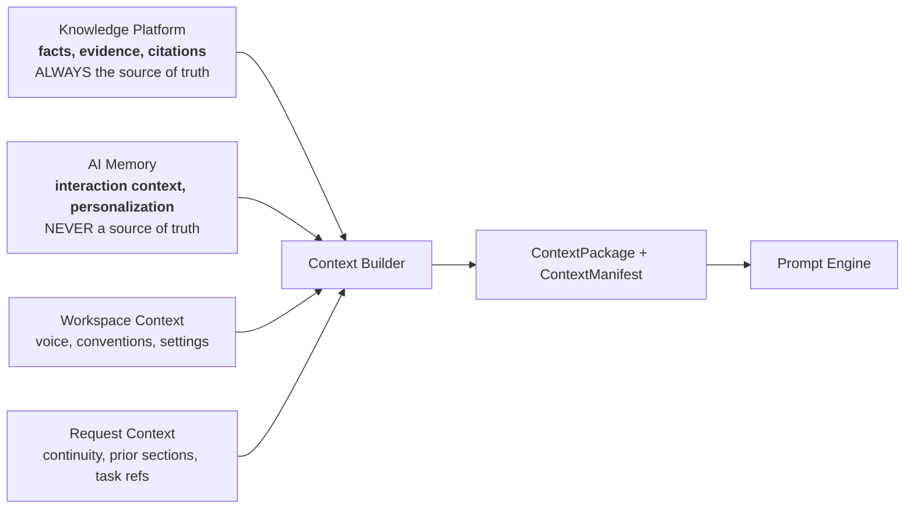
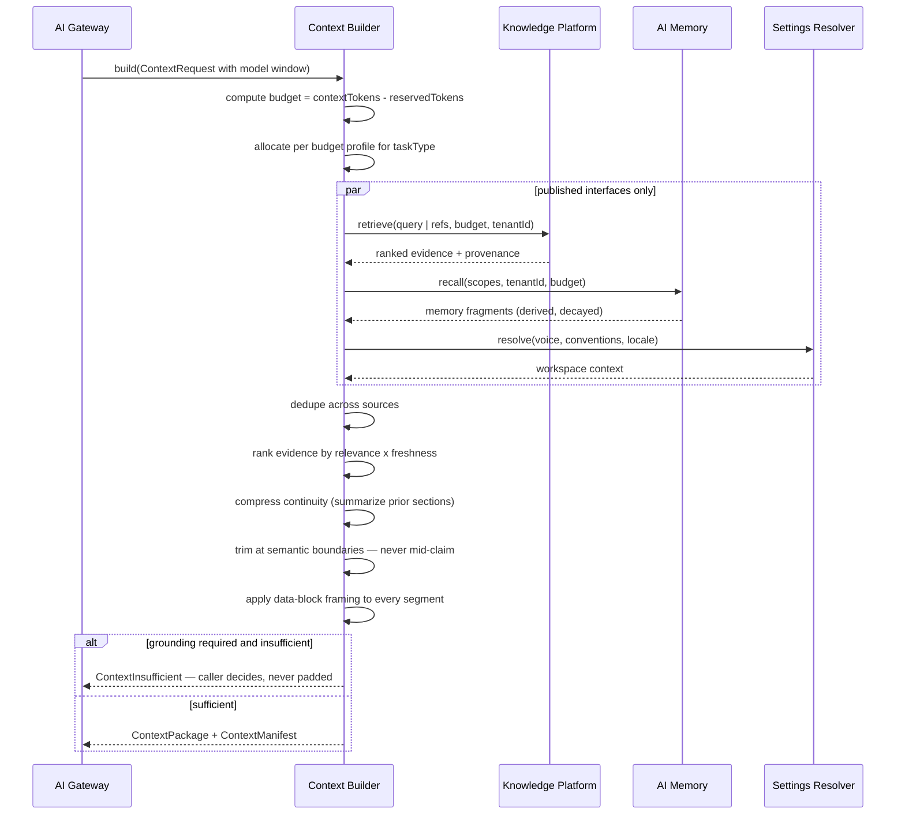
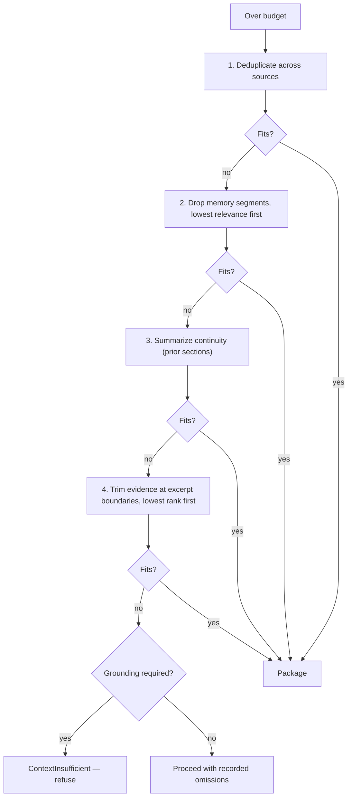

# Context Builder

> **Status:** v2.0 — complete. Rewritten for ADR-020, ADR-021, ADR-026, and Phases 2–5. Supersedes v1.0.
> **Position in the pipeline:** Model Router → **Context Builder** → Prompt Engine. It runs *after* routing because the selected model fixes the context window and tokenizer it must budget against.

## Overview

**Business purpose.** What the model sees determines what the model says. Context assembly is the highest-leverage quality control in the platform and simultaneously its largest cost variable — token spend scales directly with context size, and past a point additional context measurably degrades output rather than improving it. This component is where grounding quality per token is maximized.

**Technical purpose.** Combine four sources into a single budgeted, compressed `ContextPackage` with a manifest of exactly what was included, by reference.

**The four sources** (ADR-026):



That asymmetry is the design's spine. Evidence carries provenance and can support a claim; memory carries preference and can never support one. Both enter the same context, and the package marks which is which so that nothing downstream can confuse them.

## Responsibilities

- Assembling context from the four sources through their **published interfaces**.
- Token budgeting against the selected model's window and tokenizer.
- Compression: summarization, deduplication, and boundary-aware trimming.
- Evidence selection: relevance and freshness ranking within budget.
- Memory retrieval, scoped and decayed.
- Workspace context resolution.
- Producing the `ContextManifest` — what was included, by reference.
- Refusing to proceed when grounding is insufficient for a factual task.

## Non-responsibilities

| Not owned | Owner |
|---|---|
| Prompt templates and rendering | `prompt-engine.md` |
| AI execution | `ai-gateway.md`, `provider-adapters.md` |
| **Database queries of any kind** | The owning platform's published interface |
| Business logic | The calling engine |
| Retrieval algorithms, reranking, embeddings | `11-knowledge-platform/retrieval-pipeline.md`, `vector-search.md` |
| Memory storage and retention policy | `ai-memory.md` |
| Injection framing *policy* | `guardrails.md` — this component *applies* it |
| Model selection | `model-router.md` |

**The no-database rule is absolute.** This component holds no repository, no SQL, and no ORM entity. It calls `KnowledgeRetrieval.retrieve(...)`, `MemoryStore.recall(...)`, and `SettingsResolver.resolve(...)`. If it queried tables directly it would bypass tenant isolation, retrieval ranking, and memory decay — three properties owned by three other components.

## Inputs

```ts
interface ContextRequest {
  taskType: string;                    // opaque; used only to select a budget profile
  tenantId: string;
  correlationId: string;

  model: {                             // from the Router — determines the budget
    contextTokens: number;
    tokenizer: string;
  };
  reservedTokens: number;              // prompt template + expected output

  refs: {
    evidenceRefs?: EvidenceRef[];      // explicit evidence the caller requires
    retrievalQuery?: string;           // or a query for the Knowledge Platform to resolve
    memoryScopes?: MemoryScope[];      // session | workspace | long_term
    continuityRefs?: ContinuityRef[];  // prior sections, earlier turns
  };
  grounding: {
    required: boolean;                 // factual tasks: true
    minEvidenceItems?: number;
    maxEvidenceAgeDays?: number;
  };
}
```

**Validation:** `reservedTokens` must leave a workable remainder; a budget too small for mandatory segments returns a typed error rather than silently truncating instructions. `grounding.required` with no evidence refs and no retrieval query is a caller error, not an empty context.

**Ownership.** All inputs are references and parameters. This component fetches content through interfaces; the caller never passes content in.

## Outputs

```ts
interface ContextPackage {
  segments: ContextSegment[];
  totalTokens: number;
  manifest: ContextManifest;
  compressionApplied: CompressionRecord[];
  groundingSufficient: boolean;
}

interface ContextSegment {
  kind: 'evidence' | 'memory' | 'workspace' | 'continuity';
  provenance: 'source_of_truth' | 'derived';   // evidence = source_of_truth; memory = derived
  content: string;
  refs: string[];                               // evidence ids, memory keys
  tokens: number;
  framing: 'data_block';                        // ALWAYS
}

interface ContextManifest {
  evidenceIds: string[];        // flow through to the Citation Engine
  memoryKeys: string[];
  workspaceKeys: string[];
  continuityRefs: string[];
  omitted: OmissionRecord[];    // what did NOT fit, and why
  digest: string;               // feeds Score.inputsDigest (ADR-021)
}
```

**Every segment carries `provenance`.** A downstream consumer can tell at a glance whether a piece of context could support a citation. Memory segments are marked `derived` and can never be cited.

**The `omitted` list is not optional.** Knowing what did not fit is as important as knowing what did — it is how a thin-context quality problem is diagnosed rather than guessed at.

**Score impact:** none produced. `manifest.digest` feeds `Score.inputsDigest`, which is what makes score caching decidable (ADR-021 §10).

## Workflow



### Budget allocation

Shares are **policy per task profile**, not constants. A representative grounded-generation profile:

| Segment | Share | Trimming rule |
|---|---|---|
| Evidence | 55% | Ranked; trimmed at excerpt boundaries, **never mid-claim** |
| Continuity | 15% | Compressed by summarization before dropping |
| Workspace context | 10% | Voice and conventions; rarely trimmed |
| Memory | 10% | Lowest priority; dropped first |
| Headroom | 10% | Rendering variance and tokenizer drift |

**Memory is dropped first, always.** It is derived and non-authoritative; evidence is what the output must rest on. A profile that sacrificed evidence to keep personalization would be optimizing the wrong thing.

### Compression ladder



**Instructions are never trimmed.** If the budget cannot hold the prompt template plus minimum viable context, the request fails typed — the Gateway may re-route to a larger-window model. Silently truncating instructions produces confidently wrong output with no diagnostic trace.

## Domain rules

1. **Knowledge Platform is always the source of truth; AI Memory never is** (ADR-026). Segments are marked accordingly, and a claim may only be grounded in an evidence segment.
2. **No direct database access.** Published interfaces only.
3. **Every segment is framed as a data block.** Retrieved content is never instruction (`guardrails.md`, `16-security/prompt-injection.md`).
4. Trimming happens at **semantic boundaries** — excerpt or sentence — never mid-claim. A half-quoted statistic is worse than an omitted one.
5. **Instructions are never sacrificed to context.**
6. `grounding.required` with insufficient evidence returns **`ContextInsufficient`**; the caller decides whether to request more research or proceed unground. This component never pads.
7. Memory is dropped before evidence, always.
8. The manifest records **omissions**; silent dropping is prohibited.
9. Context is assembled **after** routing, because the window and tokenizer come from the selected model.
10. `taskType` selects a budget profile and nothing else — no branch may inspect its business meaning.
11. All retrieval is **tenant-scoped**; a cross-tenant context is a data breach, not a bug.

**Idempotency:** given identical refs, budget, and source state, assembly is deterministic. **Concurrency:** stateless; source calls fan out in parallel.

## AI usage

The Context Builder makes **one** kind of model call, and only under a bounded condition:

| Task type | Purpose | Tier hint |
|---|---|---|
| `context.summarize_continuity` | Compress prior sections when they exceed their share | Fast |

Summarization is invoked **through the AI Gateway** like any other request — this component does not bypass the pipeline it sits inside. It is used only for continuity, never for evidence: summarizing evidence would destroy the offsets and provenance that citation anchors depend on.

Where the budget permits, continuity is included verbatim and no model call occurs.

## Scoring

Per **ADR-021**: no categories produced or consumed.

`manifest.digest` is the component's contribution to the contract: it is a stable hash of exactly what the model saw, and it feeds `Score.inputsDigest`. That is what lets a producing engine answer "are my cached scores still valid?" without knowing anything about the algorithm that produced them — if the context digest is unchanged and the algorithm version is unchanged, the score stands.

## Explainability

The Context Builder emits no Explainability Envelope. It produces the **evidentiary substrate** for every downstream one:

- `manifest.evidenceIds` flow to the Citation Engine, so every generated claim can be resolved to the specific evidence that was in context when it was written.
- `manifest.omitted` records what did not fit and why — "three evidence items dropped for budget, lowest relevance" — which turns an unexplained quality gap into a diagnosable one.
- `compressionApplied` records which segments were summarized, so a loss of nuance is attributable.
- Segment `provenance` makes it impossible to later mistake a memory fragment for a cited fact.

## Events

Published through the transactional outbox where durable (ADR-020); most signals here are transient telemetry.

| Event | Producer | Consumers | Payload |
|---|---|---|---|
| `ContextInsufficient` | This component | Calling engine (via typed error), Observability | `{ taskType, requiredItems, availableItems, correlationId }` |
| `ContextCompressionApplied` | This component | Observability | `{ taskType, segmentsCompressed, tokensSaved }` |
| `ContextBudgetExceeded` | This component | Observability, Router (re-route signal) | `{ taskType, requiredTokens, availableTokens }` |

**Consumed:** none. The Context Builder is invoked synchronously and returns a value; an event-driven context builder could not participate in a request pipeline.

Payloads carry counts and identifiers — **never context content**.

## Database impact

**This component owns no tables and issues no queries.**

It reads through:

| Interface | Owner |
|---|---|
| `KnowledgeRetrieval.retrieve(query, budget, filters)` | `11-knowledge-platform/retrieval-pipeline.md` |
| `MemoryStore.recall(scopes, tenantId, budget)` | `ai-memory.md` |
| `SettingsResolver.resolve(scope, keys)` | `04-platform/settings.md` |

**Caching:** assembled packages cached by `(taskType, refsDigest, model.contextTokens, sourceStateVersion)` in Redis. A revise loop that changes one section re-uses the package for unchanged sections — the dominant context-cost saving in the Writing Engine.

**No schema impact whatsoever**, by design.

## APIs

| Surface | Operation |
|---|---|
| Internal (primary) | `ContextBuilder.build(request: ContextRequest) → ContextPackage` |
| Internal | `ContextBuilder.estimate(request) → { estimatedTokens, groundingSufficient }` — lets a caller check viability before dispatch |
| REST | **None.** Not reachable from outside the platform |

## Security

- **Tenant isolation is the first-order concern**: every retrieval call carries `tenantId`, and vector retrieval additionally carries a mandatory tenant filter (`11-knowledge-platform/vector-search.md`). A cross-tenant context would place one customer's evidence inside another's generated content.
- **This is the component through which untrusted web content reaches a model.** Data-block framing is applied to every segment without exception, and the framing is asserted by a prompt-injection regression corpus (`10-testing/ai-evaluation.md` §11).
- Memory segments are marked `derived` specifically so a compromised or poisoned memory entry can never be laundered into a citation.
- PII redaction runs at the Gateway after assembly, before dispatch (`guardrails.md`).
- Context content never appears in logs, traces, or events — only references, counts, and digests.
- Cache keys are tenant-scoped; a shared context cache would be a cross-tenant leak.

## Performance

| Concern | Approach |
|---|---|
| Assembly latency | **p95 < 300 ms**, dominated by retrieval |
| Parallelism | The four sources are fetched concurrently |
| Caching | Package cache by refs digest; the largest saving in iterative work |
| Token counting | Model-specific tokenizer, computed locally |
| Compression cost | Summarization is a fast-tier call, invoked only when over budget |
| Budget discipline | Bounded by the model window; there is no unbounded context path |

**Token efficiency is the cost lever.** More context is not better past a point — it costs linearly and degrades attention. The budget profiles exist to make that trade explicit rather than emergent.

## Observability

- **Metrics:** `context_build_duration_seconds{task_type}`, `context_tokens_total{segment_kind}`, `context_cache_hit_ratio`, `context_compression_total{strategy}`, `context_insufficient_total{task_type}`, `context_omissions_total{reason}`, `evidence_items_included` (histogram), `context_budget_utilization` (histogram).
- **Tracing:** one span per build with child spans per source, carrying segment token counts and the manifest digest.
- **Logging:** task type, token counts, source counts, omission reasons, correlation id — **never content**.
- **Business KPIs:** evidence items per generated section (a leading indicator of citation quality), and context tokens per article, which is the largest component of cost per article.
- **Alerts:** `context_insufficient_total` rising for a task family (usually upstream research degradation, not a context bug); cache hit ratio dropping; budget utilization consistently at ceiling, which means profiles need retuning or a larger-window tier.

## Cross references

- `01-system-architecture/13-adr-log.md` — **ADR-026**, the memory/knowledge separation this component implements
- `ai-memory.md` — the derived, non-authoritative source
- `11-knowledge-platform/retrieval-pipeline.md` · `vector-search.md` · `evidence-bank.md` — the authoritative source
- `prompt-engine.md` — consumes the `ContextPackage` through its declared context slot
- `model-router.md` — supplies the window and tokenizer that set the budget
- `guardrails.md` — owns the framing policy applied here
- `04-platform/settings.md` — workspace context resolution (ADR-024)
- `05-content-platform/writing-engine.md` · `review-engine.md` — the heaviest consumers
- `01-system-architecture/14-scoring-contract.md` §10 — how `manifest.digest` makes score caching decidable
