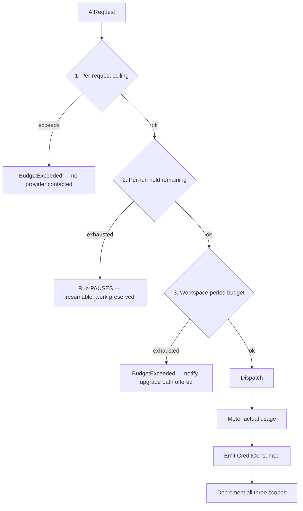
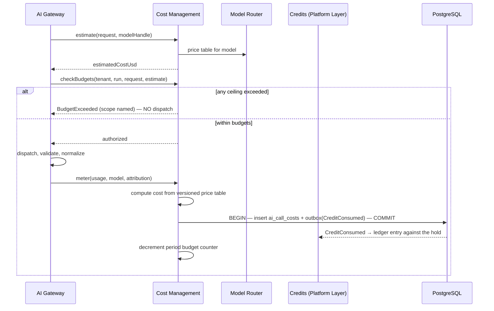
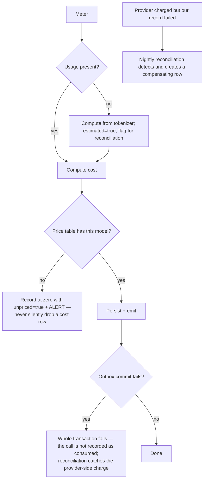

# Cost Management

> **Status:** v1.0 — complete. New in Phase 6.
> **Position:** cross-cutting. Meters every AI call, enforces every budget ceiling, and attributes every dollar. **It performs no billing.**

## Overview

**Business purpose.** AI spend is the platform's dominant variable cost and the direct determinant of gross margin. It is also unbounded by nature: a runaway loop, a ballooned context, or a routing regression can consume a month of margin in an afternoon without producing a single error. Cost management is the component that makes spend measurable, attributable, forecastable, and — critically — **refusable before it happens**.

**Technical purpose.** Account for token usage on every call, compute cost from versioned price tables, attribute it down to the article and pipeline stage, enforce budget ceilings at three scopes, and emit the consumption events the Platform Layer's ledger consumes.

**The billing boundary, stated first because it is the one that matters.** This component measures and enforces; it does **not** bill. It knows tokens, models, and dollars. It does **not** know what a credit is worth, what a plan costs, how an invoice is produced, or whether a customer has paid. That separation is why a pricing change never touches AI execution code, and why an AI cost model change never touches an invoice.

## Responsibilities

- Token accounting per call, including estimated-usage handling.
- Cost computation from versioned price tables.
- Cost attribution: tenant, organization, article, run, stage, task type, correlation id.
- Budget enforcement at three scopes: per request, per run, per workspace period.
- Pre-dispatch estimation, so a request that cannot afford to run is refused before it does.
- Emitting `CreditConsumed` for the Platform Layer's ledger.
- Forecasting and burn-rate projection.
- Reconciliation against provider invoices.

## Non-responsibilities

| Not owned | Owner |
|---|---|
| **Billing, invoicing, payment** | `04-platform/billing.md` |
| The credit ledger, holds, settlement | `04-platform/credits.md` |
| What a credit is worth | Pricing policy, OQ-10 |
| Plan limits and entitlements | `04-platform/billing.md` → `organizations.md` |
| Rate limits and throughput control | `rate-limiting.md` — a distinct concern (see below) |
| Model selection on cost grounds | `model-router.md` — this component supplies price tables, the Router decides |
| Provider price negotiation | Commercial, outside the platform |

**Cost versus rate limiting.** They are frequently conflated and are not the same. Cost management answers *"can this be afforded?"* — a money question. Rate limiting answers *"can this be admitted right now?"* — a throughput and fairness question. A workspace can be well within budget and still be rate-limited for burst protection, and vice versa. Two components, two questions, two failure modes.

## The three budget scopes



| Scope | Purpose | Enforcement | Breach behaviour |
|---|---|---|---|
| **Per request** | Bounds one call | Hard ceiling, pre-dispatch | Typed `BudgetExceeded`; **never a silent tier downgrade** |
| **Per run** | Bounds one pipeline execution | The credit hold from `04-platform/credits.md` | Run **pauses** at the next durable checkpoint — resumable, nothing discarded |
| **Per workspace period** | Bounds a customer's spend over a billing period | Soft-warn at threshold, hard stop at ceiling | Notification then refusal; existing runs finish |

**The per-run pause is the commercially important one.** Killing a run at 80% completion destroys work the customer already paid for. Pausing preserves it, notifies, and lets them top up and resume (`05-content-platform/orchestration.md`).

**A budget breach never silently downgrades the model.** Producing cheaper, worse output while reporting success is the failure mode that erodes trust invisibly; a typed refusal is honest and actionable.

## Token accounting

```ts
interface UsageRecord {
  promptTokens: number;
  completionTokens: number;
  totalTokens: number;
  estimated: boolean;              // true when the provider omitted counts
  tokenizer: string;
  cachedTokens?: number;           // where a provider reports prompt caching
}
```

**Usage is always populated.** Where a provider omits counts, the adapter computes them with the model's tokenizer and marks `estimated: true` (`provider-adapters.md`). Estimation is honest but imprecise, so `estimated` propagates all the way into the cost row and into reconciliation, where a persistently high estimated share is itself an alert.

**Streaming** is metered on completion; a cancelled stream meters what was actually consumed. **Cache hits** cost zero provider tokens but are recorded with `cacheHit: true` so that cache savings are measurable rather than invisible.

## Cost computation

```ts
interface CostComputation {
  usd: number;
  priceTableVersion: string;       // versioned — historical costs stay reproducible
  breakdown: {
    promptCostUsd: number;
    completionCostUsd: number;
  };
  estimated: boolean;
}
```

Price tables are **versioned reference data**, and every cost row records the version used. Without that, a provider price change would silently rewrite the apparent cost of historical work and make month-over-month margin analysis meaningless.

Amounts use `NUMERIC`, never floating point — a rounding error in money is a compliance problem, not a bug (`03-database/tables.md` §1.1).

## Attribution

Every call is attributed along every dimension a question might be asked from:

| Dimension | Source | Answers |
|---|---|---|
| `tenantId` | Request | "What does this workspace cost?" |
| `organizationId` | Request | "What does this customer cost?" |
| `articleId` | `attribution` | **"What does an article cost?"** — the headline unit economic |
| `runId` | `attribution` | "What did this run cost?" |
| `stage` | `attribution` | "Which pipeline stage dominates cost?" |
| `taskType` | Request | "Which task type is expensive?" |
| `model` | Router decision | "What does each tier cost us?" |
| `promptVersion` | Prompt Engine | "Did that prompt change cost more?" |
| `correlationId` | Request | "What did this user action cost, end to end?" |

**`correlationId` is the join that makes everything else work.** One customer action produces one correlation id, which appears on every AI call, cost row, span, and event it caused — so "this run cost $2.14" is a query, not an estimate.

## Workflow



### Failure branches



**A cost row is never silently dropped.** An unpriced model produces a zero-cost row flagged `unpriced` plus an alert, because a missing price table entry is a configuration defect that would otherwise appear as free work.

## Domain rules

1. **This component never bills.** It meters, enforces, and emits; `04-platform/credits.md` owns the ledger and `billing.md` owns money.
2. **Budgets are checked before dispatch.** A request that cannot afford to run never contacts a provider.
3. **A budget breach never downgrades the model.** Typed refusal only.
4. **Per-run exhaustion pauses; it does not fail.** Paid work is preserved.
5. Usage is **always recorded**, estimated where necessary and marked as such.
6. Cost is computed from a **versioned price table**, and the version is recorded.
7. **Retries consume budget.** A retry is a real provider call and is metered like any other (`retry-strategy.md`).
8. Cache hits are recorded at **zero provider cost** with `cacheHit: true`, so savings are measurable.
9. **Every cost row carries full attribution.** A row without `correlationId` is a defect.
10. `CreditConsumed` is emitted **only after a successful, metered call**, inside the same transaction as the cost row (ADR-020).
11. Consumption events are **idempotent** on the request's idempotency key — a retried emission never double-charges.
12. Amounts are `NUMERIC`; floating-point money is prohibited.

**Idempotency:** metering is keyed on `(idempotencyKey, attemptNumber)`, so each genuine provider call meters exactly once. **Concurrency:** period budget counters are atomic Redis operations with periodic reconciliation against the durable rows.

## AI usage

**None.** Cost management issues no model calls. Forecasting is statistical — burn-rate extrapolation over historical rows — and deliberately so: a forecast that varied between runs would be useless for planning, and paying a model to predict spend would be a small irony with a real bill.

## Scoring

Per **ADR-021**: no categories produced or consumed.

Cost data does feed one contract-adjacent decision: a tier downshift proposed on cost grounds must be validated by the evaluation harness before routing policy adopts it (`10-testing/ai-evaluation.md`). Cost tells you what you would save; only evaluation tells you what you would lose. This component supplies the first number and never the second.

## Explainability

Cost management emits no Explainability Envelope, but its output is the platform's **cost explanation surface**:

- Any article's cost decomposes into stages, task types, models, and prompt versions.
- Any run's cost resolves through `correlationId` to the exact calls that produced it, including retries and repairs.
- A cost increase attributes to a dimension: a prompt version, a routing change, a context-size increase, or a cache-hit-ratio decline.

That last capability is why attribution is exhaustive. "AI spend rose 40% this month" is a panic; "AI spend rose 40% because a prompt version increased context tokens by 3× on one task type" is a fix.

## Events

Published through the transactional outbox in the state-changing transaction (ADR-020).

| Event | Producer | Consumers | Payload | Retry / DLQ |
|---|---|---|---|---|
| `CreditConsumed` | This component | **`04-platform/credits.md` ledger**, Cost dashboards | `{ tenantId, organizationId, holdId, costUsd, tokens, taskType, model, correlationId, idempotencyKey }` | **Critical — pages; unmetered spend is revenue loss** |
| `BudgetCeilingHit` | This component | Notifications, Orchestrator (pause), Cost dashboards | `{ scope, tenantId, cap, taskType }` | Critical |
| `BudgetThresholdCrossed` | This component | Notifications (soft-warn at 80%) | `{ tenantId, scope, percentUsed }` | Standard |
| `UnpricedModelDetected` | This component | **Observability — alert**, Router | `{ modelHandle, priceTableVersion }` | Critical |
| `CostReconciliationDiscrepancy` | Reconciliation job | **Observability — pages**, Notifications (internal) | `{ provider, period, expectedUsd, invoicedUsd, delta }` | **Critical** |

**Consumed:** `SubscriptionChanged` → refresh workspace period budgets from plan entitlements; `RunCompleted` / `RunFailed` / `RunCancelled` → finalize run attribution so a paused or failed run's partial spend is correctly attributed.

## Database impact

| Table | Purpose | Notes |
|---|---|---|
| `ai_call_costs` | Per-call metering: tenant, org, article, run, stage, task type, model, prompt version, tokens, cost, price table version, cache hit, estimated, correlation id | **Existing** (`03-database/tables.md` §8). Append-only, partitioned monthly, 13-month retention |
| `ai_price_tables` | Versioned per-model prompt and completion prices | **New.** Reference data (ADR-025 exception class) |
| `ai_cost_rollups` | Hourly and daily aggregates per tenant, article, task type | **New.** Rebuildable from `ai_call_costs` |

**Indexes** (existing, from `03-database/indexes.md` §8): `(tenant_id, created_at)`, `(article_id)`, `(model, created_at)`.

**Dashboards read rollups, never raw rows.** `ai_call_costs` reaches 10⁹ rows; a cost dashboard scanning it would be its own cost problem. Period budget counters live in **Redis** for atomic decrement, reconciled against durable rows hourly.

**No schema redesign** — `ai_call_costs` is unchanged; two new tables added.

## APIs

| Surface | Operation |
|---|---|
| Internal (primary) | `CostManagement.estimate(request, model) → estimatedCostUsd` · `.checkBudgets(scopes, estimate) → authorized \| BudgetExceeded` · `.meter(usage, model, attribution) → CostRecord` |
| Internal | `CostManagement.forecast(tenantId, horizon) → BurnProjection` |
| REST | `GET /v1/workspaces/{id}/ai-usage?window=` — usage and cost attributed per article and stage · `GET /v1/organizations/{id}/ai-usage` |
| Admin REST | `GET /internal/v1/costs/reconciliation` · `GET/PUT /internal/v1/costs/price-tables` (versioned, audited) |
| Workers | Rollup builder; nightly reconciliation; budget counter reconciliation (BullMQ) |

Customer-facing usage endpoints report **cost attribution in credits**, translated by `04-platform/credits.md` — this component's USD figures are internal, because exposing raw provider cost would reveal margin.

## Security

- Cost data is **competitively sensitive internally** (it reveals margin) and **operationally sensitive per tenant** (it reveals activity volume). Workspace-scoped endpoints show only that workspace; USD is never exposed to customers.
- Cost rows carry `tenant_id` with RLS; cross-tenant cost aggregation is available only to platform admins and is audited.
- **Budget ceilings are an abuse control**, bounding what a compromised caller or runaway loop can spend — the denial-of-wallet defence.
- Price tables are platform-admin-only and audit-logged; a price table edit changes reported margin.
- Event payloads carry amounts and identifiers, never prompt or response content.
- Reference `16-security/`; this component defines no controls of its own.

## Performance

| Concern | Approach |
|---|---|
| Budget check | **p95 < 10 ms** — Redis counters plus a cached price table; on the critical path of every call |
| Metering | Asynchronous relative to the response; the caller is never blocked on a cost write |
| Estimation | Local tokenizer, no network round-trip |
| Rollups | Hourly batch; dashboards never scan raw rows |
| Reconciliation | Nightly, on a **replica** |
| Counter accuracy | Redis atomic decrements, reconciled hourly against durable rows — fast and eventually exact |

## Observability

- **Metrics:** `ai_cost_usd_total{task_type,model,tenant_top_n}`, `ai_tokens_total{direction,model}`, `cost_per_article_usd` (histogram), `budget_rejections_total{scope}`, `budget_threshold_crossings_total`, `estimated_usage_ratio`, `unpriced_calls_total`, `cache_savings_usd`, `reconciliation_delta_usd`.
- **Tracing:** budget check and metering are spans on every AI call; cost appears as a span attribute so a trace shows what it cost.
- **Logging:** tenant, task type, model, tokens, cost, price table version, correlation id — never content.
- **Business KPIs:** **cost per article** (the headline unit economic), cost per stage, cache savings, and estimated-usage ratio as a metering-accuracy signal.
- **Alerts:** `CreditConsumed` DLQ entries (**page** — unmetered spend); `cost_per_article_usd` above 2× the 7-day baseline (**page** — usually a prompt or context regression, occasionally a routing change); any `reconciliation_delta_usd` beyond tolerance (**page** — money and metering have diverged); `unpriced_calls_total` non-zero; `estimated_usage_ratio` rising.

## Cross references

- `04-platform/credits.md` — the ledger consuming `CreditConsumed`; hold, consume, settle
- `04-platform/billing.md` — money, which this component deliberately does not touch
- `ai-gateway.md` — invokes budget checks and metering on every call
- `model-router.md` — consumes price tables for budget filtering
- `provider-adapters.md` — supplies usage, including the `estimated` flag
- `rate-limiting.md` — the adjacent, distinct concern
- `retry-strategy.md` — retries consume budget
- `03-database/tables.md` §8 — `ai_call_costs`
- `14-operations/monitoring.md` — cost dashboards and the reconciliation job
- `10-testing/ai-evaluation.md` — validates cost-driven routing changes before adoption
- `99-open-questions.md` — OQ-10 (credit pricing)
