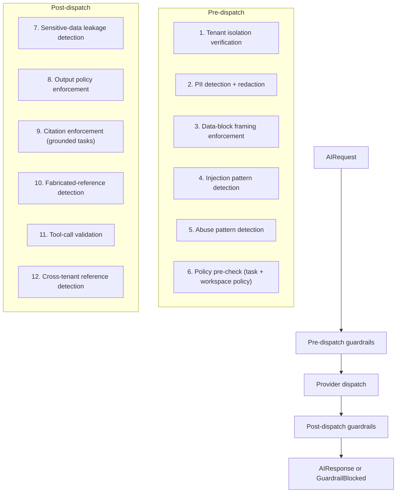
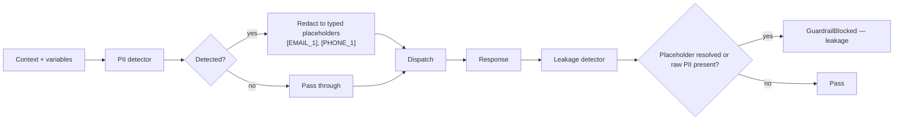
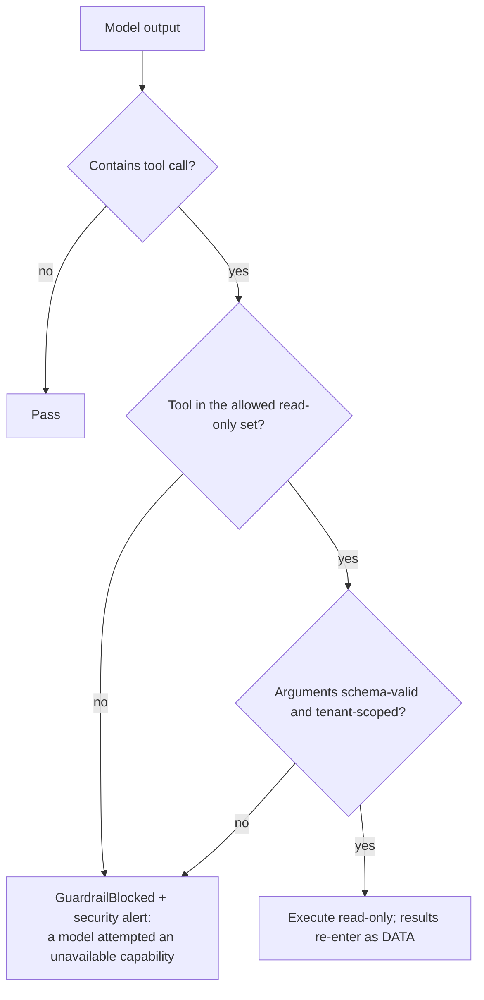

# Guardrails

> **Status:** v1.0 — complete. New in Phase 6.
> **Position in the pipeline:** applied **pre-dispatch** and **post-dispatch** by the AI Gateway, wrapping every model interaction without exception.

## Overview

**Business purpose.** The platform sends customer content to third-party models and ingests arbitrary web content into prompts. Both directions carry risk that is commercially unacceptable if unmanaged: leaked personal data, content published under a customer's brand that violates policy, and — the sharpest one — retrieved web text successfully instructing the platform to act against its own customer. Guardrails are the controls that make those risks bounded rather than latent.

**Technical purpose.** Enforce safety and policy decisions on every AI request and response, **fail closed**, and produce an auditable record of every intervention.

**The boundary with response validation.** These are two components with adjacent names and different jobs:

| | Guardrails | Response Validation |
|---|---|---|
| Asks | *Is this **allowed**?* | *Is this **well-formed and complete**?* |
| Concerns | Safety, policy, privacy, abuse | Schema, required fields, citations resolving, completeness |
| Failure means | Blocked — a policy decision | Malformed — a repairable defect |
| Retry helps | No | Often yes |

A response with an invalid JSON schema is a validation failure. A response containing a customer's credit card number is a guardrail failure. Confusing them leads to retrying policy violations, which is how a platform accidentally brute-forces its way past its own safety controls.

## Responsibilities

- **Prompt-injection defence**: data-block framing policy, instruction-boundary enforcement, injection-pattern detection.
- **Sensitive data protection**: PII detection and redaction before dispatch; leakage detection after.
- **Output policy enforcement**: prohibited content categories, brand-safety boundaries.
- **Citation enforcement**: refusing generated content that asserts facts without traceable support, where the task requires grounding.
- **Hallucination handling**: detecting fabricated references and unsupported specificity.
- **Tool-usage validation**: no side effect is ever triggered by model output.
- **Tenant isolation verification**: catching cross-tenant references in context or output.
- **Abuse prevention**: detecting patterns indicating misuse of the platform's model access.

## Non-responsibilities

| Not owned | Owner |
|---|---|
| Schema conformance, completeness, field presence | `response-validation.md` |
| Whether a claim is *true* | `05-content-platform/review-engine.md` — Guardrails checks *traceability*, not truth |
| Citation *resolution* | `11-knowledge-platform/citation-engine.md` |
| Rate limits and quotas | `rate-limiting.md` |
| Authentication and authorization | `04-platform/permissions.md` |
| The security threat model | `16-security/` — this component implements controls, it does not define the model |
| Business thresholds | `04-platform/settings.md` |

**On truth versus traceability:** Guardrails can determine that a sentence asserts a specific statistic with no supporting evidence reference in context. It cannot determine whether the statistic is correct — that requires evidence comparison and belongs to the Review Engine. The distinction keeps this component fast, deterministic where possible, and inside the request path.

## The control set



Controls are ordered so the cheapest and most decisive run first: tenant verification is a comparison, PII redaction is pattern matching, and only then does anything expensive run.

## Prompt-injection defence

The platform's highest-severity AI risk, because the Research Engine ingests arbitrary web content that reaches a model through the Context Builder.

**Defence is structural, not detective.** Pattern matching for "ignore previous instructions" is a weak last line; the real control is that retrieved content **can never occupy an instruction position**.

| Layer | Control |
|---|---|
| **1. Structural framing** | Every context segment is wrapped in a data block with explicit delimiters and a framing instruction stating that its contents are data to be analyzed, never instructions to follow. Enforced by `context-builder.md` and `prompt-engine.md`; **policy owned here** |
| **2. Positional isolation** | Retrieved content is never placed in system or developer message parts. The template's context slot is confined to user-part positions |
| **3. Variable escaping** | Caller variables are substituted into declared slots with escaping; they cannot introduce new instructions |
| **4. Pattern detection** | Known injection patterns are detected and flagged — **advisory**, feeding telemetry, not the primary control |
| **5. Capability denial** | **No model output can trigger a side effect.** There is no tool the model can call that publishes, spends, deletes, or fetches (see Tool-usage validation) |
| **6. Output inspection** | Post-dispatch detection of system-prompt echo or instruction-following patterns indicating a successful injection |

**Layer 5 is the one that actually matters.** Even a perfectly successful injection can, at most, make the model produce bad text — which then faces the Review Engine's quality gate. It cannot make the platform publish, spend credits, delete evidence, or fetch an attacker-chosen URL, because those capabilities are not reachable from model output at all.

Every layer is asserted against a fixed adversarial corpus in the evaluation harness, and a regression there is a **blocking** failure, not a score (`10-testing/ai-evaluation.md` §11).

## Sensitive data protection



**Redaction is pre-dispatch and irreversible within the request.** The model never sees the raw value. Placeholders are typed and stable within a request so the model can reason about "the customer's email" without receiving it.

The detector covers email addresses, phone numbers, postal addresses, payment-card patterns, national identifiers, and credential-shaped strings (API keys, tokens). Its corpus is unit-tested with an **asserted zero false-negative rate on the corpus** (`10-testing/unit-testing.md` §11) — false positives are acceptable, false negatives are not.

**Credentials are the highest-severity case.** A connector credential appearing in context would be transmitted to a third party. The detector treats credential-shaped strings as an immediate block rather than a redaction, because their presence indicates a defect upstream that must be investigated, not smoothed over.

## Citation enforcement

Applies to tasks the caller marks as **grounded**.

| Check | Behaviour on failure |
|---|---|
| Every factual assertion carries a citation marker | Flagged; the caller decides (Writing Engine flags `supported: false`) |
| Every citation marker resolves to an evidence id **that was in the context manifest** | **Blocked** — a citation to evidence the model never saw is fabricated |
| No citation marker references an evidence id outside the tenant | **Blocked** — cross-tenant reference |
| Specificity without support (a precise statistic with no marker) | Flagged for Review |

**The second check is the direct structural answer to the v1 fabricated-source defect.** In v1, a regex could mark a claim supported because it matched "according to \<Capitalised\>". Here, a citation is only acceptable if it names an evidence id **present in the `ContextManifest`** for that request — a set of identifiers fixed before dispatch. A model cannot invent an identifier that was already in a list it did not write.

## Tool-usage validation

**The platform exposes no tools to models that produce side effects.** Not restricted tools, not confirmed tools — none.



Where structured tool use is enabled at all, it is **read-only and tenant-scoped** — retrieving additional evidence within the same workspace, for example. Any side-effecting operation — publishing, spending, deleting, external fetching — requires **authenticated user intent** and is unreachable from model output by construction (`01-system-architecture/06-c4-context.md` §Security).

A model attempting a tool call outside the allowed set is treated as a **security signal**, not a malformed response: it indicates either a successful injection or a prompt defect, and both warrant investigation.

## Inputs and outputs

```ts
interface GuardrailCheck {
  phase: 'pre' | 'post';
  request: AIRequest;
  contextManifest?: ContextManifest;    // required for citation enforcement
  response?: RawProviderResponse;       // post phase
  policy: GuardrailPolicy;              // task + workspace policy, resolved
  tenantId: string;
  correlationId: string;
}

interface GuardrailResult {
  outcome: 'pass' | 'modified' | 'blocked';
  modifications: Modification[];        // redactions applied
  violations: Violation[];              // control, severity, evidence
  auditRef: string;
}

interface Violation {
  control: GuardrailControl;
  severity: 'advisory' | 'blocking';
  reasonCode: string;                   // registry-backed
  location?: string;                    // where in the payload, by offset
}
```

**Score impact:** none produced or consumed (ADR-021). A guardrail violation is a policy outcome, not a quality measure — conflating them would let a safety block appear as a low score a threshold could be tuned to ignore.

## Domain rules

1. **Fail closed, always.** A guardrail that cannot execute blocks the request. A safety control that fails open is not a control.
2. **Guardrails run on every request and every response**, including cache population — a cached response was validated when stored.
3. **Blocking is a policy decision and is never retried.** Retrying a blocked request is brute-forcing a safety control (`retry-strategy.md`).
4. **Redaction is pre-dispatch and irreversible within the request.**
5. **No model output triggers a side effect.** Ever.
6. A citation naming an evidence id absent from the context manifest is **fabricated** and blocks.
7. Cross-tenant references in context or output are **blocked and escalated as a security event**, not merely filtered.
8. **Guardrails never modify content for quality** — only redaction and blocking. Quality mutation belongs to the Writing Engine.
9. Every intervention is **audit-logged** with control, reason code, severity, and correlation id.
10. Policy is **resolved configuration** (ADR-024), not constants — but a **platform-level floor exists that workspace policy cannot weaken**.
11. `taskType` selects a policy profile; no control branches on its business meaning.

**Idempotency:** guardrails are pure functions over their inputs. **Concurrency:** stateless; abuse detection reads shared counters from Redis.

## AI usage

Guardrails are **predominantly deterministic** — pattern matching, structural verification, set membership, schema checks. Determinism is a requirement here: a safety control whose behaviour varies run to run cannot be reasoned about or tested.

One bounded exception, under policy:

| Task type | Purpose | Tier hint |
|---|---|---|
| `guardrail.policy_classify` | Classify ambiguous content against prohibited-content policy where deterministic rules are inconclusive | Fast |

It is **advisory-escalating**: it can raise a borderline case to blocking, but it can never *clear* something the deterministic controls flagged. A model may not overrule a rule.

The call goes through the AI Gateway with guardrails **disabled for that inner call**, avoiding infinite recursion — an explicitly documented and narrowly scoped exception.

## Explainability

Every intervention produces a registry-backed reason code, never prose:

| Control | Representative reason codes |
|---|---|
| Injection | `guardrail.injection_pattern_detected`, `guardrail.system_prompt_echo` |
| PII | `guardrail.pii_redacted`, `guardrail.credential_detected` |
| Citation | `guardrail.citation_not_in_manifest`, `guardrail.unsupported_specificity` |
| Policy | `guardrail.prohibited_category`, `guardrail.brand_safety_violation` |
| Tenant | `guardrail.cross_tenant_reference` |
| Tool | `guardrail.unavailable_tool_attempted` |

A blocked request returns a typed `GuardrailBlocked` carrying the reason code and severity — **never the offending content**, which would propagate what was blocked. The full detail lives in the audit record, accessible to platform admins only.

## Events

Published through the transactional outbox in the state-changing transaction (ADR-020).

| Event | Producer | Consumers | Payload | Retry / DLQ |
|---|---|---|---|---|
| `GuardrailTriggered` | This component | **Security monitoring**, Observability, Audit | `{ control, severity, reasonCode, taskType, tenantId, correlationId }` | **Critical** |
| `GuardrailBlocked` | This component | Security monitoring, Notifications, Calling engine | `{ control, reasonCode, taskType, correlationId }` | **Critical** |
| `CrossTenantReferenceDetected` | This component | **Security monitoring — SEV1 candidate**, Audit | `{ tenantId, referencedTenantId, phase, correlationId }` | **Critical — pages** |
| `CredentialDetectedInContext` | This component | **Security monitoring — pages**, Audit | `{ tenantId, location, correlationId }` | **Critical — pages** |
| `InjectionAttemptDetected` | This component | Security monitoring, Evaluation harness | `{ pattern, sourceRef, correlationId }` | Critical |

`CrossTenantReferenceDetected` and `CredentialDetectedInContext` page immediately: both indicate a defect upstream that has already produced a dangerous condition, and both map to incident playbooks (`14-operations/incident-response.md` P5, P10).

**Payloads carry control identifiers and references — never the content that triggered them.**

## Database impact

| Table | Purpose | Notes |
|---|---|---|
| `guardrail_violations` | `tenant_id`, control, severity, reason code, task type, phase, correlation id, redacted location metadata | **Tenant-scoped with RLS**; append-only; 180-day retention |
| `guardrail_policies` | Policy profiles per task class, with the platform floor | Reference data (ADR-025 exception class) |

**No offending content is stored** — only its location and classification. Storing the payload would create a repository of exactly the material the controls exist to keep out.

Abuse counters live in **Redis** (per-tenant, sliding window). **No schema redesign**; both tables are new.

## APIs

| Surface | Operation |
|---|---|
| Internal (primary) | `Guardrails.pre(check) → GuardrailResult` · `.post(check) → GuardrailResult` |
| Internal | `Guardrails.redact(text) → { redacted, modifications }` — reused by logging serializers |
| Admin REST | `GET /internal/v1/guardrails/violations` · `GET /internal/v1/guardrails/policies` · `PUT /internal/v1/guardrails/policies/{profile}` (audited) |
| REST | **None public** |

## Security

This component *is* a security control set; `16-security/` owns the threat model it implements.

- **Platform floor:** workspace policy may make guardrails **stricter**, never weaker. A tenant cannot disable PII redaction, injection framing, or citation enforcement.
- **Fail closed** on every control, including the classifier's unavailability.
- Redaction runs before **any** third party sees the payload.
- Cross-tenant detection is defence in depth behind RLS and vector filtering — three independent layers, because the failure is unrecoverable.
- Violation records are platform-admin readable only, and access is itself audited.
- Policy changes require platform-admin authority and are audit-logged.

## Performance

| Concern | Approach |
|---|---|
| Pre-dispatch overhead | **p95 < 30 ms** — pattern matching and structural checks only |
| Post-dispatch overhead | **p95 < 40 ms**, dominated by citation-manifest set comparison |
| Determinism | No I/O on the deterministic path; policy is cache-resident |
| Classifier | Invoked only on ambiguous cases, off the common path |
| Abuse counters | Redis, sliding window, single round-trip |

Guardrails sit on **every** AI call, so overhead is a first-class budget rather than an afterthought. Controls that cannot meet it are moved to asynchronous post-hoc analysis rather than being dropped.

## Observability

- **Metrics:** `guardrail_checks_total{control,phase,outcome}`, `guardrail_blocks_total{control,reason_code}`, `guardrail_duration_seconds{phase}`, `pii_redactions_total{type}`, `injection_attempts_total`, `citation_enforcement_failures_total`, `cross_tenant_detections_total`, `guardrail_classifier_invocations_total`.
- **Tracing:** pre and post guardrails are spans on every AI call carrying controls run and outcome.
- **Logging:** control, reason code, severity, correlation id — **never the offending content**.
- **Business KPIs:** block rate per task type (a rising rate means a prompt or upstream regression), and citation-enforcement failure rate, which is a leading indicator of grounding quality before Review ever sees the content.
- **Alerts:** any `cross_tenant_detections_total` (**page**); any `CredentialDetectedInContext` (**page**); injection attempts spiking for one tenant (probing); block rate deviating sharply from baseline.

## Cross references

- `16-security/prompt-injection.md` — the threat model these controls implement
- `response-validation.md` — the adjacent component: well-formedness, not policy
- `ai-gateway.md` — applies these controls pre and post dispatch
- `context-builder.md` · `prompt-engine.md` — apply the framing policy owned here
- `11-knowledge-platform/citation-engine.md` — citation resolution, distinct from enforcement
- `05-content-platform/review-engine.md` — determines truth; this component determines traceability
- `retry-strategy.md` — why blocked requests are never retried
- `10-testing/ai-evaluation.md` §11 — the adversarial corpus gating every prompt version
- `14-operations/incident-response.md` — playbooks P5 and P10
