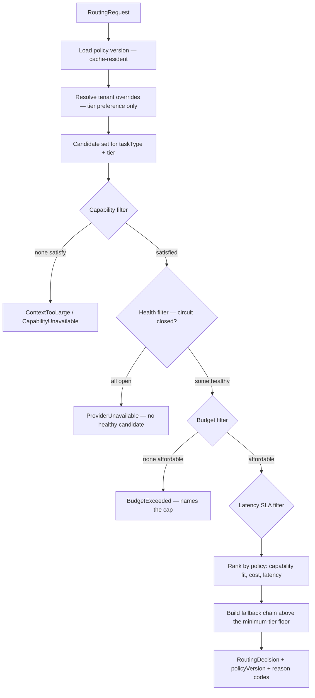
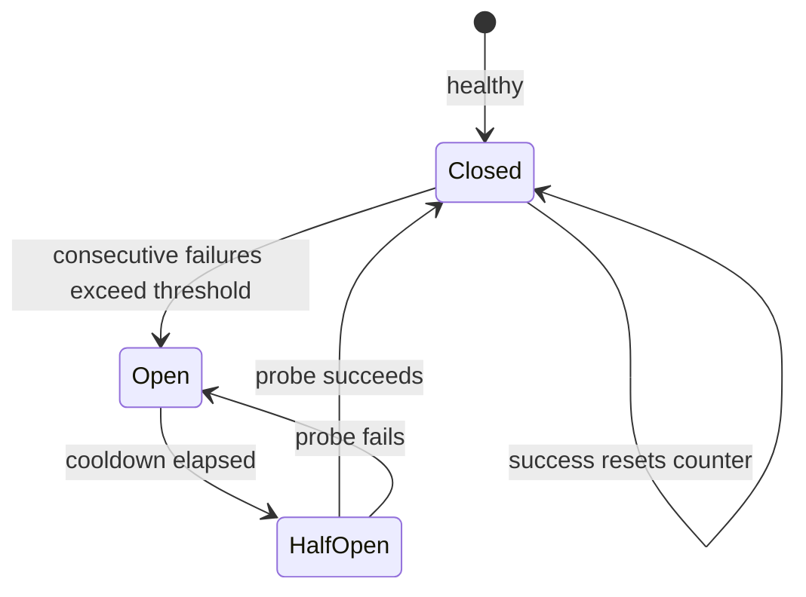
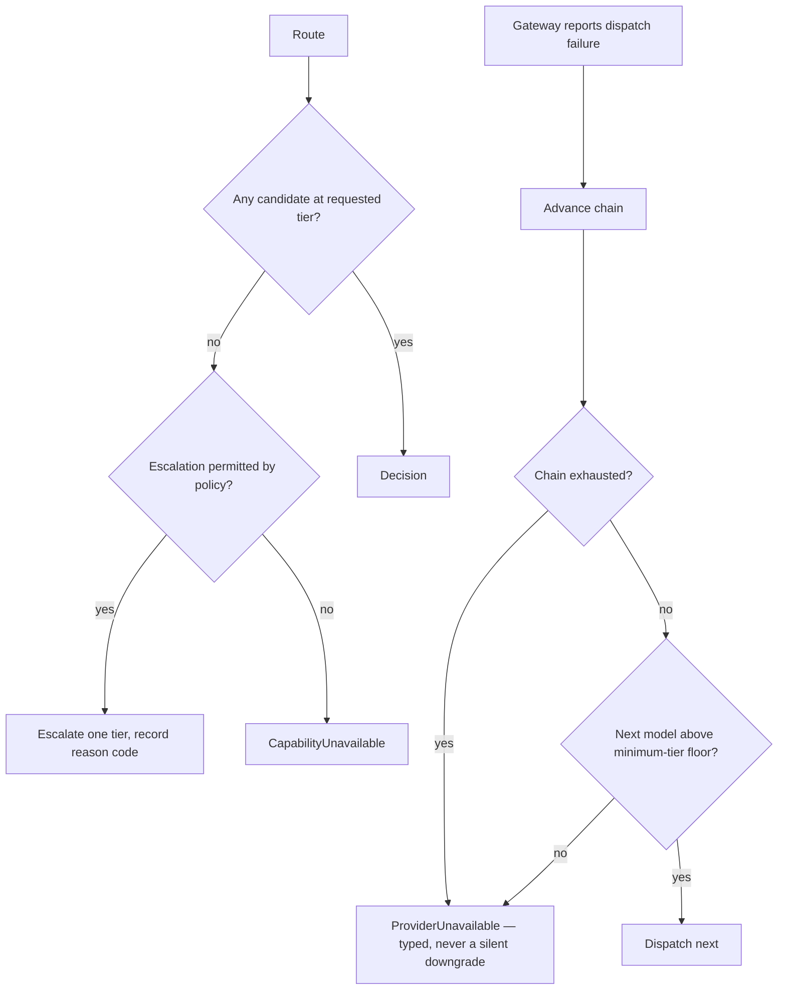

# Model Router

> **Status:** v2.0 — complete. Rewritten to remove provider and model names from architecture; the concrete matrix is policy data in `model-selection.md` (ADR-013).
> **Authority:** ADR-008. The only component that decides which model executes a request.

## Overview

**Business purpose.** The platform's unit economics are a routing problem. The same pipeline can cost three times as much or produce materially better output depending on which tier executes which task, and that trade-off must be adjustable **as versioned policy, without a deploy** — because it will be tuned continuously as models, prices, and evaluation results change.

**Technical purpose.** Turn a request's declared requirements — capability, cost ceiling, latency SLA, context size — into a concrete model handle plus an ordered fallback chain, filtered by live availability and tenant policy, and record the policy version that produced the decision.

**The isolation rule.** Provider identity stops here. Upstream components receive a **`ModelHandle`** describing capabilities — context window, tokenizer, modalities, structured-output support — never a provider name or a vendor model string. That is what makes a provider swap invisible to the rest of the platform.

## Responsibilities

- Evaluating routing inputs against versioned policy.
- Capability matching: refusing a model that cannot satisfy the request's requirements.
- Constructing an ordered fallback chain.
- Maintaining circuit-breaker state per model and per provider.
- Enforcing minimum-tier floors so cost optimization never silently degrades a critical task.
- Recording `policy_version` for reproducibility and audit.
- Exposing routing decisions and health for observability.

## Non-responsibilities

| Not owned | Owner |
|---|---|
| Dispatching the request | `ai-gateway.md` |
| Provider authentication, transport, endpoint shapes | `provider-adapters.md` port; `09-integrations/` adapters |
| Retry timing and backoff | `retry-strategy.md` — the Router supplies the chain, not the schedule |
| Rate-limit admission | `rate-limiting.md` |
| The concrete model matrix | `model-selection.md` — **policy data**, consumed here |
| What a `task_type` means | The calling engine |
| Cost accounting | `cost-management.md` |

**The Router selects; the Gateway dispatches; the retry strategy decides when to advance the chain.** Three components, three decisions, no overlap.

## Inputs

```ts
interface RoutingRequest {
  taskType: string;                  // opaque routing key
  tenantId: string;
  tierHint?: TierName;               // caller's preference, not a command
  requirements: {
    minContextTokens: number;        // computed from the request's context refs
    structuredOutput: boolean;
    modalities: ('text' | 'image')[];
    determinismRequired: boolean;    // forces temperature-0-capable models
  };
  budget: { maxCostUsd: number };
  latencySla?: number;
  excludeModels?: string[];          // set by the Gateway when advancing a chain
}
```

**Validation:** `minContextTokens` must be satisfiable by at least one model in policy — otherwise `ContextTooLarge` is returned **before** any dispatch, so an oversized context fails fast rather than truncating silently. `budget.maxCostUsd` must be non-negative; a zero budget is valid and means "cache only."

**Policy inputs, resolved rather than passed:** the versioned routing policy, per-model circuit state, live provider health, and workspace routing overrides from resolved settings (ADR-024). Overrides may express a **tier preference**, never a model identifier — a workspace cannot pin a vendor, because that would leak provider coupling into tenant configuration.

## Outputs

```ts
interface RoutingDecision {
  primary: ModelHandle;
  fallbackChain: ModelHandle[];      // ordered; may be empty
  policyVersion: string;
  tier: TierName;
  reason: RoutingReason[];           // registry-backed codes
  estimatedCostUsd: number;
  minimumTierFloor: TierName;        // below which fallback must not descend
}

interface ModelHandle {
  handle: string;                    // opaque platform identifier, e.g. 'tier.premium.primary'
  capabilities: {
    contextTokens: number;
    tokenizer: string;
    structuredOutput: boolean;
    modalities: string[];
    supportsTemperatureZero: boolean;
  };
  costPer1kTokens: { prompt: number; completion: number };
  typicalLatencyMs: number;
}
```

**No provider name, no vendor model string, anywhere in `ModelHandle`.** The adapter layer resolves a handle to a concrete provider call; nothing upstream can, and nothing upstream needs to.

**Score impact:** none produced or consumed. `policyVersion` flows into the Gateway's scoring metadata as an `algorithmVersion` input (ADR-021).

## Workflow



### Circuit breaker



Circuit state is **per `(model, provider)` and shared across instances via Redis**, so one instance discovering an outage protects all of them. A model with an open circuit is excluded from candidacy entirely — it is never selected as a primary and never appears in a fallback chain.

### Failure branches



**Compensation.** The Router holds no durable state beyond circuit counters, which are self-healing. A routing decision that leads to a failed dispatch is recorded with its failure reason so policy can be evaluated against real outcomes.

## Domain rules

1. **The Router is the only component that selects a model.** No caller, engine, or adapter may.
2. **Provider identity never escapes this component.** Upstream receives `ModelHandle` only.
3. Routing policy is **versioned data**, not code. A change is a policy edit with a version bump and a changelog entry — never a deploy.
4. **Every decision records `policyVersion`**, making any historical call reproducible.
5. **Minimum-tier floors are absolute.** Fallback may descend within policy but never below the floor a task declares — a fact-verification task must never silently fall back to a fast-tier model, because the output would look identical and be materially worse.
6. Tenant overrides express **tier preference only**; a workspace cannot pin a provider or a vendor model.
7. A model failing capability requirements is **excluded, not attempted**. Sending a 200k-token context to a 32k-window model to see what happens is not a strategy.
8. `tierHint` is a **hint**. Policy may override it — for example, escalating a low-confidence classification — and records a reason code when it does.
9. **Budget filtering happens before dispatch.** A model whose estimated cost exceeds the request ceiling is never selected.
10. `taskType` is opaque: policy maps it to a tier, but no code in this component branches on its business meaning.

**Idempotency and determinism.** Given identical inputs, policy version, and health state, routing is **deterministic** — an important property for reproducing a run. Health state is the only non-deterministic input, and it is recorded in the decision's reason codes.

**Concurrency.** Stateless apart from shared circuit state; policy is cached process-wide with an event-driven refresh.

## AI usage

**None.** The Router makes no model calls. A router that consulted a model to choose a model would introduce circular dependency, unbounded latency on the hottest path, and non-determinism into the one component that most needs to be predictable.

## Scoring

Per **ADR-021**: no categories produced or consumed. `policyVersion` is one of the four inputs from which a producing engine composes `algorithmVersion` (`ai-gateway.md` §Scoring). A routing change therefore bumps producers' `algorithmVersion` **without any contract, API, or schema change** — which is precisely the property the contract was designed to guarantee.

## Explainability

The Router emits no Explainability Envelope but produces **routing reason codes** from a registry, which appear in traces and in cost analysis:

| Reason code | Meaning |
|---|---|
| `routing.tier_from_policy` | Tier assigned by task policy |
| `routing.tier_hint_honoured` / `routing.tier_hint_overridden` | Caller preference outcome |
| `routing.escalated_low_confidence` | Escalated a tier under policy |
| `routing.capability_filtered` | Candidates excluded for capability |
| `routing.health_filtered` | Candidates excluded for circuit state |
| `routing.budget_filtered` | Candidates excluded for cost |
| `routing.fallback_engaged` | Chain advanced after dispatch failure |
| `routing.floor_enforced` | Fallback stopped at the minimum-tier floor |

These make "why did this call cost what it cost?" and "why did quality change?" answerable from telemetry rather than by inference.

## Events

Published through the transactional outbox where durable (ADR-020); health signals are transient.

| Event | Producer | Consumers | Payload |
|---|---|---|---|
| `RoutingPolicyChanged` | Policy admin | All instances (cache refresh), Audit, Observability | `{ policyVersion, changedTaskTypes[], actor }` |
| `ModelCircuitOpened` | This component | Observability, Notifications (on-call), Cost dashboards | `{ modelHandle, provider, consecutiveFailures }` |
| `ModelCircuitClosed` | This component | Observability | `{ modelHandle, provider }` |
| `RoutingFloorEnforced` | This component | Observability | `{ taskType, requestedTier, floor }` |

`ModelCircuitOpened` is **critical**: an open circuit on a primary model changes the platform's cost and quality profile immediately, and on-call must know.

**Consumed:** `SettingsUpdated` → refresh tenant overrides; provider health signals from the adapter layer.

## Database impact

| Table | Purpose | Notes |
|---|---|---|
| `routing_policies` | Versioned policy documents: task → tier, tier → model handles, floors, escalation rules | **Reference data**, seeded by migration, immutable per version (ADR-025 exception class) |
| `routing_decisions` | Sampled decisions for policy analysis: task, tier, model, reason codes, outcome | Append-only, sampled (not every call), 90-day retention |

Circuit state lives in **Redis**, not PostgreSQL — it is high-churn, ephemeral, and must be readable in microseconds on the hot path.

**No schema redesign.** Both tables are new to this platform and touch nothing from Phases 2–5.

## APIs

| Surface | Operation |
|---|---|
| Internal (primary) | `ModelRouter.route(request: RoutingRequest) → RoutingDecision` |
| Internal | `ModelRouter.estimate(taskType, tokens) → estimatedCostUsd` — used by the Gateway's `estimate` path |
| Internal | `ModelRouter.health() → ModelHealth[]` — circuit state for dashboards |
| Admin REST | `GET /internal/v1/routing/policy` · `PUT /internal/v1/routing/policy` (versioned, audited) · `GET /internal/v1/routing/health` |
| REST | **None public** |

Policy updates are a **versioned write with a changelog entry**, audited like any configuration change (`04-platform/audit-logs.md`).

## Security

- Routing overrides come from resolved settings and are **tier-only**, so a tenant cannot influence which vendor sees their data — a genuine data-residency and confidentiality concern.
- Policy changes require platform-admin authority and are audit-logged with actor and version.
- Circuit state is shared but carries no tenant data.
- The Router never sees prompt content, context, or completions — it operates purely on requirements and metadata, which minimizes its exposure entirely by construction.
- Reference: `16-security/` for controls; this component defines none of its own.

## Performance

| Concern | Approach |
|---|---|
| Decision latency | **p95 < 5 ms** — pure policy evaluation with no I/O; policy and circuit state are cache-resident |
| Policy cache | Process-wide, refreshed on `RoutingPolicyChanged`, TTL backstop 60 s |
| Circuit state | Redis with a short local cache; a stale-by-seconds circuit is acceptable, a slow one is not |
| Scaling | Stateless; scales with the Gateway |
| Hot path discipline | **No database read on the routing path**, ever |

## Observability

- **Metrics:** `routing_decisions_total{task_type,tier,model}`, `routing_duration_seconds`, `routing_fallbacks_total{reason}`, `model_circuit_state{model}` (gauge), `routing_floor_enforced_total`, `routing_capability_rejections_total`, `estimated_vs_actual_cost_ratio`.
- **Tracing:** routing is a span on every AI call carrying `tier`, `policy_version`, `model`, and reason codes.
- **Logging:** decision summary with reason codes, correlation id — never request content.
- **Business KPIs:** cost per task type by tier, and the **quality-versus-cost frontier** — evaluation scores per tier per task family, which is what justifies a tier downshift (`10-testing/ai-evaluation.md`).
- **Alerts:** any circuit open on a primary model (**page**); fallback rate above baseline; `estimated_vs_actual_cost_ratio` diverging, which means the policy's cost table is stale.

## Cross references

- `model-selection.md` — the concrete matrix this component consumes as policy data (ADR-013)
- `ai-gateway.md` — the caller and dispatcher
- `provider-adapters.md` — resolves a `ModelHandle` to a concrete provider call
- `retry-strategy.md` — decides when the chain advances
- `rate-limiting.md` — admission, distinct from routing
- `cost-management.md` — cost tables feeding budget filtering
- `04-platform/settings.md` — tenant tier overrides (ADR-024)
- `10-testing/ai-evaluation.md` — validates every tier change before policy adoption
- `01-system-architecture/13-adr-log.md` — ADR-008, ADR-013
