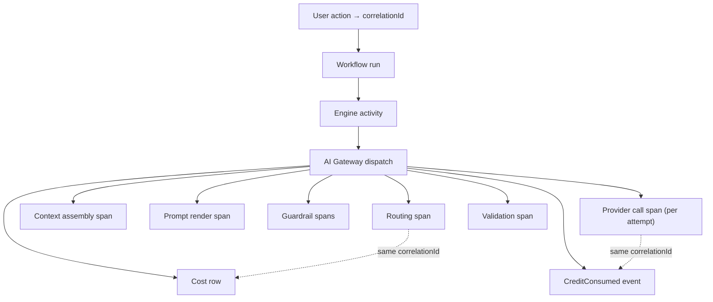
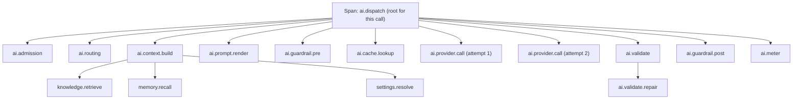
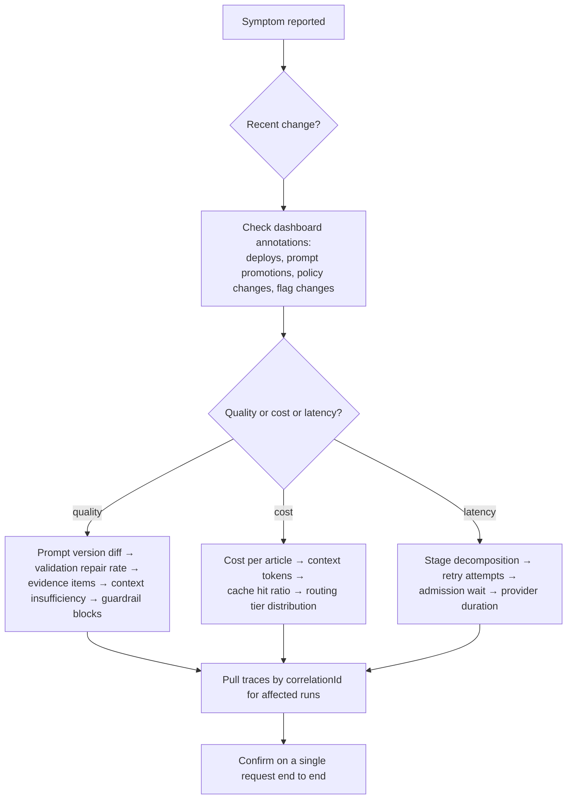

# AI Platform Observability

> **Status:** v1.0 — complete. New in Phase 6. The final document of the AI Platform.
> **Scope boundary:** this document owns **AI-specific** telemetry — the signals unique to model execution. Platform-wide SLOs, the telemetry pipeline, dashboards, and alert routing are `14-operations/monitoring.md`, and this document feeds them rather than restating them.

## Overview

**Business purpose.** AI execution fails in ways that produce no errors. A prompt regression returns HTTP 200 with worse content. A cache-key change triples the bill while every dashboard stays green. A routing change silently downgrades a task tier. A context regression halves grounding quality. None of these appear in latency or error-rate monitoring, and all of them are expensive — which is why AI observability is a distinct discipline rather than a subsection of application monitoring.

**Technical purpose.** Instrument every stage of the AI pipeline so that quality, cost, and reliability regressions are **attributable to a specific version of a specific thing** — a prompt version, a policy version, a model, a context profile — within minutes rather than through archaeology.

**Design posture — attribution over aggregation.** A single number ("AI is slow") is nearly useless. Every signal here carries the dimensions needed to answer *which* prompt version, *which* task type, *which* tier, *which* tenant.

## The correlation contract

**Every AI request carries a `correlationId`, propagated to every span, log line, metric exemplar, cost row, and event it produces.** This is not a convention — it is the mechanism that makes the entire platform diagnosable.



Given a `correlationId`, these questions are one query each:

| Question | Resolved by |
|---|---|
| What did this user action cost? | Sum `ai_call_costs` by correlation id |
| Why was it slow? | Span breakdown: queue, context, provider, retries |
| Which prompt versions ran? | Span attributes across the trace |
| Was anything blocked, repaired, or retried? | Guardrail, validation, and attempt spans |
| Which models executed it? | Routing and provider spans |

**Mandatory span attributes on every AI span:** `correlationId`, `tenant_id`, `organization_id`, `task_type`, and — where applicable — `model`, `prompt_version`, `policy_version`, `cache_hit`, `attempt`.

## Metric catalogue

Organized by the question each group answers. All follow the platform's naming conventions (`14-operations/monitoring.md` §5).

### Execution and latency

| Metric | Type | Dimensions |
|---|---|---|
| `ai_calls_total` | counter | `task_type`, `model`, `outcome` |
| `ai_call_duration_seconds` | histogram | `task_type`, `model` |
| `ai_gateway_overhead_seconds` | histogram | — |
| `ai_stage_duration_seconds` | histogram | `stage` (routing, context, prompt, guardrail, provider, validation) |
| `ai_time_to_first_token_seconds` | histogram | `model` (streaming) |
| `ai_inflight_calls` | gauge | `model_class` |

**Stage decomposition is the highest-value latency signal.** "The call took 8 s" is not actionable; "context assembly took 5.2 s of 8 s" is. Without per-stage timing, every latency investigation starts by blaming the provider.

### Token usage and cost

| Metric | Type | Dimensions |
|---|---|---|
| `ai_tokens_total` | counter | `direction` (prompt/completion), `model`, `task_type` |
| `ai_cost_usd_total` | counter | `task_type`, `model` |
| `cost_per_article_usd` | histogram | `article_type` |
| `ai_context_tokens` | histogram | `task_type` |
| `ai_output_tokens` | histogram | `task_type` |
| `estimated_usage_ratio` | gauge | `provider_class` |
| `cache_savings_usd` | counter | `task_type` |
| `budget_rejections_total` | counter | `scope` |

`ai_context_tokens` is a leading indicator that deserves its own alert: **context size is the input that most often grows silently** — a prompt change, a retrieval-policy tweak, or an evidence-volume increase inflates it, and cost follows within hours.

### Cache

| Metric | Type | Dimensions |
|---|---|---|
| `ai_cache_hit_ratio` | gauge | `task_type` |
| `ai_cache_lookups_total` | counter | `task_type`, `result` |
| `ai_cache_evictions_total` | counter | — |
| `context_cache_hit_ratio` | gauge | `task_type` |
| `memory_recall_cache_hit_ratio` | gauge | — |

**Cache hit ratio is the platform's single largest cost lever**, which makes a sudden drop a cost incident before it is anything else. The most common cause is a cache-key regression — a change to prompt version, model handle, or normalization that invalidates everything without anyone intending to.

### Routing and provider health

| Metric | Type | Dimensions |
|---|---|---|
| `routing_decisions_total` | counter | `task_type`, `tier`, `model` |
| `routing_duration_seconds` | histogram | — |
| `routing_fallbacks_total` | counter | `reason` |
| `routing_floor_enforced_total` | counter | `task_type` |
| `provider_requests_total` | counter | `provider`, `outcome` |
| `provider_duration_seconds` | histogram | `provider` |
| `model_circuit_state` | gauge | `model` (0 closed, 1 half-open, 2 open) |
| `provider_capacity_utilization` | gauge | `provider_class` |

### Retries and failures

| Metric | Type | Dimensions |
|---|---|---|
| `retries_total` | counter | `task_type`, `failure_class`, `outcome` |
| `retry_attempts` | histogram | `task_type` |
| `retry_exhausted_total` | counter | `failure_class` |
| `fallback_chain_exhausted_total` | counter | `task_type` |
| `deadline_exceeded_total` | counter | `task_type` |
| `safety_refusals_total` | counter | `task_type`, `prompt_version` |

### Guardrails and validation

| Metric | Type | Dimensions |
|---|---|---|
| `guardrail_checks_total` | counter | `control`, `phase`, `outcome` |
| `guardrail_blocks_total` | counter | `control`, `reason_code` |
| `pii_redactions_total` | counter | `type` |
| `injection_attempts_total` | counter | — |
| `cross_tenant_detections_total` | counter | — |
| `validation_failures_total` | counter | `stage`, `reason_code` |
| `validation_repairs_total` | counter | `attempts` |
| `validation_repair_success_ratio` | gauge | `prompt_version` |
| `citation_fabrication_total` | counter | `prompt_version` |

**`validation_repair_success_ratio` by prompt version is a quality signal available before evaluation runs.** A version needing frequent repair is producing structurally unreliable output, and that is visible in production within hours rather than at the next eval sweep.

### Prompt, context, and memory

| Metric | Type | Dimensions |
|---|---|---|
| `prompt_renders_total` | counter | `template_id`, `version` |
| `prompt_versions_active` | gauge | — |
| `prompt_validation_failures_total` | counter | `reason` |
| `context_build_duration_seconds` | histogram | `task_type` |
| `context_tokens_total` | counter | `segment_kind` |
| `context_insufficient_total` | counter | `task_type` |
| `context_omissions_total` | counter | `reason` |
| `context_budget_utilization` | histogram | `task_type` |
| `memory_fragments_returned` | histogram | `scope` |
| `memory_stale_ratio` | gauge | — |
| `evidence_items_included` | histogram | `task_type` |

**`evidence_items_included` is a grounding-quality leading indicator.** If it declines, citation quality declines a stage later and gate blocks rise a stage after that. Watching it means seeing the cause rather than the symptom.

### AI Council

| Metric | Type | Dimensions |
|---|---|---|
| `council_sessions_total` | counter | `mode`, `agreement` |
| `council_duration_seconds` | histogram | `mode` |
| `council_cost_usd` | counter | `mode` |
| `council_degraded_total` | counter | `reason` |
| `council_dissent_ratio` | gauge | `task_type` |
| `council_distinct_families` | histogram | — |

`council_degraded_total` is **critical**: a degraded council means the platform is delivering less rigour than configured while still reporting a council ran (ADR-019).

### Rate limiting

| Metric | Type | Dimensions |
|---|---|---|
| `rate_limit_decisions_total` | counter | `dimension`, `outcome` |
| `rate_limit_utilization` | gauge | `dimension` |
| `rate_limit_queue_wait_seconds` | histogram | `dimension` |
| `tenant_capacity_share` | gauge | `tenant_top_n` |
| `admission_duration_seconds` | histogram | — |

## Cardinality discipline

`tenant_id` is on **every trace and log line** but on **almost no metric**. Unbounded tenant labels on high-frequency metrics would make the metrics store cost more than the platform it observes.

| Dimension | Metrics | Traces | Logs |
|---|---|---|---|
| `tenant_id` | **Top-N only**, curated | Always | Always |
| `task_type` | Yes — bounded, ~40 values | Yes | Yes |
| `model` | Yes — bounded | Yes | Yes |
| `prompt_version` | **Selected metrics only** | Yes | Yes |
| `correlationId` | Never (exemplars only) | Always | Always |

Per-tenant investigation happens in **traces and logs**, where cardinality is naturally bounded by retention. The label allowlist is enforced at the collector, which drops unapproved high-cardinality labels rather than letting the store fall over.

## Tracing



**Each retry attempt is its own child span.** A 12-second call visibly decomposes into three attempts with backoff between them, rather than appearing as one slow provider — the difference between diagnosing a provider problem and diagnosing a retry-policy problem.

**Sampling:** 10% for routine calls; **100% for** any call that errored, was retried, was blocked, failed validation, invoked the Council, or exceeded a cost threshold. The expensive and diagnostically valuable paths are always fully traced; high-volume fast-tier classification is sampled.

## Structured logging

One line per AI call, plus lines for exceptional events.

```json
{
  "level": "info",
  "event": "ai.call.completed",
  "correlation_id": "01J8...",
  "tenant_id": "01J7...",
  "task_type": "planning.outline_synthesize",
  "model": "tier.premium.primary",
  "prompt_version": "planning.outline@7",
  "policy_version": "routing@2026-07-12",
  "tokens": { "prompt": 12480, "completion": 2210 },
  "cost_usd": 0.0412,
  "duration_ms": 4120,
  "attempts": 1,
  "cache_hit": false,
  "context_tokens": 12100,
  "evidence_items": 14
}
```

**Prohibited in logs, without exception:** prompt text, context content, completions, evidence excerpts, memory values, variable values, provider payloads, credentials. Only identifiers, versions, counts, and outcomes.

That restriction is why the diagnostic dimensions above are exhaustive — when content is unloggable, metadata has to carry the entire diagnostic burden.

## SLIs and SLOs

AI-specific indicators feeding the platform SLO catalogue (`14-operations/monitoring.md` §4):

| SLI | Target | Window | Rationale |
|---|---|---|---|
| AI call success rate (post-retry) | ≥ 99.5% | 7 d | What the caller experiences after recovery |
| Gateway overhead | p95 < 50 ms | 7 d | The platform's own cost on the hot path |
| Fast-tier call latency | p95 < 3 s | 7 d | Classification and extraction feel instant |
| Premium-tier call latency | p95 < 30 s | 7 d | Reasoning is allowed to take time |
| Validation success rate (first attempt) | ≥ 95% | 7 d | Below this, prompts are structurally unreliable |
| Admission wait | p95 < 500 ms | 7 d | Contention should be invisible at normal load |
| **Citation fabrication rate** | **0** | Always | **Invariant, not an SLO — no error budget** |
| **Cross-tenant detections** | **0** | Always | **Invariant** |
| **Council diversity satisfied when invoked** | **100%** | Always | **Invariant** — a degraded council must be disclosed, never silent |

The last three have **no error budget**. A "0.1% acceptable rate" of fabricated citations or cross-tenant references is not a coherent position for this product, and they are monitored as invariant breaches that page immediately.

## Dashboards

| Dashboard | Audience | Answers |
|---|---|---|
| **AI execution health** | On-call | Success rate, latency by stage, retry rate, circuit states, admission wait |
| **AI cost** | Founder, AI engineer | Cost per article, cost by task type and tier, cache hit ratio, context-token trend, budget consumption |
| **Prompt quality** | AI engineer | Repair rate and validation failures by prompt version, evaluation scores, promotion history |
| **Grounding quality** | AI engineer, content | Evidence items per call, context insufficiency, citation fabrication, guardrail blocks |
| **Council** | AI engineer | Sessions, agreement distribution, dissent ratio, degradation, cost share |
| **Capacity** | On-call, DevOps | Provider utilization, queue depth, tenant capacity share, saturation periods |

**Prompt version and policy version are dashboard annotations**, alongside deploy markers — during an incident, "did we promote a prompt?" is as important as "did we deploy?", and both belong on the same timeline (`14-operations/deployment.md` §13).

## Alert strategy

Alerts map to a symptom and a runbook; everything else is a dashboard.

| Alert | Severity | Signal |
|---|---|---|
| `CreditConsumed` in DLQ | **Page** | Unmetered spend — revenue loss |
| Citation fabrication non-zero | **Page** | Invariant breach; grounding compromised |
| Cross-tenant detection non-zero | **Page** | Isolation breach (SEV1 candidate) |
| Credential detected in context | **Page** | Upstream defect already produced a dangerous condition |
| Council degraded | **Page** | Delivering less rigour than configured |
| Circuit open on a primary model | **Page** | Cost and quality profile changed immediately |
| Fallback chain exhausted, sustained | **Page** | No healthy model for a task type |
| Cost per article > 2× 7-day baseline | **Page** | Usually a prompt or context regression |
| Cache hit ratio drop > 20 points | Investigate | Likely a cache-key regression |
| Validation repair rate above threshold, by prompt version | Investigate | Prompt regression |
| Context tokens trending up on a task type | Investigate | Silent cost growth |
| Safety refusals rising for a prompt version | Investigate | Prompt problem; route to evaluation |
| Admission wait above SLO | Investigate | Capacity contention |
| `estimated_usage_ratio` rising | Investigate | Metering accuracy degrading |

**The cost alert pages.** AI spend is the platform's dominant variable cost, a doubling is a margin event, and it produces no errors — which makes it exactly the class of failure that goes unnoticed without an explicit alarm.

## Incident diagnostics

A deliberate order of investigation, because AI incidents rarely announce their cause:



**The first question is always "what changed?"** — and in this platform a change is more often a prompt promotion or a routing-policy edit than a deploy, which is precisely why both are dashboard annotations.

**The last step matters.** Aggregate metrics identify a pattern; a single trace confirms the mechanism. An investigation that stops at aggregates produces plausible theories rather than causes.

Playbooks P1 (model provider degraded) and P9 (prompt or model quality regression) in `14-operations/incident-response.md` consume these signals directly.

## Events

Observability **consumes** signals rather than producing domain events. Two exceptions, both about the telemetry itself:

| Event | Producer | Consumers | Payload |
|---|---|---|---|
| `AIQualitySignalDegraded` | Detector job | Notifications, Evaluation harness | `{ signal, taskType, promptVersion, baseline, observed }` |
| `AICostAnomalyDetected` | Detector job | Notifications, Cost dashboards | `{ dimension, baseline, observed, window }` |

Both are emitted through the outbox (ADR-020) and feed the evaluation harness, so a production-detected regression becomes an evaluation case rather than a one-off fix.

## Database impact

**This component owns no tables.** It reads:

| Source | Owner |
|---|---|
| `ai_call_costs`, `ai_cost_rollups` | `cost-management.md` |
| `validation_failures` | `response-validation.md` |
| `guardrail_violations` | `guardrails.md` |
| `council_sessions`, `council_positions` | `ai-council.md` |
| `routing_decisions` | `model-router.md` |
| Metrics, traces, logs | The telemetry pipeline (`14-operations/monitoring.md`) |

Analytical queries run against a **replica**; a dashboard must never be able to degrade the AI execution path. **No schema impact.**

## Scoring

Per **ADR-021**: no categories produced or consumed. Observability tracks the **operational** dimensions of scoring — how often scores are emitted, how often the contract is violated, how score values trend after an `algorithmVersion` bump — without producing or interpreting a Score.

That last signal is the important one: a category's mean value shifting sharply after a version bump indicates a regression the evaluation harness should have caught, and this is the production backstop for it (ADR-021 §15).

## Security

- **No content in telemetry, ever** — the prohibition list is enforced by the logging serializer, which redacts by key at any depth and is unit-tested (`10-testing/unit-testing.md` §11).
- `tenant_id` in telemetry is an **identifier, not content** — safe to log, essential for isolation forensics.
- Security-relevant AI signals route to the security channel: cross-tenant detections, credential detections, injection attempts, safety refusals.
- Cost telemetry reveals margin internally and activity volume per tenant; dashboards carrying per-tenant data require operator roles and access is audited.
- Trace and log retention follows platform policy (14 and 30 days); AI telemetry is not retained longer, since it can contain sensitive metadata even without content.
- Reference `16-security/`; this component defines no controls of its own.

## Performance

| Concern | Approach |
|---|---|
| Instrumentation overhead | **< 3%** of AI call latency — sampling, batched export, no synchronous telemetry I/O |
| Cardinality | Collector-enforced label allowlist; tenant labels only on curated metrics |
| Trace volume | 10% sampled, 100% on exceptional paths |
| Dashboards | Read pre-aggregated recording rules and rollups, never raw cost rows |
| Failure isolation | Telemetry buffers with bounded memory and drops rather than blocking; **the AI path never fails because observability failed** |

## Cross references

- `14-operations/monitoring.md` — the platform telemetry pipeline, SLO catalogue, and alert routing this document feeds
- `14-operations/incident-response.md` — playbooks P1 and P9, which consume these signals
- `ai-gateway.md` — emits the root span and the correlation contract
- `cost-management.md` · `rate-limiting.md` · `retry-strategy.md` · `guardrails.md` · `response-validation.md` · `ai-council.md` — the components instrumented here
- `model-router.md` · `prompt-engine.md` · `context-builder.md` · `ai-memory.md` — version and quality signals
- `10-testing/ai-evaluation.md` — offline evaluation; this document is its online counterpart
- `01-system-architecture/14-scoring-contract.md` §15 — the scoring observability this complements
