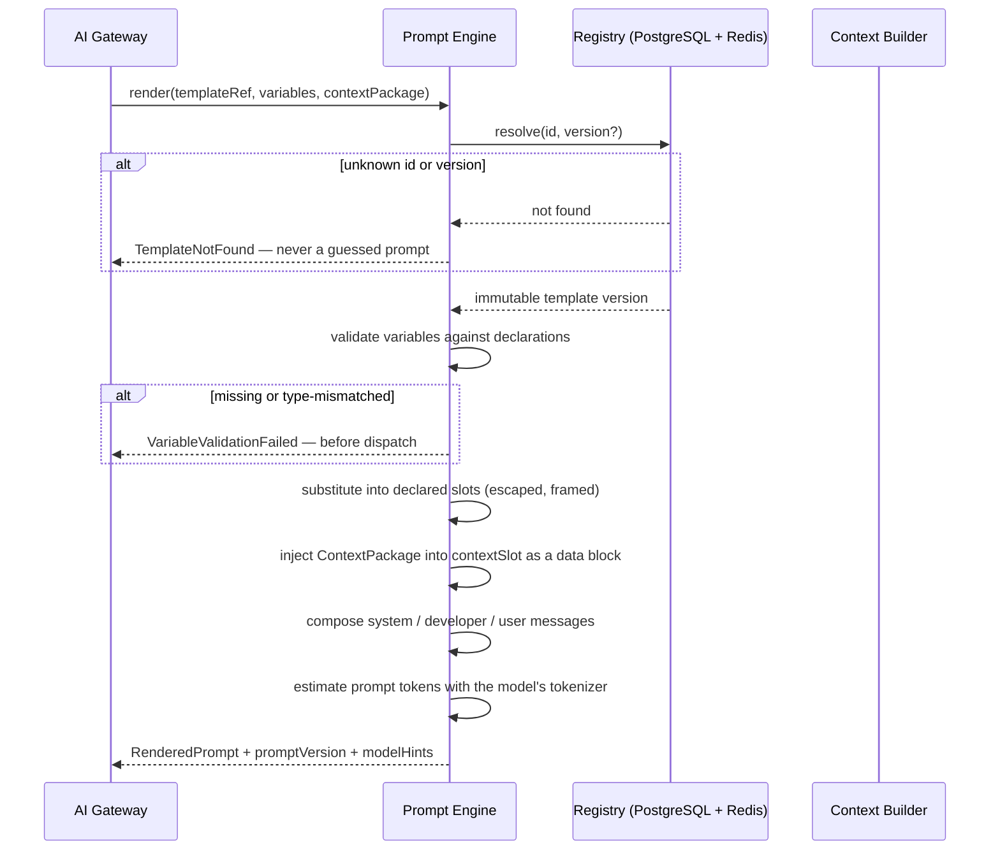
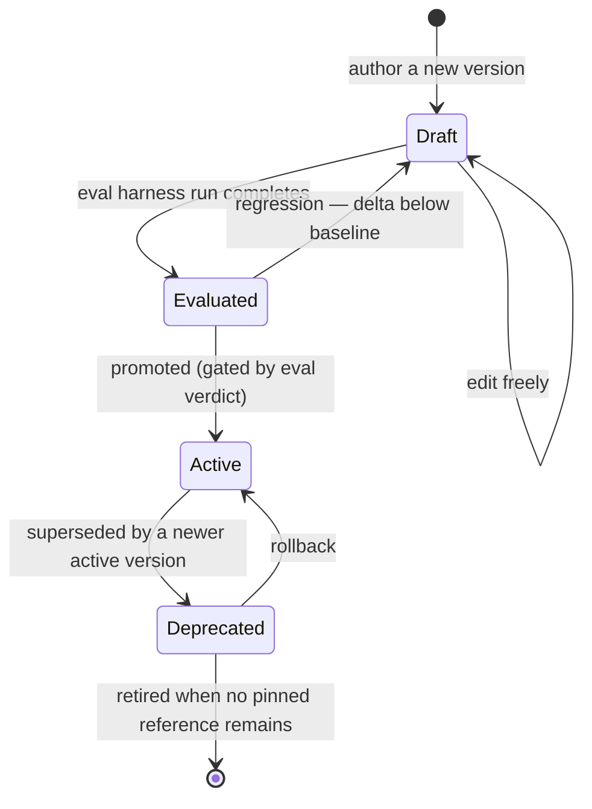
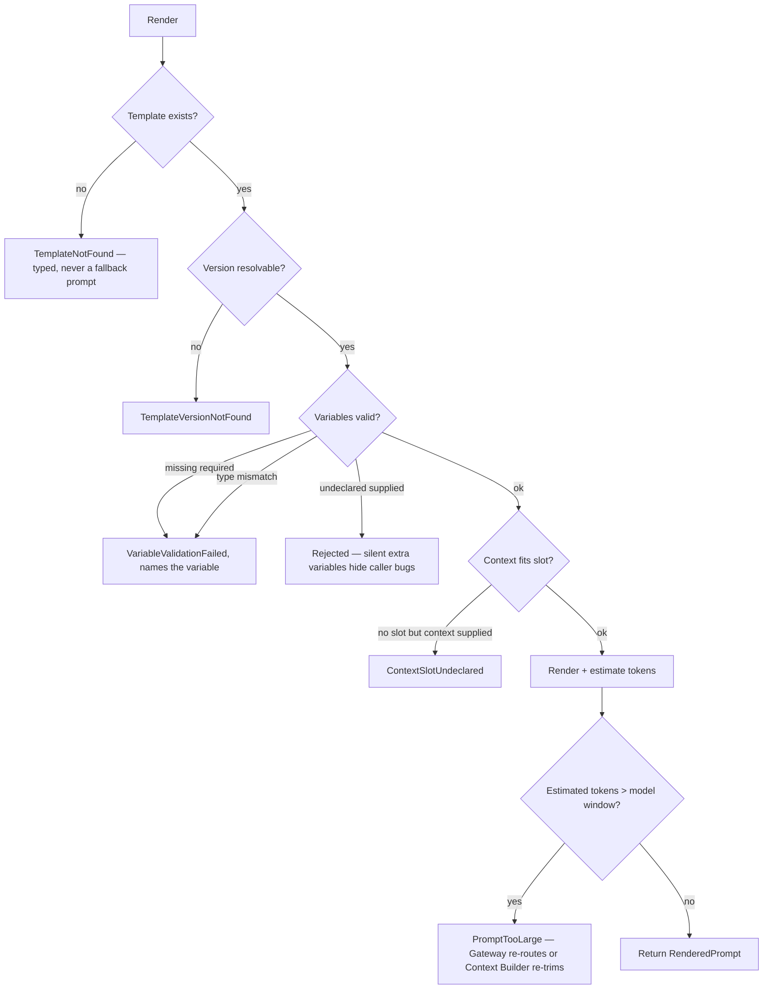

# Prompt Engine

> **Status:** v2.0 — complete. Rewritten for ADR-020, ADR-021, and Phases 2–5. Supersedes v1.0.
> **Position in the pipeline:** Context Builder → **Prompt Engine** → Provider Adapter. It renders; it does not retrieve, route, or dispatch.

## Overview

**Business purpose.** Prompts are the platform's most-edited production artifact and its least-governed one if left as inline strings. A prompt scattered across an engine cannot be A/B tested, rolled back, audited, or evaluated — which means quality changes arrive as mysteries and regressions are discovered by customers. Making prompts versioned data is what allows the platform to improve output quality deliberately rather than accidentally.

**Technical purpose.** Maintain a versioned registry of named prompt templates, resolve a `templateRef` to an immutable version, substitute typed variables safely, and return a rendered prompt together with the metadata that makes the call reproducible.

**Design posture — prompts are data.** A template is a versioned artifact with a lifecycle, an owner, an evaluation set, and a promotion gate, exactly like a database migration or an ADR. Nothing in this component is compiled into an engine.

## Responsibilities

- Template storage, resolution, and the versioning lifecycle.
- Typed variable declaration and safe substitution.
- Message composition: system, developer, and user parts, with the context slot placed correctly.
- Prompt metadata: model hints, sampling parameters, output schema reference, evaluation set reference.
- Rendering validation — failing **before** dispatch rather than producing a malformed model call.
- Promotion and rollback, gated by the evaluation harness.
- Per-tenant overlays where policy permits.

## Non-responsibilities

| Not owned | Owner |
|---|---|
| **Business rules of any kind** | The calling engine, or `04-platform/settings.md` |
| Knowledge retrieval or evidence selection | `context-builder.md`, `11-knowledge-platform/` |
| Model selection | `model-router.md` |
| Dispatch | `ai-gateway.md` |
| Whether output is acceptable | `response-validation.md`, `guardrails.md` |
| Running evaluations | `10-testing/ai-evaluation.md` — this component exposes the hook and honours the verdict |
| Notification or UI copy templates | `04-platform/notifications.md` — a different registry with a different lifecycle |

**The business-rule boundary, stated precisely.** A template may contain *instruction* — "produce a section with an introductory sentence, supporting detail, and a concluding transition." It may **not** contain *policy* — "if the content type is YMYL, require three citations per claim." The first is how to write; the second is a threshold that belongs in resolved settings and is enforced by the Review Engine. The test: if changing the rule should change a gate verdict or a customer's configuration, it is not a prompt concern.

## Inputs

```ts
interface RenderRequest {
  templateRef: { id: string; version?: number };   // version omitted = latest active
  variables: Record<string, unknown>;
  context?: ContextPackage;                        // from the Context Builder
  tenantId: string;
  overlayPermitted: boolean;                       // from resolved settings
  correlationId: string;
}
```

**Validation, in order:** the template id exists; the requested version exists and is `active` or explicitly pinned; every declared variable is present and type-conformant; no undeclared variable is supplied; the context package fits the declared context slot. Any failure returns a typed error **before** dispatch — a malformed prompt must never reach a provider, because it costs money and produces plausible-looking garbage.

**Ownership.** Variables are supplied by the caller and are **untrusted data**. They are substituted into declared slots with escaping and framing, never concatenated into instruction text.

## Outputs

```ts
interface RenderedPrompt {
  messages: NormalizedMessage[];        // system / developer / user parts
  promptVersion: string;                // 'planning.outline@7'
  modelHints: {
    preferredTier: TierName;
    maxOutputTokens: number;
    temperature: number;
    seed?: number;
    determinismRequired: boolean;
  };
  outputSchemaRef?: string;             // resolved by response-validation
  estimatedPromptTokens: number;
  templateMetadata: { owner: string; evalSetRef: string; contractVersion: number };
}
```

**Score impact:** none produced. `promptVersion` is one of the four inputs from which a producing engine composes `algorithmVersion` (ADR-021) — so a prompt change bumps a producer's `algorithmVersion` and **nothing else changes**: no contract, no API, no schema.

## Template anatomy

```ts
interface PromptTemplate {
  id: string;                           // dot.case, stable forever: 'planning.outline'
  version: number;                      // monotonic; immutable once active
  taskType: string;                     // links to routing policy — opaque here
  status: 'draft' | 'evaluated' | 'active' | 'deprecated';

  parts: {
    system: string;                     // role, constraints, output expectations
    developer?: string;                 // platform-level invariants
    user: string;                       // the task, with variable slots
  };
  contextSlot?: {                       // where the ContextPackage is injected
    position: 'before_user' | 'after_user';
    framing: 'data_block';              // ALWAYS data framing — never instruction
  };

  variables: VariableDeclaration[];     // typed, with required/optional and constraints
  modelHints: { preferredTier; maxOutputTokens; temperature; seed?; determinismRequired };
  outputSchemaRef?: string;
  evalSetRef: string;                   // mandatory — no template ships unevaluated
  owner: string;
  changelog: string;
}

interface VariableDeclaration {
  name: string;
  type: 'string' | 'number' | 'boolean' | 'enum' | 'string[]' | 'object';
  required: boolean;
  maxLength?: number;
  enumValues?: string[];
  description: string;
}
```

`evalSetRef` is **mandatory on every template**. A template with no evaluation set cannot be promoted, which is what prevents the registry from accumulating prompts nobody can safely change.

## Workflow



### Version lifecycle



**Only one `active` version per template id at a time.** Resolution without an explicit version returns that one. Workflows **pin at run start**, so a promotion mid-run cannot alter behaviour (`orchestration.md`).

### Failure branches



**There is no fallback prompt, ever.** A missing or broken template fails the request. Substituting a generic prompt would produce output that looks valid and is untraceable to any version.

## Domain rules

1. **Prompts are data, not code.** No prompt string exists outside this registry; inline prompt literals fail a lint rule in CI.
2. **An `active` version is immutable.** Fixes ship as a new version. Editing an active prompt would silently change every historical call's provenance.
3. `evalSetRef` is mandatory; promotion is gated by the evaluation harness (`10-testing/ai-evaluation.md`) and blocked on regression beyond tolerance.
4. **Variables are untrusted data**, substituted into declared slots with escaping — never concatenated into instructions.
5. **The context slot is always framed as a data block.** Retrieved evidence and memory are never injected as instruction text (`guardrails.md`).
6. Undeclared variables are **rejected**, not ignored — a silently dropped variable is a caller bug that would otherwise surface as unexplained quality loss.
7. **No business rule may appear in a template.** Thresholds, policies, and conditional business behaviour belong in settings and engines.
8. Template ids are **stable forever**. Renaming breaks every pinned reference and every historical record.
9. Rendering is **deterministic**: identical template version plus identical variables plus identical context yields byte-identical output.
10. Per-tenant overlays may adjust phrasing within declared bounds; they may **not** alter instructions, output schema, or model hints, and are disabled by default.

**Idempotency:** rendering is pure. **Concurrency:** stateless; the registry is read-mostly and cache-resident.

## AI usage

**None.** The Prompt Engine issues no model calls. It composes the input to one.

An earlier proposal to use a model to auto-improve prompts was rejected for this component: prompt improvement is an offline, evaluated activity (`10-testing/ai-evaluation.md`), not a runtime behaviour. A prompt that rewrites itself at dispatch time is unversioned by definition.

## Scoring

Per **ADR-021**: no categories produced or consumed. `promptVersion` feeds `algorithmVersion`. The practical consequence is the contract's core promise: **a prompt rewrite changes `algorithmVersion` and requires no contract, API, schema, or consumer change.**

## Explainability

The Prompt Engine emits no Explainability Envelope. It supplies the **reproducibility anchor**: given a `promptVersion` from any historical `AIResponse`, the exact template version, its parts, its variable declarations, its model hints, and its changelog are retrievable — permanently, because active versions are immutable.

This is what makes "why did quality change last Tuesday?" answerable: diff the prompt versions in force.

## Events

Published through the transactional outbox in the state-changing transaction (ADR-020).

| Event | Producer | Consumers | Payload | Retry / DLQ |
|---|---|---|---|---|
| `PromptVersionCreated` | This component | Evaluation harness, Audit | `{ templateId, version, owner }` | Standard |
| `PromptVersionPromoted` | This component | **All instances (cache purge)**, Semantic cache (invalidate), Audit, Observability | `{ templateId, version, previousVersion, actor }` | **Critical — a stale cache serves an old prompt** |
| `PromptVersionRolledBack` | This component | All instances, Semantic cache, Notifications, Audit | `{ templateId, version, from, actor, reason }` | **Critical** |
| `PromptVersionDeprecated` | This component | Observability | `{ templateId, version }` | Standard |

**Consumed:** `EvalRunCompleted` (from the evaluation harness) → record the verdict against the candidate version and permit or block promotion.

**Promotion invalidates the semantic cache for that template**, because the cache key includes `prompt_version` — entries for the old version become unreachable naturally, but the invalidation event lets instances drop them eagerly rather than waiting for TTL.

## Database impact

| Table | Purpose | Notes |
|---|---|---|
| `prompt_templates` | Template identity: id, task type, owner, current active version | Platform-owned reference data (ADR-025 exception class) |
| `prompt_template_versions` | PK `(template_id, version)`; parts, variables, model hints, schema ref, eval set ref, status, changelog | **Append-only and immutable once active**; `UPDATE`/`DELETE` revoked at role level |
| `prompt_overlays` | Per-tenant phrasing overlays | **Tenant-scoped with RLS** — the one table here carrying `tenant_id` |

**Indexes:** `(template_id, status)` partial on `active` for the dominant resolution path; `(template_id, version)` unique.

**Caching:** active versions cached process-wide with event-driven invalidation; pinned versions cached indefinitely, since they are immutable. Resolution performs **no database read on the hot path**.

**No schema redesign.** All three tables are new to this platform.

## APIs

| Surface | Operation |
|---|---|
| Internal (primary) | `PromptEngine.render(request) → RenderedPrompt` · `.resolve(id, version?) → PromptTemplate` |
| Internal | `PromptEngine.estimateTokens(templateRef, variables, tokenizer) → number` |
| Admin REST | `GET /internal/v1/prompts` · `GET /internal/v1/prompts/{id}/versions` · `POST /internal/v1/prompts/{id}/versions` (create draft) · `POST /internal/v1/prompts/{id}/versions/{v}/promote` · `POST /internal/v1/prompts/{id}/versions/{v}/rollback` |
| Admin REST | `POST /internal/v1/prompts/{id}/versions/{v}/evaluate` — triggers the harness |
| REST | **None public.** Prompts are platform intellectual property and an injection surface if exposed |

Promotion requires platform-admin authority, a passing evaluation verdict, and is audit-logged (OQ-16 governs who approves).

## Security

- **Variables are the primary injection surface reaching a prompt.** They are escaped and confined to declared slots; a variable can never introduce a new instruction, because it is never concatenated into instruction text (`16-security/prompt-injection.md`).
- **The context slot is always a data block** — the single most important structural defence, since retrieved web content arrives through it.
- Templates are **not exposed publicly**: they encode platform know-how and reveal the exact instruction surface an attacker would target.
- Per-tenant overlays are bounded to phrasing and cannot alter instructions, schema, or hints — otherwise a tenant could weaken a safety instruction.
- Promotion and rollback are audit-logged with actor, version, and evaluation verdict.
- Template content never appears in logs, traces, or events — only `promptVersion`.

## Performance

| Concern | Approach |
|---|---|
| Resolution | Cache-resident; **no database read on the hot path** |
| Rendering | Pure string composition; p95 **< 5 ms** |
| Token estimation | Local tokenizer, no network round-trip |
| Cache invalidation | Event-driven on promotion, with a 60 s TTL backstop |
| Scaling | Stateless; scales with the Gateway |

## Observability

- **Metrics:** `prompt_renders_total{template_id,version}`, `prompt_render_duration_seconds`, `prompt_resolution_cache_hit_ratio`, `prompt_validation_failures_total{reason}`, `prompt_versions_active` (gauge), `prompt_promotions_total`, `prompt_rollbacks_total`.
- **Tracing:** rendering is a span on every AI call carrying `template_id`, `prompt_version`, and estimated tokens.
- **Logging:** template id, version, validation outcome, correlation id — **never template or variable content**.
- **Business KPIs:** evaluation score trend per template family (`10-testing/ai-evaluation.md`), and the interval between promotions — a template family that never changes is either perfect or unmeasured.
- **Alerts:** `PromptVersionPromoted` DLQ entries (**instances may serve a stale prompt**); rollback events (notify — a rollback means a regression reached production); validation failure rate rising, which indicates a caller and template drifting apart.

## Cross references

- `ai-gateway.md` — the only caller
- `context-builder.md` — supplies the `ContextPackage` injected into the context slot
- `model-router.md` — consumes `modelHints.preferredTier` as an input, not a command
- `response-validation.md` — consumes `outputSchemaRef`
- `guardrails.md` — owns the data-block framing policy this component applies
- `10-testing/ai-evaluation.md` — the promotion gate
- `04-platform/settings.md` — where business thresholds live instead of in templates
- `01-system-architecture/14-scoring-contract.md` — how `promptVersion` feeds `algorithmVersion`
- `99-open-questions.md` — OQ-16 (promotion approval authority)
