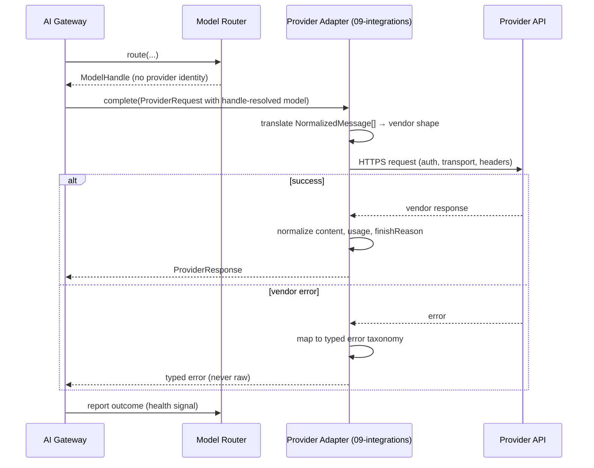
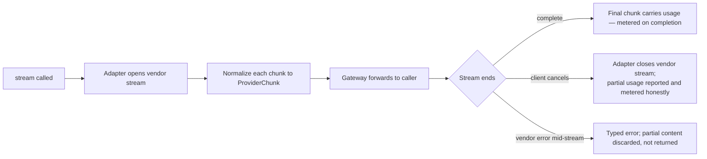

# Provider Adapters — the `ModelProvider` Port

> **Status:** v1.0 — complete. New in Phase 6.
> **Scope boundary:** this document defines the **port** — the interface, capability contract, normalization contract, and error taxonomy every model provider must satisfy. Concrete **adapters** live in `09-integrations/`. The port is architecture; the adapters are integrations.

## Overview

**Business purpose.** Provider independence is a commercial position, not a technical preference. Model pricing changes monthly, capabilities change quarterly, and vendors fail. A platform whose engines depend on a vendor's response shape is negotiating from weakness and cannot adopt a better or cheaper model without a refactor. The port is what converts "switch providers" from a project into a configuration change.

**Technical purpose.** Define a single interface through which the AI Gateway reaches any model, and a normalization contract strict enough that two adapters produce indistinguishable results for equivalent work.

**The isolation chain, completed.** The Router hides provider identity behind `ModelHandle`; this port hides provider *behaviour* behind a uniform contract. Together they mean nothing above the Gateway can tell which vendor executed a request — and nothing needs to.

## Responsibilities

- Defining the `ModelProvider` interface every adapter implements.
- Defining the capability declaration each adapter must publish.
- Defining the normalization contract: how any provider's response becomes an `AIResponse` fragment.
- Defining the **error taxonomy**: how any provider's failure becomes one of a fixed set of typed errors.
- Defining streaming semantics.
- Defining health-probe and capability-discovery requirements.
- Defining the adapter registration and lifecycle contract.

## Non-responsibilities

| Not owned | Owner |
|---|---|
| Concrete adapter implementations | `09-integrations/openrouter.md` and siblings |
| Provider credentials, authentication, transport | `09-integrations/`, `16-security/` |
| Which model to use | `model-router.md` |
| When to retry or advance a chain | `retry-strategy.md` |
| Rate-limit admission | `rate-limiting.md` — adapters *report* limits, they do not enforce platform policy |
| Cost accounting | `cost-management.md` — adapters report usage, they do not price it |
| Response acceptability | `response-validation.md` |

**An adapter translates and reports. It never decides.** No adapter retries on its own schedule, chooses a different model, caches, or interprets content — those are platform decisions made by components that can see the whole picture.

## The port

```ts
interface ModelProvider {
  readonly providerId: string;                 // visible only within the adapter layer
  capabilities(): Promise<ProviderCapabilities>;
  health(): Promise<ProviderHealth>;

  complete(req: ProviderRequest): Promise<ProviderResponse>;
  stream(req: ProviderRequest): AsyncIterable<ProviderChunk>;
  embed?(req: EmbeddingRequest): Promise<EmbeddingResponse>;   // optional capability
  countTokens(text: string, model: string): Promise<number>;
}

interface ProviderRequest {
  model: string;                    // vendor model string — resolved from ModelHandle HERE, not upstream
  messages: NormalizedMessage[];
  params: {
    temperature: number;
    maxOutputTokens: number;
    topP?: number;
    seed?: number;
    stopSequences?: string[];
  };
  structuredOutput?: { schema: JsonSchema; strict: boolean };
  timeoutMs: number;
  idempotencyKey: string;           // passed through where the provider supports it
  correlationId: string;
}

interface ProviderResponse {
  content: string | StructuredContent;
  finishReason: FinishReason;
  usage: { promptTokens: number; completionTokens: number };
  providerMetadata: Record<string, unknown>;   // opaque, retained for diagnostics only
  rateLimitState?: RateLimitState;             // reported, never enforced here
}
```

**`NormalizedMessage` is the platform's message shape**, not any vendor's. Adapters translate to and from it. A vendor introducing a novel message concept is the adapter's problem to map or reject at capability-declaration time — never something that reshapes the platform's interface.

## Capability declaration

Every adapter publishes, per model it exposes:

```ts
interface ModelCapability {
  vendorModel: string;              // adapter-internal
  contextTokens: number;
  maxOutputTokens: number;
  tokenizer: string;
  modalities: ('text' | 'image')[];
  structuredOutput: 'native' | 'best_effort' | 'none';
  supportsTemperatureZero: boolean;
  supportsSeed: boolean;
  supportsStreaming: boolean;
  supportsIdempotencyKey: boolean;
  costPer1kTokens: { prompt: number; completion: number };
  typicalLatencyMs: number;
}
```

**Capabilities are declared, not assumed.** The Router filters candidates on these values, so a mis-declared capability produces a routing decision that cannot succeed. Adapters must verify declarations against the provider at startup where the provider exposes a discovery endpoint, and capability declarations are covered by the nightly live-provider contract suite (`10-testing/integration-testing.md`).

`structuredOutput: 'best_effort'` is deliberately distinct from `'native'`: it tells the Router that schema conformance requires validation-and-repair rather than being guaranteed, which changes both the retry budget and the expected cost of the call.

## Normalization contract

Every adapter must produce output indistinguishable in **shape** from every other adapter:

| Aspect | Rule |
|---|---|
| Content | Plain string, or parsed object when structured output was requested |
| Usage | Prompt and completion tokens, **always populated**. Where a provider omits them, the adapter computes them with the model's tokenizer and marks the response `usageEstimated: true` |
| Finish reason | Mapped to the fixed set: `stop`, `length`, `content_filter`, `tool_call` |
| Whitespace and encoding | Normalized; no vendor-specific leading tokens, markers, or wrappers |
| Errors | Mapped to the taxonomy below — **never a raw provider error object** |
| Metadata | Vendor-specific fields retained in `providerMetadata`, opaque, never interpreted upstream |

**`usageEstimated` matters commercially.** A provider that omits token counts would otherwise produce silent under-metering; marking the estimate keeps reconciliation honest (`cost-management.md`).

## Error taxonomy

The fixed set. Every provider failure maps to exactly one, and the mapping is the adapter's responsibility.

| Typed error | Meaning | Retryable | Chain advance |
|---|---|---|---|
| `ProviderRateLimited` | Provider-side limit hit | Yes, after `Retry-After` | After budget |
| `ProviderUnavailable` | 5xx, connection failure, timeout | Yes | Yes |
| `ProviderTimeout` | Exceeded the request timeout | Yes | Yes |
| `ProviderAuthFailed` | Credential rejected | **No** | Yes — and circuit opens |
| `ProviderBadRequest` | Malformed request | **No** | **No** — our defect, not theirs |
| `ProviderContentFiltered` | Provider refused on safety grounds | **No** | Conditional (see below) |
| `ProviderContextTooLarge` | Input exceeded the window | **No** | Yes, to a larger-window model |
| `ProviderModelUnavailable` | Model retired or unknown | **No** | Yes — and capability refresh triggered |
| `ProviderMalformedResponse` | Unparseable output | Yes, bounded | After repair attempts |

**`ProviderContentFiltered` advances the chain only when policy permits.** A provider refusing content on safety grounds is a signal worth respecting; automatically shopping the same prompt to a more permissive model is exactly the behaviour a responsible platform should not have. Policy decides, and the decision is recorded (`guardrails.md`).

**`ProviderBadRequest` never advances the chain**, because retrying our own malformed request against a different vendor wastes money and hides a bug.

## Workflow



### Streaming



**Partial streamed content is never returned as a complete response.** A mid-stream failure yields a typed error, because a truncated article section that looks complete is worse than a visible failure.

## Domain rules

1. **Only adapters import provider SDKs.** Enforced by import-boundary lint (ADR-010, ADR-012).
2. **Only the AI Gateway invokes this port.** No engine, worker, or platform service may.
3. Adapters **translate and report; they never decide** — no independent retries, no model substitution, no caching, no content interpretation.
4. Every provider error maps to the fixed taxonomy. A raw provider error escaping an adapter is a defect.
5. Usage is **always populated**, estimated where necessary and marked as such.
6. Capabilities are **declared and verified**, never assumed.
7. Vendor model strings are **resolved from `ModelHandle` inside the adapter layer** and never appear above it.
8. `idempotencyKey` is passed through wherever the provider supports it, so idempotency holds even if our record of an attempt is lost mid-flight.
9. An adapter must be **stateless** apart from a connection pool; all shared state (circuit, limits, cache) belongs to platform components.
10. Adding a provider requires **zero change** to any component in `08-ai-platform/`. If it does not, the port is wrong.

**Idempotency:** adapters are pure translators; identical input yields an identical provider call. **Concurrency:** connection pooling per provider with bounded parallelism; adapters never queue internally, since queueing hides back-pressure the platform needs to see.

## AI usage

Adapters *are* the AI usage boundary. They issue no requests of their own and hold no prompts, templates, or context — they receive a fully-rendered request and transmit it.

## Scoring

Per **ADR-021**: no categories produced or consumed. The model identity resolved here feeds the Gateway's scoring metadata as an `algorithmVersion` input. **A provider swap that preserves capabilities changes `algorithmVersion` and nothing else** — no contract, API, or schema change. That is the property this port exists to deliver.

## Explainability

Adapters produce no explanations. They preserve the **diagnostic record**: `providerMetadata` retains vendor request ids and response headers, which is what makes a support conversation with a vendor possible three weeks later. That metadata is opaque to the platform and never influences behaviour.

## Events

| Event | Producer | Consumers | Payload |
|---|---|---|---|
| `ProviderHealthChanged` | Adapter health probe | Model Router (circuit), Observability, Notifications | `{ providerId, status, reason }` |
| `ProviderCapabilityChanged` | Adapter discovery | Model Router (policy validation), Observability | `{ providerId, model, changed[] }` |
| `ProviderRateLimitObserved` | Adapter | Rate limiting (adaptive tuning), Observability | `{ providerId, remaining, resetAt }` |

Health and capability events are **critical**: a retired model that policy still references produces failing routes until the policy is corrected, and `ProviderCapabilityChanged` is how that is caught before customers see it.

Published through the outbox where durable (ADR-020); high-frequency rate-limit observations are transient telemetry.

## Database impact

| Table | Purpose | Notes |
|---|---|---|
| `provider_capabilities` | Last-known declared and verified capabilities per provider and model | Refreshed by discovery; read by the Router at policy validation, **not on the hot path** |
| `provider_health_history` | Health transitions for post-incident analysis | Append-only, 90-day retention |

Live circuit and rate-limit state lives in **Redis**. **No schema redesign**; both tables are new to this platform.

## APIs

| Surface | Operation |
|---|---|
| Internal (the port) | `ModelProvider.complete` · `.stream` · `.embed?` · `.capabilities` · `.health` · `.countTokens` |
| Internal | `ProviderRegistry.resolve(modelHandle) → ModelProvider + vendorModel` |
| Admin REST | `GET /internal/v1/providers` · `GET /internal/v1/providers/{id}/capabilities` · `POST /internal/v1/providers/{id}/probe` |
| REST | **None public** |

## Security

- **Credentials never leave the adapter layer.** They are fetched from the secret manager at the boundary, never logged, never returned, never visible to the Gateway or Router.
- Provider endpoints are fixed configuration, not caller-supplied — there is no path by which a request can direct traffic to an arbitrary host.
- `providerMetadata` is retained for diagnostics but **never surfaced to callers**, since vendor headers can leak account identifiers and internal endpoints.
- Adapters send prompt content to third parties by definition; PII redaction has already run at the Gateway before the adapter is invoked, and adapters must not log the payload they transmit.
- Reference `16-security/` for controls; this port defines none of its own.

## Performance

| Concern | Approach |
|---|---|
| Adapter overhead | **p95 < 10 ms** above provider latency — translation only, no I/O beyond the provider call |
| Connection pooling | Per provider, bounded; keep-alive enabled |
| Streaming | Zero-buffering passthrough; chunks normalized in flight |
| Timeouts | Supplied per request by the Gateway; adapters never extend them |
| Token counting | Local tokenizer where available, avoiding a network round-trip for estimation |

## Observability

- **Metrics:** `provider_requests_total{provider,model,outcome}`, `provider_duration_seconds{provider}`, `provider_errors_total{provider,typed_error}`, `provider_circuit_state{provider}`, `provider_usage_estimated_total`, `provider_rate_limit_remaining{provider}`.
- **Tracing:** one span per provider call carrying `provider`, `vendorModel`, `attempt`, and the vendor request id from `providerMetadata` — the link that makes vendor support tractable.
- **Logging:** provider, model, outcome, typed error, latency, correlation id. **Never the transmitted payload.**
- **Alerts:** any `ProviderAuthFailed` (**page** — credentials broken); `ProviderCapabilityChanged` on a model referenced by active policy; `provider_usage_estimated_total` rising (metering accuracy degrading); circuit open on a primary.

## Cross references

- `09-integrations/openrouter.md` — the reference adapter implementing this port
- `09-integrations/README.md` — the general Provider Layer pattern this specializes
- `model-router.md` — consumes capabilities, owns model selection
- `ai-gateway.md` — the only invoker
- `retry-strategy.md` — consumes the error taxonomy defined here
- `rate-limiting.md` — consumes reported limit state
- `cost-management.md` — consumes usage, including `usageEstimated`
- `01-system-architecture/13-adr-log.md` — ADR-010, ADR-012
- `10-testing/integration-testing.md` — cassette-based adapter contract tests and the nightly live-provider suite
