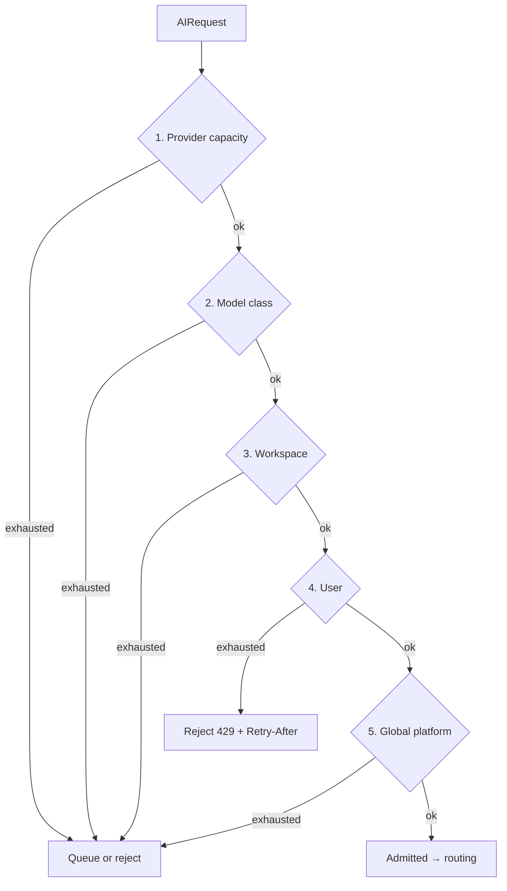
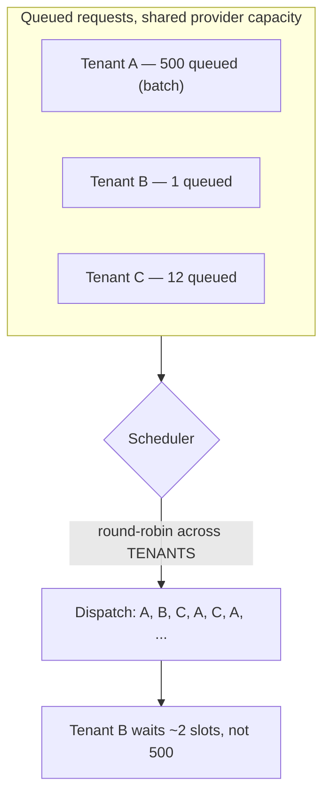
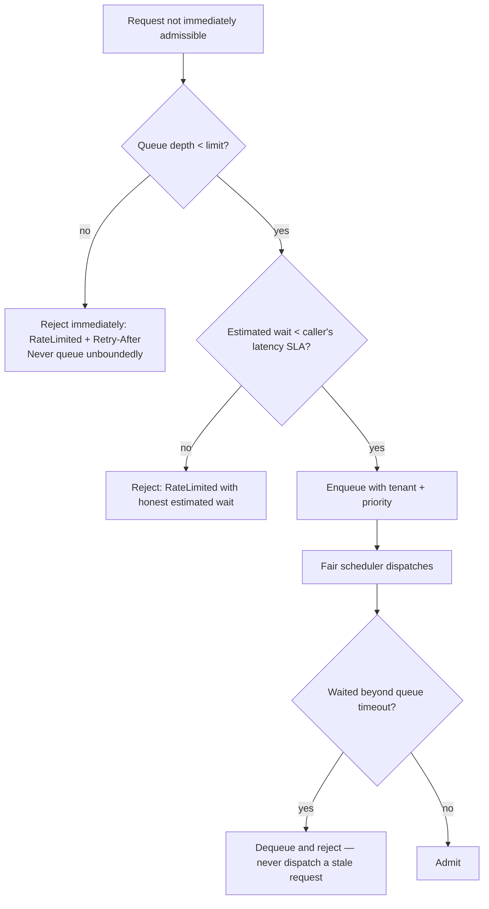

# Rate Limiting

> **Status:** v1.0 — complete. New in Phase 6.
> **Position:** admission control at the AI Gateway, before routing and before any provider is contacted.

## Overview

**Business purpose.** The platform's AI throughput is bounded by provider quota, not by its own capacity. That quota is a shared, finite resource across every tenant, and without deliberate allocation the largest customer consumes it. A five-hundred-article agency batch must not make a solo creator's single article wait an hour — that experience is indistinguishable from an outage, and it is what makes multi-tenant platforms feel unreliable.

**Technical purpose.** Decide, in microseconds, whether a request may proceed **right now** — across workspace, user, API, model-class, and provider dimensions — with burst tolerance, fair scheduling, and honest back-pressure.

**The question this component answers.** *"Can this be admitted right now?"* — a throughput and fairness question. It is **not** *"can this be afforded?"*, which is `cost-management.md`, and it is **not** *"is this within the customer's plan?"*, which is a business quota owned by the Platform Layer. Three questions, three owners.

## Responsibilities

- Admission control across five limit dimensions.
- Token-bucket enforcement with burst tolerance.
- Sliding-window accounting for smooth, gameable-resistant limits.
- **Fair scheduling** across tenants competing for shared provider quota.
- Queue behaviour with bounded depth and honest wait signalling.
- Back-pressure propagation to callers.
- Adaptive tuning from provider-reported limit state.

## Non-responsibilities

| Not owned | Owner |
|---|---|
| **Business quotas** — plan limits, workspace caps, entitlements | `04-platform/billing.md` → `organizations.md` |
| Whether spend is affordable | `cost-management.md` |
| API-gateway request rate limiting for non-AI endpoints | `01-system-architecture/09-request-flow.md` |
| Provider-side limits themselves | The provider; adapters **report** them (`provider-adapters.md`) |
| Retry scheduling after a limit rejection | `retry-strategy.md` |
| Model selection | `model-router.md` |
| Queue durability for pipeline work | Temporal and BullMQ (`05-content-platform/orchestration.md`) |

**On business quotas.** "This plan includes 100 articles per month" is an entitlement — commercial, persistent, and enforced when a run *starts*. "This workspace may issue 60 AI calls per minute" is a rate limit — operational, transient, and enforced per call. Implementing plan limits here would put a commercial rule in an infrastructure component and make a pricing change a Gateway deploy.

## The five limit dimensions



| # | Dimension | Protects | Typical shape |
|---|---|---|---|
| 1 | **Provider capacity** | The provider's contracted quota | Token bucket, adaptively tuned from reported headroom |
| 2 | **Model class** | Scarce premium-tier capacity | Token bucket per tier |
| 3 | **Workspace** | Other tenants (fairness) | Token bucket + sliding window |
| 4 | **User** | The workspace, from one runaway member or client | Sliding window |
| 5 | **Global platform** | The platform itself, from correlated load | Token bucket, coarse |

Checked **provider-first** deliberately: the scarcest resource rejects earliest, so a request never passes four cheap checks to fail on the one that was always going to reject it.

## Token bucket and sliding window

Both are used, for different properties:

| Mechanism | Property | Applied to |
|---|---|---|
| **Token bucket** | Permits bursts up to capacity, refills at a steady rate | Provider, model class, workspace, global |
| **Sliding window** | Smooth, precise, resistant to boundary gaming | User, and as a secondary workspace ceiling |

**Bursts are a feature.** Content production is bursty by nature — a pipeline stage fans out twenty concurrent section drafts and then does nothing for a minute. A limiter that flattened that would make every article slower with no benefit to anyone. Bucket capacity is sized to a typical stage fan-out; the refill rate is sized to sustained throughput.

**Fixed windows are prohibited.** A fixed one-minute window lets a caller issue a full window's allowance in the last second and another full allowance in the first second of the next — double the intended rate at the boundary. Sliding windows cost slightly more to compute and do not have that defect.

## Fair scheduling

The mechanism that makes multi-tenancy work:



**Scheduling is round-robin across tenants, not FIFO across requests.** Under FIFO, a five-hundred-request batch means every other tenant waits behind all five hundred. Under tenant round-robin, a single-request tenant waits approximately one cycle regardless of how large anyone else's batch is.

This is the same fairness principle applied to worker scheduling in `14-operations/scaling-strategy.md` §9, applied here to provider quota. Within one tenant, ordering is FIFO with a priority lane for interactive work — a user waiting on a screen outranks a scheduled batch.

**Weighted fairness** is supported: plan tier may grant a larger share of contested capacity. The weights are **supplied by resolved settings**, not defined here — this component applies a share, it does not decide who deserves one.

## Queue behaviour and back-pressure



**Unbounded queueing is prohibited.** A queue that grows without limit converts a throughput problem into a latency problem and then into a memory problem, while telling callers nothing. Bounded depth plus an honest `Retry-After` lets the caller — usually the orchestrator — make a real decision.

**Estimated wait is compared against the caller's latency SLA before enqueueing.** Queueing a request that will certainly exceed its deadline wastes capacity and delays others; rejecting it immediately is more useful to everyone.

**Stale requests are dequeued, never dispatched.** A request whose caller has timed out or cancelled must not consume provider quota.

## Inputs and outputs

```ts
interface AdmissionRequest {
  tenantId: string;
  organizationId: string;
  userId?: string;
  taskType: string;                    // opaque; selects a limit profile
  modelClass: TierName;                // from the Router's decision
  estimatedTokens: number;             // weighted limits consume by tokens, not calls
  priority: 'interactive' | 'batch';
  latencySla?: number;
  correlationId: string;
}

interface AdmissionResult {
  outcome: 'admitted' | 'queued' | 'rejected';
  waitedMs?: number;
  retryAfterMs?: number;               // populated on rejection — always honest
  limitingDimension?: LimitDimension;  // which limit bound this request
  queuePosition?: number;
}
```

**Limits are consumed by estimated tokens where the underlying limit is token-based** — most provider quotas are. A request estimated at 40,000 tokens consumes far more of the bucket than one estimated at 500, and counting both as "one call" would let large requests exhaust quota invisibly.

**`limitingDimension` is always returned on rejection.** "You were rate limited" is unactionable; "you were limited by workspace concurrency" tells the caller and the operator exactly what to change.

## Domain rules

1. **Admission is decided before routing and before any provider contact.** A rejected request costs nothing.
2. **Provider capacity is checked first** — the scarcest resource rejects earliest.
3. **Fair scheduling is round-robin across tenants**, never FIFO across requests.
4. **Queues are bounded.** Depth exceeded means immediate rejection with `Retry-After`.
5. `Retry-After` is **honest** — computed from actual bucket refill or queue position, never a constant. A dishonest value causes retry storms.
6. **Stale queued requests are dequeued and rejected**, never dispatched.
7. Token-weighted consumption where the underlying limit is token-based.
8. **Business quotas are never enforced here.** Plan limits belong to the Platform Layer.
9. Interactive priority outranks batch **within** a tenant, never across tenants — cross-tenant priority would defeat fairness.
10. Provider-reported limit state **adaptively tunes** local buckets, so the platform discovers real headroom rather than assuming a configured value.
11. Rejection is **fail-closed**: if limiter state is unavailable, a conservative default applies rather than admitting freely.
12. `taskType` selects a limit profile and nothing else.

**Idempotency:** admission is not idempotent by nature — it is a point-in-time decision. A retried request is a **new admission decision**, which is correct: conditions have changed. **Concurrency:** all counters are atomic Redis operations; the limiter is horizontally scaled and shares state.

## AI usage

**None.** A limiter that consulted a model would add latency to the one component that must decide in microseconds, and would introduce non-determinism into admission control — making capacity behaviour unreproducible.

Adaptive tuning is statistical: exponentially-weighted moving averages over provider-reported headroom and observed rejection rates.

## Scoring

Per **ADR-021**: no categories produced or consumed. Rate limiting is orthogonal to quality — it affects *when* work happens, never *what* is produced. A rate-limited request that later succeeds produces an identical result.

## Explainability

The limiter emits no Explainability Envelope, but its rejections must be **diagnosable**, since "the platform felt slow" is otherwise unattributable:

- `limitingDimension` names which of the five limits bound the request.
- `retryAfterMs` is computed, not guessed.
- `queuePosition` and `waitedMs` are reported where queued.
- Contention is attributable per tenant in telemetry, so an operator can see *which* tenant's batch is consuming shared quota.

Callers surface this upward: the orchestrator records a rate-limited stage with its dimension, so a slow run resolves to "waiting on premium-tier capacity" rather than an unexplained delay.

## Events

Published through the transactional outbox where durable (ADR-020); high-frequency admission decisions are transient telemetry, not events.

| Event | Producer | Consumers | Payload | Retry / DLQ |
|---|---|---|---|---|
| `RateLimitThresholdCrossed` | This component | Observability, Notifications (sustained only) | `{ dimension, tenantId?, utilizationPercent }` | Standard |
| `ProviderCapacitySaturated` | This component | **Observability — alert**, Model Router (health signal), Cost dashboards | `{ providerClass, durationSeconds }` | Critical |
| `QueueDepthExceeded` | This component | Observability, Notifications | `{ dimension, depth, rejectedCount }` | Critical |
| `FairnessViolationDetected` | This component | Observability | `{ tenantId, sharePercent, windowSeconds }` | Standard |

`FairnessViolationDetected` fires when one tenant sustains a share of contested capacity well above its weight — usually legitimate (nobody else is asking), occasionally a misconfiguration, and worth seeing either way.

**Consumed:** `ProviderRateLimitObserved` (from adapters) → adaptively tune buckets; `SettingsUpdated` → refresh per-workspace weights and limit profiles.

## Database impact

**All limiter state lives in Redis.** Token buckets, sliding windows, queue state, and fairness counters are high-churn, ephemeral, and must be readable and mutable in microseconds. Placing them in PostgreSQL would put admission control on the transactional primary — a self-inflicted bottleneck on the hottest path in the platform.

| Table | Purpose | Notes |
|---|---|---|
| `rate_limit_profiles` | Limit profiles per task class and tier: bucket capacity, refill rate, window size, queue depth | **New.** Reference data (ADR-025 exception class) |
| `rate_limit_events` | Sampled threshold crossings and saturation periods for capacity planning | **New.** Append-only, 90-day retention, sampled |

**No schema redesign.** Two new tables; neither is on the hot path.

**Redis structures:** token buckets as atomic Lua scripts (capacity, refill, consume in one round-trip); sliding windows as sorted sets with score-based expiry; fair-scheduling queues as per-tenant lists with a round-robin cursor.

## APIs

| Surface | Operation |
|---|---|
| Internal (primary) | `RateLimiter.admit(request: AdmissionRequest) → AdmissionResult` · `.release(admissionToken)` |
| Internal | `RateLimiter.peek(tenantId, modelClass) → { available, estimatedWaitMs }` — lets a caller check before committing |
| Admin REST | `GET /internal/v1/rate-limits/state` · `GET/PUT /internal/v1/rate-limits/profiles` (audited) |
| REST | **None public** |

`release` matters for concurrency-shaped limits: a slot held for the duration of a call must be returned when it completes, including on failure. Leaked slots silently reduce capacity, so release is implemented as a scoped resource with automatic return rather than manual cleanup per branch.

## Security

- **Rate limiting is a denial-of-service and denial-of-wallet control** as much as a fairness one: per-tenant limits mean a compromised or abusive tenant degrades only itself.
- Limits are **per tenant and per user**, so one workspace member cannot exhaust their organization's shared capacity.
- **Fail closed:** if limiter state is unreachable, a conservative default applies. Failing open under a Redis outage would remove the platform's only protection at exactly the moment it is least stable.
- Limit profiles are platform-admin-only and audited; raising a limit has cost and fairness consequences.
- Rejection responses carry no information about other tenants' consumption.
- Reference `16-security/`; this component defines no controls of its own.

## Performance

| Concern | Approach |
|---|---|
| Admission decision | **p95 < 3 ms** — one Redis round-trip via an atomic Lua script |
| Atomicity | Bucket check-and-consume is a single scripted operation; a read-then-write race would over-admit under load |
| Queue dispatch | O(1) round-robin cursor advance |
| Adaptive tuning | Background, off the decision path |
| Scaling | Stateless workers sharing Redis state; scales with the Gateway |
| Local cache | Profiles cached process-wide; **counters are never cached locally**, since a stale counter over-admits |

The distinction in that last row is important: configuration may be cached, consumption state may not.

## Observability

- **Metrics:** `rate_limit_decisions_total{dimension,outcome}`, `rate_limit_utilization{dimension}` (gauge), `rate_limit_queue_depth{dimension}`, `rate_limit_queue_wait_seconds` (histogram), `rate_limit_rejections_total{dimension}`, `provider_capacity_utilization`, `tenant_capacity_share{tenant_top_n}`, `admission_duration_seconds`.
- **Tracing:** admission is a span on every AI call carrying outcome, limiting dimension, and wait time — so a slow request shows queue time distinctly from provider time.
- **Logging:** dimension, outcome, tenant, wait, correlation id. Sampled at high volume; rejections logged in full.
- **Business KPIs:** queue wait at p95 (the customer-visible cost of contention) and capacity share by tenant, which is the input to quota renegotiation with providers.
- **Alerts:** `ProviderCapacitySaturated` sustained (**page** — the platform is quota-bound and every tenant is slowing); queue depth above threshold; rejection rate above baseline for a single tenant (a runaway loop or an abusive client); admission latency above 10 ms, since it sits on every call.

## Cross references

- `ai-gateway.md` — invokes admission before routing
- `cost-management.md` — the adjacent, distinct question: affordability, not admissibility
- `model-router.md` — supplies model class; consumes saturation as a health signal
- `provider-adapters.md` — reports provider limit state for adaptive tuning
- `retry-strategy.md` — consumes `retryAfterMs`; never retries faster than instructed
- `04-platform/billing.md` · `organizations.md` — business quotas, deliberately elsewhere
- `04-platform/settings.md` — per-workspace weights and profiles (ADR-024)
- `14-operations/scaling-strategy.md` §9 — the same fairness principle applied to workers
- `12-storage-platform/redis.md` — limiter state configuration
