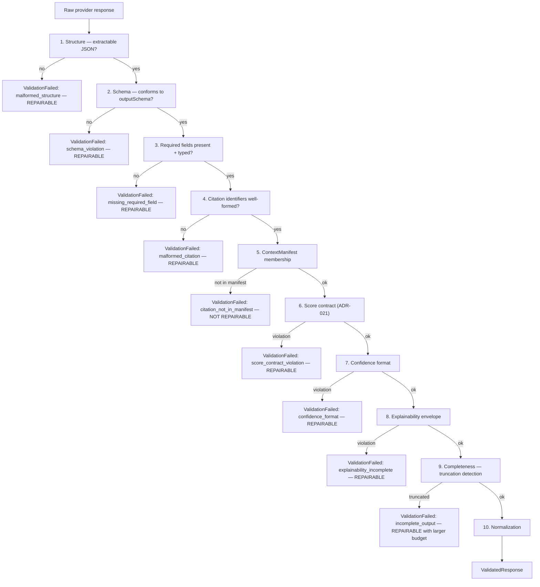
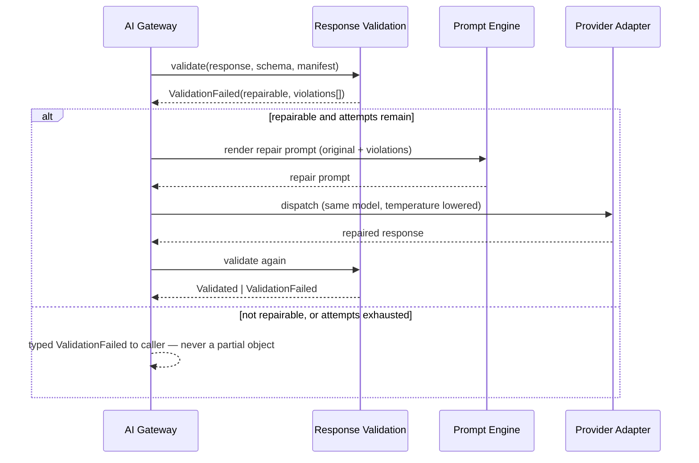

# Response Validation

> **Status:** v1.0 — complete. New in Phase 6.
> **Position in the pipeline:** Provider Adapter → **Response Validation** → Normalization → Scoring Metadata. Runs on every response, without exception.

## Overview

**Business purpose.** Model output is a suggestion, not a result. A response that parses cleanly can still omit a required field, cite an evidence id that was never in context, or return a confidence value on the wrong scale — and every one of those defects propagates silently into content a customer publishes under their own brand. Validation is the boundary at which "the model said something" becomes "the platform has a result."

**Technical purpose.** Verify that a response is **structurally correct and complete** against the contract the request declared, repair what is repairably malformed, and reject what is not — returning a typed error rather than a partial object.

**Design posture — never trust model output.** Not the schema, not the field presence, not the citations, not the confidence scale, not even the JSON. Every assumption is checked. This is cheap relative to a provider call and catches a class of defect that is otherwise discovered by a customer.

## The hard boundary with Guardrails

Two components with adjacent names and non-overlapping jobs. This distinction is normative and must never be collapsed.

| | **Guardrails** | **Response Validation** |
|---|---|---|
| Question | *Is this **allowed**?* | *Is this **structurally correct**?* |
| Domain | Safety, policy, privacy, abuse | Schema, fields, references, format |
| Failure means | A policy decision was made | A defect exists in the output |
| **Retry** | **Forbidden** | **Allowed, bounded** |
| Repairable | No — policy is not negotiable | Often yes |
| Example | Output contains a customer's card number | Output omits the required `confidence` field |

**The retry asymmetry is the reason the boundary matters.** Retrying a guardrail block is brute-forcing a safety control — sampling variance until a prohibited output slips through. Retrying a validation failure is asking a model to produce well-formed output, which is a legitimate and frequently successful request. Merging the two components would make that distinction impossible to enforce.

This document **never** performs a policy decision. If a check here would need to consider whether content is *acceptable* rather than *well-formed*, it belongs in `guardrails.md`.

## Responsibilities

- JSON structure validation and extraction.
- Schema validation against the request's declared `outputSchema`.
- Required-field presence and type conformance.
- **Citation existence** — every cited identifier resolves.
- **`ContextManifest` verification** — every cited identifier was actually in context.
- **Score contract validation** (ADR-021) — shape, range, and direction.
- Confidence format validation.
- Explainability validation — envelope shape and non-empty evidence.
- Output normalization to the platform's canonical form.
- The bounded repair workflow.

## Non-responsibilities

| Not owned | Owner |
|---|---|
| **Any policy or safety decision** | `guardrails.md` |
| Whether a claim is *true* | `05-content-platform/review-engine.md` |
| Citation *resolution* against the Evidence Bank | `11-knowledge-platform/citation-engine.md` — this component checks existence and manifest membership |
| Computing a Score's value | The producing engine (ADR-021) |
| Retry scheduling and backoff | `retry-strategy.md` — this component reports repairability, it does not schedule |
| Provider response parsing quirks | `provider-adapters.md` |
| Business meaning of any field | The calling engine |

## Validation pipeline

Ordered cheapest-and-most-decisive first. A failure short-circuits; there is no value in schema-checking something that is not JSON.



### Stage detail

**1 · Structure.** Extract JSON from the response, tolerating the common wrappers models emit — fenced code blocks, leading prose, trailing commentary. Extraction is tolerant; what is extracted is then validated strictly. Tolerating a fenced block is not the same as tolerating a malformed object.

**2 · Schema.** Validate against the `outputSchema` the request declared. Where the model's capability was `structuredOutput: 'best_effort'` rather than `'native'` (`provider-adapters.md`), schema violations are expected at a measurable rate and the repair budget is set accordingly.

**3 · Required fields.** Presence plus type conformance. A field present but null, or present with the wrong type, fails identically to an absent one — a `null` where a number is required is a defect, not a value.

**4 · Citation identifiers.** Well-formedness only: does each cited identifier match the expected shape?

**5 · `ContextManifest` membership — the critical check.** Every cited identifier must appear in the `ContextManifest` produced for this request. **This is not repairable.** A model citing an identifier it never received did not make a formatting mistake; it fabricated a reference. Asking it to try again invites a better-formed fabrication.

This is the structural closure of the v1 defect where a regex could mark a claim supported by matching a phrasing pattern. Here, the acceptable set is a finite list fixed **before** dispatch, and the model did not write it.

**6 · Score contract validation (ADR-021).** Where a response carries a Score, its shape is verified against the contract: `value` an integer 0–100, `confidence` an integer 0–100, `verdict` in the fixed four-value set, category present in the registry, explanation present. **Direction is verified too** — an inverted category such as spam risk must already be inverted so that higher is better, because a direction error passes every other check and silently corrupts every downstream comparison.

**7 · Confidence format.** Integer 0–100, per the contract. A model returning `0.87` has produced a scale error, and coercing it silently would be indistinguishable from a value of 87 when it means 87%.

**8 · Explainability.** Where the response asserts a recommendation, the envelope must carry `recommendation`, `reason`, `expected_impact`, `confidence`, and a **non-empty `evidence[]`** (ADR-009). Reason codes must exist in the registry — an unregistered code is a validation failure, since it would be unqueryable.

**9 · Completeness.** Truncation detection: `finishReason === 'length'`, unterminated structures, sentences ending mid-clause. Truncated output is repairable **with a larger output budget**, not by asking again at the same size.

**10 · Normalization.** Whitespace, encoding, numeric formats, and canonical field ordering — so two providers yield byte-comparable results for equivalent work, which is what makes response caching and diffing meaningful.

## Repair workflow



| Property | Value |
|---|---|
| Default repair attempts | **2** — policy per task profile |
| Repair prompt | Original request plus a structured statement of violations; **never free-form "try again"** |
| Model | **Same model.** A repair is a formatting correction, not a re-decision |
| Temperature | Lowered on repair — determinism helps structure |
| Budget | Repairs consume the request's budget; exhaustion returns `BudgetExceeded` |
| Non-repairable | Manifest violations, and any guardrail interaction |

**Repair is not regeneration.** It supplies the model its own output plus a precise description of what is structurally wrong. Regenerating from scratch would discard correct content and cost a full call; and for a partially-correct response, regeneration frequently loses quality that repair preserves.

**Repair never escalates the model tier.** Escalating on a formatting failure conflates structure with capability and quietly raises cost per request. If a model cannot produce the schema reliably, that is a routing-policy finding, not a per-request workaround.

## Inputs and outputs

```ts
interface ValidationRequest {
  raw: RawProviderResponse;
  outputSchema?: JsonSchema;
  contextManifest?: ContextManifest;     // required when citations are expected
  expectations: {
    citationsExpected: boolean;
    scoreExpected: boolean;
    explainabilityExpected: boolean;
    minCompleteness?: 'partial_ok' | 'complete_required';
  };
  repairAttempt: number;
  correlationId: string;
}

interface ValidationResult {
  outcome: 'valid' | 'repairable' | 'failed';
  normalized?: unknown;
  violations: ValidationViolation[];
  repairHint?: RepairHint;               // structured; consumed by the repair prompt
}

interface ValidationViolation {
  stage: ValidationStage;
  reasonCode: string;                    // registry-backed
  path?: string;                         // JSON path
  expected?: string;
  observed?: string;
  repairable: boolean;
}
```

**Score impact:** none produced. This component **enforces** the ADR-021 contract's shape on responses carrying Scores; it never computes a value, a confidence, or a verdict.

## Domain rules

1. **Every response is validated**, including cached responses at population time.
2. **A partial object is never returned.** Validation either yields a complete, conformant result or a typed error.
3. **Manifest violations are not repairable** and never retried.
4. **Guardrail blocks are never routed into repair.** The two components are ordered and independent: validation runs first on structure, guardrails second on policy, and a guardrail outcome terminates the request.
5. Repair uses the **same model** at lowered temperature; no tier escalation.
6. Repairs consume the request budget; there is no free retry.
7. Score-carrying responses are validated against the contract's **shape, range, and direction** (ADR-021).
8. Reason codes are registry-backed; an unregistered code fails validation.
9. **Coercion is prohibited.** A confidence of `0.87` is an error, not a value to be multiplied by 100 — silent coercion hides a systematic scale defect.
10. Truncation is repaired with a **larger output budget**, not a re-ask at the same size.
11. `taskType` selects an expectation profile and nothing else; no check branches on its business meaning.

**Idempotency:** validation is a pure function of its inputs. **Concurrency:** stateless.

## AI usage

Validation itself uses **no AI** — it is schema checking, set membership, and structural analysis. A validator whose verdict varied between runs would be unusable.

Repair issues an ordinary `AIRequest` through the Gateway with a template from the Prompt Engine (`system.repair_structured_output`). The Gateway sequences it exactly like any other call: metered, guarded, and validated again.

## Scoring

Per **ADR-021**: no categories produced or consumed. This component is the contract's **enforcement point on the response path** — it is where a malformed Score is caught before it reaches a producing engine, so an engine can rely on shape and spend its logic on measurement.

## Explainability

Validation emits no Explainability Envelope but **validates** them: envelope shape, required fields, non-empty `evidence[]`, and registry-backed reason codes.

Its own output is diagnostic: a `ValidationViolation` names the stage, the JSON path, what was expected, and what was observed. "Expected integer 0–100 at `scores[0].confidence`, observed 0.87" is immediately actionable by whoever owns the prompt — which is what turns a validation failure from a mystery into a prompt fix.

## Events

Published through the transactional outbox in the state-changing transaction (ADR-020).

| Event | Producer | Consumers | Payload | Retry / DLQ |
|---|---|---|---|---|
| `ValidationFailed` | This component | Observability, Evaluation harness | `{ taskType, stage, reasonCode, repairable, promptVersion, correlationId }` | Standard |
| `ValidationRepaired` | This component | Observability | `{ taskType, stage, attempts, promptVersion }` | Standard |
| `CitationFabricationDetected` | This component | **Security monitoring**, Evaluation harness, Notifications | `{ taskType, citedId, promptVersion, correlationId }` | **Critical — pages** |
| `ScoreContractViolation` | This component | Observability, Evaluation harness | `{ category, violation, promptVersion }` | Critical |

`CitationFabricationDetected` pages because it means a model attempted to ground a claim in something that does not exist. It also feeds the evaluation harness as a **high-value case**: a prompt version producing fabricated citations must not be promoted.

**Payloads carry codes, paths, and versions — never response content.**

## Database impact

| Table | Purpose | Notes |
|---|---|---|
| `validation_failures` | `tenant_id`, task type, stage, reason code, prompt version, repairable, attempts, correlation id | Tenant-scoped with RLS; append-only; 90-day retention; **sampled** at high volume |

**No response content is stored** — only classification, path, and version, which is what makes the table safe to query broadly.

**No schema redesign.** One new table; `ai_call_costs` already records attempt counts.

## APIs

| Surface | Operation |
|---|---|
| Internal (primary) | `ResponseValidation.validate(request) → ValidationResult` |
| Internal | `ResponseValidation.normalize(content, schema) → unknown` — reused by cache population |
| Internal | `ResponseValidation.buildRepairHint(violations) → RepairHint` |
| Admin REST | `GET /internal/v1/validation/failures?taskType=&promptVersion=` — prompt-quality diagnostics |
| REST | **None public** |

## Security

- **Manifest verification is a security control**, not merely a correctness one: it is what prevents a model from grounding a claim in a fabricated or cross-tenant reference.
- Validation failures never echo response content into logs, events, or errors — only paths and codes. An error message containing the offending output would propagate exactly what failed.
- Repair prompts include the model's own prior output, which is untrusted: it is framed as a data block like any other untrusted content (`guardrails.md`).
- Cross-tenant identifiers surfacing in citations are detected here **and** by guardrails — two independent layers, because the failure is unrecoverable.
- Reference `16-security/`; this component defines no controls of its own.

## Performance

| Concern | Approach |
|---|---|
| Validation overhead | **p95 < 25 ms** — schema compilation cached per schema hash |
| Manifest membership | Hash-set lookup, O(1) per citation |
| Repair cost | A full additional provider call; capped at 2 attempts and budget-bounded |
| Short-circuit | Cheapest checks first; a malformed structure never reaches schema validation |
| Caching | Compiled schemas and registry lookups cached process-wide |

Repair is the expensive path, which is why **repair rate per prompt version is a monitored quality signal** — a version needing frequent repair is a version to fix, not a cost to absorb.

## Observability

- **Metrics:** `validation_total{stage,outcome}`, `validation_duration_seconds`, `validation_failures_total{stage,reason_code}`, `validation_repairs_total{attempts}`, `validation_repair_success_ratio`, `citation_fabrication_total`, `score_contract_violations_total`, `truncation_detected_total`.
- **Tracing:** validation is a span on every AI call carrying stage reached, violation count, and repair attempts.
- **Logging:** task type, stage, reason code, JSON path, prompt version, correlation id — never content.
- **Business KPIs:** **repair rate per prompt version** (a prompt-quality signal available before evaluation runs) and validation failure rate by task type.
- **Alerts:** any `citation_fabrication_total` (**page**); repair rate above threshold for a prompt version (prompt regression); `score_contract_violations_total` non-zero (a producing engine or prompt is drifting from ADR-021); truncation rate rising, which usually means output budgets need raising.

## Cross references

- `guardrails.md` — the adjacent component; policy, not structure; **never retried**
- `retry-strategy.md` — consumes `repairable` to decide scheduling; owns the retry asymmetry
- `ai-gateway.md` — sequences validation on every response
- `prompt-engine.md` — supplies `outputSchemaRef` and the repair template
- `context-builder.md` — produces the `ContextManifest` this component verifies against
- `01-system-architecture/14-scoring-contract.md` — the contract enforced at stage 6
- `11-knowledge-platform/citation-engine.md` — resolution, distinct from existence checking
- `10-testing/ai-evaluation.md` — validation failures and fabrications as evaluation cases
