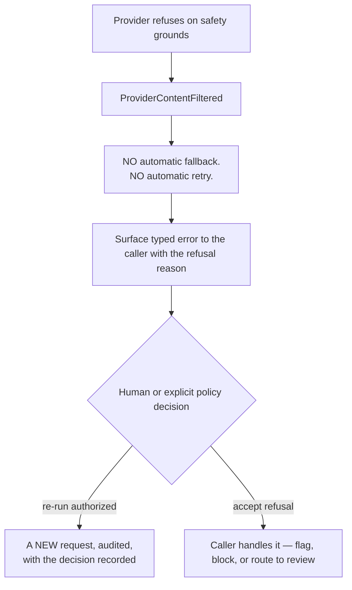
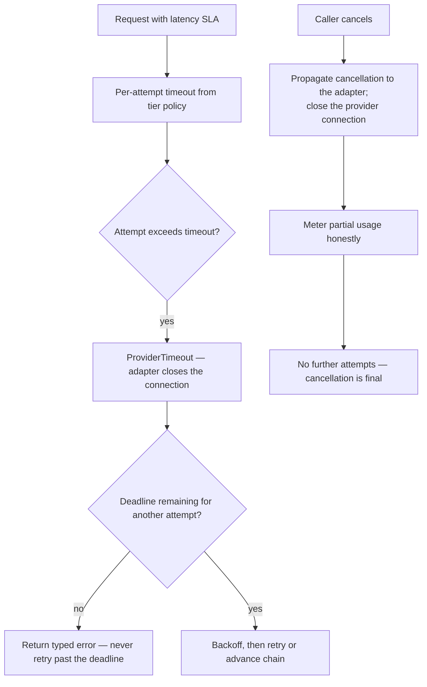
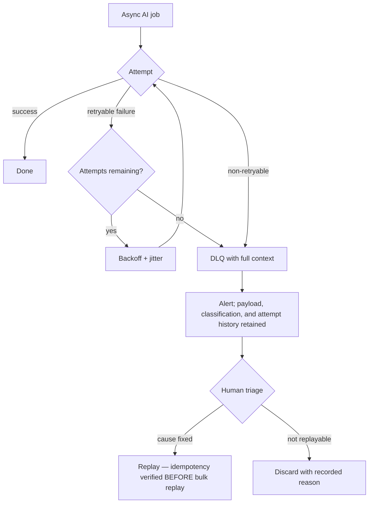

# Retry Strategy

> **Status:** v1.0 — complete. New in Phase 6.
> **Position:** invoked by the AI Gateway on every failure. Owns *whether* and *when* to retry; the Router owns *what to retry with*.

## Overview

**Business purpose.** Model providers fail transiently and often — rate limits, timeouts, capacity blips. Without retries, a pipeline that makes sixty AI calls would fail regularly on noise alone, and a customer's paid run would die for reasons nobody could explain. With **undisciplined** retries, the same platform amplifies a provider outage into a self-inflicted denial of service, doubles its own bill during an incident, and — worst — brute-forces past its own safety controls.

**Technical purpose.** Classify every failure against a fixed taxonomy, decide retryability, schedule attempts with bounded backoff and jitter, coordinate with the Router's fallback chain and circuit breakers, and terminate honestly when recovery is not available.

**Design posture — retry is a cost decision, not a resilience reflex.** Every retry is a real provider call: it consumes budget, quota, and latency. The default answer is one retry, not five.

## The two mandatory rules

These are normative and admit no exception.

### Rule 1 — Validation failure may be retried; a guardrail block never may

| Outcome | Retry | Why |
|---|---|---|
| **Validation failure** (`response-validation.md`) | **Allowed**, bounded | A structural defect. Asking a model for well-formed output is legitimate and often succeeds |
| **Guardrail block** (`guardrails.md`) | **Forbidden**, absolutely | A policy decision. Retrying is sampling variance until a prohibited output slips through — brute-forcing a safety control |

A guardrail block terminates the request immediately and returns `GuardrailBlocked`. No backoff, no fallback, no repair. The two components are kept separate specifically so this asymmetry is enforceable (`response-validation.md` §The hard boundary).

### Rule 2 — A provider safety refusal never triggers automatic provider fallback

When a provider refuses on safety grounds (`ProviderContentFiltered`), the platform **does not** automatically re-dispatch to a different provider or model.



Automatically shopping a refused prompt to a more permissive model is behaviour a responsible platform should not have. It converts a supplier's safety judgment into an obstacle to route around, and it does so invisibly. A refusal is **information** — usually that the content or the prompt needs attention.

> **Authority note.** `provider-adapters.md` marks this case "conditional." **This document is the authority**, and the answer is: never automatic. Any re-run is a new, explicitly authorized request.

## Failure taxonomy and retry policy

Every failure maps to exactly one class. Sources: the provider error taxonomy (`provider-adapters.md`), validation outcomes, guardrail outcomes, and platform-internal errors.

| Class | Retryable | Max attempts | Backoff | Advances fallback chain |
|---|---|---|---|---|
| `ProviderRateLimited` | Yes | 3 | Honour `Retry-After`, then exponential | After attempts exhausted |
| `ProviderUnavailable` | Yes | 2 | Exponential + jitter | **Yes, immediately after first failure** |
| `ProviderTimeout` | Yes | 2 | Exponential + jitter | Yes |
| `ProviderMalformedResponse` | Yes | 2 | Immediate | After attempts |
| `ValidationFailed` (repairable) | Yes | 2 repairs | Immediate, temperature lowered | **No** — same model (`response-validation.md`) |
| `ProviderAuthFailed` | **No** | — | — | Yes, and the circuit opens |
| `ProviderBadRequest` | **No** | — | — | **No** — our defect, not the provider's |
| `ProviderContextTooLarge` | **No** | — | — | Yes, to a larger-window model |
| `ProviderModelUnavailable` | **No** | — | — | Yes, plus capability refresh |
| **`ProviderContentFiltered`** | **No** | — | — | **No — Rule 2** |
| **`GuardrailBlocked`** | **No** | — | — | **No — Rule 1** |
| `ValidationFailed` (not repairable) | **No** | — | — | No |
| `BudgetExceeded` | **No** | — | — | No — retrying cannot create budget |
| `RateLimited` (platform) | Yes | Per `Retry-After` | As instructed | No |
| `ContextInsufficient` | **No** | — | — | No — the caller must gather more evidence |

**Three non-retryable classes deserve emphasis.** `ProviderBadRequest` is our bug — retrying it against another vendor wastes money and hides the defect. `BudgetExceeded` cannot be resolved by trying again. `ContextInsufficient` is a signal that upstream work is incomplete, and retrying generation without more evidence produces ungrounded content, which is precisely what the platform must not do.

## Backoff

```
delay(attempt) = min(base × 2^attempt, ceiling) × jitter(0.5 … 1.5)
```

| Parameter | Value | Reasoning |
|---|---|---|
| Base | 500 ms | Below typical provider recovery, above instant hammering |
| Ceiling | 8 s | Beyond this the caller's deadline is the binding constraint |
| Jitter | ±50%, multiplicative | **Mandatory** |
| `Retry-After` | Always honoured when supplied | Provider knows better than our formula |

**Jitter is not optional.** Without it, every request failing at the same instant retries at the same instant — a synchronized thundering herd that turns a brief provider blip into a sustained self-inflicted outage. This is the single most important detail in the backoff configuration.

**Retries respect the caller's deadline.** If the next attempt's delay would exceed the remaining latency SLA, the retry is abandoned and the typed error returned immediately. Retrying past a deadline consumes budget and quota to produce a result nobody is waiting for.

## Interaction with fallback and circuit breakers

Three components collaborate; each owns one decision.

```mermaid
sequenceDiagram
    participant GW as AI Gateway
    participant RS as Retry Strategy
    participant RT as Model Router
    participant PA as Provider Adapter

    GW->>PA: dispatch (primary model)
    PA-->>GW: ProviderUnavailable
    GW->>RS: classify + decide
    RS-->>GW: retryable; advanceChain=true; delay=0
    GW->>RT: report failure (health signal)
    RT->>RT: increment circuit counter
    GW->>PA: dispatch (next in chain)
    PA-->>GW: ProviderUnavailable
    GW->>RS: decide
    RS-->>GW: attempts exhausted; chain exhausted
    GW-->>GW: typed ProviderUnavailable to caller
    RT->>RT: consecutive failures exceed threshold → circuit OPENS
```

| Decision | Owner |
|---|---|
| *Should this be retried at all?* | **This component** |
| *When?* | **This component** |
| *With which model?* | `model-router.md` |
| *Is this model healthy enough to try?* | `model-router.md` (circuit state) |

**Retry-in-place versus advance-the-chain.** A rate limit is transient on the *same* model — wait and retry there. An unavailability is a signal about that model — advance immediately rather than waiting on something that is down. The table above encodes which is which, and getting it backwards produces either wasted waiting or unnecessary fallback to a lower tier.

**Failures feed circuit state, not the reverse.** This component reports outcomes; the Router accumulates them and trips circuits. A retry strategy that also owned circuits would have two mechanisms racing on the same signal.

## Idempotency

**Every AI request carries an `idempotencyKey`, and every retry reuses it.** Three consequences:

1. Where the provider supports idempotency keys, the key is passed through, so a retry after an ambiguous failure cannot produce a second generation (`provider-adapters.md`).
2. Cost metering is keyed on `(idempotencyKey, attemptNumber)`, so each genuine call meters exactly once and a duplicated retry never double-charges (`cost-management.md`).
3. The Gateway's idempotency record means a retry arriving after the original succeeded returns the original result at zero cost.

**Ambiguous outcomes are the dangerous case.** A timeout *after* the request was sent may mean the provider generated and charged for a completion we never received. It is retried — with the same idempotency key — and if the provider supports the key, no second generation occurs. Where the provider does not, the cost is metered honestly as two attempts and the discrepancy surfaces in reconciliation rather than being hidden.

## Timeout and cancellation



**Cancellation is final and propagates.** When a caller cancels — a workflow terminated, a user navigating away from a stream — the adapter closes the provider connection so tokens stop being generated and billed. A retry after cancellation would be work nobody asked for.

**Per-attempt timeouts come from tier policy** and are supplied by the Gateway; a caller may lower them but never raise them, so no single request can hold provider capacity indefinitely.

## Dead letter queue

Retries live inside a synchronous request; the DLQ handles **asynchronous** AI work — batch embedding generation, scheduled analysis, background enrichment.



**Blind bulk replay is prohibited.** Replaying non-idempotent work turns one incident into two. A DLQ replay requires confirming the handler is idempotent for that job class, then replaying in bounded batches (`13-event-platform/dead-letter-queue.md`).

DLQ entries carry the typed classification, the attempt history, and the correlation id — so triage starts from evidence rather than from re-running to see what happens.

## Inputs and outputs

```ts
interface RetryDecision {
  retry: boolean;
  delayMs: number;
  advanceChain: boolean;
  attemptNumber: number;
  reason: RetryReasonCode;             // registry-backed
  terminal?: TypedError;               // populated when retry === false
}

interface RetryContext {
  failure: TypedError;                 // from the fixed taxonomy
  attemptNumber: number;
  elapsedMs: number;
  deadlineMs?: number;
  budgetRemainingUsd: number;
  chainRemaining: number;
  retryAfterMs?: number;               // provider-supplied
}
```

**`budgetRemainingUsd` is an input to the decision.** A retry that would exceed the remaining budget is not scheduled — the request terminates with `BudgetExceeded` rather than attempting something it cannot pay for.

**Score impact:** none produced or consumed (ADR-021). `attempts` appears in the response and in cost rows, and feeds a producing engine's `algorithmVersion` inputs only insofar as the Gateway records it — retry behaviour never alters a Score's value.

## Domain rules

1. **Guardrail blocks are never retried** (Rule 1).
2. **Provider safety refusals never trigger automatic fallback** (Rule 2).
3. **Every retry reuses the original `idempotencyKey`.**
4. **Jitter is mandatory** on every backoff.
5. `Retry-After` is honoured whenever supplied, over any computed delay.
6. **Retries never exceed the caller's deadline.**
7. **Retries consume budget**, and a retry that cannot be afforded is not attempted.
8. `ProviderBadRequest` is never retried and never advances the chain — it is our defect.
9. **Fallback never descends below the task's minimum-tier floor** (`model-router.md`).
10. Cancellation is final and propagates to the provider connection.
11. Non-retryable failures return a **typed error** immediately — never a degraded or partial success.
12. Attempt counts are recorded on the response, the cost row, and the trace.

**Idempotency:** the decision function is pure. **Concurrency:** stateless; circuit state is the Router's.

## AI usage

**None.** A component that decides whether to retry must be deterministic and instant. Its behaviour must be reproducible from the failure classification alone, and any model call would add both latency and non-determinism to error handling — the worst place for either.

## Explainability

Retry emits no Explainability Envelope but produces the **failure narrative** that makes incidents diagnosable:

- Each attempt records its classification, delay, and whether the chain advanced.
- The response carries `attempts`, so a slow call is attributable to retries rather than to the model.
- Terminal errors carry the reason code and the attempt history.
- Registry-backed reason codes: `retry.transient_provider`, `retry.rate_limited_backoff`, `retry.validation_repair`, `retry.chain_advanced`, `retry.deadline_exceeded`, `retry.budget_exhausted`, `retry.non_retryable_policy`, `retry.non_retryable_safety_refusal`.

The last two are deliberately distinct: "we chose not to retry a policy decision" and "the provider refused on safety grounds" are different facts, and collapsing them would hide Rule 2 from telemetry.

## Events

Published through the transactional outbox where durable (ADR-020); per-attempt signals are transient telemetry.

| Event | Producer | Consumers | Payload | Retry / DLQ |
|---|---|---|---|---|
| `RetryExhausted` | This component | Observability, Notifications (on sustained) | `{ taskType, failureClass, attempts, correlationId }` | Standard |
| `SafetyRefusalReceived` | This component | **Security monitoring**, Evaluation harness, Observability | `{ taskType, promptVersion, correlationId }` | **Critical** |
| `FallbackChainExhausted` | This component | **Observability — alert**, Router, Notifications | `{ taskType, modelsAttempted, correlationId }` | Critical |
| `AsyncJobDeadLettered` | This component | DLQ triage, Notifications, Observability | `{ jobType, failureClass, attempts }` | Critical |

`SafetyRefusalReceived` is routed to the evaluation harness as well as security monitoring: a prompt version producing repeated refusals is a prompt problem, and it must be visible before promotion rather than discovered in production.

## Database impact

**This component owns no tables.** It is a pure decision function; its outcomes are recorded by others:

| Recorded in | By | What |
|---|---|---|
| `ai_call_costs` | `cost-management.md` | Attempt number per metered call |
| `validation_failures` | `response-validation.md` | Repair attempts |
| DLQ streams | `13-event-platform/` | Async job failures |
| Traces | `observability.md` | Per-attempt spans |

Backoff state is held **in-request**, not persisted — a retry sequence lives within one Gateway invocation. **No schema impact whatsoever.**

## APIs

| Surface | Operation |
|---|---|
| Internal (primary) | `RetryStrategy.decide(context: RetryContext) → RetryDecision` |
| Internal | `RetryStrategy.classify(error: unknown) → TypedError` — the single mapping point from raw failures to the taxonomy |
| Internal | `RetryStrategy.policyFor(taskType) → RetryPolicy` |
| REST | **None public** |

`classify` is deliberately centralized: one place where an unknown failure becomes a typed one, so an unclassified error surfaces as a gap in this component rather than as inconsistent handling scattered across callers.

## Security

- **Rule 1 is a security control.** Retrying a guardrail block is an attempt to defeat a safety control by sampling variance, and forbidding it structurally is the only reliable defence.
- **Rule 2 is a security and ethics control.** Not routing around a supplier's safety refusal keeps that judgment intact rather than treating it as an obstacle.
- Retry storms are a self-inflicted denial-of-service; jitter and bounded attempts are the controls, and unbounded retry is prohibited.
- Retries consume budget, so retry policy is also a **denial-of-wallet** control.
- DLQ payloads may contain prompts and context and are treated with the same access restrictions as the underlying data — platform-admin only, audited.
- Reference `16-security/`; this component defines no controls of its own.

## Performance

| Concern | Approach |
|---|---|
| Decision latency | **p95 < 1 ms** — pure function, no I/O |
| Attempt budget | Default 2, tuned per task profile; **not** a global constant |
| Deadline awareness | Every decision checks remaining time before scheduling |
| Jitter | Prevents synchronized retry waves — the dominant systemic risk |
| Total latency contribution | Bounded by attempts × ceiling, and always by the caller's deadline |

## Observability

- **Metrics:** `retries_total{task_type,failure_class,outcome}`, `retry_attempts` (histogram), `retry_delay_seconds` (histogram), `fallback_chain_advances_total`, `retry_exhausted_total{failure_class}`, `safety_refusals_total{task_type}`, `non_retryable_total{failure_class}`, `deadline_exceeded_total`, `dlq_entries_total{job_type}`.
- **Tracing:** each attempt is a **child span** of the dispatch span, carrying attempt number, failure class, delay, and whether the chain advanced — so a 12-second call visibly decomposes into three attempts rather than appearing as one slow provider.
- **Logging:** failure class, attempt, delay, decision reason code, correlation id — never payloads.
- **Business KPIs:** retry rate per task type (a rising rate signals provider degradation or a prompt producing malformed output), and the share of latency attributable to retries.
- **Alerts:** `FallbackChainExhausted` sustained (**page** — no healthy model for a task type); retry rate above baseline (provider degradation); `safety_refusals_total` rising for one prompt version (prompt problem, route to evaluation); DLQ growth.

## Cross references

- `guardrails.md` — **Rule 1**: blocks are never retried
- `response-validation.md` — repairable failures, the retryable counterpart
- `provider-adapters.md` — the error taxonomy classified here; **this document is the authority on safety-refusal handling**
- `model-router.md` — owns the fallback chain and circuit state
- `rate-limiting.md` — supplies `Retry-After`; retries never outpace it
- `cost-management.md` — retries consume budget and are metered per attempt
- `ai-gateway.md` — invokes this component on every failure
- `13-event-platform/dead-letter-queue.md` — async DLQ semantics and replay discipline
- `14-operations/incident-response.md` — playbooks P1 and P2 (provider degradation)
