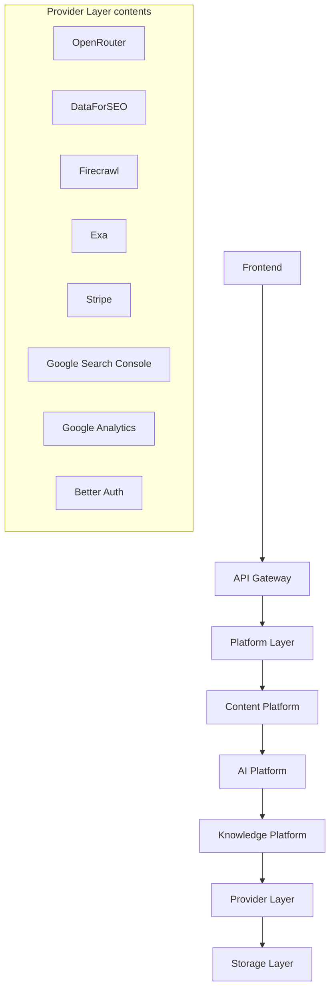

# 08 — Integrations (Provider Layer)

The **Provider Layer** holds every external provider adapter. It formalizes the baseline's "adapters behind stable interfaces" principle (ADR-010) into a named architectural layer (ADR-012). Providers are swappable without touching engines; each adapter carries its own auth, rate-limit, retry, and cost policy.

## Position in the Architecture

The stack above is the canonical linear view. In practice the layer is **horizontal** — multiple platforms consume it:

| Provider | Consumed by | Purpose |
|---|---|---|
| `openrouter.md` | AI Gateway **only** | Unified access to Claude Sonnet, GPT-5, Gemini 2.5 Flash, Grok |
| `dataforseo.md` | Keyword + SERP Intelligence | Keyword metrics, SERP results, backlinks |
| `firecrawl.md` | Research Engine | Fetch + parse pages into clean content for the Evidence Bank |
| `exa.md` | Research Engine | Semantic/neural search for high-quality evidence discovery |
| `stripe.md` | Billing (Platform Layer) | Subscriptions, credit purchases, webhooks |
| `google-search-console.md` | Analytics Engine | Clicks, impressions, CTR, position, index status |
| `google-analytics.md` | Analytics Engine | Traffic, engagement, conversions (ROI) |
| `better-auth.md` | Auth (Platform Layer) | Authentication framework: sessions, OAuth, organizations |

## Rules

1. Only this layer imports provider SDKs / calls provider APIs. Engines depend on the stable interface, never the SDK.
2. Every adapter implements timeout, retry, circuit breaker, and rate limiting.
3. Credentials are tenant-scoped where applicable, encrypted at rest, and never logged.
4. Every document here covers: **Purpose · Authentication · Rate Limits · Retry Strategy · Error Handling · Cost Considerations · Response Mapping · Future Improvements.**
