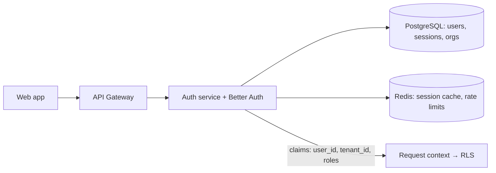
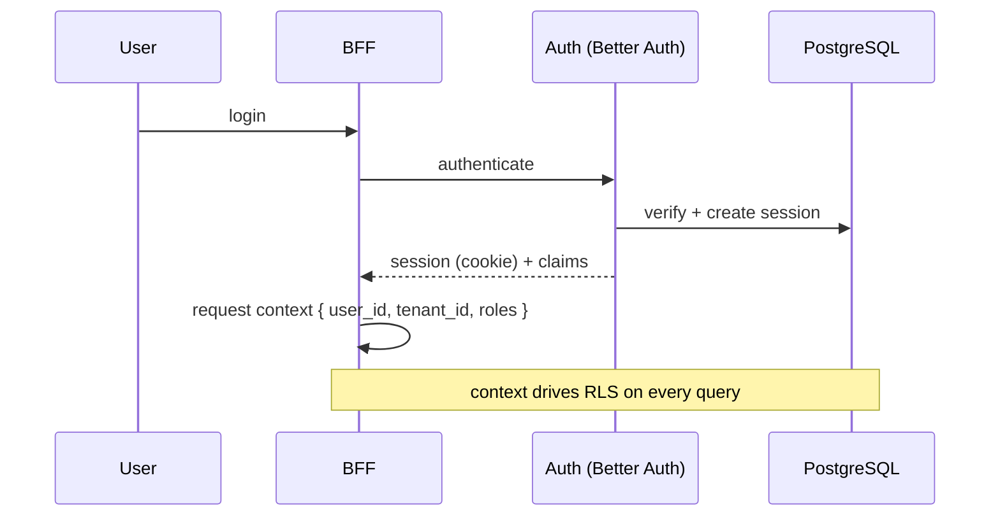

# Better Auth

> **Status:** v1.0 — complete. Interface: `IdentityProvider`. Consumed by the Auth service (Platform Layer). **Resolves baseline open question OQ-1** (identity provider choice).

## Overview & Purpose

Better Auth is a TypeScript authentication **framework** (self-hosted library, not an external SaaS): email/password, social OAuth, sessions, and — critically for ContentOS — an organizations plugin that maps cleanly onto workspaces, memberships, and roles. Being in-stack keeps auth data in our PostgreSQL under the same tenancy rules.

## Authentication (how it authenticates users)

Cookie-based sessions (primary) with the PostgreSQL adapter as source of truth and Redis as secondary/session cache; social OAuth providers as configured per environment; 2FA plugin available. Session claims carry `user_id`, active `tenant_id`, and `roles` — exactly what the BFF injects into the request-scoped context that PostgreSQL RLS reads.

## Rate Limits

Built-in rate limiting on auth endpoints (login, signup, reset) — configured, backed by Redis, plus gateway-level limits. Brute-force lockout per account + IP.

## Retry Strategy

Auth flows are user-interactive; no silent retries of credential submissions. Internal calls (session lookup) retry once on transient store errors, then fail closed (**deny by default**).

## Error Handling

| Condition | Behavior |
|---|---|
| Invalid credentials | Generic failure message (no account enumeration) |
| Session invalid/expired | 401 → re-auth; revocation is immediate via session store |
| Store unavailable | Fail closed; alert; never issue unverified sessions |
| OAuth callback mismatch | Reject + audit log |

## Cost Considerations

No per-call provider fees — self-hosted. Costs are infra (DB/Redis) and maintenance; upgrades tracked like any dependency (pinned, reviewed).

## Response Mapping

Better Auth session → internal `Principal { user_id, tenant_id, roles[], session_id }` — the only identity shape the rest of the platform ever sees. Organization/member records map to Workspace domain entities (`02-domain-design/workspace.md`).

## Sequence Diagram

## Implementation Notes

Kept behind the `IdentityProvider` interface (ADR-010) so an enterprise IdP can be added without touching consumers. Auth tables live in the platform schema with the same migration discipline as everything else.

## Future Improvements

Enterprise SSO/SAML and SCIM provisioning via plugins; per-workspace IdP; passkeys.

## Open Questions

SSO/SAML timeline for enterprise tier — `99-open-questions.md`.
