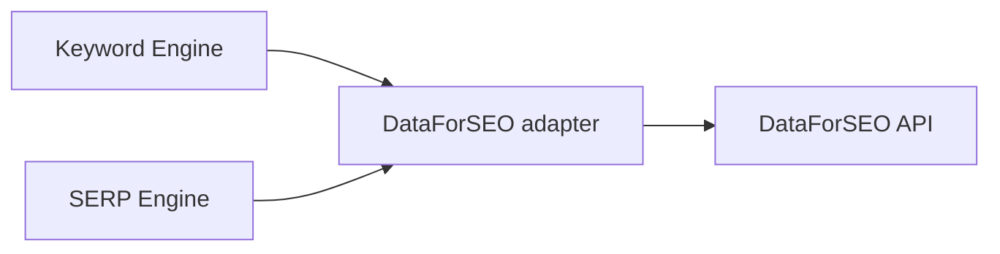
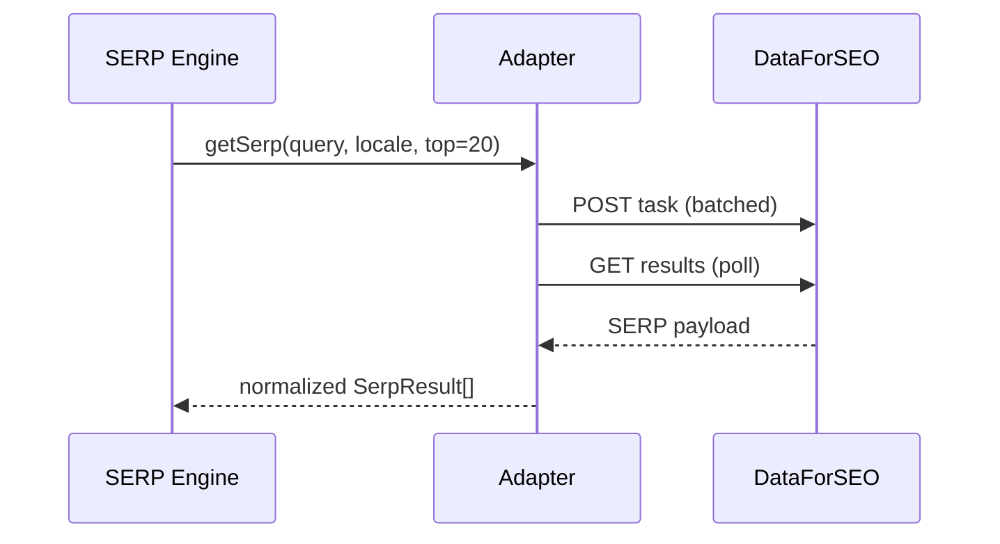

# DataForSEO

> **Status:** v1.0 — complete. Interfaces: `KeywordDataProvider`, `SerpProvider`. Consumed by Keyword Intelligence and SERP Intelligence. Resolves baseline open question OQ-2 (primary keyword/SERP data source).

## Overview & Purpose

Primary source for keyword metrics (search volume, difficulty, CPC, trends), SERP results (top-N organic with structure), and backlink data. Chosen for broad endpoint coverage and predictable per-request pricing.

## Authentication

HTTP Basic auth (`login:password`, base64) from the secret manager. Platform-level credentials; sandbox credentials for non-prod environments.

## Rate Limits

Account/plan-based. Two calling styles: **Live** endpoints (synchronous, pricier) and **Task-based** (POST task → poll GET, cheaper, batchable). Default to task-based with batching for research runs; Live only where the user is waiting. Verify current plan limits in the dashboard; mirror into adapter buckets.

## Retry Strategy

Backoff on 429/5xx. Task polling with capped attempts and increasing interval; a task that never completes is recorded as a data gap with a freshness flag — the engine serves cached/degraded data rather than failing the request.

## Error Handling

| Signal | Typed error | Behavior |
|---|---|---|
| Auth failure | `ProviderAuthFailed` | Alert; no retry |
| 429 / quota | `RateLimited` | Backoff + queue |
| Task timeout | `DataUnavailable` | Serve cache with freshness flag |
| Partial results | — | Return partial + gap markers; never invent metrics |

## Cost Considerations

Per-request cost varies by endpoint; task-based + batching is the primary lever. Aggressive TTL cache keyed by `(tenant, keyword, locale)` — keyword metrics change slowly; SERP snapshots cached per research run.

## Response Mapping

→ internal `KeywordMetrics { volume, difficulty, cpc, trend[] }`, `SerpResult { position, url, title, structure }`, `BacklinkSummary`. Locale/device parameters normalized to platform enums.

## Sequence Diagram

## Implementation Notes

Adapter owns pagination, batching, and locale mapping. Raw payloads archived to object storage for re-parsing without re-purchase.

## Future Improvements

Ahrefs as a supplementary/backlink-depth source behind the same interface; SERP-volatility signals.

## Open Questions

Per-plan cost caps per tenant tier — `99-open-questions.md`.
