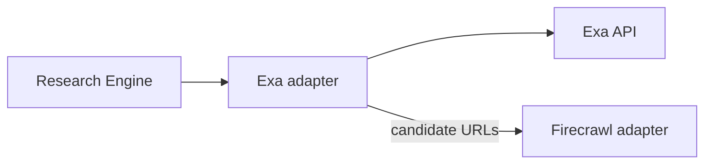
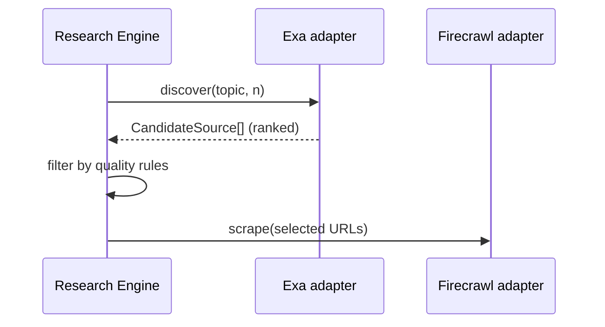

# Exa

> **Status:** v1.0 — complete. Interface: `WebSourceProvider` (discovery). Consumed by the Research Engine.

## Overview & Purpose

Semantic/neural web search for **evidence discovery** — finding high-quality, on-topic sources that keyword SERPs miss (papers, deep guides, primary sources). Complements DataForSEO (what ranks) with what's *relevant*; discovered URLs are then fetched via Firecrawl.

## Authentication

API key header from the secret manager. Platform-level key.

## Rate Limits

Plan-based request limits. Mirror into adapter buckets; research runs batch discovery queries per topic rather than per subtopic.

## Retry Strategy

Backoff on 429/5xx (bounded). Empty/weak result sets are a signal, not an error — the engine widens or reformulates the query once, then proceeds with what exists.

## Error Handling

| Signal | Typed error | Behavior |
|---|---|---|
| Auth failure | `ProviderAuthFailed` | Alert; no retry |
| 429 | `RateLimited` | Backoff + queue |
| 5xx | `ProviderUnavailable` | Retry bounded; fall back to SERP-only research with a coverage note |

Discovery failure never blocks the pipeline — it degrades evidence breadth, and the run records that.

## Cost Considerations

Per-search (and per-contents) pricing. Levers: cache discovery results per `(topic, locale)` with TTL; request only candidate metadata from Exa and do full content retrieval via Firecrawl (single fetch path, single cache).

## Response Mapping

→ `CandidateSource { url, title, score, published_at?, snippet }` ranked by semantic relevance; the Research Engine filters by source-quality rules before fetching.

## Sequence Diagram

## Implementation Notes

Exa results carry a relevance score used in Evidence ranking (Context Builder input). Dedupe against already-banked evidence by URL + fingerprint before fetching.

## Future Improvements

Category-restricted discovery (papers, news, docs); similarity-to-URL discovery for competitor-adjacent sources.

## Open Questions

Source-quality scoring rubric ownership — `99-open-questions.md`.
