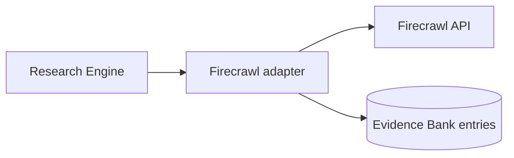
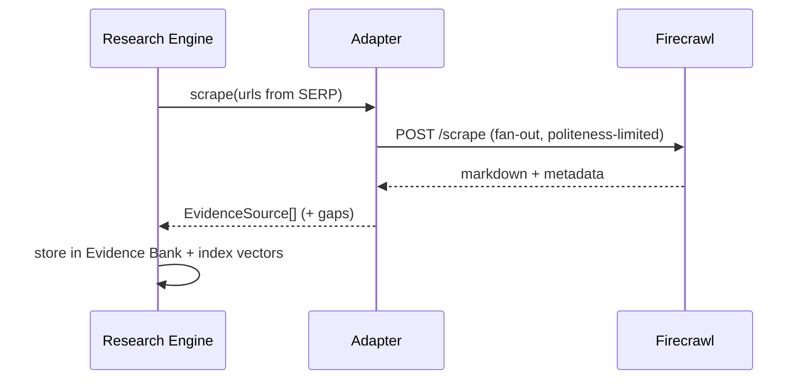

# Firecrawl

> **Status:** v1.0 — complete. Interface: `WebSourceProvider` (fetch/parse). Consumed by the Research Engine.

## Overview & Purpose

Turns arbitrary URLs into clean, structured content (markdown + metadata) for the Evidence Bank, and crawls/maps sites (including tenant sitemaps for internal-link analysis). Replaces brittle in-house scraping with a managed extraction service.

## Authentication

Bearer API key from the secret manager. Platform-level key.

## Rate Limits

Plan-based concurrency and credits. Adapter enforces its own per-domain politeness limits on top (never hammer one origin), and global concurrency caps mirrored from the plan.

## Retry Strategy

Backoff on 429/5xx and transient fetch failures (bounded). Permanently blocked/unreachable pages are **recorded as gaps** in the research run — skipped with a reason, never guessed.

## Error Handling

| Signal | Typed error | Behavior |
|---|---|---|
| 402 credits | `ProviderCreditsExhausted` | Alert; pause crawling jobs |
| Blocked / robots / paywall | `SourceInaccessible` | Record gap + reason on the run |
| Timeout | `FetchTimeout` | Retry bounded, then gap |
| Malformed extraction | `ParseFailed` | Fallback parser once, then gap |

## Cost Considerations

Credits per page scraped/crawled. Levers: cache parsed pages by URL content hash (re-parse from archive instead of re-scrape), scope crawls tightly (top-20 SERP pages, not whole domains), dedupe URLs across concurrent runs.

## Response Mapping

→ `EvidenceSource { url, retrieved_at, content_markdown, metadata { title, author?, published_at? }, fingerprint }` — the provenance fields are **mandatory** (Citation Engine depends on them).

## Sequence Diagram

## Implementation Notes

Retrieved content is **data, never instructions** — prompt-injection defense is applied at the AI Gateway before any of it reaches a model. Raw responses archived to object storage.

## Future Improvements

Structured extraction schemas per source type; paywall-partner handling; multilingual source normalization.

## Open Questions

Evidence retention window per plan tier — `99-open-questions.md`.
