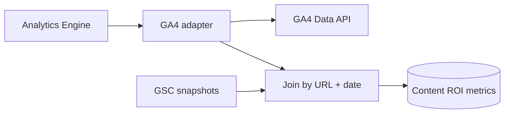
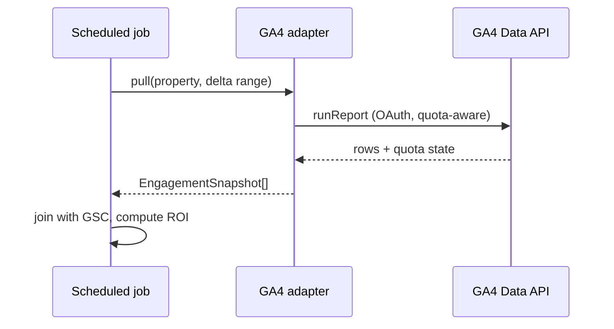

# Google Analytics

> **Status:** v1.0 — complete. Interface: `AnalyticsProvider` (behavior/conversions). Consumed by the Analytics Engine.

## Overview & Purpose

GA4 Data API supplies the behavior side of content ROI: sessions, engagement, and conversions per published URL. Combined with GSC (search side), it completes traffic → engagement → conversion → **content ROI**.

## Authentication

OAuth 2.0 per tenant (workspace connects its GA4 property), read-only analytics scope; refresh tokens encrypted and tenant-scoped. Service-account access supported for tenants who prefer granting property access.

## Rate Limits

GA4 uses a **token-based quota** system (per property, per hour/day; concurrent request caps). The adapter tracks quota consumption returned in responses and throttles proactively rather than hitting hard stops.

## Retry Strategy

Backoff on 429/5xx; split large reports (narrower date ranges / fewer dimensions) when quota-heavy queries fail; token refresh → `ReauthorizationRequired` flow identical to GSC.

## Error Handling

| Signal | Typed error | Behavior |
|---|---|---|
| Quota tokens exhausted | `RateLimited` | Defer + freshness flag |
| Auth revoked | `ReauthorizationRequired` | Actionable notification |
| Sampled/partial data | — | Mark rows as estimated; never present as exact |

## Cost Considerations

Free API; quota is the budget. Levers: request only needed dimensions/metrics, daily delta pulls, materialized rollups in PostgreSQL so dashboards never re-query GA4.

## Response Mapping

→ `EngagementSnapshot { url, date, sessions, engaged_sessions, conversions, conversion_events{} }`; joined with `PerformanceSnapshot` by (url, date) into ROI rollups.

## Sequence Diagram

## Implementation Notes

Conversion definitions differ per tenant — the mapping of GA4 events → "conversion" is workspace config, not code.

## Future Improvements

Server-side event ingestion as an alternative conversion source; attribution windows per tenant.

## Open Questions

GA4-only vs supplementary server-side events for conversions — `99-open-questions.md`.
