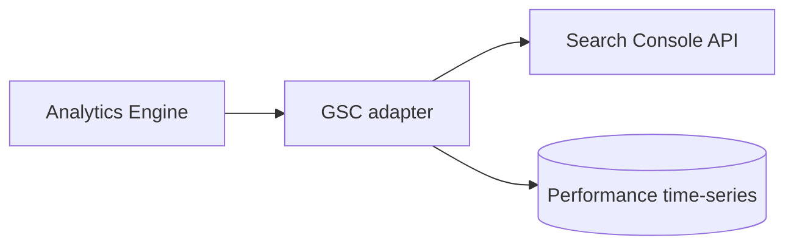
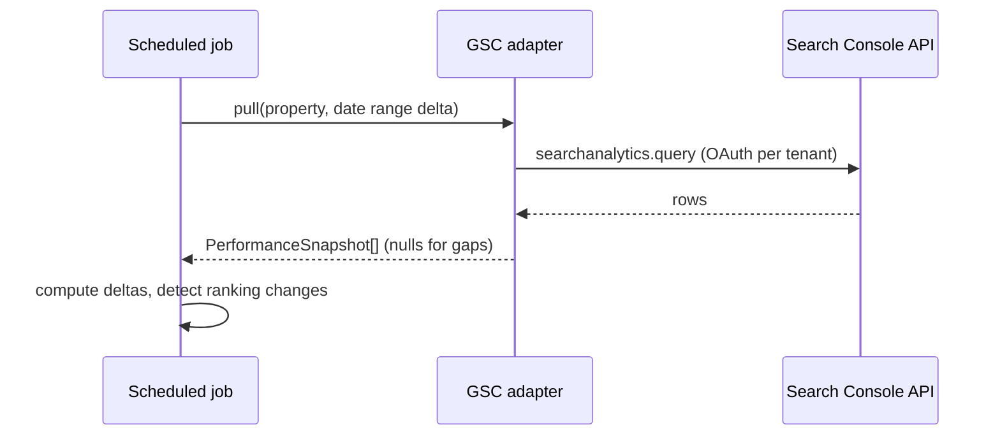

# Google Search Console

> **Status:** v1.0 — complete. Interface: `AnalyticsProvider` (search performance). Consumed by the Analytics Engine.

## Overview & Purpose

Per-tenant search performance for published URLs: clicks, impressions, CTR, average position (by query/page/device/country) plus index coverage. This is the primary signal for ranking-change detection and refresh recommendations.

## Authentication

OAuth 2.0 **per tenant**: the workspace owner connects their Search Console property; refresh tokens stored encrypted, tenant-scoped, revocable. Scopes: read-only Search Console.

## Rate Limits

Per-project and per-site daily quotas (config, verify current values). Scheduled pulls are batched per property and spread across the day; on-demand refreshes are rate-limited per tenant.

## Retry Strategy

Backoff on 429/5xx. Token refresh failures → one refresh attempt, then `ReauthorizationRequired` surfaced to the workspace as an actionable notification (never silent data loss).

## Error Handling

| Signal | Typed error | Behavior |
|---|---|---|
| Token expired/revoked | `ReauthorizationRequired` | Notify workspace admin; pause pulls for that property |
| Quota exhausted | `RateLimited` | Defer to next window; freshness flag on dashboards |
| Property mismatch | `PropertyNotFound` | Surface setup guidance |

Missing data windows are stored as **nulls with freshness flags — never zeros** (Analytics domain invariant).

## Cost Considerations

API is free; the cost is quota. Levers: pull deltas only (last N days rolling), aggregate at the right dimension granularity, cache dimension queries per day.

## Response Mapping

→ `PerformanceSnapshot { url, date, query?, clicks, impressions, ctr, position, device?, country? }`, joined to the published-URL registry from the Publishing Engine.

## Sequence Diagram

## Implementation Notes

GSC data lags ~2–3 days; ranking-change detection uses a confidence window and never alerts on the lag zone.

## Future Improvements

URL Inspection integration for index diagnostics; Bing Webmaster behind the same interface.

## Open Questions

Alert sensitivity defaults per plan — `99-open-questions.md`.
