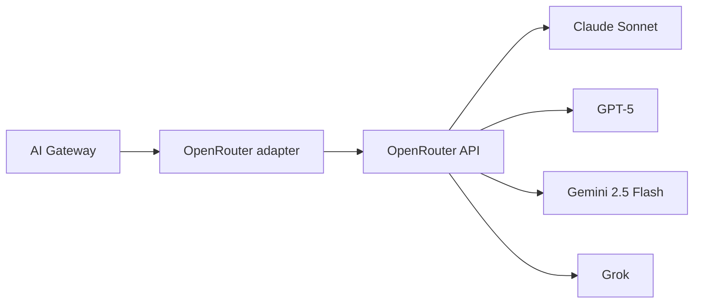
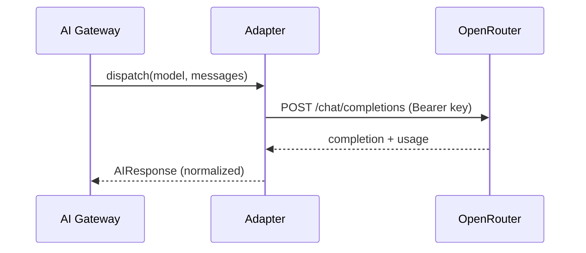

# OpenRouter

> **Status:** v1.0 — complete. Interface: `ModelProvider`. Consumed by the **AI Gateway only** — no other layer may touch this adapter.

## Overview & Purpose

Single aggregation point for all LLM access: Claude Sonnet, GPT-5, Gemini 2.5 Flash, and Grok behind one OpenAI-compatible API. One key, one billing surface, one adapter — instead of four provider SDKs. DeepSeek is excluded by policy (`08-ai-platform/model-selection.md`).

## Authentication

Bearer API key (`Authorization: Bearer ...`) from the platform secret manager. Platform-level key (not per-tenant); per-tenant attribution happens in the Gateway's metering, not at the provider.

## Rate Limits

Account/credit-based on OpenRouter's side, plus per-model limits that vary. Treat limits as **config, not constants** — mirror them into the Gateway's own per-model buckets and verify current values in the provider dashboard before tuning.

## Retry Strategy

Exponential backoff with jitter on 429/5xx (bounded attempts). Model-level failure → do **not** retry the same model beyond policy; advance the Model Router's fallback chain instead. Circuit breaker per model id.

## Error Handling

| Provider signal | Internal typed error | Behavior |
|---|---|---|
| 401/403 | `ProviderAuthFailed` | Alert ops; no retry |
| 402 / credit exhausted | `ProviderCreditsExhausted` | Alert ops; pause dispatch |
| 429 | `RateLimited` | Backoff, then fallback chain |
| 5xx / timeout | `ProviderUnavailable` | Fallback chain; open circuit on repeats |
| Malformed completion | `InvalidProviderResponse` | One re-ask, then fail typed |

Never fabricate a success; exhausted chains surface a typed error to the engine.

## Cost Considerations

Per-token, per-model pricing passthrough. The adapter returns exact usage; the Gateway computes cost and emits `CreditConsumed`. Cost levers: route cheap tasks to Gemini 2.5 Flash, semantic cache before dispatch, prompt-length discipline via the Context Builder budget.

## Response Mapping

Provider response → internal `AIResponse { content, model, usage { prompt_tokens, completion_tokens }, latency_ms }`. Provider-specific fields never leak past the adapter.

## Sequence Diagram

## Implementation Notes

Model identifiers pinned in config (exact OpenRouter ids), mapped from the matrix in `model-selection.md`. Streaming supported; token accounting reconciled at stream end.

## Future Improvements

Direct provider SDK fallback path if OpenRouter degrades; provider-health telemetry feeding the Router.

## Open Questions

Embeddings via OpenRouter vs a dedicated provider — `99-open-questions.md`.
