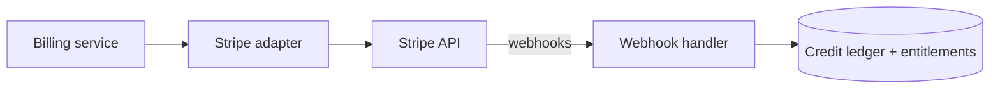
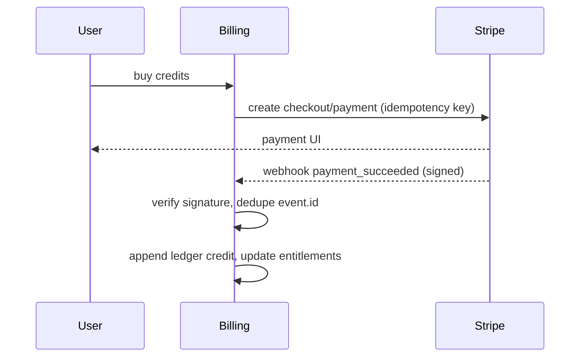

# Stripe

> **Status:** v1.0 — complete. Interface: `PaymentProvider`. Consumed by Billing & Credits (Platform Layer).

## Overview & Purpose

Subscriptions (plan tiers) and one-time credit purchases, plus the webhook stream that keeps entitlements and the credit ledger reconciled. Stripe is the v1 payment provider; Razorpay (India) is a tracked future gateway.

## Authentication

Secret API key (server-side only) + **webhook signing secret** for signature verification. Both from the secret manager; restricted keys per environment.

## Rate Limits

Generous but real; the adapter uses Stripe **idempotency keys** on every mutating call so retries are safe, and batches reads where possible.

## Retry Strategy

Mutations: retry with the same idempotency key on network/5xx. Webhooks: Stripe redelivers at-least-once — handler is idempotent, deduplicating by `event.id`; unprocessed events land in a dead-letter queue with alerting.

## Error Handling

| Signal | Typed error | Behavior |
|---|---|---|
| Card declined / payment failed | `PaymentFailed` | Downgrade entitlements per grace policy — **never delete data** |
| Signature mismatch | `WebhookInvalid` | Reject + alert (possible spoof) |
| API 429/5xx | `ProviderUnavailable` | Backoff + idempotent retry |
| Amount/ledger mismatch | `ReconciliationError` | Freeze the affected ledger entry; human review |

## Cost Considerations

Processing fees are unit-economics input for credit pricing (OQ-10). Minimize API chatter by relying on webhooks as the source of truth rather than polling.

## Response Mapping

Stripe events → internal billing domain events: `SubscriptionActivated`, `SubscriptionCanceled`, `CreditPurchaseSettled`, `PaymentFailed`. Ledger entries are append-only and keyed by `event.id` for idempotency.

## Sequence Diagram

## Implementation Notes

Credit **holds** for pipelines are internal ledger operations, not Stripe operations — Stripe only settles purchases/subscriptions. All amounts stored in minor units.

## Future Improvements

Razorpay adapter for India behind the same `PaymentProvider` interface; committed-use discounts; tax handling per region.

## Open Questions

Credit pricing model (OQ-10); Razorpay timeline — `99-open-questions.md`.
