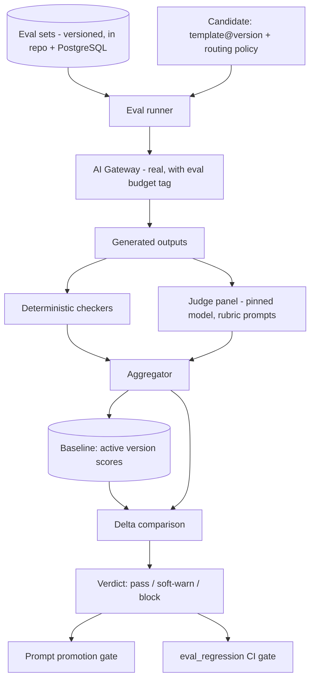
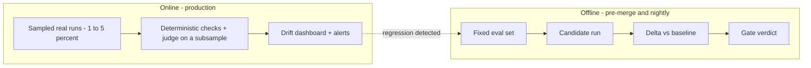

# AI Evaluation

> **Status:** v1.0 — complete. The non-deterministic track of `testing-strategy.md` §3, and the gate referenced by `08-ai-platform/prompt-engine.md` as the promotion requirement (`eval_set_ref`, `status: draft → evaluated → active`).
> **Scope:** how ContentOS measures the quality of model-produced output — eval sets, rubrics, judge configuration, scoring, the regression gate that governs prompt and routing changes, and online evaluation of production traffic.

## 1. Overview

**Why this exists.** Every other level of testing answers "is this correct?" with a boolean. Model output has no such answer: two drafts can both be valid and one can be clearly better. Yet the platform makes constant changes that alter output quality — a new prompt version, a routing change from Claude Sonnet to Gemini 2.5 Flash to save cost, a Context Builder change in how evidence is packed. Without measurement, those changes are gambles, and quality regressions surface as churn weeks later.

**Business purpose.** Quality is the product. The unit economics of ContentOS depend on routing tasks to the cheapest model that still clears the quality bar (§22) — and "clears the bar" is only meaningful if the bar is a number. Evaluation is what converts model choice from an opinion into an economic decision: it lets the team answer "can we serve section drafting with a cheaper tier?" with evidence rather than instinct.

**Technical purpose.** Provide a reproducible score for a `(template_id, version, model, context strategy)` tuple, comparable across time, that gates prompt promotion and routing-policy changes, and that runs continuously against sampled production traffic to detect drift.

**Design philosophy.**
1. **Deterministic checks first.** Anything mechanically verifiable — citation coverage, heading structure, word count, schema validity, banned-phrase presence — is checked with code, not with a judge. Judges are expensive, slower, and noisier; they are reserved for what only judgment can assess.
2. **Rubrics over vibes.** Every judged dimension has a written rubric with anchored score levels, so two runs and two humans agree on what a 7 means.
3. **Comparative beats absolute.** Absolute quality scores drift with judge model versions. The gate is therefore a *delta versus the current active version on the same eval set with the same judge*, which cancels most systematic bias.
4. **The judge is versioned and validated.** A judge is a component with its own regression risk; it is pinned, and its agreement with human ratings is measured (§11).

## 2. Responsibilities

**MUST:**
- Maintain versioned eval sets per prompt family, with inputs, context, and expectations.
- Run deterministic checkers and rubric-based judging, producing a per-dimension score and an aggregate.
- Compare against the active version's baseline and emit a `pass` / `soft-warn` / `block` verdict, reusing the Review Engine's verdict vocabulary rather than inventing a second one.
- Gate prompt promotion and routing-policy changes.
- Sample production traffic for online evaluation and detect drift.
- Enforce the safety corpus (prompt injection, PII, unsupported-claim fabrication) as a blocking check.

**MUST NOT:**
- Replace the Review Engine. Review is a **runtime, per-article** quality gate that ships with the product (`05-content-platform/review-engine.md`); evaluation is a **build-time and monitoring-time** measurement of the platform itself. They share vocabulary and some analyzers, but they answer different questions: "is this article publishable?" vs "did our system get better or worse?"
- Assert deterministic application logic (`unit-testing.md`).
- Judge with an unpinned or auto-updating model.
- Gate on absolute scores alone.

**Boundary:** evaluation ends at the score and verdict. Acting on the verdict — promoting a prompt, changing routing — belongs to `08-ai-platform/prompt-engine.md` and `08-ai-platform/model-router.md`.

## 3. Architecture

### 3.1 Evaluation harness



Evaluation calls the **real AI Gateway** — not a fake backend — because routing, context assembly, and guardrails are part of what is being evaluated. Eval traffic is tagged so its cost is metered separately and never billed to a tenant.

### 3.2 Two evaluation modes



Offline evaluation prevents regressions from shipping; online evaluation catches what the eval set does not represent — the long tail of real briefs, niches, and languages — and feeds new cases back into the eval sets. Offline alone always drifts from reality; online alone cannot block a bad change before it lands.

### 3.3 Eval set anatomy

```ts
interface EvalCase {
  id: string;                      // stable, referenced by results forever
  templateFamily: string;          // e.g. 'planning.outline'
  input: Record<string, unknown>;  // the template variables
  context: {                       // frozen context so the case is reproducible
    evidenceRefs: string[];        // fixed evidence documents in the eval corpus
    serpFixtureRef?: string;
    voiceProfileRef?: string;
  };
  expectations: {
    deterministic: DeterministicExpectation[];   // machine-checkable
    rubric: string;                              // rubric id used by the judge
    mustNotContain?: string[];                   // e.g. fabricated-source patterns
  };
  segment: 'general' | 'ymyl' | 'technical' | 'ecommerce' | 'local';
  weight: number;                  // segment weighting in the aggregate
}
```

**Context is frozen.** An eval case that retrieves live evidence would change every run, making score deltas meaningless. The eval corpus is a fixed, versioned set of documents stored in object storage alongside the eval sets.

**Size and composition.** Each prompt family carries **40–120 cases**, stratified by segment, with YMYL deliberately over-represented relative to production mix because its failure cost is highest. Every production incident that traced to model output adds a case — the eval set is the platform's regression memory.

## 4. Inputs

| Input | Source | Validation |
|---|---|---|
| Eval set version | Repo (`packages/ai-platform/test/eval/`) + registry row | Schema-validated; cases immutable once referenced by a published result |
| Candidate | `template_id@version`, plus optional routing override | Must exist in the Prompt Engine registry with status `draft` or `evaluated` |
| Baseline | Scores of the current `active` version on the same set, same judge version | If absent (first version), the gate runs in "establish baseline" mode and cannot block |
| Judge config | Pinned model id, rubric set version, temperature 0, panel size | A judge config change re-baselines all families (§10) |
| Budget | Explicit token/cost ceiling per eval run | Run aborts at the ceiling rather than silently truncating the set |

**Preconditions:** the eval corpus is present; the AI Gateway is reachable; the candidate template renders without missing variables (a unit-level failure, caught earlier).

**Authorization:** eval runs are platform-internal, executed by CI or by an operator with the `platform_admin` role. Eval runs never execute in a tenant context and never consume tenant credits.

**Error cases:** missing baseline → advisory verdict; judge unavailable → `unavailable` verdict, which blocks promotion but not unrelated merges; case failure (Gateway error) → the case is marked `errored` and excluded from the aggregate, but more than 10% errored cases invalidates the run.

## 5. Outputs

```json
{
  "run_id": "ev_01J8...",
  "template_id": "planning.outline",
  "candidate_version": 8,
  "baseline_version": 7,
  "judge": { "model": "pinned-judge-model-id", "rubric_version": 3, "panel": 2 },
  "cases": 96,
  "scores": {
    "evidence_grounding": 8.4,
    "structural_completeness": 9.1,
    "intent_alignment": 8.0,
    "brand_voice": 7.6,
    "readability": 8.2,
    "seo_structure": 8.5,
    "aggregate": 8.3
  },
  "deltas": { "evidence_grounding": 0.6, "brand_voice": -0.4, "aggregate": 0.3 },
  "deterministic": { "citation_coverage": 0.97, "schema_valid": 1.0, "banned_phrases": 0 },
  "safety": { "injection_corpus": "pass", "pii_leak": "pass", "fabricated_source": 0 },
  "cost": { "usd": 3.42, "tokens": 1284000 },
  "verdict": "pass"
}
```

| Output | Consumer |
|---|---|
| Eval report (above) | `eval_regression` CI gate; prompt promotion workflow |
| Per-case artifacts (input, output, judge rationale) | Human review of disagreements; stored 90 days |
| Score history per template family | Quality trend dashboard (`14-operations/monitoring.md`) |
| New eval candidates from online sampling | Eval set maintenance backlog |

**Events:** `EvalRunCompleted { template_id, candidate_version, verdict, aggregate, delta }` — consumed by Notifications and by the promotion workflow.

## 6. Internal Workflow

```
Resolve candidate + eval set version
  ↓
Freeze judge config and record it in the run row
  ↓
For each case: render template → AI Gateway (eval-tagged, cache disabled) → output
  ↓
Deterministic checkers per output  (cheap, run first; a hard failure short-circuits judging for that case)
  ↓
Judge panel scores each rubric dimension with rationale
  ↓
Aggregate: weighted by segment; compute per-dimension and aggregate deltas vs baseline
  ↓
Apply gate thresholds → verdict
  ↓
Persist run + per-case artifacts; emit EvalRunCompleted
```

**Cache is disabled for eval runs.** A semantic-cache hit would return the previous version's output and produce a meaningless zero delta.

**Deterministic-first ordering** matters economically: roughly a third of failing candidates fail a mechanical check (missing citations, wrong heading depth, invalid JSON schema), and short-circuiting those before judging cuts eval cost substantially.

## 7. Dependencies

| Dependency | Role |
|---|---|
| AI Gateway (`08-ai-platform/ai-gateway.md`) | Executes both candidate generation and judge calls; provides cost/token metering |
| Prompt Engine (`08-ai-platform/prompt-engine.md`) | Template resolution, `eval_set_ref`, promotion workflow that consumes the verdict |
| Model Router (`08-ai-platform/model-router.md`) | Routing policy under evaluation when the change is a routing change rather than a prompt change |
| Knowledge Platform | Frozen evidence corpus retrieval for context assembly |
| Review Engine analyzers | Reused deterministic checkers (readability, citation coverage) — evaluation must not fork a second implementation |
| PostgreSQL + object storage | Run rows and per-case artifacts |

**Reuse over duplication:** the readability, citation-coverage, and duplicate-detection analyzers are the Review Engine's, invoked as libraries. If evaluation forked its own copies, the platform's build-time and runtime quality definitions would drift apart — the worst possible failure mode for a quality system.

## 8. Database Impact

| Table | Purpose | Tenancy |
|---|---|---|
| `platform.eval_sets` | Set metadata and versions | Platform-owned, no tenant data |
| `platform.eval_cases` | Case definitions | Platform-owned |
| `platform.eval_runs` | Run header: candidate, baseline, judge config, cost, verdict | Platform-owned |
| `platform.eval_case_results` | Per-case scores + artifact refs | Platform-owned |
| `public.online_eval_samples` | Sampled production outputs and their scores | **Tenant-scoped: `tenant_id` + RLS, mandatory** |

**The platform-schema exception, stated explicitly.** The baseline rule is that every table carries `tenant_id` and an RLS policy (§21). Eval sets contain no customer data — they are internal corpora — so tenant columns on them would be meaningless. Rather than weaken the rule, these tables live in a dedicated `platform` schema that is registered in the RLS-coverage checker's allowlist with a written justification per table (`integration-testing.md` §8). Anything in `public` remains subject to the unmodified rule. Online eval samples *do* contain customer content and are therefore fully tenant-scoped, RLS-protected, retained on a short window, and excluded from any cross-tenant aggregate that could expose one tenant's content to another's dashboard.

**Indexes:** `(template_id, candidate_version)` on runs; `(run_id)` on case results; `(tenant_id, sampled_at)` on online samples. **Retention:** run headers and scores indefinitely (they are the quality history); per-case artifacts 90 days; online samples 30 days by default, configurable down per tenant policy (OQ-9 adjacency).

## 9. API Contracts

Internal, `platform_admin`-scoped, versioned with the rest of the API (`06-api/README.md` conventions apply — same auth header, same error envelope):

| Endpoint | Purpose | Notes |
|---|---|---|
| `POST /internal/v1/evals/runs` | Start a run for a candidate | `202` + run handle; idempotent per `(template_id, version, eval_set_version, judge_config)` |
| `GET /internal/v1/evals/runs/{id}` | Run status and report | — |
| `GET /internal/v1/evals/templates/{id}/history` | Score trend | Paginated, cursor-based |
| `POST /internal/v1/evals/cases` | Add a case (typically promoted from an online sample or an incident) | Requires segment + rubric |

These endpoints are never exposed to tenant tokens. Customer-facing quality reporting is the Review Engine's output, not this.

## 10. Error Handling

| Failure | Behavior |
|---|---|
| Gateway error on a case | Retry once; then mark `errored`; >10% errored invalidates the run |
| Judge disagreement within the panel beyond the tolerance band | Case escalates to a third judge call; persistent disagreement flags the case for human review and excludes it from the aggregate |
| Judge model deprecated or changed by the provider | **Re-baseline required:** all active templates are re-scored under the new judge before any delta gate can be trusted. Until then, `eval_regression` reports `unavailable` |
| Eval budget exceeded | Run aborts with partial results marked `incomplete`; never silently truncated |
| Baseline missing | "Establish baseline" mode; verdict is advisory |
| Score improves but a safety check fails | **Block, unconditionally.** Safety is not tradeable against quality |

**Retry and cost:** eval runs are the most expensive routine job in CI. They run only when the diff touches prompt templates, routing policy, or Context Builder logic, plus nightly on a rotating subset of families to catch provider-side model drift.

## 11. Security

- **Judge integrity:** the judge model is pinned by exact id. Self-preference bias — a judge favoring output from the same model family — is a known effect and is mitigated by (a) preferring a judge from a different family than the generator where possible, and (b) tracking human-agreement rate. **Human calibration:** 20 cases per family are human-rated quarterly; judge–human agreement below the accepted correlation invalidates the rubric until recalibrated (OQ-17).
- **Prompt-injection corpus** is a first-class, blocking eval dimension. Cases contain scraped-page fixtures with embedded instructions; a candidate passes only if injected instructions are treated as data, no tool call is emitted, and no system-prompt content is echoed (§24).
- **PII:** eval inputs are synthetic; the online sampler redacts before persistence, and its redaction path is the AI Gateway's, unit-tested against the redaction corpus (`unit-testing.md` §11).
- **Fabrication detection:** a deterministic checker asserts that every citation in an output resolves to a document in the frozen corpus. Invented URLs or attributions are counted, and any non-zero count is a blocking failure — this is the mechanical enforcement of the grounding invariant (§16).
- **Access:** eval artifacts can contain full generated articles; access is `platform_admin` only and audit-logged.

## 12. Performance

A full run of 96 cases with a 2-judge panel costs roughly 3× the token volume of one production article per case, so runs are parallelized (16 concurrent cases, bounded by AI Gateway per-tenant limits for the platform tenant), deterministic-checked first, and capped by an explicit budget. Target: a single-family run completes in **under 8 minutes** and under a defined dollar ceiling; the nightly full sweep runs off-peak. Judge calls use temperature 0 and short structured outputs — a judge that writes essays doubles cost for no measurable gain in scoring accuracy.

## 13. Observability

Evaluation is itself observed: run duration, cost per run, per-dimension score trend per template family, judge disagreement rate, judge–human agreement, online-vs-offline score gap (the drift signal), and share of production traffic sampled. Alerts: online aggregate drops more than 5 points below the offline baseline for a family over a 24-hour window (model-side drift or context regression); fabrication counter non-zero in production samples (page immediately — this is a grounding-invariant breach); judge disagreement rate rising, which usually indicates a rubric that has stopped discriminating. Dashboards live beside the AI cost dashboards in `14-operations/monitoring.md`, because quality and cost are read together when routing is tuned.

## 14. Future Expansion

- **Pairwise preference evaluation** (A/B with judge choosing) in addition to absolute rubric scoring; pairwise is more sensitive to small quality differences.
- **Per-tenant evaluation** for enterprise tenants with custom voice profiles, using their approved content as the reference standard.
- **Automated routing optimization:** a nightly job that proposes the cheapest model per task whose eval delta stays within tolerance, submitted as a routing-policy PR for human approval — never auto-applied.
- **Human-in-the-loop rating UI** for calibration batches, replacing the current spreadsheet-based process.
- **Outcome-linked evaluation:** correlate eval scores with real ranking and traffic outcomes from the Analytics Engine, so the rubric is validated against the metric customers actually care about.
- **Multilingual eval sets** as localization ships.

## 15. Open Questions

- Judge-model choice, panel size, and self-preference mitigation; ownership of quarterly human calibration — **OQ-17**, extending **OQ-16** (prompt promotion approval).
- Per-family eval budget ceilings and how they scale with template count.
- Whether online evaluation may sample enterprise tenants' content by default or requires opt-in (interacts with **OQ-9** retention and contractual terms).

Tracked in `99-open-questions.md`.

## Cross References

- `08-ai-platform/prompt-engine.md` — promotion lifecycle gated by this harness
- `08-ai-platform/model-router.md` — routing changes evaluated before rollout
- `08-ai-platform/context-builder.md` — context strategy is an evaluated variable
- `08-ai-platform/model-selection.md` — the model matrix whose cost/quality trade-offs this validates
- `05-content-platform/review-engine.md` — shared analyzers and verdict vocabulary; runtime counterpart
- `testing-strategy.md` — `eval_regression` gate definition
- `14-operations/monitoring.md` — quality and cost dashboards, drift alerting
