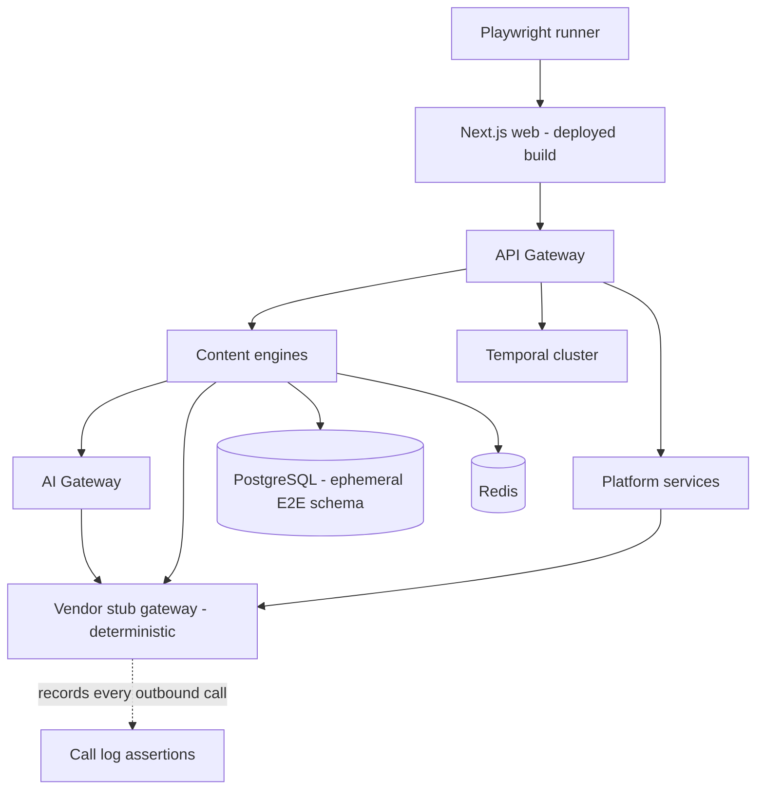
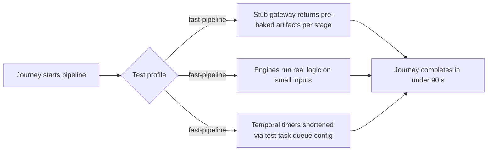
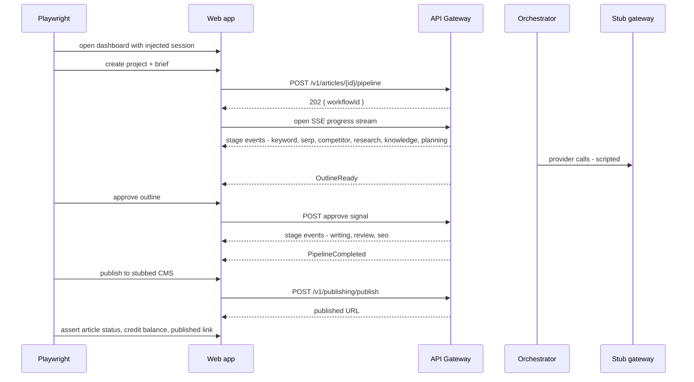

# End-to-End Testing

> **Status:** v1.0 — complete. Level 4 of the taxonomy in `testing-strategy.md` §3.
> **Scope:** browser-driven journeys against a fully deployed stack with vendor traffic stubbed. Defines the critical-journey set, the long-running-pipeline problem and its solution, SSE progress assertions, multi-tenant session handling, and the smoke suite that gates every deploy.

## 1. Overview

**Why this level exists.** ContentOS's core value is delivered by a workflow that spans a browser session, an API gateway, a durable orchestrator, ten engines, an AI platform, and a third-party CMS. Every one of those pieces can be individually correct while the journey is broken: the pipeline completes but the progress stream never closes, credits are charged but the UI shows the old balance, publishing succeeds but the article stays `draft` in the dashboard. Only a test that drives the real UI against a real stack can catch integration seams of that shape.

**Business purpose.** Protect the moments where a customer's trust is won or lost — signup, first article, approval, publish, and payment. These journeys are also the demo path; a break here is visible to every prospect.

**Technical purpose.** Provide the deploy gate. `14-operations/deployment.md` promotes a build to production only after the E2E smoke suite passes against staging, and runs the same suite against production post-deploy as the release verification step.

**Design philosophy.** Few tests, high value, zero tolerance for flake. E2E is the most expensive and least stable level, so it is deliberately capped at roughly **40 specs**, of which **8** are the smoke set. Anything provable at a lower level is not written here. A journey that becomes flaky is fixed or deleted — never retried into green, because a retried E2E test provides false confidence at exactly the moment confidence matters most.

## 2. Responsibilities

**MUST cover:**
- Authentication and workspace switching, including that switching tenants fully re-scopes visible data.
- The full content pipeline from brief to published URL, including the two human gates (outline approval, blocked-quality review).
- Real-time progress streaming (SSE) — connection, event order, reconnection after a dropped connection, and terminal closure.
- Credit lifecycle visible to the user: balance before/after a run, insufficient-credit block, and purchase flow (Stripe test mode via a stubbed checkout).
- Publishing to at least one CMS target end to end, with the connector stubbed at the HTTP boundary.
- Role-based UI behavior: a `viewer` cannot see the publish control; an `editor` cannot change billing.

**MUST NOT cover:**
- Field-level validation, error copy, or component states — those are unit/component tests in `apps/web`.
- Engine internals, scoring, or gate math (`unit-testing.md`).
- Model output quality (`ai-evaluation.md`) — E2E asserts that *an* article was produced with the expected structure, never that it is a good article.
- Provider correctness (`integration-testing.md`).

**Boundary:** E2E asserts *observable user outcomes*. If an assertion requires reading a database row to be meaningful, it belongs one level down.

## 3. Architecture

### 3.1 Environment topology

The **vendor stub gateway** is a single deployed service that impersonates every external provider (OpenRouter, DataForSEO, Firecrawl, Exa, Stripe, GSC, GA, and CMS targets) at the HTTP boundary, driven by scenario files. It exists because per-test in-process interception is impossible when the calls originate in a different container. It also records every outbound call, which lets a journey assert *that the system did not call a provider it should not have* — for example, that a cache hit produced zero model calls.

### 3.2 The long-running-pipeline problem

A standard pipeline run takes 8–20 minutes (§6 NFRs), which no E2E suite can absorb. Three mechanisms make the journey testable in minutes:

| Mechanism | Effect | Fidelity retained |
|---|---|---|
| Scenario-driven stub responses | Model and data provider latency ≈ 0 | Real engine orchestration, real events, real persistence |
| Reduced inputs (3 competitors, 5 evidence items, 900-word target) | Fewer activities, smaller payloads | Same code path, same stage sequence |
| Shortened approval timeouts on the E2E task queue | Timeout journeys testable in seconds | Real durable-timer semantics |

The pipeline is never mocked as a whole. Every stage executes; only vendor latency and payload size are compressed.

## 4. Inputs

| Input | Source |
|---|---|
| Environment | A dedicated, ephemeral E2E environment (per-PR preview at scale, shared staging in v1) with its own database and object-storage prefix |
| Seeded tenants | Provisioned via an internal, environment-gated test API — never via the UI, which would make every journey depend on signup |
| Auth | Programmatic session injection via storage state; only the signup/login journeys authenticate through the UI |
| Vendor scenarios | Named scenario files (`happy-path`, `provider-429`, `gate-block`, `publish-conflict`) selected per spec via a header the stub gateway honors |
| Test data | Synthetic only (`testing-strategy.md` §11) |

**Preconditions:** environment healthy (`/health` green for web, API, orchestrator, and the stub gateway); database migrated; a clean tenant per spec, because shared tenants across parallel journeys are the primary source of E2E flake.

**Error cases:** environment unhealthy → suite aborts before running (a failed suite against a broken environment is noise, not signal); stub scenario missing → hard failure; a journey that finds pre-existing articles in its tenant → fails, since it indicates leaked state.

## 5. Outputs

| Output | Consumer |
|---|---|
| JUnit results | `e2e_smoke` and `e2e_full` gates |
| Playwright traces, video, and screenshots on failure | Debugging; retained 14 days |
| Journey timing report | Advisory latency signal, compared with the SLOs in `14-operations/monitoring.md` |
| Post-deploy verification result | `14-operations/deployment.md` — a failed post-deploy smoke triggers automatic rollback |

**Side effects:** rows and objects in the E2E environment only; the stub gateway's call log is cleared per spec. No production system, provider account, or real CMS is touched.

## 6. Internal Workflow

The critical journey, end to end:

Assertion set for this journey: stage events arrive in the documented pipeline order (`05-content-platform/README.md`) with no stage skipped; the outline gate genuinely blocks (writing does not start before approval); the article reaches `published` with a URL; the credit balance decreased by exactly the run cost; the audit log entry for the publish is visible in the UI; the stub gateway recorded no unexpected provider calls.

## 7. Dependencies

**Tooling:** Playwright (Chromium as the default matrix; WebKit and Firefox on the nightly full run), the vendor stub gateway service (`tooling/stub-gateway`), the environment-gated test-provisioning API, and Playwright's trace viewer for CI failure triage.

**Environment dependencies:** a deployed build of `apps/web`, `apps/api-gateway`, `apps/orchestrator`, `apps/workers`, plus PostgreSQL, Redis, and the Temporal cluster — the same container set defined in `14-operations/deployment.md`, which is why a green E2E run is meaningful evidence about a deployable artifact.

## 8. Database Impact

E2E owns no schema knowledge. It reads and writes exclusively through the product's own surfaces, which is what makes it a true black-box level. Two constrained exceptions exist, both through the environment-gated test API rather than direct SQL:

| Exception | Why it is allowed |
|---|---|
| Tenant/user provisioning | Signing up through the UI in every spec would make all 40 journeys depend on one flow and triple runtime |
| Time manipulation for scheduled features (refresh scans, analytics pulls) | Otherwise untestable without waiting days |

The test API is compiled out of production builds and additionally refuses to start unless `ENVIRONMENT` is `e2e` or `staging` — two independent controls, because a test-provisioning endpoint reachable in production would be a complete authentication bypass.

## 9. API Contracts

E2E consumes the public API only, through the browser. It therefore validates the contracts in `06-api/` as a *client* would:

- Long-running operations return `202` with a handle and stream progress over SSE, matching `01-system-architecture/09-request-flow.md`.
- SSE event names and payload shapes match the documented progress contract; unknown event types must be ignored by the client rather than break the stream.
- Reconnection: the spec drops the SSE connection mid-pipeline and asserts the client resumes and still observes terminal completion — the single most common real-world failure for streamed long jobs (proxy idle timeouts).
- Error envelopes surface as user-visible messages with no raw provider text or stack traces.

## 10. Error Handling

Journeys covering the unhappy paths — these carry as much weight as the happy path, because degraded behavior is what customers actually experience:

| Scenario | Stub scenario | Asserted outcome |
|---|---|---|
| Quality gate blocks the draft | `gate-block` | Pipeline pauses, notification appears, annotated review package is viewable, resubmit resumes the same workflow |
| Data provider returns 429 for the whole run | `provider-429` | User sees a typed, actionable message; run is retryable; credits are not consumed for the failed stage |
| Model provider unavailable | `model-outage` | Fallback chain visibly engages or the run fails cleanly with an explanation — never a silently empty article |
| CMS publish conflict (slug exists) | `publish-conflict` | Actionable conflict resolution offered; no partial publish recorded |
| Insufficient credits | `low-credits` | Run is blocked before any provider spend; upgrade path is presented |
| Session expiry mid-pipeline | — | Re-auth returns the user to the running pipeline with progress intact |

**Flake protocol:** zero spec-level retries. A failing journey blocks the deploy. If the failure is environmental, the fix is to the environment or to the suite's setup, not a retry count.

## 11. Security

E2E is the only level that observes the system as an unprivileged, browser-based attacker would, so it carries specific security journeys:

- **Cross-tenant navigation:** a signed-in user of tenant A pastes a URL containing tenant B's article id and receives a not-found, with no data leaking through page metadata, titles, or error text.
- **Role enforcement in the UI and API together:** a `viewer` who calls the publish endpoint directly from the browser console is denied — proving the UI's hidden control is not the only guard.
- **Session revocation:** revoking a session in one browser context invalidates it in another within the documented window.
- **Connector credentials** entered through the UI are never returned in any subsequent API response (asserted by scanning the network log for the submitted secret).
- **CSP and cookie flags** on the deployed app are asserted (`HttpOnly`, `Secure`, `SameSite`), since these are properties of the deployed artifact rather than of source code.

## 12. Performance

Suite budget: **15 minutes** for the full set, **under 4 minutes** for the 8-spec smoke set, achieved by parallel workers with one isolated tenant each, programmatic authentication, and the fast-pipeline profile (§3.2).

Journey timings are recorded and compared against the user-facing SLOs, but treated as advisory here — a shared staging environment is too noisy to gate on latency. Authoritative latency verification is the k6 load suite against a production-sized staging environment (`14-operations/scaling-strategy.md`).

## 13. Observability

Every E2E request carries a `x-e2e-run-id` header propagated into traces, so a failed journey links directly to its server-side trace in Grafana — the difference between "the button didn't work" and "the Planning activity timed out waiting on the stub gateway." Failure artifacts (trace, video, console log, server trace link) are attached to the CI run. The smoke suite doubles as the production release-verification probe, and its results feed the deployment dashboard described in `14-operations/monitoring.md`.

## 14. Future Expansion

- **Per-PR preview environments** (already the "at scale" plan in §25) so E2E runs against an isolated stack instead of shared staging, removing the last structural flake source.
- **Visual regression** on the dashboard, editor, and report surfaces, once the design system stabilizes.
- **Accessibility gates** (`axe-core`) on the critical journeys.
- **Synthetic production monitoring:** run a read-only subset of journeys against production every 15 minutes as an availability probe feeding the SLO error budget.
- **Real CMS sandbox journeys** (WordPress in a container) for the top publishing target, promoting one journey from stubbed to genuinely end-to-end.

## 15. Open Questions

- Whether per-PR preview environments are affordable at v1 infrastructure cost, or remain a post-launch upgrade.
- Whether synthetic production journeys may consume real credits and provider quota, and under which tenant.
- Browser matrix scope: Chromium-only for the merge gate is assumed; WebKit/Firefox nightly.

Tracked in `99-open-questions.md`.

## Cross References

- `testing-strategy.md` — gate contract, critical-journey definition, flake policy
- `integration-testing.md` — where API and provider contracts are proven in depth
- `06-api/articles.md`, `06-api/publishing.md` — the contracts these journeys consume
- `01-system-architecture/09-request-flow.md` — the 202 + SSE pattern asserted here
- `14-operations/deployment.md` — smoke suite as deploy gate and post-deploy verification
- `14-operations/monitoring.md` — SLOs and synthetic monitoring roadmap
