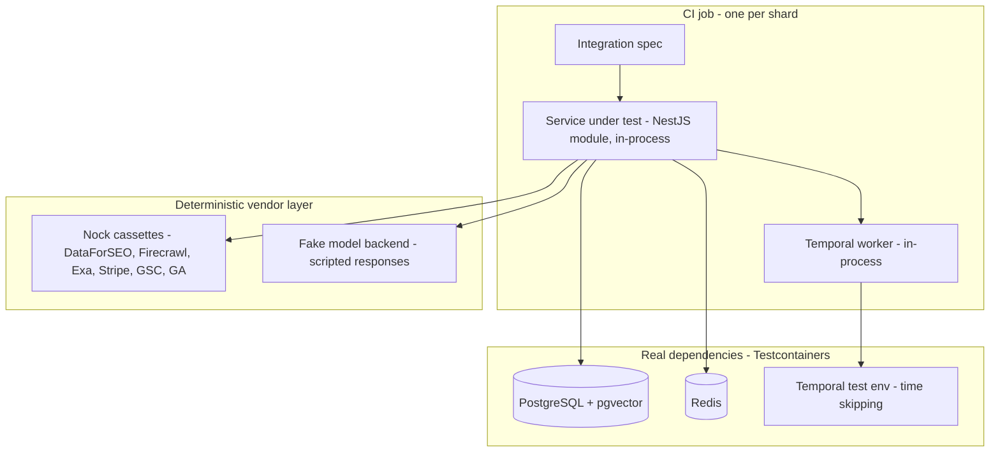
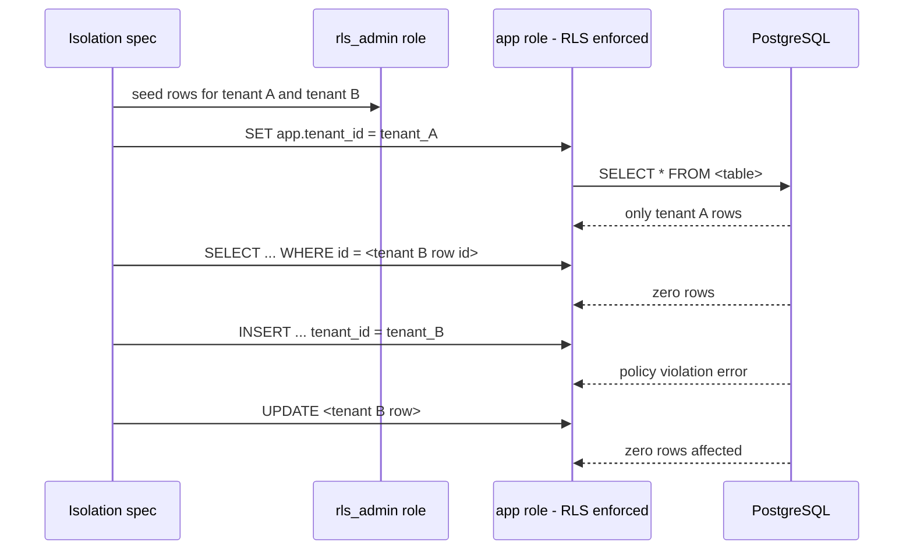
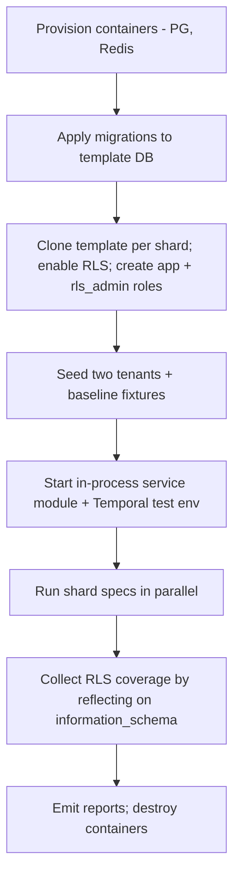

# Integration Testing

> **Status:** v1.0 — complete. Level 3 of the taxonomy in `testing-strategy.md` §3.
> **Scope:** tests that run against real PostgreSQL (with `pgvector`), real Redis, and the Temporal test environment. Hosts the **mandatory tenant-isolation suite**, workflow durability and idempotency tests, and provider-adapter contract tests.

## 1. Overview

**Why this level exists.** The properties that would sink this platform are all properties of infrastructure semantics, not of application logic: does Row-Level Security actually deny the row, does the credit charge and the pipeline start commit atomically, does a retried Temporal activity charge twice, does a workflow resume correctly after a worker dies, does a provider's response really map to our domain object. None of these can be proven by doubling the dependency — doubling a database only tests the double.

**Business purpose.** Two failure modes at this level are existential rather than merely expensive: a cross-tenant data leak ends enterprise deals and triggers breach obligations; a double-charge or double-publish erodes trust in the credit ledger, which the baseline defines as immutable and auditable. Integration tests are the only level that can prove neither happens.

**Technical purpose.** Verify the imperative shell (`unit-testing.md` §3) — repositories, adapters, workflow definitions, queue consumers, and the API Gateway's tenant-context propagation — against the real systems they wrap, using the same migration chain and the same session-variable mechanism production uses.

**Design philosophy.** Real dependencies, fake vendors. Everything ContentOS *operates* (PostgreSQL, Redis, Temporal, its own HTTP surface) is real. Everything ContentOS *buys* (OpenRouter, DataForSEO, Firecrawl, Exa, Stripe, GSC, GA) is replayed from recorded cassettes. This split gives full fidelity where behavior is subtle and full determinism where behavior is someone else's to change.

## 2. Responsibilities

**MUST cover:**
- **Tenant isolation** for every table, both directions: a tenant cannot read another tenant's rows, and cannot write rows carrying another tenant's id.
- Transactional boundaries: credit hold + workflow start, publish record + history append, evidence write + vector upsert.
- Idempotency: every Temporal activity keyed by `(workflow_id, step)` produces one effect under repeated execution.
- Workflow durability: resume after worker crash, signal handling for approval gates, timer behavior for approval timeouts, deterministic replay against recorded histories.
- Queue semantics: BullMQ retry/backoff, dead-letter routing, at-least-once delivery with idempotent consumers, per-tenant fairness.
- Provider adapter behavior: response mapping, timeout, retry, circuit-breaker state transitions, rate-limit handling, error classification.
- API Gateway behavior: authN/authZ, tenant-context derivation, rate limiting, idempotency-key handling, error envelope shape.
- Cache correctness: tenant-prefixed keys, TTL behavior, semantic-cache key composition including `prompt_version`.

**MUST NOT cover:**
- Browser behavior or visual rendering (`e2e-testing.md`).
- Model output quality (`ai-evaluation.md`). The AI Gateway is exercised here with a deterministic fake model backend; what the model *says* is out of scope.
- Pure logic already covered by unit tests. An integration test that exists only to re-run a scoring function is waste.

**Boundary:** integration tests exercise at most one service boundary plus its stores. A test that requires the browser, the API, and three services running together belongs in E2E.

## 3. Architecture

### 3.1 Test topology



### 3.2 The isolation suite



Four assertions per table — scoped read, targeted read by known id, cross-tenant insert, cross-tenant update — because a policy that filters `SELECT` but permits `INSERT` with a foreign `tenant_id` is a leak in the other direction and is easy to ship accidentally.

## 4. Inputs

| Input | Source | Notes |
|---|---|---|
| Schema | The real migration chain from `03-database/migrations.md` | Applied to a template database, snapshotted, cloned per shard |
| Tenant fixtures | `TenantFixture` factories (`testing-strategy.md` §4) | Always at least two tenants per isolation spec |
| Provider responses | Committed cassettes per adapter, per scenario (success, 429, 500, timeout, malformed) | Recorded once against sandbox accounts, then frozen |
| Model responses | `FakeModelBackend` scripts keyed by `task_type` | Returns fixed content + fixed token usage so cost assertions are exact |
| Workflow histories | Recorded JSON histories committed under `apps/orchestrator/test/histories/` | Used for replay tests |

**Preconditions:** connection uses the non-superuser app role; `app.tenant_id` unset by default (a query without tenant context must return zero rows, and there is a spec asserting exactly that); Redis flushed; Temporal test environment started with time skipping.

**Error cases:** cassette miss → hard failure with the unmatched request logged; missing migration → suite abort; superuser connection → `RLS_BYPASS_RISK` abort; unset `app.tenant_id` on a tenant-scoped query in production code paths → the spec asserts denial, not a default.

## 5. Outputs

| Output | Consumer |
|---|---|
| JUnit results per shard | `integration` gate |
| RLS coverage report `{ table, hasTenantId, hasPolicy, hasIsolationTest }` | `rls_coverage` gate — any `false` blocks the merge |
| Adapter contract report (cassette drift, unmapped fields) | Provider maintenance backlog |
| Workflow replay report | `integration` gate — non-determinism is a hard failure |

**Side effects:** ephemeral containers destroyed at job end; no external account is written to (Stripe is exercised in test mode via cassettes only, never live in the default suite).

## 6. Internal Workflow



Reflection in step G is what makes the isolation guarantee non-negotiable: the report is generated from the live schema, so a table added in a migration without a matching isolation test cannot pass unnoticed.

## 7. Dependencies

| Dependency | Purpose | Notes |
|---|---|---|
| Testcontainers | Disposable PostgreSQL (`pgvector` image, pinned to production's version) and Redis | Version drift between test and prod containers is itself a defect |
| `@temporalio/testing` | Time-skipping test environment, replay harness | Day-long approval waits collapse to milliseconds |
| Nock | HTTP record/replay for every provider adapter | Cassettes are reviewed artifacts, not generated noise |
| `FakeModelBackend` | Deterministic model responses behind the real AI Gateway | Gateway logic (routing, metering, caching, guardrails) is real; only the provider call is faked |
| `supertest` | HTTP-level assertions against the API Gateway module | Exercises the real auth/tenant middleware chain |

**Internal:** `packages/db` (migrations, RLS helpers), `packages/integrations` (adapters under test), `packages/ai-platform` (Gateway, Router, Prompt Engine, Context Builder), `apps/orchestrator` (workflow definitions), `apps/api-gateway`.

## 8. Database Impact

This level is defined by its database impact.

| Aspect | Policy |
|---|---|
| Tables used | All of them — the isolation suite is exhaustive by construction |
| Reads | Every repository's read path is exercised under an explicit tenant context |
| Writes | Every write path is exercised twice: correct tenant (succeeds) and foreign tenant (denied) |
| Indexes | Index presence for the queries in `03-database/indexes.md` is asserted via `EXPLAIN` on the hot paths (keyword lookup, article list by project, evidence retrieval); a sequential scan on a hot path fails the spec |
| Transactions | Atomicity specs: credit hold + workflow start commit or roll back together; a forced failure between them leaves no orphan hold |
| RLS | Mandatory four-assertion suite per table (§3.2), plus a spec asserting that an unset tenant context yields zero rows |
| Append-only | `UPDATE`/`DELETE` on the credit ledger and audit log must be rejected by policy or trigger |
| Vectors | `pgvector` similarity queries asserted to filter by `tenant_id` metadata; a cross-tenant nearest-neighbour spec asserts zero foreign results |
| Migrations | Every migration is tested forward, and expand-phase migrations are tested against the *previous* application version's queries (zero-downtime requirement, `03-database/migrations.md`) |

**Why vectors get their own assertion.** Vector search is the most likely place for a leak that RLS does not catch, because similarity queries are frequently written against a shared index with a metadata filter rather than a policy-protected table. The spec exists specifically to catch a missing filter before it becomes a cross-tenant evidence leak.

## 9. API Contracts

Integration tests assert the API conventions defined in `06-api/README.md` at the transport level:

| Contract | Assertion |
|---|---|
| Auth | Missing/expired/foreign-tenant token → `401`/`403` with the standard error envelope; never `500` |
| Tenant context | A token for tenant A cannot read a resource id belonging to tenant B → `404` (not `403`, which would confirm existence) |
| Long-running work | Pipeline start returns `202` with a workflow handle, per `01-system-architecture/09-request-flow.md` |
| Idempotency | Repeating a `POST` with the same `Idempotency-Key` returns the original result and creates no second workflow or charge |
| Pagination | Cursor pagination is stable under concurrent inserts |
| Rate limits | `429` with `Retry-After`; per-tenant buckets do not interfere across tenants |
| Errors | Every failure returns the standard envelope with a typed code — no stack traces, no provider error strings passed through |

Example idempotency assertion, expressed as pseudo-code:

```
POST /v1/articles/{id}/pipeline  Idempotency-Key: K  -> 202 { workflowId: W }
POST /v1/articles/{id}/pipeline  Idempotency-Key: K  -> 202 { workflowId: W }   // same handle
assert creditLedger.entriesFor(article) == 1
assert temporal.workflowsStarted(article) == 1
```

## 10. Error Handling

| Scenario | Asserted behavior |
|---|---|
| Provider returns 429 | Adapter backs off within its documented policy; circuit breaker opens after the configured consecutive failures; subsequent calls fail fast without hitting the network |
| Provider returns 500 then succeeds | Retry succeeds; exactly one domain-level effect is recorded |
| Provider timeout | Typed `ProviderUnavailable`; the engine's documented fallback (cached data, degraded report) is taken, and the gap is recorded in the output |
| Worker crash mid-activity | Workflow resumes from the last durable step; no duplicate credit consumption |
| Redis unavailable | Cache misses degrade to source-of-truth reads; queue producers surface a typed error rather than silently dropping jobs |
| Poison message | After max attempts, the job lands in the dead-letter queue with the original payload and failure reason; an alert metric increments |
| Duplicate event delivery | Consumer dedupes by `eventId`; the second delivery is a no-op |
| Migration failure mid-deploy | Rollback path leaves the schema usable by the currently deployed application version |

Crash simulation is explicit: the worker process's activity handler is terminated between the "external effect" and the "record the effect" steps, which is the exact interleaving that produces double-charges in naive implementations.

## 11. Security

- **Isolation** is the headline security property of this level (§8).
- **Authorization matrix:** for every endpoint in `06-api/`, a spec iterates roles (`owner`, `admin`, `editor`, `viewer`, non-member) and asserts allow/deny, so a new role or endpoint cannot ship without an explicit decision.
- **Credential handling:** connector credentials are asserted encrypted at rest — a spec reads the raw column and asserts it is not plaintext — and asserted absent from logs and from error payloads returned to the client.
- **Prompt-injection containment:** a Research → Knowledge → Writing integration path is run with an adversarial document in the corpus; the spec asserts that no tool call, publish action, or credit spend is triggered by the document's embedded instructions, and that the content is stored as evidence rather than interpreted.
- **Audit trail:** security-relevant actions (role change, connector added, publish, export) each have a spec asserting an append-only audit row with actor, tenant, and correlation id.

## 12. Performance

The suite budget is **8 minutes** wall clock, held by: cloning a pre-migrated template database instead of re-running migrations per shard; sharding by package with independent databases; reusing one container set per shard rather than per spec; and Temporal time-skipping so approval-wait specs cost microseconds instead of real time.

Two performance assertions live here rather than in the load suite because they are correctness-adjacent: hot-path queries must use an index (`EXPLAIN` assertion), and the N+1 detector fails any spec whose request issues more queries than its declared budget — the cheapest possible defense against a listing endpoint that degrades linearly with tenant size.

## 13. Observability

Specs run with the OpenTelemetry SDK enabled against an in-memory exporter, which makes tracing itself testable: a spec asserts that a pipeline request produces a trace spanning gateway → engine → AI Gateway → provider adapter, with `tenant_id`, `workflow_id`, `task_type`, `model`, and `prompt_version` present as span attributes. This directly enforces the "100% tracing coverage of engine + AI boundaries" NFR (§6) at build time instead of discovering gaps during an incident. Structured-log assertions confirm every log line carries a correlation id and no secret material.

## 14. Future Expansion

- **Consumer-driven contract tests** against provider sandboxes on a schedule, replacing cassette-drift inference with a real contract signal.
- **Chaos injection** (container pause, packet loss to Redis) promoted from staging experiments into a nightly integration profile.
- **Multi-version replay corpus** — retain a rolling window of production workflow histories (scrubbed) so that every workflow-code change is replay-tested against real shapes.
- **Qdrant parity suite** so the pgvector → Qdrant cutover (OQ-6) can be validated by running the same retrieval specs against both backends.

## 15. Open Questions

- Cadence and cost ceiling for the nightly `live-providers` contract suite — **OQ-21**.
- Whether scrubbed production workflow histories may be retained for replay testing, given the no-production-data rule (**OQ-18** adjacency).

Tracked in `99-open-questions.md`.

## Cross References

- `testing-strategy.md` — gate contract, budgets, fixture model
- `unit-testing.md` — the boundary between doubles and real dependencies
- `03-database/tables.md`, `03-database/indexes.md`, `03-database/migrations.md` — schema under test
- `06-api/README.md` — API conventions asserted here
- `09-integrations/` — per-adapter auth, rate limits, retries, and response mapping
- `08-ai-platform/ai-gateway.md` — Gateway behavior exercised with a fake model backend
- `14-operations/incident-response.md` — the failure modes this level simulates
