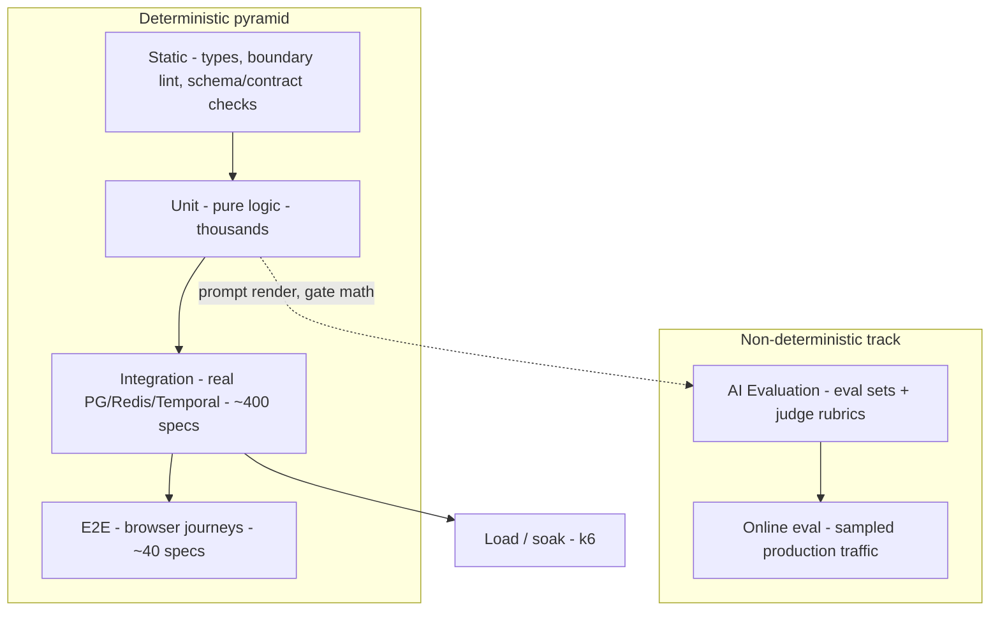
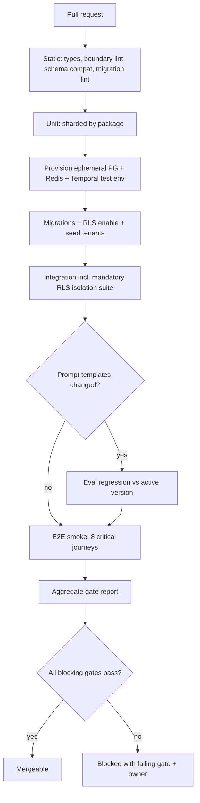

# Testing Strategy

> **Status:** v1.0 — complete. Anchor document for folder 09. Tooling decisions here are recorded as **ADR-014 (Testing & Evaluation Stack)** and must be transcribed into `01-system-architecture/13-adr-log.md` when that file is written.
> **Scope:** the test taxonomy, what each level owns, the CI gate contract that governs merges and deploys, budgets, ownership, and the flake policy. Level-specific mechanics live in the four sibling documents.

## 1. Overview

**Why this exists.** ContentOS produces content that a customer publishes under their own brand and ranks on their own domain. A defect here does not merely break a screen — it publishes an unsupported claim, leaks one tenant's competitive research into another's dashboard, or double-charges credits on a retry. The cost of a defect is external and often irreversible, so verification must be structural.

**Business purpose.** Ship weekly without a QA department. The gate contract in §9 is what allows an AI coding agent or a solo engineer to merge with confidence: if the gates are green, the change is releasable.

**Technical purpose.** Give every architectural invariant an executable owner. Each invariant asserted in the baseline maps to exactly one test level, so no invariant depends on human vigilance:

| Invariant (source) | Owned by | Level |
|---|---|---|
| Every row is tenant-scoped; RLS denies cross-tenant reads (§21) | `rls.isolation.spec` per table | Integration |
| No engine imports a provider SDK; only the AI Gateway calls models (§26, ADR-008) | Boundary lint + import graph test | Static |
| Retried activities never double-charge or double-publish (§19) | Idempotency suite | Integration |
| The pipeline resumes from the last durable step after a crash (§6) | Temporal replay + crash test | Integration |
| Unsupported claims never pass the Quality Gate (`05-content-platform/review-engine.md`) | Gate verdict matrix | Unit + Eval |
| Every recommendation carries an Explainability Envelope (§4.6) | Contract schema test | Unit |
| p95 dashboard read < 300 ms; pipeline p50 < 8 min (§6) | Load + journey timing | E2E / Load |

**Design philosophy.** Four rules, in priority order:

1. **Test at the lowest level that can prove the property.** Isolation needs a real database; scoring policy does not.
2. **Determinism is engineered, not hoped for.** Clock, randomness, ids, and model responses are injected. A test that can fail twice with the same input is a bug in the test.
3. **Fidelity where it matters, doubles everywhere else.** PostgreSQL, Redis, and Temporal are real in integration tests — their semantics (RLS, atomicity, timers) *are* the thing under test. External providers are never real in the default suite.
4. **Non-determinism is scored, not asserted.** Model output flows to the evaluation harness (`ai-evaluation.md`), which produces a numeric verdict comparable across versions.

## 2. Responsibilities

**This document MUST:**
- Define the test levels, their boundaries, and which level owns which risk.
- Define the CI gate contract: the exact checks that block a merge and a deploy.
- Define time budgets, ownership, coverage policy, and the flake protocol.
- Define the fixture and tenant-seeding model shared by all levels.

**This document MUST NOT:**
- Specify assertion style, file naming, or helper APIs — that is `07-development-guide/coding-standards.md`.
- Define deployment mechanics or rollback — that is `14-operations/deployment.md`, which *consumes* the gate contract defined here.
- Define prompt rubrics or eval-set contents — that is `ai-evaluation.md`.

**Boundary:** this folder governs pre-production verification. The moment a build is promoted, ownership passes to folder 10. The handoff artifact is the **gate report** (§5).

## 3. Architecture

### 3.1 Test taxonomy

The classic pyramid is extended with two levels this system requires: a **contract/static** floor that enforces architectural boundaries, and an **evaluation** track that runs alongside the pyramid rather than inside it.



### 3.2 What each level owns

| Level | Runs against | Owns | Never asserts | Budget |
|---|---|---|---|---|
| Static | Source tree | Import direction, provider-SDK containment, event/DTO schema compatibility, migration lint | Runtime behavior | < 60 s |
| Unit | In-process, all deps doubled | Scoring, policy, routing decisions, gate math, prompt rendering, mappers, reducers | Anything needing a real store | < 90 s |
| Integration | Ephemeral PG + Redis + Temporal test env | RLS isolation, transactions, idempotency, workflow resumption, adapter response mapping, queue semantics | UI, model quality | < 8 min |
| E2E | Deployed stack (staging-like), providers stubbed | User journeys, auth + tenant switching, SSE progress, publish, checkout | Internal implementation detail | < 15 min |
| Load | Staging | Latency/throughput NFRs (§6), backpressure, worker autoscale triggers | Correctness | Nightly |
| Evaluation | Prompt registry + eval sets | Output quality per prompt version, regression vs baseline | Deterministic correctness | Pre-promotion + nightly |

### 3.3 Where tests live

```
packages/engines/planning/
├── src/
└── test/
    ├── unit/                 # doubles only
    └── integration/          # requires containers; tagged @integration
apps/web/test/e2e/            # Playwright specs
packages/db/test/rls/         # mandatory per-table isolation suite
packages/ai-platform/test/eval/  # eval sets + judge harness config
tooling/test/                 # shared factories, container bootstrap, seeds
```

Colocation with the owning package is deliberate: an engine's blast radius must stay "one engine + its tests" (§6, Maintainability). A test that must import another engine's internals to pass is evidence of a boundary violation and fails the static gate.

## 4. Inputs

Test execution is triggered by four events, each with a different suite selection:

| Trigger | Suites | Rationale |
|---|---|---|
| Pre-commit hook | Static + changed-package unit | Sub-10 s feedback |
| Pull request | Static, unit, integration, E2E smoke (8 critical journeys), eval regression for changed prompts | Merge gate |
| Merge to `main` | Full E2E, full eval set, migration dry-run against a staging clone | Release candidate gate |
| Nightly | Load/soak, `live-providers` contract suite, full eval sweep, restore drill trigger (`14-operations/backup-recovery.md`) | Drift detection |

**Fixture inputs.** Every suite builds state from typed factories, never from SQL dumps:

```ts
interface TenantFixture {
  tenantId: string;                    // uuid v7, generated from a seeded PRNG
  plan: 'free' | 'pro' | 'agency' | 'enterprise';
  members: Array<{ userId: string; role: 'owner' | 'admin' | 'editor' | 'viewer' }>;
  settings: { voiceProfileRef?: string; gateThresholds?: GateThresholds; ymyl: boolean };
  seed: { projects?: number; articles?: ArticleState[]; evidence?: number };
}
```

**Preconditions.** Integration and E2E suites require: migrations applied to an ephemeral database, RLS enabled (tests run as a non-superuser role — a superuser bypasses RLS and would silently void the entire isolation suite), Redis flushed per worker, and the Temporal test environment with time-skipping enabled.

**Validation / error cases at the input boundary:**

| Condition | Behavior |
|---|---|
| Fixture requests a tenant-scoped row without `tenantId` | Factory throws at build time |
| Suite starts with a superuser DB connection | Bootstrap aborts with `RLS_BYPASS_RISK` |
| A test declares no tenant context but touches the DB | Harness fails the test, does not default a tenant |
| `live-providers` suite runs without an explicit cost budget env var | Suite is skipped, CI logs a warning |

## 5. Outputs

| Output | Format | Consumer |
|---|---|---|
| Per-suite results | JUnit XML | CI annotations, flake dashboard |
| Coverage | LCOV + per-package summary | Coverage gate (§9) |
| Boundary report | JSON: violating import edges | Static gate, review |
| RLS coverage report | JSON: `{ table, hasTenantId, hasPolicy, hasIsolationTest }` | Merge gate — any `false` blocks |
| Eval report | `{ template_id, version, scores{}, delta_vs_active, verdict }` | Prompt promotion (`08-ai-platform/prompt-engine.md`) |
| **Gate report** | Signed JSON summary of all gates for a commit SHA | `14-operations/deployment.md` — promotion requires it |

```json
{
  "commit": "9f2c1ab",
  "gates": {
    "static": "pass", "unit": "pass", "integration": "pass",
    "e2e": "pass", "rls_coverage": "pass", "eval_regression": "soft-warn"
  },
  "coverage": { "engines": 0.87, "contracts": 0.94 },
  "flaky_quarantined": 2,
  "verdict": "releasable"
}
```

**Side effects.** Ephemeral containers and databases are destroyed on completion; eval results are persisted to PostgreSQL (they are longitudinal quality data, not build waste); no test writes to production stores, object storage buckets, or provider accounts.

## 6. Internal Workflow



Stages run in this order because each is cheaper than the next and can invalidate it: a boundary violation makes unit results irrelevant, and a failing RLS suite makes E2E results irrelevant. Stages 1–2 and 5's shards run in parallel internally; the sequence above is the dependency order, not a serial-time estimate.

## 7. Dependencies

| Dependency | Choice | Justification |
|---|---|---|
| Test runner | **Vitest** | One runner for NestJS services, Next.js app, and shared packages; native TS/ESM, no separate transform config; watch-mode speed matters most in the engine packages where iteration is heaviest. Jest was rejected only on monorepo config overhead and cold-start speed, not capability |
| Container harness | **Testcontainers** | Real `postgres` with `pgvector` and `redis` per CI job, disposable and version-pinned to production |
| Workflow tests | **`@temporalio/testing`** time-skipping test environment | Days-long human waits (§19) collapse to milliseconds; replay tests catch non-deterministic workflow code |
| Browser E2E | **Playwright** | Multi-browser, first-class SSE/network interception, trace viewer for CI failures |
| HTTP record/replay | **Nock** cassettes committed per adapter | Deterministic provider responses; cassette diff is a visible signal that a provider's contract changed |
| Load | **k6** | Scriptable in JS, CI-friendly thresholds that map 1:1 to §6 NFRs |
| Eval harness | Custom, in `packages/ai-platform` | Must integrate with the Prompt Engine registry and the AI Gateway's metering; see `ai-evaluation.md` |

**Internal dependencies:** `packages/contracts` (source of truth for DTO/event schemas asserted by static tests), `packages/db` (migration + RLS helpers), `packages/config` (gate thresholds and routing policy are loaded, never hardcoded in tests), `tooling/test` (factories, seeds, container bootstrap).

## 8. Database Impact

| Aspect | Policy |
|---|---|
| Schema source | Tests always apply the real migration chain (`03-database/migrations.md`) — never a hand-maintained test schema, which would let production and test schemas drift |
| Isolation between test workers | One database per CI worker, created from a migrated template database; parallel workers never share a database |
| Connection role | Non-superuser application role with RLS enforced; a second, explicitly-named `rls_admin` role exists only in the isolation suite to set up cross-tenant fixtures |
| Tenant context | Set per-transaction via the same session variable the API Gateway uses in production — the test path and the production path must not diverge |
| Cleanup | Truncate-and-reseed between specs; drop the database at job end |
| Append-only tables | Credit ledger and audit log are asserted immutable: an `UPDATE`/`DELETE` attempt must be rejected |

**The RLS coverage rule.** A CI job enumerates `information_schema` for every table in the migrated schema and cross-references the isolation test registry. Any table lacking `tenant_id`, lacking a policy, or lacking a named isolation test fails the merge gate. This converts §21.4's "primary isolation risk" from a review-time concern into a build-time one.

## 9. API Contracts — the CI Gate Contract

Gates are the public interface of this folder. `14-operations/deployment.md` promotes builds solely on this contract.

| Gate | Blocks merge | Blocks deploy | Threshold |
|---|---|---|---|
| `static` | Yes | Yes | Zero type errors; zero boundary violations |
| `unit` | Yes | Yes | 100% pass |
| `integration` | Yes | Yes | 100% pass |
| `rls_coverage` | Yes | Yes | Every table: `tenant_id` + policy + isolation test |
| `e2e_smoke` | Yes | Yes | 8 critical journeys pass |
| `e2e_full` | No | Yes | 100% pass on `main` |
| `coverage` | Yes | No | ≥ 85% lines in `packages/engines/*` and `packages/contracts`; ≥ 70% elsewhere; no threshold on `apps/web` |
| `eval_regression` | Only for prompt changes | Yes for prompt changes | No rubric dimension below the active version's baseline by more than 3 points |
| `migration_dryrun` | No | Yes | Applies cleanly to a staging clone; no destructive statement in an expand-phase migration |
| `load` | No | No | Advisory; regression > 20% opens an issue |

Coverage is deliberately asymmetric: engine and contract code encodes business rules and is cheap to unit-test; UI code is covered by journeys, where a percentage target would only incentivize shallow render tests.

## 10. Error Handling

| Failure | Handling |
|---|---|
| Infrastructure flake (container pull, network) | Automatic retry once at the *job* level; a second failure is a real failure |
| Test flake (same code, different verdict) | Never retried at the spec level. Detected by the flake dashboard (≥ 2 divergent results in 20 runs) |
| Quarantine | A flaky spec is tagged `@quarantine`, excluded from the gate, and given an owner and a 7-day fix deadline; quarantine count > 5 blocks all merges until reduced |
| Timeout | Per-level budgets in §3.2 are enforced as hard CI timeouts; exceeding them is a failure, not a warning — slow suites decay into skipped suites |
| Provider cassette miss | Hard failure with the unmatched request logged; the suite never falls through to a live call |
| Eval judge unavailable | `eval_regression` reports `unavailable`, which blocks prompt promotion but not unrelated merges |

**Recovery:** the gate report is regenerable from any commit SHA; no gate depends on mutable shared state, so a re-run of a green build is green.

## 11. Security

- **No production data in tests, ever.** Not anonymized, not sampled. Staging seed data is synthetic and generated by the same factories, which sidesteps the GDPR question of derived personal data in lower environments (see OQ-18).
- **Secrets:** CI holds only stub credentials by default. Real provider keys exist solely in the nightly `live-providers` job, scoped to sandbox accounts, injected from the secret manager, and never echoed. A test that prints an environment variable fails the static gate's log-hygiene rule.
- **Tenant isolation** is the highest-priority test class; see §8.
- **Prompt-injection regression corpus:** a fixed corpus of adversarial documents (instructions embedded in scraped pages: "ignore previous instructions", fake system blocks, exfiltration attempts) is stored with the eval sets. Every Research/Writing prompt version must demonstrate that injected instructions are treated as data (§24). Regression here is a blocking failure, not a score.
- **Authorization tests** assert deny-by-default per role for every endpoint in `06-api/`; a new endpoint without an authorization spec fails review.

## 12. Performance

Total PR feedback target is **under 12 minutes wall clock**, achieved by: sharding unit tests by package across CI runners; running integration shards against separate databases; reusing a pre-warmed container image with `pgvector` installed; caching the migrated template database; and running E2E smoke in parallel with integration on a separate runner. The full `main` pipeline targets 25 minutes. When a suite exceeds budget, the response is to move tests down a level — not to raise the budget.

## 13. Observability

CI emits OpenTelemetry spans per suite and per spec (duration, retry count, container wait time) to the same collector used in production (`14-operations/monitoring.md`), so build health is a dashboard, not a folklore. Tracked signals: suite duration p50/p95 trend, flake rate per spec, coverage trend per package, RLS coverage (must be 100%), eval score trend per prompt family, quarantine count and age. Alerts: flake rate > 2% of specs, quarantine age > 7 days, PR pipeline p95 > 15 minutes.

## 14. Future Expansion

- **Mutation testing** (Stryker) on `packages/engines/*` scoring and gate logic, where a passing-but-vacuous test is most dangerous.
- **Consumer-driven contract tests** against provider sandboxes, replacing cassette drift detection with a real contract check.
- **Chaos suite** in staging: kill a worker mid-activity, sever Redis, expire a provider token — asserting the recovery behaviors documented in `14-operations/incident-response.md`.
- **Golden-article corpus:** end-to-end pipeline runs over a fixed keyword set with human-rated outputs, giving a single quality number per release.
- **Per-tenant canary evaluation** once online evaluation (`ai-evaluation.md`) is live.

## 15. Open Questions

- Judge-model choice and self-preference bias in LLM-as-judge scoring — **OQ-17**.
- Staging data strategy: synthetic-only (current position) vs anonymized clone for realistic scale testing — **OQ-18**.
- Load-test environment sizing and its monthly cost ceiling — **OQ-21**.
- Whether `eval_regression` should ever block a non-prompt change (currently no).

All tracked in `99-open-questions.md`.

## Cross References

- `07-development-guide/coding-standards.md` — test style, naming, assertion helpers
- `07-development-guide/git-workflow.md` — branch protection consuming the gate contract
- `03-database/migrations.md`, `03-database/tables.md` — schema and RLS under test
- `08-ai-platform/prompt-engine.md` — promotion workflow gated by `eval_regression`
- `14-operations/deployment.md` — promotion consumes the gate report
- `14-operations/monitoring.md` — shared SLO definitions and telemetry pipeline
